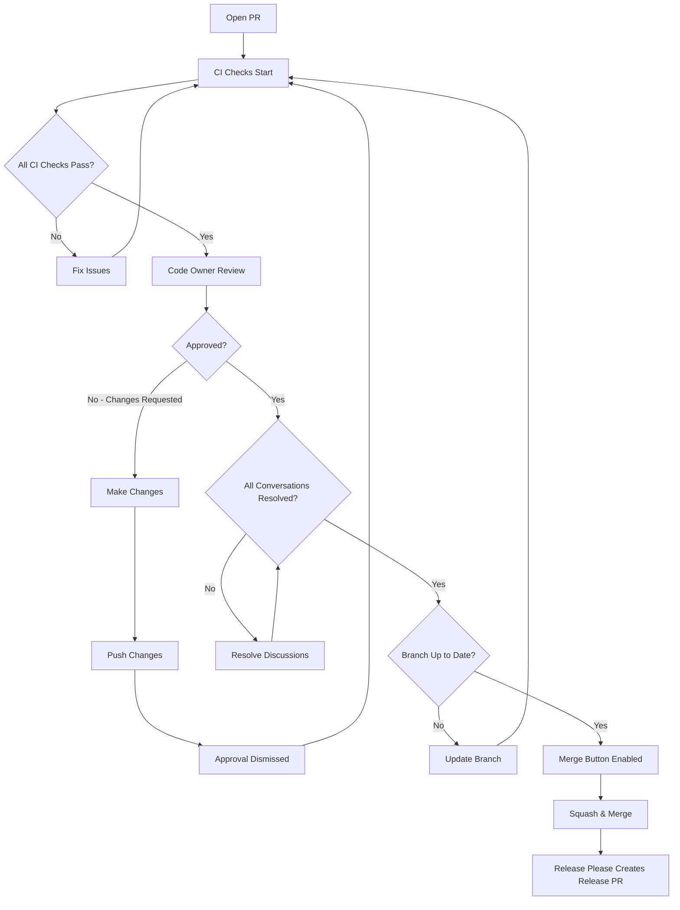

# Code Ownership

This document explains the code ownership model used in the `ado` project and how it affects code reviews, approvals, and contributions.

## What is Code Ownership?

Code ownership defines who is responsible for reviewing and approving changes to different parts of the codebase. This ensures:

- **Quality**: Changes are reviewed by maintainers with expertise in that area
- **Accountability**: Clear responsibility for each component
- **Consistency**: Architectural decisions are maintained across changes
- **Security**: Critical files require review from specific maintainers
- **Knowledge Transfer**: Review process shares context with team

## How Code Ownership Works

This project uses GitHub's native **CODEOWNERS** file (`.github/CODEOWNERS`) to define ownership at the file path level.

### Key Principles

1. **Automatic Review Requests**: When you open a PR, GitHub automatically requests reviews from the code owners of the files you modified
2. **Required Approvals**: Branch protection rules require approval from code owners before merging
3. **File-Based**: Ownership is defined by file patterns (like `.gitignore`)
4. **Hierarchical**: More specific patterns override general ones

### Example

```
# .github/CODEOWNERS
* @anowarislam                    # Default owner for everything
/docs/ @anowarislam               # Documentation owner
/internal/config/ @anowarislam    # Config package owner
```

If you modify `internal/config/loader.go`, GitHub automatically requests review from `@anowarislam`.

## Current Code Owners

The `ado` project has the following ownership structure:

| Component | Path | Owner(s) | Description |
|-----------|------|----------|-------------|
| **Default** | `*` | @anowarislam | All files unless specified |
| **Go Commands** | `/cmd/ado/` | @anowarislam | CLI command implementations |
| **Internal Packages** | `/internal/` | @anowarislam | Core libraries and utilities |
| **Config System** | `/internal/config/` | @anowarislam | Configuration loading and validation |
| **Logging System** | `/internal/logging/` | @anowarislam | Structured logging implementation |
| **Metadata** | `/internal/meta/` | @anowarislam | Build metadata and versioning |
| **UI Components** | `/internal/ui/` | @anowarislam | User interface utilities |
| **Python Lab** | `/lab/py/` | @anowarislam | Python prototyping environment |
| **Documentation** | `/docs/` | @anowarislam | All documentation |
| **ADRs** | `/docs/adr/` | @anowarislam | Architecture Decision Records |
| **Specs** | `/docs/commands/`, `/docs/features/` | @anowarislam | Command and feature specifications |
| **Recipes** | `/docs/recipes/` | @anowarislam | CI/CD recipe documentation |
| **CI/CD** | `/.github/workflows/` | @anowarislam | GitHub Actions workflows |
| **Build System** | `/Makefile`, `/make/`, `/.githooks/` | @anowarislam | Build automation and git hooks |
| **Release Config** | `/.goreleaser.yaml`, `/release-please-config.json` | @anowarislam | Release automation configuration |
| **Dependencies** | `go.mod`, `go.sum`, `lab/py/pyproject.toml` | @anowarislam | Dependency management |
| **Security** | `/SECURITY.md`, `/docs/recipes/04-security-features.md` | @anowarislam | Security policies and features |

## Code Review Requirements

### Branch Protection Rules

The `main` branch has the following protections:

- ✅ **Require pull request reviews before merging**
- ✅ **Require review from Code Owners**
- ✅ **Require approvals**: 1 approval minimum
- ✅ **Dismiss stale pull request approvals when new commits are pushed**
- ✅ **Require approval of the most recent reviewable push**
- ✅ **Require status checks to pass before merging**
- ✅ **Require conversation resolution before merging**
- ✅ **Require signed commits**
- ✅ **Require linear history**
- ✅ **Include administrators**

### What This Means for Contributors

**You cannot merge until:**

1. ✅ All required status checks pass (tests, lint, coverage, build)
2. ✅ All conversations are resolved
3. ✅ Code owner(s) approve your changes
4. ✅ Your branch is up to date with `main`
5. ✅ Your commits are signed and follow conventional commit format

**Timeline Expectations:**

Code owners aim to review PRs within 48 business hours. If you haven't received a review after this period, feel free to ping the code owner in the PR comments.

## Three-Phase Review Process

Different types of changes have different review requirements:

### Phase 1: ADR (Architecture Decision Record)

**When Required**: Architectural changes, new dependencies, security decisions, breaking changes

**Review Process**:
1. Create GitHub issue using "ADR Proposal" template
2. Discuss in issue comments
3. Create branch: `adr/NNNN-short-title`
4. Submit PR with ADR document
5. **Reviewer Assignment**: Tech lead (@anowarislam)
6. **Approval Criteria**: Consensus from maintainers
7. Merge after approval

**Code Owner**: `@anowarislam` (docs/adr/)

### Phase 2: Spec (Feature/Command Specification)

**When Required**: New commands, new non-command features

**Review Process**:
1. Create branch: `docs/command-name` or `docs/feature-name`
2. Submit PR with spec document
3. **Reviewer Assignment**: Package owner (from CODEOWNERS)
4. **Approval Criteria**: Spec completeness, feasibility, alignment with architecture
5. Merge after approval

**Code Owner**:
- Commands: `@anowarislam` (docs/commands/)
- Features: `@anowarislam` (docs/features/)

### Phase 3: Implementation

**When Required**: All code changes (after spec approval if new feature)

**Review Process**:
1. Create branch: `feat/name`, `fix/name`, etc.
2. Submit PR with implementation
3. **Reviewer Assignment**: Automatic based on modified files (CODEOWNERS)
4. **Approval Criteria**:
   - Follows spec (if applicable)
   - Passes all CI checks
   - 80%+ test coverage maintained
   - Follows code style guidelines
   - No security vulnerabilities
5. Merge after approval

**Code Owner**: Varies by file path (see CODEOWNERS)

## Review Responsibilities

### What Code Owners Review

Code owners are expected to review:

**Architecture & Design**:
- Does the change fit the overall architecture?
- Are there better approaches?
- Does it follow existing patterns?

**Code Quality**:
- Is the code readable and maintainable?
- Are there appropriate tests?
- Does coverage meet the 80% threshold?
- Does it follow the style guide?

**Security & Safety**:
- Are there security vulnerabilities?
- Are errors handled properly?
- Are inputs validated?

**Documentation**:
- Is the code documented?
- Are specs/ADRs updated if needed?
- Is the CHANGELOG updated (via conventional commits)?

**Dependencies & Compatibility**:
- Are new dependencies justified?
- Are there breaking changes?
- Is backwards compatibility maintained?

### What Code Owners Don't Review

Code owners are **not** responsible for:

- ❌ Detailed line-by-line review of every file (GitHub Actions CI handles linting)
- ❌ Manual testing of every scenario (CI handles automated tests)
- ❌ Verifying code compiles (CI handles build checks)
- ❌ Checking test coverage manually (CI enforces 80% threshold)

The CI/CD pipeline handles mechanical checks. Code owners focus on **design, architecture, and correctness**.

## How to Request Code Review

### Automatic Assignment

When you open a PR, GitHub automatically:
1. Analyzes which files you changed
2. Looks up code owners from `.github/CODEOWNERS`
3. Requests reviews from matching owners
4. Adds required reviewers (cannot merge without their approval)

### Manual Assignment

If you need additional reviewers:
1. Use the "Reviewers" section in the PR sidebar
2. Search for GitHub username
3. Click to add them

**Note**: You still need code owner approval even with additional reviewers.

### Re-requesting Review

If you make changes after review:
1. Code owner approval is automatically dismissed (branch protection setting)
2. GitHub shows "Changes requested" or "Approval dismissed"
3. Request review again using the circular arrow icon next to the reviewer

## Becoming a Code Owner

As the project grows, code ownership will expand. To become a code owner:

**Requirements**:
1. Consistent high-quality contributions to the area
2. Deep understanding of the component
3. Demonstrated ability to review others' code
4. Availability for timely reviews
5. Alignment with project goals and philosophy

**Process**:
1. Existing code owner proposes new owner
2. Discussion in GitHub issue
3. Update `.github/CODEOWNERS` file
4. Announce in CHANGELOG and docs

## Changing Code Ownership

Code ownership assignments can change over time as:
- New maintainers join
- Current maintainers step back
- New components are added
- Ownership is subdivided for specialization

**Process to Request Ownership Changes**:
1. Open GitHub issue titled "Request: Code Ownership Change for [component]"
2. Explain rationale (expertise, availability, etc.)
3. Current code owner(s) review and approve
4. Update `.github/CODEOWNERS`
5. Update this documentation
6. Announce in CHANGELOG

## Emergency Procedures

### Bypassing Code Owner Approval

In emergencies (critical security fix, production outage), administrators can override branch protection to merge without code owner approval.

**When Allowed**:
- ✅ Critical security vulnerability (CVE with active exploits)
- ✅ Production outage affecting users
- ✅ Data loss prevention

**When NOT Allowed**:
- ❌ "I need this feature urgently"
- ❌ "Code owner is on vacation"
- ❌ "It's just a small change"

**Procedure**:
1. Document emergency in PR description
2. Notify code owners via PR comment + Slack/email
3. Administrator merges with override
4. Post-merge review: Code owner reviews merged changes
5. Create follow-up PR if issues found

### Inactive Code Owners

If a code owner is unavailable (vacation, medical leave, left project):

**Short-term (< 2 weeks)**:
- Wait for their return if non-urgent
- Request review from another maintainer if urgent
- Administrator can override if critical

**Long-term (> 2 weeks)**:
- Update `.github/CODEOWNERS` to remove or replace
- Announce change in issue/PR
- Add to emeritus maintainers (if applicable)

## Integration with CI/CD

Code ownership integrates with the CI/CD pipeline:



### Pre-Push Hook

The `.githooks/pre-push` hook runs locally before `git push`:
1. Tests with race detector
2. Coverage check (80% threshold)
3. Build verification
4. Documentation validation (if mkdocs installed)
5. Python lab tests (if lab/py/ changed)

This catches issues **before** CI runs, saving time.

### CI Checks

The CI pipeline (`.github/workflows/ci.yml`) runs:
1. Conventional commit validation
2. Go tests (all packages)
3. Go coverage check (80% threshold)
4. Go linting (golangci-lint)
5. Go build (all platforms)
6. Python lab tests (if applicable)
7. Documentation build (strict mode)
8. Docker build test

All must pass before code owner can approve.

### Branch Protection

GitHub branch protection enforces:
- ✅ CI checks pass
- ✅ Code owner approves
- ✅ Conversations resolved
- ✅ Branch up to date
- ✅ Commits signed

Only when all conditions are met can the PR be merged.

## FAQs

### Q: Can I merge my own PR?

**A**: No. Even if you are a code owner, branch protection requires review from **another** code owner or maintainer. This enforces the "four-eyes principle."

### Q: What if I disagree with the code owner's review?

**A**: Discuss in PR comments. If you cannot reach consensus:
1. Present your reasoning clearly
2. Provide evidence/examples if possible
3. Escalate to tech lead if needed
4. Follow the decision even if you disagree (maintain consistency)

### Q: Can I add someone as a code owner temporarily?

**A**: No. Code ownership is a responsibility, not a permission. Use the manual reviewer assignment instead for one-off reviews.

### Q: What if all code owners are the same person?

**A**: In the early stages (current state), the sole maintainer (@anowarislam) reviews all changes. As the project grows, ownership will be distributed.

### Q: How do I know who owns a file?

**A**: Three ways:
1. Check `.github/CODEOWNERS` file directly
2. GitHub shows "Reviewers" automatically when you open a PR
3. Use the `gh` CLI: `gh api repos/anowarislam/ado/codeowners/errors`

### Q: Can code owners merge without CI passing?

**A**: No. Branch protection requires all CI checks to pass, even for administrators.

### Q: What happens if I force-push to my branch?

**A**: Branch protection dismisses previous approvals. Code owner must re-review and re-approve.

## Related Documentation

- [Development Workflow](workflow.md) - Complete workflow guide
- [CODEOWNERS Integration](workflow.md#codeowners-automated-reviewer-assignment) - Automated reviewer assignment and integration architecture
- [Contributing Guide](contributing.md) - Contribution guidelines
- [Code Review Process](workflow.md#code-review-process) - Detailed review criteria
- [Branch Protection](workflow.md#branch-protection-rules) - GitHub settings
- [ADR Process](adr/README.md) - Architecture Decision Records
- [Spec-Driven Development](workflow.md#phase-2-spec-feature-or-command-specification) - Specification workflow

## References

- [GitHub CODEOWNERS Documentation](https://docs.github.com/en/repositories/managing-your-repositorys-settings-and-features/customizing-your-repository/about-code-owners)
- [GitHub Branch Protection](https://docs.github.com/en/repositories/configuring-branches-and-merges-in-your-repository/managing-protected-branches/about-protected-branches)
- [Kubernetes Code Review Guide](https://www.kubernetes.dev/docs/guide/pull-requests/)
- [CNCF Contributor Guide](https://contribute.cncf.io/)
