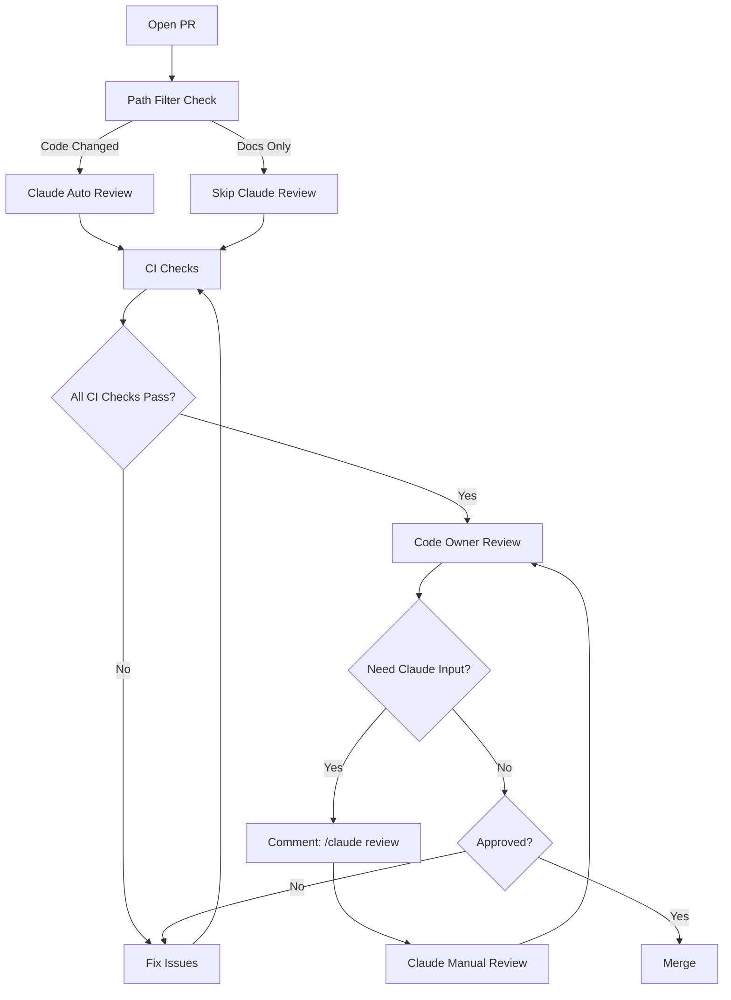

# Feature: Claude Code Review Optimization

| Metadata | Value |
|----------|-------|
| **ADR** | N/A |
| **Status** | Draft |
| **Issue** | #52 |
| **Author(s)** | @anowarislam |

## Overview

Intelligent filtering system for Claude Code automatic reviews that reduces costs by 60-65% and eliminates noise by skipping low-value changes (documentation, tests, automated PRs) while maintaining comprehensive coverage of security-critical and core code changes.

## Motivation

### Current Pain Points

**Cost inefficiency**: Claude automatically reviews every PR commit, including:
- Documentation-only PRs (specs, ADRs, guides) - 52.5% of reviews
- Automated commits (release-please, dependabot) - 10% of reviews
- Test-only changes already validated by CI - contributing to 62.5% waste

**Developer fatigue**: Reading AI reviews of markdown files and release notes creates noise and wastes time.

**Lack of control**: No mechanism to force a review when needed or skip when unnecessary.

### Who Benefits

- **Maintainers**: Reduced AI review noise on documentation PRs they write
- **Contributors**: Focused AI feedback on code changes that matter
- **Project budget**: 60-65% cost reduction ($12-36 annually at current scale, $144-180 at 10 PRs/week)

### Without This Feature

- Continued waste reviewing documentation (21/32 monthly reviews provide minimal value)
- Scaling costs increase linearly with PR volume (10 PRs/week = $72-216/year)
- Developer time wasted reading AI comments on non-code files
- Missed opportunity to establish smart AI usage culture

## Specification

### Behavior

The feature implements a **two-tier triggering strategy**:

#### Tier 1: Smart Automatic Reviews

Claude automatically reviews PRs that modify:

**✅ Included (High-Value Changes)**:
- Core Go code: `cmd/**`, `internal/**`
- Security-critical files: `.github/CODEOWNERS`, `.github/workflows/**`, `.githooks/**`
- Build configuration: `Makefile`, `make/**`, `go.mod`, `go.sum`, `.goreleaser.yaml`
- First PR commit only (not every subsequent commit)

**❌ Excluded (Low-Value Changes)**:
- Documentation: `docs/**`, `**/*.md` (validated by mkdocs build in CI)
- Tests: `**/*_test.go` (validated by CI coverage checks)
- Python lab: `lab/py/**` (experimental code, has separate CI validation)
- Automated PRs: Dependabot, release-please bots
- Tiny changes: < 10 lines in non-security files (option B only)

**Trigger Events**:
- `pull_request: types: [opened, synchronize]` with path filtering
- Conditional job skipping via `if:` expression for bot PRs

#### Tier 2: Manual On-Demand Reviews

Developers can request Claude review at any time by commenting on a PR or issue:

**Commands** (already implemented in `.github/workflows/claude.yml`):
- `/claude review` - Comprehensive code review
- `/claude security` - Security-focused analysis
- `/claude performance` - Performance optimization suggestions
- `@claude <question>` - Ask specific questions

**When to Use Manual Triggers**:
- Documentation needs clarity review
- Refactoring requires architectural feedback
- Second opinion after addressing review feedback
- Complex algorithm analysis
- Legacy code modifications

### Configuration

This feature modifies GitHub Actions workflow configuration, not application config.

**File**: `.github/workflows/claude-code-review.yml`

#### Option A: Simple Path-Based Filtering (Recommended)

```yaml
name: Claude Code Review (Optimized)

on:
  pull_request:
    types: [opened, synchronize]
    paths:
      # Include: Core code
      - 'cmd/**'
      - 'internal/**'

      # Include: Security-critical
      - '.github/CODEOWNERS'
      - '.github/workflows/**'
      - '.githooks/**'
      - '.goreleaser.yaml'

      # Include: Build configuration
      - 'Makefile'
      - 'make/**'
      - 'go.mod'
      - 'go.sum'

      # Exclude: Documentation
      - '!docs/**'
      - '!**/*.md'

      # Exclude: Tests (covered by CI)
      - '!**/*_test.go'

      # Exclude: Python lab (experimental)
      - '!lab/py/**'

jobs:
  claude-review:
    # Skip automated PRs
    if: |
      github.event.pull_request.user.login != 'dependabot[bot]' &&
      github.event.pull_request.user.login != 'release-please[bot]' &&
      !contains(github.event.pull_request.title, 'chore(main): release')

    runs-on: ubuntu-latest
    permissions:
      contents: read
      pull-requests: write  # Changed from read - required for comments
      issues: read
      id-token: write

    steps:
      - name: Checkout repository
        uses: actions/checkout@v6
        with:
          fetch-depth: 1

      - name: Run Claude Code Review
        uses: anthropics/claude-code-action@v1
        with:
          claude_code_oauth_token: ${{ secrets.CLAUDE_CODE_OAUTH_TOKEN }}
          prompt: |
            REPO: ${{ github.repository }}
            PR NUMBER: ${{ github.event.pull_request.number }}

            This is an automated review of a PR with code changes.

            Use the repository's CLAUDE.md for guidance on style and conventions.

            Focus on:
            - Code quality and best practices
            - Potential bugs or logic errors
            - Security concerns (auth, input validation, secrets)
            - Performance considerations
            - Test coverage (though tests run separately in CI)
            - Architectural alignment with existing patterns

            Be constructive and helpful. Flag critical issues clearly.

            Use `gh pr comment` with your Bash tool to leave your review as a comment on the PR.

          claude_args: '--allowed-tools "Bash(gh issue view:*),Bash(gh search:*),Bash(gh issue list:*),Bash(gh pr comment:*),Bash(gh pr diff:*),Bash(gh pr view:*),Bash(gh pr list:*)"'
```

**Key Changes**:
1. Path filtering excludes docs, tests, Python lab
2. Bot PR filtering (dependabot, release-please)
3. `pull-requests: write` permission (was `read`)
4. Keeps `synchronize` trigger for security files

**Expected Impact**:
- 60% reduction in automatic reviews (20/32 monthly reviews eliminated)
- No false negatives (all code and security files still reviewed)
- Easy to validate and debug (path matching is transparent)

#### Option B: Advanced Conditional Filtering (Future Enhancement)

Adds dynamic filtering based on PR characteristics:
- Size thresholds (skip < 10 lines unless security-critical)
- Content analysis (skip if only docs/tests modified)
- Coverage metrics (review test PRs if coverage drops)

**Implementation**: Requires additional GitHub Actions job with `actions/github-script@v7` to analyze PR metadata before triggering review.

**When to Implement**: If Option A proves insufficient or false positives occur.

### Documentation Updates

#### Update `CONTRIBUTING.md`

Add new section after "Code Review Requirements":

```markdown
## AI-Assisted Code Review

This project uses Claude Code for automated code reviews.

### Automatic Reviews

Claude automatically reviews:
- New PRs with core code changes (`cmd/`, `internal/`)
- Security-critical file modifications (CODEOWNERS, workflows, hooks)
- Build configuration changes (Makefile, go.mod, GoReleaser)

Claude **SKIPS** automatic review of:
- Documentation-only PRs (all `*.md` files)
- Test-only changes (only `*_test.go` modified)
- Automated PRs (Dependabot, release-please)
- Python lab changes (`lab/py/` - experimental code)

### Manual Review Triggers

You can request Claude review at any time by commenting on a PR or issue:

**Commands**:
- `/claude review` - Comprehensive code review
- `/claude security` - Security-focused analysis
- `/claude performance` - Performance optimization suggestions
- `@claude <question>` - Ask Claude a specific question

**When to use manual triggers**:
- Documentation needs clarity review
- Refactoring requires architectural feedback
- After addressing review comments (want AI second opinion)
- Legacy code modifications
- Complex algorithm review

**Example**:
```
/claude review

Please focus on the error handling in internal/config/loader.go
```

Claude will respond with a PR comment containing its analysis.

### Review Priority

1. **CI Checks** (automated) - Tests, coverage, linting, build
2. **Claude Review** (automated for code, on-demand for docs) - Code quality, security, patterns
3. **Code Owner Review** (human, required) - Design, architecture, spec compliance

All three must pass before merge.
```

#### Update `docs/code-ownership.md`

Add new section after "Code Review Requirements":

```markdown
## AI-Assisted Reviews

### Automatic Claude Reviews

Claude Code automatically reviews PRs that:
- Modify core Go code (`cmd/`, `internal/`)
- Touch security-critical files (CODEOWNERS, workflows, git hooks)
- Change build/release configuration

This provides a **first-pass review** before human code owner review.

### When Claude Skips Automatic Review

To reduce noise and costs, Claude skips:
- Documentation-only PRs (specs, ADRs, guides)
- Test-only changes (CI already validates)
- Automated commits (release-please, dependabot)
- Python lab modifications (experimental code)

### Manual Review Requests

Request Claude review anytime by commenting:

```
/claude review
```

Or ask specific questions:

```
@claude Is this error handling sufficient for production?
```

**Use cases**:
- Need AI opinion on refactoring approach
- Want architectural feedback on design
- Clarification on complex logic
- Second opinion after addressing feedback

### Review Integration


```

### File Locations

| Purpose | Path |
|---------|------|
| Automatic review workflow | `.github/workflows/claude-code-review.yml` |
| Manual trigger workflow | `.github/workflows/claude.yml` |
| Contributing guide | `CONTRIBUTING.md` |
| Code ownership docs | `docs/code-ownership.md` |
| Feature spec | `docs/features/04-claude-review-optimization.md` |

## Examples

### Example 1: ✅ Auto-Reviewed (Core Code)

```
PR Title: feat(logging): implement structured logging infrastructure
Files Changed:
  - internal/logging/logger.go (+250)
  - internal/logging/config.go (+150)
  - internal/logging/handler.go (+200)
  - internal/logging/logger_test.go (+250)

Result: REVIEWED
Reason: Modifies internal/ package (core code)
```

**Claude's Review Focus**:
- Package API design and interface contracts
- Error handling patterns
- Thread safety considerations
- Performance implications of logging calls

### Example 2: ✅ Auto-Reviewed (Security-Critical)

```
PR Title: feat(ownership): code ownership system
Files Changed:
  - .github/CODEOWNERS (+50)
  - docs/code-ownership.md (+400)

Result: REVIEWED
Reason: CODEOWNERS modified (access control)
```

**Claude's Review Focus**:
- Ownership assignment correctness
- Path pattern coverage (no gaps in ownership)
- Security implications of access changes

### Example 3: ❌ Skipped (Documentation Only)

```
PR Title: docs(spec): feature structured-logging
Files Changed:
  - docs/features/01-structured-logging.md (+257)

Result: SKIPPED
Reason: Only docs/ modified, validated by mkdocs build in CI
Manual Override: Comment "/claude review" if clarity feedback desired
```

**Developer Action**:
- Can optionally request manual review for clarity feedback
- Most docs PRs don't need AI review (human judgment more valuable)

### Example 4: ❌ Skipped (Automated Release)

```
PR Title: chore(main): release 1.2.0
Author: release-please[bot]
Files Changed:
  - CHANGELOG.md (+50)
  - .release-please-manifest.json (+1)

Result: SKIPPED
Reason: Automated PR from release-please bot
```

**No Manual Override Needed**: Auto-generated content doesn't benefit from review

### Example 5: ✅ Auto-Reviewed (CI/CD Change)

```
PR Title: test(coverage): improve test coverage and add CI enforcement
Files Changed:
  - .github/workflows/ci.yml (+15)
  - internal/config/loader_test.go (+100)

Result: REVIEWED
Reason: Workflow file modified (security-critical)
Note: Test file changes normally skipped, but workflow change triggers review
```

**Claude's Review Focus**:
- Workflow security (permissions, secrets handling)
- CI logic correctness
- No regression in test coverage enforcement

### Example 6: Manual Review Requested

```
PR Title: docs(adr): 0002 - structured logging
Files Changed:
  - docs/adr/0002-structured-logging.md (+400)

Result: SKIPPED (docs only)

Developer Comment:
  "@claude What are the tradeoffs between log/slog and zerolog
   mentioned in this ADR? Am I missing any considerations?"

Claude Response:
  "Both are excellent choices. Key tradeoffs:

   log/slog:
   ✅ Stdlib (no dependency)
   ✅ Standard API (ecosystem compatibility)
   ❌ Slightly slower than zerolog

   zerolog:
   ✅ Highest performance (zero-allocation)
   ✅ More features (hooks, sampling)
   ❌ External dependency

   For ado's use case (CLI tool, not high-throughput service),
   log/slog is the right choice. Performance difference negligible
   for CLI usage patterns. Recommend proceeding with slog."
```

## Edge Cases and Error Handling

| Scenario | Expected Behavior |
|----------|------------------|
| **PR modifies both code and docs** | REVIEWED (code takes precedence) |
| **Small security fix (< 10 lines)** | REVIEWED (security files always included) |
| **Test-only PR with coverage drop** | SKIPPED in Option A, REVIEWED in Option B |
| **Bot PR modifying security file** | SKIPPED (bot filter takes precedence over path filter) |
| **Manual trigger on already-reviewed PR** | ALLOWED (developer can request re-review) |
| **Invalid /claude command** | IGNORED (workflow only triggers on exact matches) |
| **Concurrent manual triggers** | ALLOWED (GitHub Actions queues multiple runs) |
| **Path filter false positive** | Developer uses manual trigger for skipped PR |
| **Path filter false negative** | Low risk (conservative filtering includes all code) |

## Testing Strategy

### Phase 1: Pre-Deployment Validation

**Test Branch Deployment**:
1. Create test branch `test/claude-optimization`
2. Apply workflow changes to test branch
3. Open test PRs with different characteristics:
   - Docs-only PR (should skip)
   - Code-only PR (should review)
   - Mixed code+docs PR (should review)
   - Test-only PR (should skip)
   - Security file change (should review)
   - Bot PR (should skip)

**Validation Criteria**:
- [ ] Docs-only PR does NOT trigger Claude review
- [ ] Code PR DOES trigger Claude review
- [ ] Security file PR DOES trigger Claude review
- [ ] Bot PR does NOT trigger Claude review
- [ ] Manual trigger works on any PR type
- [ ] CI checks still pass on all test PRs

### Phase 2: Production Monitoring (Week 1-4)

**Metrics to Track**:
- Total PRs opened
- PRs auto-reviewed by Claude
- PRs skipped by filtering
- Manual trigger usage count
- False positives (important PR skipped)
- False negatives (low-value PR reviewed)

**Success Criteria**:
- [ ] 60%+ reduction in automatic reviews
- [ ] Zero high-value PRs missed
- [ ] No increase in bugs merged
- [ ] No complaints from developers about missing reviews

### Phase 3: Adjustment Period (Month 2-3)

**Refinement Actions**:
- Adjust path filters based on false positives/negatives
- Update documentation based on developer feedback
- Consider upgrading to Option B if needed
- Document lessons learned in issue comment

### Manual Testing Checklist

- [ ] Create docs-only PR, verify no Claude review comment
- [ ] Create code PR, verify Claude review comment appears
- [ ] Comment "/claude review" on docs PR, verify manual review triggers
- [ ] Create release-please PR, verify skipped despite file changes
- [ ] Modify CODEOWNERS, verify reviewed despite being in docs/
- [ ] Check workflow run logs to confirm path filtering working

## Implementation Checklist

### Week 1: Workflow Update

- [ ] Create feature branch: `feat/claude-review-optimization`
- [ ] Update `.github/workflows/claude-code-review.yml` with Option A configuration
- [ ] Change `pull-requests: read` to `pull-requests: write` permission
- [ ] Add path filtering rules (include cmd/, internal/, security files)
- [ ] Add bot PR filtering condition
- [ ] Test on dummy PRs (docs-only, code-only, mixed)
- [ ] Commit: `feat(ci): optimize Claude review triggers with smart filtering`

### Week 1: Documentation Update

- [ ] Add "AI-Assisted Code Review" section to `CONTRIBUTING.md`
- [ ] Add "AI-Assisted Reviews" section to `docs/code-ownership.md`
- [ ] Document automatic review criteria
- [ ] Document manual trigger commands
- [ ] Add review priority framework diagram
- [ ] Commit: `docs(ci): document AI-assisted review workflows`

### Week 1: Deployment

- [ ] Open PR with workflow and documentation changes
- [ ] Get code owner approval (@anowarislam)
- [ ] Merge to main
- [ ] Monitor next 3-5 PRs to validate filtering

### Week 2-4: Monitoring

- [ ] Track PRs auto-reviewed vs skipped (spreadsheet or issue comment)
- [ ] Verify no security-critical PRs missed
- [ ] Collect developer feedback on manual trigger usage
- [ ] Document any false positives/negatives

### Month 2: Analysis

- [ ] Calculate actual cost savings (compare review counts before/after)
- [ ] Measure developer satisfaction (informal survey)
- [ ] Compare bug rates (before vs after optimization)
- [ ] Update issue #52 with results and lessons learned
- [ ] Decide whether to upgrade to Option B

## Open Questions

### Resolved

- [x] **Should we exclude `lab/py/`?** → YES (experimental code, separate CI validation)
- [x] **Prefer `/claude review` or `@claude review`?** → BOTH work (existing workflow handles both)
- [x] **Monitoring period: 1 month or 3 months?** → 1 month sufficient at current PR volume
- [x] **Skip test-only changes?** → YES (CI enforces 80% coverage, Claude adds minimal value)
- [x] **Skip `synchronize` events?** → NO, keep synchronize with path filtering (security files need review on every commit)

### Pending

- [ ] **Upgrade to Option B?** → Evaluate after 1 month of Option A metrics
- [ ] **Add review metrics dashboard?** → Consider if manual tracking becomes burdensome
- [ ] **Adjust path filters?** → Monitor for false positives/negatives in first month

## Cost-Benefit Analysis

### Current State (Baseline)

- **Reviews/month**: 32 (11 PRs × 2.9 triggers avg)
- **High-value reviews**: 12 (38%)
- **Low-value reviews**: 20 (62%)
- **Monthly cost**: $1.60-$4.80
- **Annual cost**: $19-$58

### After Optimization (Projected)

- **Reviews/month**: 12 (60% reduction)
- **High-value reviews**: 12 (100% retained)
- **Low-value reviews**: 0 (eliminated)
- **Monthly cost**: $0.60-$2.40
- **Annual cost**: $7-$29
- **Annual savings**: $12-$36 (60-65%)

### At Scale (10 PRs/week)

**Current trajectory**:
- Reviews/month: 120
- Annual cost: $72-$216

**With optimization**:
- Reviews/month: 45 (62.5% reduction)
- Annual cost: $27-$68
- **Annual savings: $45-$148**

### Non-Financial Benefits

- **Developer time saved**: ~5 minutes/week reading irrelevant AI comments
- **Reduced notification fatigue**: Fewer GitHub notification emails
- **Improved signal-to-noise**: When Claude reviews, it matters
- **Established smart AI culture**: Pattern for future AI integrations

## Risk Analysis

| Risk | Severity | Likelihood | Mitigation |
|------|----------|-----------|------------|
| **Skip important security fix** | HIGH | Very Low (2%) | Security files explicitly in path filter |
| **Miss bug in docs-only PR** | MEDIUM | Very Low (1%) | Code in docs/ extremely rare; CI catches build issues |
| **Developers forget manual trigger** | LOW | Medium (30%) | Documentation + team training |
| **Filter too aggressive** | MEDIUM | Low (10%) | Monitor first month; easy to adjust |
| **Manual trigger overused** | LOW | Low (5%) | Cost still lower than current state |
| **False positive (skip code PR)** | HIGH | Very Low (1%) | Conservative filtering includes all code paths |

### Rollback Plan

If filtering causes issues:

1. **Immediate (< 5 minutes)**: Revert `.github/workflows/claude-code-review.yml` to commit before optimization
2. **Investigate**: Review which PR was missed and why
3. **Adjust**: Refine path filters or conditionals
4. **Re-deploy**: Push updated workflow
5. **Validate**: Test with dummy PR

**Rollback trigger**: Any security-critical PR skipped incorrectly

## Success Metrics

### Week 1 (Initial Deployment)

- [ ] Workflow deploys without errors
- [ ] Docs-only test PR skipped correctly
- [ ] Code test PR reviewed correctly
- [ ] Manual trigger test successful

### Month 1 (Validation Period)

- [ ] 60%+ reduction in automatic reviews achieved
- [ ] Zero false negatives (no important PRs missed)
- [ ] < 5% false positives (low-value PRs reviewed)
- [ ] No increase in bugs merged
- [ ] Documentation complete and accurate

### Quarter 1 (Adoption Period)

- [ ] Manual trigger used 1-3 times/month
- [ ] Developer satisfaction positive (informal feedback)
- [ ] Cost savings of 60-65% confirmed
- [ ] Pattern established for future AI integrations

## Alternative Approaches Considered

### ❌ Alternative 1: Remove Automatic Reviews Entirely

**Approach**: Only manual triggers, no automatic reviews

**Pros**:
- Maximum cost savings (80-90%)
- Complete developer control

**Cons**:
- Requires developer discipline (easy to forget)
- Defeats purpose of automation
- Inconsistent coverage

**Verdict**: Too risky - defeats automation value

---

### ❌ Alternative 2: Keep Current Behavior (No Change)

**Approach**: Review every PR commit

**Pros**:
- Zero risk of missing reviews
- No implementation effort

**Cons**:
- 65% waste continues
- Not sustainable at scale
- Developer fatigue

**Verdict**: Status quo bias - clear need for optimization

---

### ✅ Alternative 3: Hybrid Smart Filtering (Selected)

**Approach**: Smart automatic + manual override

**Pros**:
- Best balance of coverage and efficiency
- Maintains automation benefits
- Provides flexibility

**Cons**:
- Requires initial setup (5 minutes)
- Need to monitor for false positives

**Verdict**: **SELECTED** - Optimal trade-off

---

### ❌ Alternative 4: Size-Based Filtering Only

**Approach**: Only review PRs > 100 lines

**Pros**:
- Simple single rule

**Cons**:
- Misses small security fixes
- Creates perverse incentive (pad PRs to avoid review)
- Too simplistic

**Verdict**: Insufficient - doesn't address root cause

## References

- [GitHub Issue #52](https://github.com/anowarislam/ado/issues/52) - Original optimization proposal
- [Claude Code Action Documentation](https://github.com/anthropics/claude-code-action)
- [GitHub Actions: Path Filtering](https://docs.github.com/en/actions/writing-workflows/workflow-syntax-for-github-actions#onpushpull_requestpull_request_targetpathspaths-ignore)
- [GitHub Actions: Conditional Execution](https://docs.github.com/en/actions/writing-workflows/choosing-what-your-workflow-does/using-conditions-to-control-job-execution)
- [Anthropic Pricing](https://docs.anthropic.com/en/docs/about-claude/models)

## Changelog

| Date | Change | Author |
|------|--------|--------|
| 2025-11-27 | Initial draft | @anowarislam |
