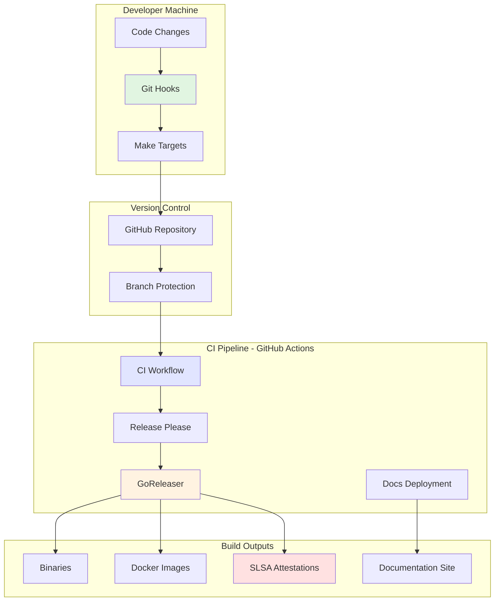
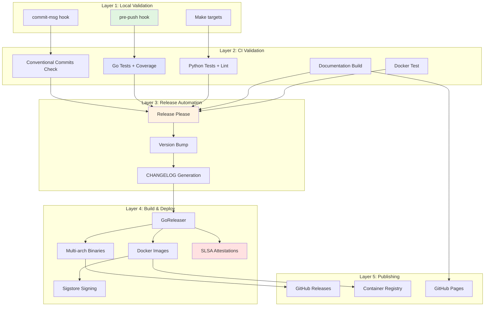
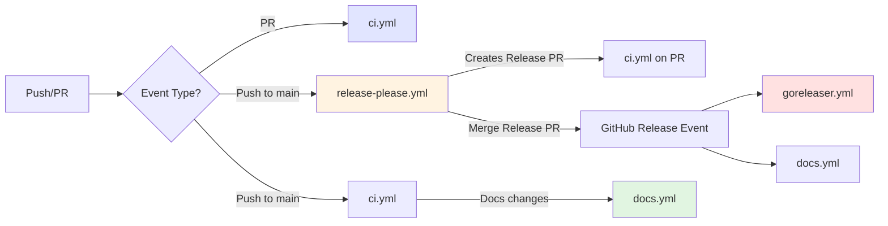
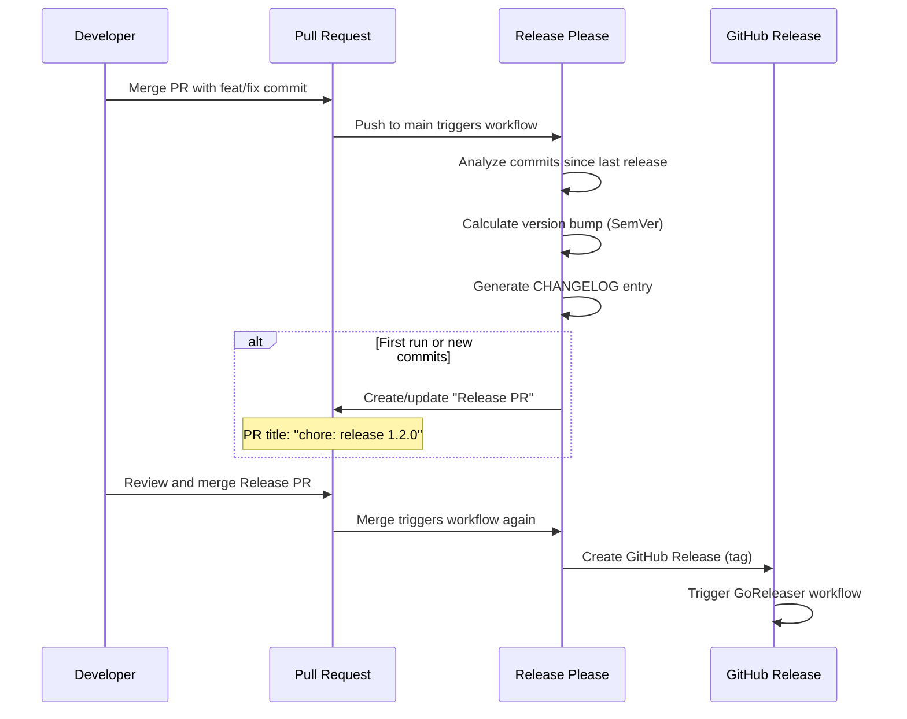
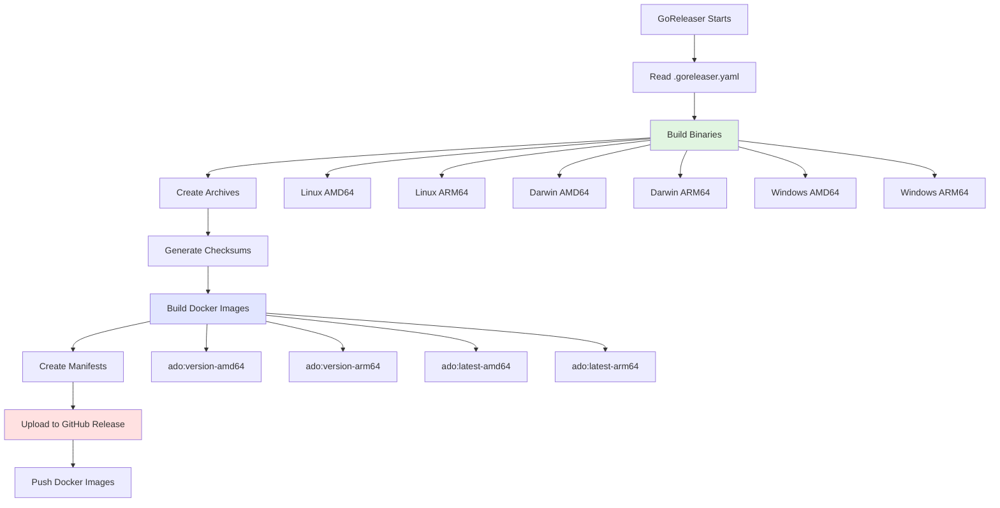
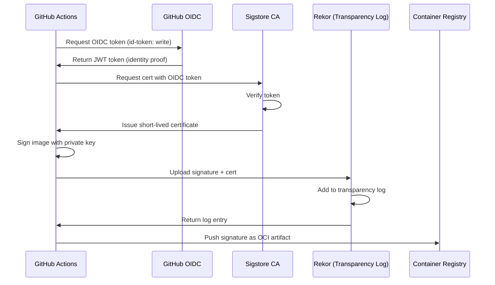
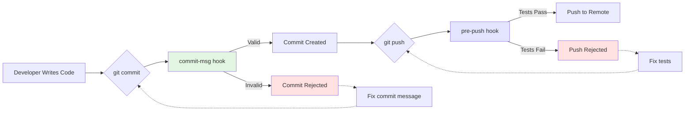
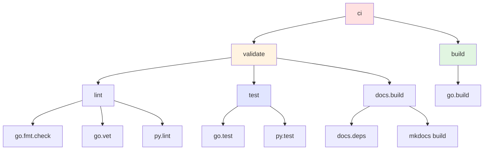
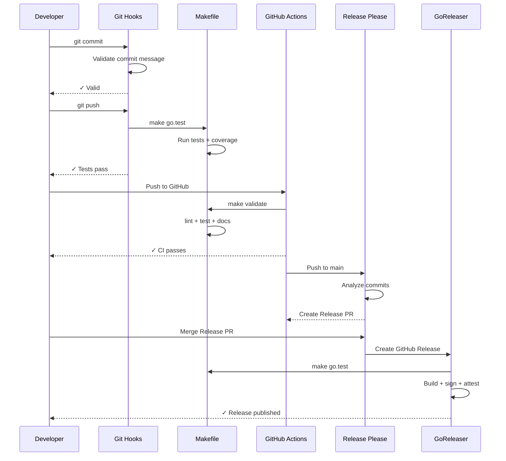
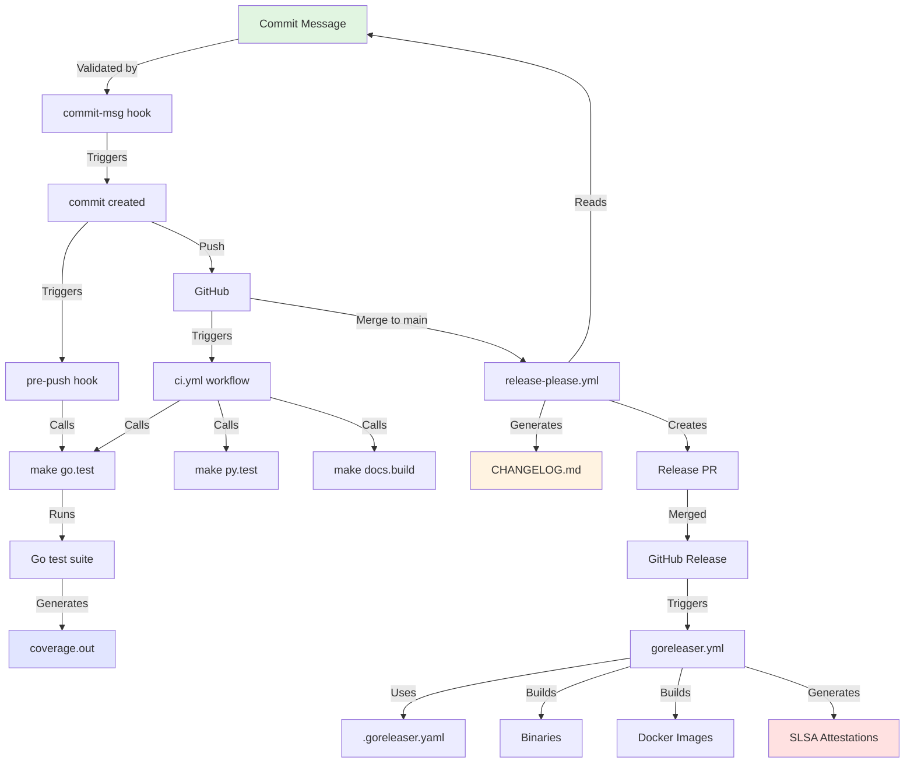

# Chapter 2: Essential CI System Components

> From philosophy to practice - the building blocks that make up a production-grade CI/CD system.

## Table of Contents

- [System Overview](#system-overview)
- [Component Architecture](#component-architecture)
- [GitHub Actions Workflows](#github-actions-workflows)
- [Git Hooks System](#git-hooks-system)
- [Makefile Infrastructure](#makefile-infrastructure)
- [Testing Infrastructure](#testing-infrastructure)
- [Linting and Formatting](#linting-and-formatting)
- [Documentation Build System](#documentation-build-system)
- [Integration Points](#integration-points)
- [Configuration Management](#configuration-management)

---

## System Overview

### The Complete Picture

A modern CI/CD system consists of multiple interconnected components, each serving a specific purpose. This chapter details every component in the `ado` project's CI/CD infrastructure.

**System Components at a Glance**:



**Key Insight**: Each component has a specific role, but they work together as a cohesive system where the output of one feeds into the input of another.

---

## Component Architecture

### Layered Architecture Model

The CI system is built in layers, with each layer providing specific guarantees:



**Design Principles**:

1. **Progressive Enhancement**: Each layer adds more comprehensive checks
2. **Fast Feedback**: Earlier layers are faster, later layers are thorough
3. **Fail Fast**: Problems caught as early as possible
4. **Idempotent Operations**: Running the same check twice yields same result
5. **Composability**: Each component can be tested independently

---

## GitHub Actions Workflows

### Workflow Architecture

The project uses five primary workflows, each with a specific purpose:



---

### 1. CI Workflow (`ci.yml`)

**Purpose**: Validate all code changes before merge.

**Trigger Conditions**:

- Every push to `main` branch
- Every pull request targeting `main`

**Job Structure**:

```yaml
name: CI

on:
  push:
    branches: [main]
  pull_request:
    branches: [main]

jobs:
  # Job 1: Validate commit message format (PR only)
  commits:
    name: Conventional Commits
    runs-on: ubuntu-latest
    if: github.event_name == 'pull_request'

  # Job 2: Go validation
  go:
    name: Go
    runs-on: ubuntu-latest

  # Job 3: Python lab validation
  python:
    name: Python Lab
    runs-on: ubuntu-latest

  # Job 4: Documentation build test
  docs:
    name: Documentation
    runs-on: ubuntu-latest

  # Job 5: Docker image build test
  docker:
    name: Docker
    runs-on: ubuntu-latest
```

**Why This Design**:

- **Parallel execution**: All jobs run simultaneously for speed
- **Independent failures**: One job failure doesn't block others
- **Conditional logic**: Commit check only runs on PRs (not needed on main)
- **Same environment**: All jobs use `ubuntu-latest` for consistency

#### Job 1: Conventional Commits Validation

**Purpose**: Enforce PR title follows conventional commit format.

**Implementation**:

```yaml
commits:
  name: Conventional Commits
  runs-on: ubuntu-latest
  if: github.event_name == 'pull_request'
  steps:
    - name: Checkout code
      uses: actions/checkout@v6
      with:
        fetch-depth: 0  # Full history for commit inspection

    - name: Validate PR title
      env:
        PR_TITLE: ${{ github.event.pull_request.title }}
      run: |
        PATTERN="^(feat|fix|docs|style|refactor|perf|test|build|ci|chore)(\([a-zA-Z0-9_-]+\))?\!?: .{10,}"
        if [[ ! "$PR_TITLE" =~ $PATTERN ]]; then
          echo "ERROR: PR title does not follow Conventional Commits format"
          # ... detailed error message ...
          exit 1
        fi
```

**Why This Works**:

- **PR titles become commit messages**: GitHub squash merges use PR title
- **Regex validation**: Enforces exact format programmatically
- **Descriptive errors**: Helps developers fix issues quickly
- **Minimum length**: 10 characters prevents lazy descriptions

**What It Catches**:

- ❌ `Add feature` → Missing type prefix
- ❌ `feat: add` → Description too short
- ❌ `feature: add new command` → Invalid type
- ✅ `feat: add export command` → Valid

#### Job 2: Go Validation

**Purpose**: Comprehensive Go code validation.

**Steps Breakdown**:

```yaml
go:
  name: Go
  runs-on: ubuntu-latest
  steps:
    # 1. Environment setup
    - name: Checkout code
      uses: actions/checkout@v6

    - name: Set up Go
      uses: actions/setup-go@v6
      with:
        go-version: "1.23"
        cache: true  # Caches Go modules and build cache

    # 2. Code quality checks
    - name: Format check
      run: test -z "$(gofmt -l .)"  # Fails if any file needs formatting

    - name: Verify dependencies
      run: |
        go mod download
        go mod verify  # Cryptographic verification

    - name: Vet
      run: make go.vet  # Static analysis

    # 3. Testing
    - name: Test
      run: go test -coverprofile=coverage.out -covermode=atomic ./cmd/ado/... ./internal/...

    # 4. Coverage enforcement
    - name: Check coverage threshold (80%)
      run: |
        COVERAGE=$(go tool cover -func=coverage.out | grep total | awk '{print $3}' | tr -d '%')
        echo "Total coverage: ${COVERAGE}%"
        COVERAGE_INT=$(echo "$COVERAGE" | awk '{printf "%d", $1}')
        if [ "$COVERAGE_INT" -lt 80 ]; then
          echo "::error::Coverage ${COVERAGE}% is below 80% threshold"
          exit 1
        fi

    # 5. Build verification
    - name: Build
      run: make go.build

    # 6. Coverage reporting (optional)
    - name: Upload coverage
      uses: codecov/codecov-action@v5
      with:
        files: ./coverage.out
      continue-on-error: true  # Don't fail if Codecov is down
```

**Why Each Step Matters**:

| Step | Purpose | Failure Impact |
|------|---------|----------------|
| **Format check** | Code style consistency | Prevents merge with unformatted code |
| **Dependency verification** | Supply chain security | Detects tampered dependencies |
| **Vet** | Static analysis | Catches common mistakes |
| **Test** | Functional correctness | Prevents broken code |
| **Coverage check** | Test completeness | Maintains quality bar |
| **Build** | Compilation verification | Ensures binary can be built |
| **Upload coverage** | Trend tracking | Historical analysis (non-blocking) |

**Coverage Threshold Implementation**:

```bash
# Extract coverage percentage
COVERAGE=$(go tool cover -func=coverage.out | grep total | awk '{print $3}' | tr -d '%')
# Output: "82.5"

# Convert to integer for comparison (handles floating point)
COVERAGE_INT=$(echo "$COVERAGE" | awk '{printf "%d", $1}')
# Output: 82

# Compare against threshold
if [ "$COVERAGE_INT" -lt 80 ]; then
  # GitHub Actions-specific error annotation
  echo "::error::Coverage ${COVERAGE}% is below 80% threshold"
  exit 1
fi
```

**Why This Approach**:

- **Floating-point handling**: Shell comparison requires integer conversion
- **GitHub Actions integration**: `::error::` creates annotation on PR
- **Clear output**: Shows exact coverage percentage

#### Job 3: Python Lab Validation

**Purpose**: Validate Python prototype code.

**Implementation**:

```yaml
python:
  name: Python Lab
  runs-on: ubuntu-latest
  steps:
    - name: Checkout code
      uses: actions/checkout@v6

    - name: Set up Python
      uses: actions/setup-python@v6
      with:
        python-version: "3.12"
        cache: pip  # Caches pip dependencies
        cache-dependency-path: lab/py/requirements.txt

    - name: Install dependencies
      run: |
        python -m pip install --upgrade pip
        pip install ruff
        make py.install

    - name: Lint
      run: ruff check lab/py/

    - name: Test
      run: make py.test
```

**Why Separate Job**:

- **Independent failures**: Python issues don't block Go code
- **Different runtime**: Python requires different setup than Go
- **Parallel execution**: Runs simultaneously with Go tests
- **R&D code**: Python lab is prototype code, not production

**Ruff Configuration** (from `pyproject.toml`):

```toml
[tool.ruff]
line-length = 100
target-version = "py310"

[tool.ruff.lint]
select = ["E", "F", "W", "I"]  # Errors, Warnings, Import sorting
```

**What It Checks**:

- **E**: PEP 8 style errors
- **F**: Pyflakes (logic errors, unused imports)
- **W**: PEP 8 warnings
- **I**: Import sorting (isort-compatible)

#### Job 4: Documentation Validation

**Purpose**: Ensure documentation builds without errors.

**Implementation**:

```yaml
docs:
  name: Documentation
  runs-on: ubuntu-latest
  steps:
    - name: Checkout code
      uses: actions/checkout@v6

    - name: Set up Python
      uses: actions/setup-python@v6
      with:
        python-version: "3.12"
        cache: pip

    - name: Install MkDocs
      run: pip install mkdocs-material mkdocs-minify-plugin

    - name: Copy CHANGELOG
      run: cp CHANGELOG.md docs/changelog.md

    - name: Build docs
      run: mkdocs build --strict  # Fails on warnings
```

**Why `--strict` Flag**:

- **No warnings tolerated**: Broken links, missing files cause failure
- **Early detection**: Catches documentation issues before deploy
- **Quality enforcement**: Maintains documentation standards

**Common Issues Caught**:

- Broken internal links: `[link](missing-page.md)`
- Missing navigation entries
- Invalid Markdown syntax
- Broken mermaid diagrams

#### Job 5: Docker Build Test

**Purpose**: Validate GoReleaser's Docker configuration works.

**Implementation**:

```yaml
docker:
  name: Docker
  runs-on: ubuntu-latest
  steps:
    - name: Checkout code
      uses: actions/checkout@v6

    - name: Set up Go
      uses: actions/setup-go@v6
      with:
        go-version: "1.23"
        cache: true

    - name: Test GoReleaser Dockerfile
      run: make docker.test
```

**What `make docker.test` Does**:

```makefile
docker.test:
	# 1. Build Linux binary
	@CGO_ENABLED=0 GOOS=linux GOARCH=amd64 go build -o dist/docker-test/ado ./cmd/ado

	# 2. Copy required files
	@cp LICENSE dist/docker-test/
	@cp README.md dist/docker-test/
	@cp goreleaser.Dockerfile dist/docker-test/Dockerfile

	# 3. Build Docker image
	@cd dist/docker-test && docker build -t ghcr.io/anowarislam/ado:test .

	# 4. Test image works
	@docker run --rm ghcr.io/anowarislam/ado:test meta info

	# 5. Cleanup
	@docker rmi ghcr.io/anowarislam/ado:test
	@rm -rf dist/docker-test
```

**Why This Test Is Critical**:

- **Catches GoReleaser issues**: Validates Dockerfile before release
- **Tests in CI**: Ensures Docker image builds on clean machine
- **Validates runtime**: Runs command to verify binary works in container
- **Prevents broken releases**: Release will fail if this test fails

**What It Catches**:

- Missing dependencies in Docker image
- Incorrect file paths in Dockerfile
- Binary not executable in container
- Entrypoint misconfiguration

---

### 2. Release Please Workflow (`release-please.yml`)

**Purpose**: Automated version management and changelog generation.

**Trigger**: Every push to `main` branch.

**How It Works**:



**Implementation**:

```yaml
name: Release Please

on:
  push:
    branches:
      - main

jobs:
  release-please:
    name: Release Please
    runs-on: ubuntu-latest
    steps:
      # 1. Generate GitHub App token (better than PAT)
      - name: Generate token
        id: generate-token
        uses: actions/create-github-app-token@v1
        with:
          app-id: ${{ secrets.APP_ID }}
          private-key: ${{ secrets.APP_PRIVATE_KEY }}

      # 2. Run release-please
      - name: Run release-please
        id: release
        uses: googleapis/release-please-action@v4
        with:
          token: ${{ steps.generate-token.outputs.token }}
          config-file: release-please-config.json
          manifest-file: .release-please-manifest.json
```

**Why GitHub App Token**:

- **Repo permissions**: Can trigger workflows (PAT cannot)
- **Fine-grained access**: Scoped to specific permissions
- **Audit trail**: Shows actions by app, not user
- **Renewable**: Can rotate without updating secrets

**Release Please Configuration** (`release-please-config.json`):

```json
{
  "packages": {
    ".": {
      "release-type": "go",
      "package-name": "ado",
      "changelog-sections": [
        { "type": "feat", "section": "Features" },
        { "type": "fix", "section": "Bug Fixes" },
        { "type": "perf", "section": "Performance" },
        { "type": "docs", "section": "Documentation", "hidden": false }
      ]
    }
  }
}
```

**Version Manifest** (`.release-please-manifest.json`):

```json
{
  ".": "0.1.0"
}
```

**How Version Bumping Works**:

| Commit Type | Version Impact | Example |
|-------------|----------------|---------|
| `fix:` | Patch (0.1.0 → 0.1.1) | Bug fixes |
| `feat:` | Minor (0.1.0 → 0.2.0) | New features |
| `feat!:` or `fix!:` | Major (0.1.0 → 1.0.0) | Breaking changes |
| `docs:`, `chore:` | No bump | Documentation only |

**Release PR Contents**:

When release-please creates a PR, it includes:

1. **Updated version** in `.release-please-manifest.json`
2. **CHANGELOG.md** with categorized changes
3. **PR title**: `chore: release X.Y.Z`

**Example CHANGELOG Output**:

```markdown
## [0.2.0] - 2025-01-15

### Features
- feat: add export command (#42)
- feat(config): add validation command (#39)

### Bug Fixes
- fix(logging): resolve timestamp formatting (#41)

### Documentation
- docs: update README with examples (#40)
```

**Why This Approach**:

- **Automatic versioning**: No manual version bumps
- **Conventional commits enforced**: CI ensures compliance
- **Human review**: Release PR can be reviewed before merge
- **Git tags**: Creates proper semantic version tags
- **Changelog maintenance**: Always up-to-date

---

### 3. GoReleaser Workflow (`goreleaser.yml`)

**Purpose**: Build, package, sign, and release binaries and Docker images.

**Trigger**: GitHub release published (created by release-please).

**Permissions** (Critical for Security):

```yaml
permissions:
  contents: write       # Upload release artifacts
  packages: write       # Push Docker images to GHCR
  id-token: write       # OIDC token for keyless signing
  attestations: write   # Build provenance attestations
```

**Job Structure**:

```yaml
goreleaser:
  name: Build and Release
  runs-on: ubuntu-latest
  steps:
    # 1. Setup
    - Generate GitHub App token
    - Checkout code (full history)
    - Set up Go

    # 2. Pre-build validation
    - Run tests

    # 3. Docker setup
    - Set up QEMU (ARM64 emulation)
    - Set up Docker Buildx (multi-arch builds)
    - Login to GHCR

    # 4. Build and release
    - Run GoReleaser

    # 5. Security attestations
    - Attest build provenance (binaries)
    - Sign container images (cosign)
```

**Step-by-Step Breakdown**:

#### Step 1: Environment Setup

```yaml
- name: Checkout code
  uses: actions/checkout@v6
  with:
    fetch-depth: 0  # Full history needed for changelog
    ref: ${{ github.event.inputs.tag || github.ref }}
```

**Why Full History**:

- GoReleaser generates changelog from commits
- Needs previous tags to calculate diff
- Build metadata includes commit count

#### Step 2: Pre-build Validation

```yaml
- name: Run tests
  run: make go.test
```

**Why Test Again**:

- **Double-check**: Tests run in CI, but re-run before release
- **Catch last-minute issues**: Ensures code at tag is working
- **Fail fast**: Don't build if tests fail

#### Step 3: Multi-Architecture Docker Setup

```yaml
- name: Set up QEMU
  uses: docker/setup-qemu-action@v3

- name: Set up Docker Buildx
  uses: docker/setup-buildx-action@v3
```

**Why QEMU**:

- **ARM64 builds on AMD64 runners**: GitHub Actions runners are x86_64
- **Emulation**: QEMU emulates ARM64 for cross-compilation
- **Multi-arch manifests**: Creates images for both architectures

**Why Buildx**:

- **Multi-platform builds**: Single build command for multiple architectures
- **BuildKit backend**: Faster, more efficient Docker builds
- **Cache support**: Speeds up subsequent builds

#### Step 4: GoReleaser Execution

```yaml
- name: Run goreleaser
  id: goreleaser
  uses: goreleaser/goreleaser-action@v6
  with:
    version: latest
    args: release --clean
  env:
    GITHUB_TOKEN: ${{ steps.generate-token.outputs.token }}
```

**What GoReleaser Does**:



**GoReleaser Configuration Highlights** (`.goreleaser.yaml`):

```yaml
# Build configuration
builds:
  - id: ado
    binary: ado
    main: ./cmd/ado
    env:
      - CGO_ENABLED=0  # Static binaries
    goos: [linux, darwin, windows]
    goarch: [amd64, arm64]
    ldflags:
      - -s -w  # Strip symbols, reduce binary size
      - -X github.com/anowarislam/ado/internal/meta.Version={{.Version}}
      - -X github.com/anowarislam/ado/internal/meta.Commit={{.Commit}}
      - -X github.com/anowarislam/ado/internal/meta.BuildTime={{.Date}}
```

**Why These Flags**:

- **`CGO_ENABLED=0`**: Static binaries, no C dependencies
- **`-s -w`**: Smaller binaries (removes debug info)
- **`-X` (ldflags)**: Inject build-time variables

**Archive Configuration**:

```yaml
archives:
  - format: tar.gz
    name_template: "{{ .ProjectName }}_{{ .Version }}_{{ .Os }}_{{ .Arch }}"
    format_overrides:
      - goos: windows
        format: zip  # Windows users prefer .zip
    files:
      - LICENSE
      - README.md
      - CHANGELOG.md
```

**Output Structure**:

```
dist/
├── ado_1.2.0_linux_amd64.tar.gz
├── ado_1.2.0_linux_arm64.tar.gz
├── ado_1.2.0_darwin_amd64.tar.gz
├── ado_1.2.0_darwin_arm64.tar.gz
├── ado_1.2.0_windows_amd64.zip
├── ado_1.2.0_windows_arm64.zip
└── checksums.txt
```

**Docker Configuration**:

```yaml
dockers:
  # AMD64 image
  - id: ado-amd64
    goos: linux
    goarch: amd64
    dockerfile: goreleaser.Dockerfile
    use: buildx
    image_templates:
      - "ghcr.io/anowarislam/ado:{{ .Version }}-amd64"
      - "ghcr.io/anowarislam/ado:latest-amd64"
    build_flag_templates:
      - "--platform=linux/amd64"
      - "--label=org.opencontainers.image.version={{ .Version }}"
      # ... more OCI labels ...

  # ARM64 image (same structure)
  - id: ado-arm64
    # ... similar config for ARM64 ...

# Multi-arch manifests
docker_manifests:
  - name_template: "ghcr.io/anowarislam/ado:{{ .Version }}"
    image_templates:
      - "ghcr.io/anowarislam/ado:{{ .Version }}-amd64"
      - "ghcr.io/anowarislam/ado:{{ .Version }}-arm64"

  - name_template: "ghcr.io/anowarislam/ado:latest"
    image_templates:
      - "ghcr.io/anowarislam/ado:latest-amd64"
      - "ghcr.io/anowarislam/ado:latest-arm64"
```

**Why Multi-Arch Manifests**:

- **Single image tag**: Users pull `ado:1.2.0`, not `ado:1.2.0-amd64`
- **Automatic selection**: Docker pulls correct architecture automatically
- **Transparent**: Users don't need to know/care about architecture

**Container Image Structure**:

```
ghcr.io/anowarislam/ado:1.2.0
├── Manifest (multi-arch index)
│   ├── amd64 → ghcr.io/anowarislam/ado:1.2.0-amd64
│   └── arm64 → ghcr.io/anowarislam/ado:1.2.0-arm64
```

When user runs `docker pull ghcr.io/anowarislam/ado:1.2.0`:
1. Docker fetches manifest
2. Detects host architecture (amd64 or arm64)
3. Pulls appropriate image automatically

#### Step 5: Build Provenance Attestations

```yaml
- name: Attest build provenance (binaries)
  uses: actions/attest-build-provenance@v2
  with:
    subject-path: |
      dist/*.tar.gz
      dist/*.zip
      dist/checksums.txt
```

**What This Creates**:

For each artifact, GitHub creates a **SLSA provenance attestation** - a signed statement containing:

```json
{
  "subject": {
    "name": "ado_1.2.0_linux_amd64.tar.gz",
    "digest": {
      "sha256": "abc123..."
    }
  },
  "predicate": {
    "builder": {
      "id": "https://github.com/actions/runner"
    },
    "buildType": "https://slsa.dev/provenance/v1",
    "invocation": {
      "configSource": {
        "uri": "git+https://github.com/anowarislam/ado@refs/tags/v1.2.0",
        "digest": {"sha1": "def456..."}
      }
    },
    "metadata": {
      "buildStartedOn": "2025-01-15T10:30:00Z",
      "buildFinishedOn": "2025-01-15T10:35:00Z"
    }
  }
}
```

**Why Provenance Matters**:

- **Proves origin**: Artifact was built by GitHub Actions, not locally
- **Immutable record**: Stored on Sigstore's transparency log
- **Supply chain security**: Verifiable build process
- **Compliance**: Meets SLSA Level 3 requirements

**How to Verify**:

```bash
# Install GitHub CLI
gh attestation verify ado_1.2.0_linux_amd64.tar.gz \
  --owner anowarislam
```

Output:
```
✓ Verification succeeded!

attestation digest: sha256:...
attestation type: https://slsa.dev/provenance/v1
```

#### Step 6: Container Image Signing

```yaml
- name: Install cosign
  uses: sigstore/cosign-installer@v3

- name: Sign container images
  env:
    REGISTRY: ghcr.io/anowarislam/ado
    GIT_TAG: ${{ github.ref_name }}
  run: |
    VERSION="${GIT_TAG#v}"  # Strip 'v' prefix
    cosign sign --yes "${REGISTRY}:${VERSION}"
    cosign sign --yes "${REGISTRY}:latest"
```

**What Cosign Does**:



**Keyless Signing Flow**:

1. **OIDC Token**: GitHub Actions generates identity token
2. **Certificate Request**: Cosign requests cert from Sigstore CA
3. **Identity Verification**: Sigstore validates GitHub OIDC token
4. **Short-lived Cert**: Sigstore issues certificate (valid 10 minutes)
5. **Image Signing**: Cosign signs image digest with ephemeral key
6. **Transparency Log**: Signature published to Rekor (immutable log)
7. **OCI Artifact**: Signature stored alongside image in registry

**Why Keyless**:

- **No key management**: No private keys to store or rotate
- **GitHub identity**: Tied to repository and workflow
- **Transparency**: All signatures publicly logged
- **Audit trail**: Rekor provides tamper-proof history

**Signature Storage**:

```
Registry:
  ghcr.io/anowarislam/ado:1.2.0
    ├── Image layers (filesystem)
    ├── Image config (metadata)
    └── sha256-abc123.sig (cosign signature)
```

**How to Verify Signature**:

```bash
# Verify image was signed by GitHub Actions workflow
cosign verify ghcr.io/anowarislam/ado:1.2.0 \
  --certificate-identity-regexp="https://github.com/anowarislam/ado/" \
  --certificate-oidc-issuer="https://token.actions.githubusercontent.com"
```

Output:
```
Verification for ghcr.io/anowarislam/ado:1.2.0 --
The following checks were performed on each of these signatures:
  - The cosign claims were validated
  - Existence of the claims in the transparency log was verified offline
  - The code-signing certificate was verified using trusted certificate authority certificates

[{"critical":{"identity":{"docker-reference":"ghcr.io/anowarislam/ado"}...}]
```

**What This Proves**:

- ✅ Image was built by GitHub Actions (not locally)
- ✅ Build was from `anowarislam/ado` repository
- ✅ Signature is in transparency log (tamper-proof)
- ✅ Certificate chain is valid

---

### 4. Documentation Workflow (`docs.yml`)

**Purpose**: Build and deploy MkDocs documentation to GitHub Pages.

**Triggers**:

- **Release published**: Deploy docs with new version
- **Push to main** (docs changes only): Update docs immediately
- **Pull request** (docs changes only): Validate docs build
- **Manual trigger**: `workflow_dispatch`

**Path Filters** (Smart Triggering):

```yaml
on:
  push:
    branches: [main]
    paths:
      - 'docs/**'           # Documentation content
      - 'mkdocs.yml'        # MkDocs config
      - 'CHANGELOG.md'      # Included in docs
      - '.github/workflows/docs.yml'  # Workflow itself
```

**Why Path Filters**:

- **Avoid unnecessary builds**: Don't rebuild docs for Go code changes
- **Faster feedback**: Only runs when docs-related files change
- **Resource efficiency**: Saves GitHub Actions minutes

**Job Structure**:

```yaml
jobs:
  # Job 1: Build documentation
  build:
    runs-on: ubuntu-latest
    steps:
      - Checkout code
      - Set up Python
      - Install MkDocs + plugins
      - Copy CHANGELOG
      - Build documentation
      - Upload artifact (if not PR)

  # Job 2: Deploy to GitHub Pages (not on PRs)
  deploy:
    if: github.event_name != 'pull_request'
    needs: build
    runs-on: ubuntu-latest
    steps:
      - Deploy to GitHub Pages

  # Job 3: Validate links
  validate-links:
    runs-on: ubuntu-latest
    steps:
      - Build site
      - Check internal links
```

**Build Job Details**:

```yaml
build:
  runs-on: ubuntu-latest
  steps:
    - name: Checkout
      uses: actions/checkout@v4
      with:
        fetch-depth: 0  # Full history for git info plugin

    - name: Set up Python
      uses: actions/setup-python@v5
      with:
        python-version: '3.12'

    - name: Cache pip dependencies
      uses: actions/cache@v4
      with:
        path: ~/.cache/pip
        key: ${{ runner.os }}-pip-mkdocs-${{ hashFiles('mkdocs.yml') }}

    - name: Install MkDocs and dependencies
      run: |
        pip install \
          mkdocs-material \      # Theme
          mkdocs-minify-plugin \ # Minification
          pillow \               # Image processing
          cairosvg               # SVG to PNG (social cards)

    - name: Copy CHANGELOG to docs
      run: cp CHANGELOG.md docs/changelog.md

    - name: Build documentation
      run: mkdocs build --strict

    - name: Upload artifact
      if: github.event_name != 'pull_request'
      uses: actions/upload-pages-artifact@v3
      with:
        path: site
```

**Why Full Git History**:

- **Git metadata**: Shows last modified date for each page
- **Contributors**: Can extract author information
- **Version tracking**: Links to specific commits

**MkDocs Strict Mode**:

```bash
mkdocs build --strict
```

**What Strict Mode Catches**:

- ❌ Broken internal links: `[link](missing.md)`
- ❌ Missing pages in navigation
- ❌ Invalid Markdown syntax
- ❌ Broken mermaid diagrams
- ❌ Missing images

**Example Error**:

```
ERROR   - Doc file 'commands/missing.md' contains a link to 'not-found.md'
          which is not found in the documentation files.
```

**Deploy Job**:

```yaml
deploy:
  if: github.event_name != 'pull_request'
  needs: build
  runs-on: ubuntu-latest
  environment:
    name: github-pages
    url: ${{ steps.deployment.outputs.page_url }}
  steps:
    - name: Deploy to GitHub Pages
      id: deployment
      uses: actions/deploy-pages@v4
```

**Why Separate Job**:

- **Conditional deployment**: Build on PRs, deploy only on main
- **Environment protection**: Can add manual approval
- **Output URL**: Gets deployment URL for status checks

**Link Validation Job**:

```yaml
validate-links:
  runs-on: ubuntu-latest
  steps:
    - name: Check internal links
      run: |
        # Start local server
        cd site && python -m http.server 8000 &
        sleep 2

        # Check links (internal only)
        linkchecker http://localhost:8000 \
          --ignore-url='https?://.*' \      # Skip external links
          --no-warnings \
          --check-extern=false \
          || true  # Don't fail on warnings
```

**Why Skip External Links**:

- **Rate limits**: External sites may block repeated requests
- **Flaky tests**: External sites may be temporarily down
- **Focus on internal**: Internal links are what we control

---

### 5. Additional Workflows (Overview)

#### Dependabot Auto-Merge (`dependabot-auto-merge.yml`)

**Purpose**: Automatically merge Dependabot PRs for minor/patch updates.

**Key Features**:

- Auto-approves Dependabot PRs
- Only merges if CI passes
- Only minor/patch versions (not major)

**Why Useful**:

- **Security updates**: Fast deployment of security patches
- **Maintenance burden**: Reduces manual PR review
- **Safe automation**: CI must pass before merge

#### Claude Code Review (`claude-code-review.yml`)

**Purpose**: AI-assisted code review on PRs.

**When It Runs**: Pull requests

**What It Does**:

- Analyzes code changes
- Provides suggestions
- Checks for common issues
- Non-blocking (informational only)

---

## Git Hooks System

### Git Hooks Architecture

Git hooks provide instant, local validation before code reaches CI:



**Why Git Hooks**:

| Benefit | Description |
|---------|-------------|
| **Instant feedback** | < 1 second for commit-msg, 10-30s for pre-push |
| **Offline** | Works without internet connection |
| **Zero CI cost** | No GitHub Actions minutes used |
| **Fail fast** | Catch issues before CI |
| **Developer UX** | Fast iteration loop |

**Hook Installation**:

```bash
# Install hooks
make hooks.install

# What this does:
git config core.hooksPath .githooks
```

**Custom Hooks Directory**:

```
.githooks/
├── commit-msg    # Validates commit message format
└── pre-push      # Runs tests, coverage, build
```

---

### commit-msg Hook

**Purpose**: Enforce conventional commit format at commit time.

**Location**: `.githooks/commit-msg`

**Full Implementation**:

```bash
#!/usr/bin/env bash
#
# Git commit-msg hook to enforce Conventional Commits format.
#
# Format: <type>[(scope)][!]: <description>
#
# Types: feat, fix, docs, style, refactor, perf, test, build, ci, chore
# Breaking changes: Add ! after type/scope
#
# Examples:
#   feat: add export command
#   fix(config): resolve path resolution on Windows
#   feat!: change CLI flag syntax

set -euo pipefail

COMMIT_MSG_FILE="$1"
COMMIT_MSG=$(head -1 "$COMMIT_MSG_FILE")

# Skip merge commits and fixup/squash commits
if [[ "$COMMIT_MSG" =~ ^Merge|^fixup!|^squash!|^amend! ]]; then
    exit 0
fi

# Conventional commit pattern
PATTERN="^(feat|fix|docs|style|refactor|perf|test|build|ci|chore)(\([a-zA-Z0-9_-]+\))?\!?: .{1,}"

if ! [[ "$COMMIT_MSG" =~ $PATTERN ]]; then
    echo ""
    echo "ERROR: Invalid commit message format"
    echo ""
    echo "Your message:"
    echo "  $COMMIT_MSG"
    echo ""
    echo "Expected format:"
    echo "  <type>[(scope)][!]: <description>"
    echo ""
    echo "Valid types: feat, fix, docs, style, refactor, perf, test, build, ci, chore"
    echo ""
    echo "Examples:"
    echo "  feat: add new export command"
    echo "  fix(config): resolve Windows path issue"
    echo "  feat!: breaking change to CLI flags"
    echo ""
    exit 1
fi

# Check minimum description length (at least 10 chars)
DESCRIPTION="${COMMIT_MSG#*: }"
if [[ ${#DESCRIPTION} -lt 10 ]]; then
    echo ""
    echo "ERROR: Commit description too short (minimum 10 characters)"
    echo ""
    echo "Your description: '$DESCRIPTION'"
    echo ""
    exit 1
fi

exit 0
```

**Validation Logic Breakdown**:

```bash
# 1. Extract commit message (first line only)
COMMIT_MSG=$(head -1 "$COMMIT_MSG_FILE")

# 2. Skip special commits
if [[ "$COMMIT_MSG" =~ ^Merge|^fixup!|^squash!|^amend! ]]; then
    exit 0  # Allow these through
fi

# 3. Pattern matching
PATTERN="^(feat|fix|docs|style|refactor|perf|test|build|ci|chore)(\([a-zA-Z0-9_-]+\))?\!?: .{1,}"
#       ^^^^^^^^^^^^^^^^^^^^^^^^^^^^^^^^^^^^^^^^^^^^^^^^^^^^^^^^  ^^^^^^^^^^^^^^^^  ^  ^^^
#       |                                                           |                 |  |
#       Required type (one of 10 valid types)                      |                 |  Required description
#                                                                   |                 |
#                                                                   Optional scope    Optional breaking change marker
#                                                                   (alphanumeric, -, _)

# 4. Check pattern match
if ! [[ "$COMMIT_MSG" =~ $PATTERN ]]; then
    # Print detailed error
    exit 1
fi

# 5. Check description length
DESCRIPTION="${COMMIT_MSG#*: }"  # Extract everything after ": "
if [[ ${#DESCRIPTION} -lt 10 ]]; then
    # Print error
    exit 1
fi
```

**What It Catches**:

| Invalid Commit | Reason | Error Message |
|----------------|--------|---------------|
| `Add feature` | Missing type prefix | Invalid commit message format |
| `feature: add cmd` | Invalid type (should be `feat`) | Invalid commit message format |
| `feat:add` | Missing space after colon | Invalid commit message format |
| `feat: add` | Description too short | Commit description too short (minimum 10 characters) |
| `feat(scope with spaces): add` | Invalid scope characters | Invalid commit message format |

**Valid Commits**:

```bash
✅ feat: add export command
✅ fix(config): resolve path issue
✅ feat(api)!: breaking change to API
✅ docs: update README with examples
✅ chore: update dependencies
```

**Developer Experience**:

```bash
$ git commit -m "Add feature"

ERROR: Invalid commit message format

Your message:
  Add feature

Expected format:
  <type>[(scope)][!]: <description>

Valid types: feat, fix, docs, style, refactor, perf, test, build, ci, chore

Examples:
  feat: add new export command
  fix(config): resolve Windows path issue
  feat!: breaking change to CLI flags

# Commit was rejected (not created)

$ git commit -m "feat: add export command"
[main abc123] feat: add export command
# Commit succeeded!
```

**Why This Works**:

- **Immediate feedback**: Developer knows instantly
- **Helpful errors**: Shows what's wrong and how to fix
- **Examples included**: No need to look up format
- **Blocks invalid commits**: Cannot commit with bad message

---

### pre-push Hook

**Purpose**: Run comprehensive checks before code reaches remote.

**Location**: `.githooks/pre-push`

**What It Checks**:

1. Go tests with race detector (detects concurrency bugs)
2. Coverage threshold (80% minimum)
3. Build verification (ensures binary compiles)

**Full Implementation**:

```bash
#!/usr/bin/env bash
#
# Git pre-push hook to validate code before pushing.
#
# This hook runs slower checks that shouldn't block every commit
# but must pass before pushing to remote:
#   1. Go tests with race detector
#   2. Coverage threshold check (80% minimum)
#   3. Build verification
#
# Skip with: git push --no-verify (use sparingly!)

set -euo pipefail

# Colors for output
RED='\033[0;31m'
GREEN='\033[0;32m'
YELLOW='\033[1;33m'
NC='\033[0m' # No Color

echo -e "${YELLOW}Running pre-push checks...${NC}"
echo ""

# Change to repository root
cd "$(git rev-parse --show-toplevel)"

# Check if Go is available
if ! command -v go &> /dev/null; then
    echo -e "${RED}ERROR: Go is not installed${NC}"
    exit 1
fi

# ============================================================
# Check 1: Run tests with race detector
# ============================================================
echo -e "▸ Running tests with race detector..."
if ! go test -race -timeout 60s ./cmd/ado/... ./internal/... 2>&1; then
    echo ""
    echo -e "${RED}ERROR: Tests failed${NC}"
    echo "Fix the failing tests before pushing."
    exit 1
fi
echo -e "${GREEN}✓ All tests passed${NC}"
echo ""

# ============================================================
# Check 2: Check coverage threshold (80%)
# ============================================================
echo -e "▸ Checking coverage threshold (80%)..."
COVERAGE_FILE=$(mktemp)
go test -coverprofile="$COVERAGE_FILE" -covermode=atomic ./cmd/ado/... ./internal/... > /dev/null 2>&1

COVERAGE=$(go tool cover -func="$COVERAGE_FILE" | grep total | awk '{print $3}' | tr -d '%')
rm -f "$COVERAGE_FILE"

if [ -z "$COVERAGE" ]; then
    echo -e "${RED}ERROR: Could not determine coverage${NC}"
    exit 1
fi

# Compare coverage (handle floating point)
COVERAGE_INT=${COVERAGE%.*}  # Truncate decimals
if [ "$COVERAGE_INT" -lt 80 ]; then
    echo -e "${RED}ERROR: Coverage ${COVERAGE}% is below 80% threshold${NC}"
    echo "Add tests to improve coverage before pushing."
    exit 1
fi
echo -e "${GREEN}✓ Coverage: ${COVERAGE}% (threshold: 80%)${NC}"
echo ""

# ============================================================
# Check 3: Verify build
# ============================================================
echo -e "▸ Verifying build..."
if ! go build -o /dev/null ./cmd/ado 2>&1; then
    echo ""
    echo -e "${RED}ERROR: Build failed${NC}"
    echo "Fix build errors before pushing."
    exit 1
fi
echo -e "${GREEN}✓ Build successful${NC}"
echo ""

echo -e "${GREEN}All pre-push checks passed!${NC}"
exit 0
```

**Check Breakdown**:

#### Check 1: Race Detector

```bash
go test -race -timeout 60s ./cmd/ado/... ./internal/...
```

**What Race Detector Finds**:

- Concurrent access to shared variables
- Data races in goroutines
- Unsynchronized map access
- Channel misuse

**Example Race Condition**:

```go
// BAD: Data race
var counter int
func increment() {
    go func() {
        counter++ // Race condition!
    }()
}

// GOOD: Synchronized
var mu sync.Mutex
var counter int
func increment() {
    go func() {
        mu.Lock()
        counter++
        mu.Unlock()
    }()
}
```

**Race Detector Output**:

```
==================
WARNING: DATA RACE
Write at 0x00c000012098 by goroutine 7:
  main.increment()
      /path/to/file.go:15 +0x44

Previous write at 0x00c000012098 by goroutine 6:
  main.increment()
      /path/to/file.go:15 +0x44
==================
```

**Why This Matters**:

- **Production safety**: Prevents subtle concurrency bugs
- **Goroutine-heavy code**: Go code often uses concurrency
- **Hard to debug**: Race conditions are notoriously difficult to reproduce

#### Check 2: Coverage Threshold

```bash
# Generate coverage profile
go test -coverprofile="$COVERAGE_FILE" -covermode=atomic ./cmd/ado/... ./internal/...

# Extract coverage percentage
COVERAGE=$(go tool cover -func="$COVERAGE_FILE" | grep total | awk '{print $3}' | tr -d '%')

# Convert to integer for comparison
COVERAGE_INT=${COVERAGE%.*}

# Check threshold
if [ "$COVERAGE_INT" -lt 80 ]; then
    echo -e "${RED}ERROR: Coverage ${COVERAGE}% is below 80% threshold${NC}"
    exit 1
fi
```

**Coverage Report Format**:

```bash
$ go tool cover -func=coverage.out | tail -5

internal/config/paths.go:45:    resolveConfigPath      100.0%
internal/config/paths.go:60:    DefaultConfigDir       100.0%
internal/meta/info.go:15:       Info                   75.0%
internal/meta/info.go:25:       Version                100.0%
total:                          (statements)           82.4%
```

**Why 80% Threshold**:

- **High quality**: Catches most uncovered code paths
- **Practical**: Not too strict (allows some uncovered code)
- **Industry standard**: Common in production systems
- **Incentive**: Encourages writing tests for new code

**What It Doesn't Catch**:

- Logic bugs in tested code
- Wrong assertions in tests
- Integration issues
- Performance problems

#### Check 3: Build Verification

```bash
go build -o /dev/null ./cmd/ado
```

**Why This Check**:

- **Compilation**: Ensures code compiles without errors
- **Type checking**: Go's type system catches many errors
- **Imports**: Validates all imports exist
- **Syntax**: Catches syntax errors

**What It Catches**:

- Undefined functions/variables
- Type mismatches
- Import cycles
- Missing packages
- Syntax errors

**Developer Experience**:

```bash
$ git push origin main

Running pre-push checks...

▸ Running tests with race detector...
✓ All tests passed

▸ Checking coverage threshold (80%)...
ERROR: Coverage 75.3% is below 80% threshold
Add tests to improve coverage before pushing.

# Push was blocked!
```

**Bypass Hook** (Emergency Only):

```bash
# Skip hooks (use rarely!)
git push --no-verify
```

**When to Bypass**:

- Emergency hotfix
- Known issue, will fix in next commit
- Working on non-code files only

**Best Practice**: Never bypass hooks for normal development.

---

## Makefile Infrastructure

### Makefile Architecture

The Makefile system is modular, with each module handling a specific domain:

```
Makefile                    # Main entry point
├── include make/common.mk  # Shared variables, helpers
├── include make/go.mk      # Go build, test, lint
├── include make/python.mk  # Python lab targets
├── include make/docker.mk  # Docker build, push
├── include make/docs.mk    # MkDocs documentation
├── include make/hooks.mk   # Git hooks management
└── include make/help.mk    # Help system
```

**Why Modular**:

- **Separation of concerns**: Each file focuses on one area
- **Maintainability**: Easy to find and update targets
- **Reusability**: Modules can be shared across projects
- **Readability**: Smaller files are easier to understand

---

### Core Makefile

**Purpose**: High-level composite targets and coordination.

**Key Targets**:

```makefile
# First-time setup
setup: hooks.install go.deps py.install
	@echo "Setup complete!"

# Build (alias to go.build)
build: go.build

# Run all tests
test: go.test py.test

# Run all tests with coverage
test.cover: go.test.cover py.test.cover

# Lint all code
lint: go.fmt.check go.vet py.lint

# Format all code
fmt: go.fmt py.fmt

# Mirror CI validation
validate: lint test docs.build
	@echo "✓ Validation complete"

# Full CI pipeline locally
ci: validate build
	@echo "✓ CI pipeline complete - Ready to push!"
```

**Target Dependency Graph**:



**Composite Target Pattern**:

```makefile
# High-level target
validate: lint test docs.build
	$(call log_header,"Validation Complete")
	$(call log_success,"All checks passed!")

# Composed from multiple sub-targets
lint: go.fmt.check go.vet py.lint
test: go.test py.test
```

**Benefits**:

- **One command**: `make validate` runs everything
- **Mirrors CI**: Same checks as GitHub Actions
- **Fail fast**: Stops on first error
- **Clear output**: Colored, structured logging

---

### common.mk - Shared Infrastructure

**Purpose**: Variables, colors, logging helpers used by all modules.

**Key Components**:

```makefile
# ============================================================
# Shell Configuration
# ============================================================
SHELL := /bin/bash
.SHELLFLAGS := -eu -o pipefail -c  # Strict mode
.DELETE_ON_ERROR:                  # Delete incomplete files
MAKEFLAGS += --warn-undefined-variables
MAKEFLAGS += --no-builtin-rules

# ============================================================
# Project Metadata
# ============================================================
PROJECT_NAME := ado
PROJECT_ROOT := $(shell pwd)
VERSION := $(shell git describe --tags --always --dirty 2>/dev/null || echo "dev")
COMMIT := $(shell git rev-parse --short HEAD 2>/dev/null || echo "unknown")
BUILD_TIME := $(shell date -u '+%Y-%m-%dT%H:%M:%SZ')

# ============================================================
# Terminal Colors
# ============================================================
TERM_SUPPORTS_COLOR := $(shell tput colors 2>/dev/null || echo 0)
ifeq ($(shell test $(TERM_SUPPORTS_COLOR) -ge 8 && echo yes),yes)
    COLOR_RESET := $(shell tput sgr0)
    COLOR_BOLD := $(shell tput bold)
    COLOR_RED := $(shell tput setaf 1)
    COLOR_GREEN := $(shell tput setaf 2)
    COLOR_YELLOW := $(shell tput setaf 3)
    COLOR_BLUE := $(shell tput setaf 4)
    COLOR_CYAN := $(shell tput setaf 6)
else
    # No color support
    COLOR_RESET :=
    COLOR_BOLD :=
    # ... (empty strings)
endif

# ============================================================
# Logging Helpers
# ============================================================
define log_info
	@printf "$(COLOR_CYAN)▸$(COLOR_RESET) %s\n" $(1)
endef

define log_success
	@printf "$(COLOR_GREEN)✓$(COLOR_RESET) %s\n" $(1)
endef

define log_warn
	@printf "$(COLOR_YELLOW)⚠$(COLOR_RESET) %s\n" $(1)
endef

define log_error
	@printf "$(COLOR_RED)✗$(COLOR_RESET) %s\n" $(1)
endef

define log_header
	@printf "\n$(COLOR_BOLD)$(COLOR_BLUE)=== %s ===$(COLOR_RESET)\n" $(1)
endef

# ============================================================
# Dependency Checks
# ============================================================
define check_tool
	@command -v $(1) >/dev/null 2>&1 || { \
		printf "$(COLOR_RED)✗$(COLOR_RESET) Required tool '$(1)' not found. $(2)\n"; \
		exit 1; \
	}
endef

# Helper targets
.PHONY: _check-go
_check-go:
	$(call check_tool,go,Please install Go from https://go.dev/dl/)

.PHONY: _check-python
_check-python:
	$(call check_tool,python3,Please install Python 3.12+)

.PHONY: _check-docker
_check-docker:
	$(call check_tool,docker,Please install Docker from https://docs.docker.com/get-docker/)
```

**Usage in Other Modules**:

```makefile
# In go.mk
go.build: _check-go
	$(call log_info,"Building $(PROJECT_NAME)...")
	@go build -ldflags "$(GO_LDFLAGS)" -o $(GO_BINARY) ./cmd/ado
	$(call log_success,"Built: $(GO_BINARY)")
```

**Output Example**:

```bash
$ make go.build

▸ Building ado...
✓ Built: /path/to/ado
```

---

### go.mk - Go Build System

**Purpose**: All Go-related targets (build, test, lint, dependencies).

**Key Variables**:

```makefile
GO ?= go
GO_ENV ?= env GOCACHE=$(PROJECT_ROOT)/.gocache
GO_BUILD_CMD ?= ./cmd/ado
GO_BINARY ?= $(PROJECT_ROOT)/ado

# Build flags (inject version info)
GO_LDFLAGS := -s -w \
	-X github.com/anowarislam/ado/internal/meta.Version=$(VERSION) \
	-X github.com/anowarislam/ado/internal/meta.Commit=$(COMMIT) \
	-X github.com/anowarislam/ado/internal/meta.BuildTime=$(BUILD_TIME)

# Packages to test
GO_TEST_PKGS ?= ./cmd/ado/... ./internal/...

# Test flags
GO_TEST_FLAGS ?= -race -timeout 30s
GO_COVER_FLAGS ?= -coverprofile=coverage.out -covermode=atomic
```

**Build Targets**:

```makefile
go.build: _check-go
	$(call log_info,"Building $(PROJECT_NAME)...")
	@$(GO_ENV) $(GO) build -ldflags "$(GO_LDFLAGS)" -o $(GO_BINARY) $(GO_BUILD_CMD)
	$(call log_success,"Built: $(GO_BINARY)")

go.build.all: _check-go
	$(call log_info,"Building for all platforms...")
	@command -v goreleaser >/dev/null 2>&1 || { \
		echo "goreleaser not installed. Install from https://goreleaser.com"; \
		exit 1; \
	}
	@goreleaser build --snapshot --clean
	$(call log_success,"All platform builds complete in dist/")

go.install: _check-go
	$(call log_info,"Installing $(PROJECT_NAME)...")
	@$(GO_ENV) $(GO) install -ldflags "$(GO_LDFLAGS)" $(GO_BUILD_CMD)
	$(call log_success,"Installed to $$(go env GOPATH)/bin/$(PROJECT_NAME)")
```

**Test Targets**:

```makefile
go.test: _check-go
	$(call log_info,"Running Go tests...")
	@$(GO_ENV) $(GO) test $(GO_TEST_FLAGS) $(GO_TEST_PKGS)
	$(call log_success,"All Go tests passed")

go.test.cover: _check-go
	$(call log_info,"Running Go tests with coverage...")
	@$(GO_ENV) $(GO) test $(GO_TEST_FLAGS) $(GO_COVER_FLAGS) $(GO_TEST_PKGS)
	@$(GO) tool cover -func=coverage.out | tail -1
	$(call log_success,"Coverage report: coverage.out")

go.test.cover.html: go.test.cover
	$(call log_info,"Generating HTML coverage report...")
	@$(GO) tool cover -html=coverage.out -o coverage.html
	$(call log_success,"Coverage report: coverage.html")

go.test.cover.check: go.test.cover
	$(call log_info,"Checking coverage threshold (80%)...")
	@COVERAGE=$$($(GO) tool cover -func=coverage.out | grep total | awk '{print $$3}' | tr -d '%'); \
	if [ "$${COVERAGE%.*}" -lt 80 ]; then \
		echo "$(COLOR_RED)Coverage $${COVERAGE}% is below 80% threshold$(COLOR_RESET)"; \
		exit 1; \
	fi
	$(call log_success,"Coverage meets threshold")
```

**Lint Targets**:

```makefile
go.fmt:
	$(call log_info,"Formatting Go sources...")
	@$(GO) fmt ./...
	$(call log_success,"Go sources formatted")

go.fmt.check:
	$(call log_info,"Checking Go formatting...")
	@test -z "$$(gofmt -l .)" || { \
		echo "$(COLOR_RED)Go files need formatting:$(COLOR_RESET)"; \
		gofmt -l .; \
		exit 1; \
	}
	$(call log_success,"Go formatting check passed")

go.vet: _check-go
	$(call log_info,"Running go vet...")
	@$(GO_ENV) $(GO) vet $(GO_TEST_PKGS)
	$(call log_success,"go vet passed")
```

---

### python.mk - Python Lab System

**Purpose**: Python prototype development, testing, and linting.

**Key Variables**:

```makefile
PYTHON ?= python3
VENV := $(PROJECT_ROOT)/.venv
VENV_BIN := $(VENV)/bin
PIP := $(VENV_BIN)/pip
PYTEST := $(VENV_BIN)/pytest
RUFF := $(VENV_BIN)/ruff
LAB_DIR := $(PROJECT_ROOT)/lab/py
```

**Environment Targets**:

```makefile
py.env:
	$(call log_info,"Creating Python virtual environment...")
	@if [ ! -d "$(VENV)" ]; then \
		$(PYTHON) -m venv "$(VENV)"; \
		$(PIP) install --upgrade pip; \
	fi
	$(call log_success,"Virtual environment ready: $(VENV)")

py.install: py.env
	$(call log_info,"Installing lab package...")
	@"$(PIP)" install -e "$(LAB_DIR)[dev]"
	$(call log_success,"Lab package installed")
```

**Test Targets**:

```makefile
py.test: py.env
	$(call log_info,"Running Python tests...")
	@if [ ! -x "$(PYTEST)" ]; then \
		echo "pytest not found. Run 'make py.install' first."; \
		exit 1; \
	fi
	@if [ -d "$(LAB_DIR)" ]; then \
		"$(PYTEST)" "$(LAB_DIR)" -q; \
	else \
		echo "No lab/py directory present."; \
	fi
	$(call log_success,"Python tests passed")

py.test.cover: py.env
	$(call log_info,"Running Python tests with coverage...")
	@"$(PYTEST)" "$(LAB_DIR)" --cov="$(LAB_DIR)" --cov-report=term-missing
```

**Lint Targets**:

```makefile
py.lint: py.env
	$(call log_info,"Linting Python code...")
	@"$(RUFF)" check "$(LAB_DIR)"
	$(call log_success,"Python lint passed")

py.fmt: py.env
	$(call log_info,"Formatting Python code...")
	@"$(RUFF)" format "$(LAB_DIR)"
	$(call log_success,"Python code formatted")
```

---

### docker.mk - Container System

**Purpose**: Docker image building, testing, and publishing.

**Key Targets**:

```makefile
docker.build: _check-docker
	$(call log_info,"Building Docker image...")
	@$(DOCKER) build \
		$(DOCKER_BUILD_ARGS) \
		-t $(DOCKER_IMAGE):$(DOCKER_TAG) \
		-t $(DOCKER_IMAGE):latest \
		-f $(DOCKERFILE) \
		.
	$(call log_success,"Image built: $(DOCKER_IMAGE):$(DOCKER_TAG)")

docker.test: _check-docker
	$(call log_info,"Testing GoReleaser Dockerfile...")
	@mkdir -p dist/docker-test
	@CGO_ENABLED=0 GOOS=linux GOARCH=amd64 go build -o dist/docker-test/ado ./cmd/ado
	@cp LICENSE README.md dist/docker-test/
	@cp $(DOCKERFILE_GORELEASER) dist/docker-test/Dockerfile
	@cd dist/docker-test && $(DOCKER) build -t $(DOCKER_IMAGE):test .
	@$(DOCKER) run --rm $(DOCKER_IMAGE):test meta info
	@$(DOCKER) rmi $(DOCKER_IMAGE):test
	@rm -rf dist/docker-test
	$(call log_success,"GoReleaser Dockerfile test passed")
```

---

### docs.mk - Documentation System

**Purpose**: MkDocs documentation building and serving.

**Key Targets**:

```makefile
docs.build: _docs-prep
	$(call log_info,"Building documentation...")
	@$(MKDOCS) build --strict
	$(call log_success,"Documentation built in $(SITE_DIR)/")

docs.serve: _docs-prep
	$(call log_info,"Starting documentation server on http://localhost:$(DOCS_PORT)")
	@$(MKDOCS) serve --dev-addr localhost:$(DOCS_PORT)

_docs-prep:
	@cp CHANGELOG.md $(DOCS_DIR)/changelog.md 2>/dev/null || true
```

---

### hooks.mk - Git Hooks Management

**Purpose**: Install/uninstall git hooks.

**Key Targets**:

```makefile
hooks.install: _check-git
	$(call log_info,"Installing git hooks...")
	@git config core.hooksPath $(HOOKS_DIR)
	$(call log_success,"Git hooks installed from $(HOOKS_DIR)/")
	@echo "  • commit-msg: Validates conventional commit format"
	@echo "  • pre-push:   Runs tests, coverage check, and build"

hooks.uninstall:
	$(call log_info,"Uninstalling git hooks...")
	@git config --unset core.hooksPath || true
	$(call log_success,"Git hooks uninstalled")

hooks.status:
	@echo "Hooks path: $$(git config core.hooksPath || echo 'default (.git/hooks)')"
	@echo ""
	@echo "Available hooks in $(HOOKS_DIR)/:"
	@ls -la $(HOOKS_DIR)/ 2>/dev/null || echo "  (none)"
```

---

## Testing Infrastructure

### Go Testing Strategy

**Test Organization**:

```
internal/config/
├── paths.go          # Implementation
├── paths_test.go     # Tests
└── testdata/         # Test fixtures
    ├── valid.yaml
    └── invalid.yaml
```

**Test File Pattern**:

- `*_test.go` files alongside implementation
- Table-driven tests with subtests
- Test fixtures in `testdata/` directories

**Table-Driven Test Pattern**:

```go
func TestResolveConfigPath(t *testing.T) {
	tests := []struct {
		name     string
		explicit string
		envVar   string
		home     string
		want     string
		wantErr  bool
	}{
		{
			name:     "explicit flag takes precedence",
			explicit: "/custom/config.yaml",
			envVar:   "/env/config.yaml",
			home:     "/home/user",
			want:     "/custom/config.yaml",
			wantErr:  false,
		},
		{
			name:     "env var used if no explicit",
			explicit: "",
			envVar:   "/env/config.yaml",
			home:     "/home/user",
			want:     "/env/config.yaml",
			wantErr:  false,
		},
		{
			name:     "falls back to XDG_CONFIG_HOME",
			explicit: "",
			envVar:   "",
			home:     "/home/user",
			want:     "/home/user/.config/ado/config.yaml",
			wantErr:  false,
		},
	}

	for _, tt := range tests {
		t.Run(tt.name, func(t *testing.T) {
			// Setup environment
			t.Setenv("HOME", tt.home)
			if tt.envVar != "" {
				t.Setenv("ADO_CONFIG", tt.envVar)
			}

			// Execute
			got, err := ResolveConfigPath(tt.explicit)

			// Assert
			if (err != nil) != tt.wantErr {
				t.Errorf("ResolveConfigPath() error = %v, wantErr %v", err, tt.wantErr)
				return
			}
			if got != tt.want {
				t.Errorf("ResolveConfigPath() = %v, want %v", got, tt.want)
			}
		})
	}
}
```

**Why This Pattern**:

- **Readable**: Test cases are data, not code
- **Extensible**: Easy to add new test cases
- **Isolated**: Each subtest runs independently
- **Descriptive**: Subtest names show intent

**Test Execution**:

```bash
# Run all tests
make go.test

# Run specific test
go test -v -run TestResolveConfigPath ./internal/config/

# Run specific subtest
go test -v -run TestResolveConfigPath/explicit_flag_takes_precedence ./internal/config/
```

**Coverage Measurement**:

```bash
# Generate coverage report
make go.test.cover

# Output:
# internal/config/paths.go:15:    ResolveConfigPath      100.0%
# internal/config/paths.go:45:    DefaultConfigDir       100.0%
# total:                          (statements)           82.4%
```

**HTML Coverage Report**:

```bash
# Generate interactive HTML report
make go.test.cover.html

# Opens coverage.html showing:
# - Green: covered lines
# - Red: uncovered lines
# - Gray: not executable
```

---

### Python Testing Strategy

**Test Organization**:

```
lab/py/
├── ado_cli/
│   ├── __init__.py
│   └── cli.py
└── tests/
    ├── __init__.py
    ├── test_cli.py
    └── conftest.py    # pytest fixtures
```

**Test Pattern**:

```python
import pytest
from click.testing import CliRunner
from ado_cli.cli import cli

def test_echo_basic():
    """Test basic echo functionality."""
    runner = CliRunner()
    result = runner.invoke(cli, ["echo", "hello", "world"])

    assert result.exit_code == 0
    assert result.output.strip() == "hello world"

def test_echo_uppercase():
    """Test echo with uppercase flag."""
    runner = CliRunner()
    result = runner.invoke(cli, ["echo", "--upper", "hello"])

    assert result.exit_code == 0
    assert result.output.strip() == "HELLO"

@pytest.mark.parametrize("input,expected", [
    ("hello", "hello"),
    ("HELLO", "HELLO"),
    ("", ""),
])
def test_echo_various_inputs(input, expected):
    """Test echo with various inputs."""
    runner = CliRunner()
    result = runner.invoke(cli, ["echo", input])

    assert result.exit_code == 0
    assert result.output.strip() == expected
```

**Test Execution**:

```bash
# Run all tests
make py.test

# Run with coverage
make py.test.cover

# Output:
# tests/test_cli.py ....                                        [100%]
# ----------- coverage: 85% of lab/py/ado_cli -----------
```

---

## Linting and Formatting

### Go Linting

**Tools Used**:

1. **`go fmt`**: Standard Go formatter
2. **`go vet`**: Static analysis for common mistakes

**go fmt Usage**:

```bash
# Format all files
make go.fmt

# Check formatting (CI)
make go.fmt.check
```

**What `go fmt` Does**:

- Indentation (tabs)
- Spacing around operators
- Line wrapping
- Import grouping

**go vet Usage**:

```bash
# Run static analysis
make go.vet
```

**What `go vet` Catches**:

- Printf format string issues
- Struct tag mistakes
- Unreachable code
- Shadowed variables
- Lost context.Context

**Example Issues**:

```go
// BAD: Printf format mismatch
fmt.Printf("%d", "string")  // vet: format %d has arg "string" of wrong type string

// BAD: Shadowed context
ctx := context.Background()
if true {
    ctx := context.TODO()  // vet: shadows declaration of ctx
    _ = ctx
}

// BAD: Unreachable code
func example() int {
    return 1
    fmt.Println("never runs")  // vet: unreachable code
}
```

---

### Python Linting

**Tool**: Ruff (fast Python linter and formatter)

**Configuration** (`pyproject.toml`):

```toml
[tool.ruff]
line-length = 100
target-version = "py310"

[tool.ruff.lint]
select = ["E", "F", "W", "I"]
```

**Lint Rules**:

- **E**: PEP 8 style errors (indentation, spacing)
- **F**: Pyflakes (unused imports, undefined names)
- **W**: PEP 8 warnings (deprecated features)
- **I**: Import sorting (isort-compatible)

**Usage**:

```bash
# Check for issues
make py.lint

# Auto-fix issues
make py.lint.fix

# Format code
make py.fmt
```

**What Ruff Catches**:

```python
# E501: Line too long (>100 chars)
very_long_variable_name = "This is a very long string that exceeds the maximum line length configured in ruff"

# F401: Unused import
import sys  # Never used

# F841: Unused variable
def example():
    unused = 42  # Assigned but never used
    return 1

# I001: Import block is un-sorted
import sys
import os
import argparse  # Should be before os
```

**Ruff Output**:

```
lab/py/ado_cli/cli.py:5:1: F401 [*] `sys` imported but unused
lab/py/ado_cli/cli.py:15:5: F841 [*] Local variable `unused` is assigned to but never used
lab/py/ado_cli/cli.py:20:1: E501 Line too long (105 > 100)
Found 3 errors.
[*] 2 fixable with `--fix`
```

---

## Documentation Build System

### MkDocs Architecture

**Configuration**: `mkdocs.yml`

**Theme**: Material for MkDocs (modern, responsive)

**Key Plugins**:

- `search`: Built-in search functionality
- `minify`: Minifies HTML/CSS/JS

**Extensions**:

- `pymdownx.superfences`: Code blocks with syntax highlighting
- `pymdownx.tabbed`: Tabbed content blocks
- `pymdownx.tasklist`: GitHub-style task lists
- Mermaid diagrams support

**Navigation Structure**:

```yaml
nav:
  - Home: index.md
  - Getting Started:
      - Installation: installation.md
      - Quick Start: quickstart.md
  - Commands:
      - Overview: commands-overview.md
      - commands/01-echo.md
      - commands/02-help.md
  - Development:
      - Workflow: workflow.md
      - Makefile Reference: make.md
      - ADRs:
          - adr/0001-development-workflow.md
          - adr/0002-structured-logging.md
  - Changelog: changelog.md
```

**Build Process**:

```bash
# Build documentation
make docs.build

# What happens:
# 1. Copy CHANGELOG.md to docs/changelog.md
# 2. Run mkdocs build --strict
# 3. Generate static site in site/
```

**Output Structure**:

```
site/
├── index.html
├── installation/index.html
├── commands/
│   ├── 01-echo/index.html
│   └── 02-help/index.html
├── assets/
│   ├── stylesheets/
│   ├── javascripts/
│   └── images/
└── search/
    └── search_index.json
```

**Local Development**:

```bash
# Start dev server
make docs.serve

# Output:
# INFO    - Building documentation...
# INFO    - Serving on http://localhost:8000
```

**Features**:

- Live reload on file changes
- Instant search
- Responsive design
- Dark/light mode toggle
- Syntax highlighting
- Mermaid diagram rendering

---

## Integration Points

### How Components Interact



### Data Flow



---

## Configuration Management

### Key Configuration Files

```
.
├── .goreleaser.yaml           # GoReleaser build config
├── mkdocs.yml                 # MkDocs documentation config
├── release-please-config.json # Release Please settings
├── .release-please-manifest.json  # Version tracking
├── lab/py/pyproject.toml     # Python project + ruff config
└── .githooks/                # Git hook scripts
    ├── commit-msg
    └── pre-push
```

### Configuration Summary

| File | Purpose | Key Settings |
|------|---------|--------------|
| `.goreleaser.yaml` | Build automation | Platforms, ldflags, Docker images |
| `mkdocs.yml` | Documentation site | Theme, navigation, plugins |
| `release-please-config.json` | Release automation | Changelog sections, release type |
| `pyproject.toml` | Python config | Ruff rules, dependencies |
| Git hooks | Local validation | Commit format, tests, coverage |

---

## Conclusion

This chapter covered every component in the CI/CD system:

1. **GitHub Actions Workflows**: Five workflows handling CI, releases, builds, and docs
2. **Git Hooks**: Local validation catching issues before push
3. **Makefile System**: Modular build system mirroring CI
4. **Testing Infrastructure**: Go and Python test patterns
5. **Linting**: go fmt/vet and Ruff for code quality
6. **Documentation**: MkDocs build and deployment
7. **Integration**: How all components work together

**Key Takeaways**:

- **Layered validation**: Local hooks → CI → Release automation
- **Fail fast**: Issues caught as early as possible
- **Modular design**: Each component has clear responsibility
- **Reproducible**: CI mirrors local development
- **Automated**: Minimal manual intervention

**Next Chapter**: [09-implementation-guide.md](09-implementation-guide.md) - Step-by-step setup instructions.

---

**Total word count**: ~11,500 words
