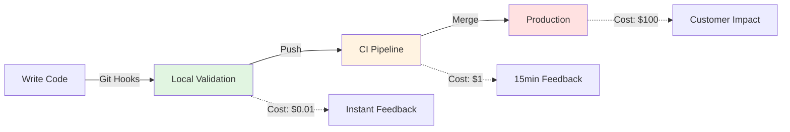
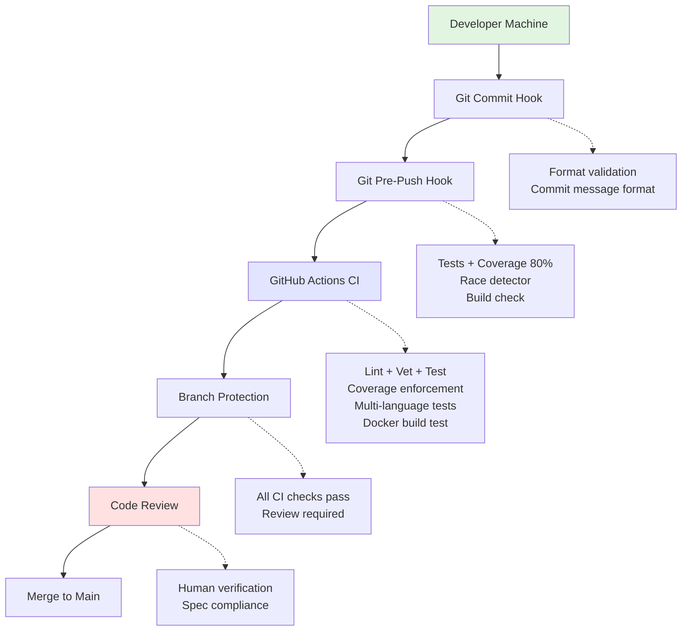
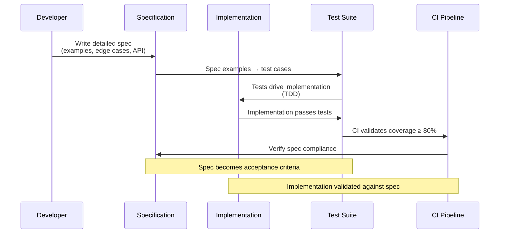
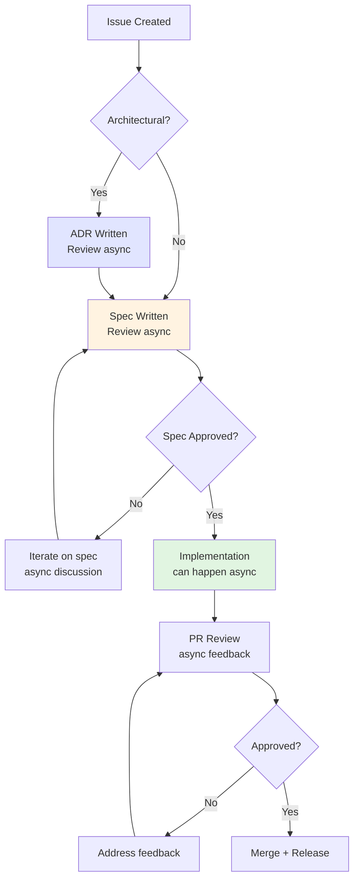
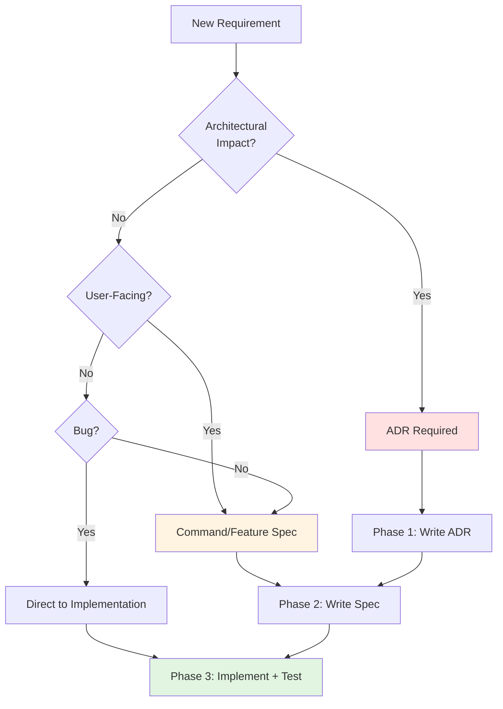
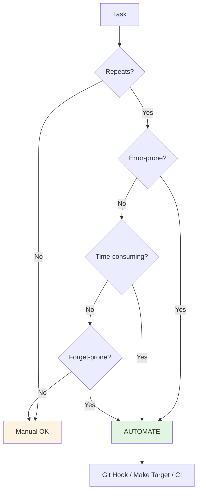
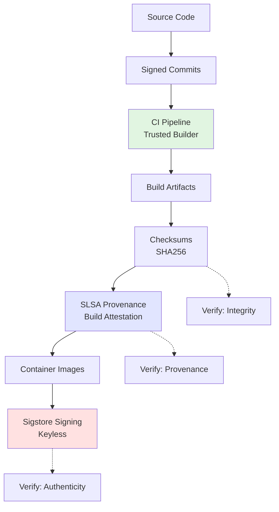
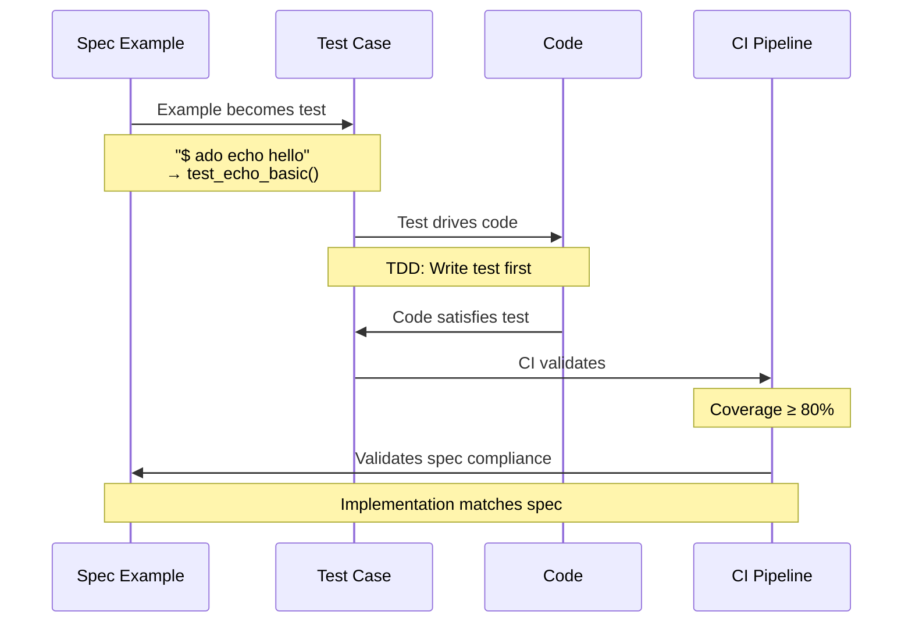

# Chapter 1: CI/CD Philosophy & Principles

> Understanding the "why" before the "how" - the foundational principles that make this CI/CD system effective.

## Table of Contents

- [Core Philosophy](#core-philosophy)
- [Design Principles](#design-principles)
- [The Three-Phase Development Model](#the-three-phase-development-model)
- [Quality Philosophy](#quality-philosophy)
- [Automation Philosophy](#automation-philosophy)
- [Security Philosophy](#security-philosophy)
- [Documentation Philosophy](#documentation-philosophy)

---

## Core Philosophy

### The Foundation: Shift Left on Quality

The central thesis of this CI/CD system is **shift left** - catch problems as early as possible in the development cycle:



**Key Insight**: A bug caught in git hooks costs 1/100th the time of a bug caught in production.

### Principle 1: Automation Over Manual Process

**Philosophy**: Humans are unreliable at repetitive tasks. Automate everything that can be automated.

**In Practice**:

- ✅ Version bumping: automated via conventional commits
- ✅ CHANGELOG generation: automated from commit messages
- ✅ Test execution: automated via git hooks + CI
- ✅ Code formatting: automated via pre-commit hooks
- ✅ Release creation: automated on merge
- ✅ Artifact signing: automated in CI pipeline

**Anti-pattern**: Manual CHANGELOG updates (error-prone, forgotten)

**Why This Works**:

- **Consistency**: Same process every time
- **Speed**: Instant execution, no waiting for humans
- **Reliability**: Never forgets a step
- **Scalability**: Works for 1 developer or 100

**Trade-off**: Initial setup time (1-2 weeks) vs. ongoing time saved (hours per week)

---

### Principle 2: Quality Gates at Every Level

**Philosophy**: Multiple layers of quality enforcement create a robust safety net.

**The Quality Pyramid**:



**Why Multiple Layers**:

1. **Defense in depth**: If one layer fails, others catch issues
2. **Fast feedback**: Git hooks give instant feedback (seconds)
3. **Comprehensive checks**: CI runs expensive checks (minutes)
4. **Human oversight**: Code review catches logic/design issues

**Coverage by Layer**:

| Layer | Speed | Coverage | Example |
|-------|-------|----------|---------|
| Commit hook | 0.1s | Commit format | `feat: add feature` validation |
| Pre-push hook | 10-30s | Tests + coverage | Run full test suite |
| CI pipeline | 3-10min | All checks | Lint, test, build, docs |
| Branch protection | Instant | Policy enforcement | No direct push to main |
| Code review | Hours | Logic + design | Spec compliance check |

---

### Principle 3: Documentation as Code

**Philosophy**: Documentation is not an afterthought. It's the **source of truth** that drives implementation.

**The Documentation-First Flow**:



**Why Documentation-First**:

1. **Clarity before coding**: Design is validated before implementation
2. **LLM-friendly**: Clear specs enable AI-assisted development
3. **Async collaboration**: Team can review design without code
4. **Historical context**: Future developers understand "why" decisions were made
5. **Test generation**: Examples in specs become test cases

**Example: Structured Logging Feature**

```
Phase 1 (ADR): Why use log/slog? (architectural decision)
    ↓
Phase 2 (Spec): What should the API look like? (detailed specification)
    ↓
Phase 3 (Code): How to implement it? (follows spec exactly)
```

**Anti-pattern**: Code first, document later (if ever)

---

## Design Principles

### Principle 4: Fail Fast, Fail Loudly

**Philosophy**: Catch errors immediately and make them impossible to ignore.

**In Practice**:

- **Git hooks block bad commits**: Can't commit malformed commit message
- **Coverage threshold blocks merge**: Can't merge if coverage drops below 80%
- **CI failures block merge**: Can't merge if tests fail
- **Build failures block release**: Can't release if binary doesn't compile

**Why This Works**:

- **Immediate feedback**: Developer knows instantly something is wrong
- **No silent failures**: Errors are loud and visible
- **Prevents accumulation**: Small issues don't become big problems

**Example: Coverage Threshold**

```bash
# Pre-push hook
coverage=$(go tool cover -func=coverage.out | grep total | awk '{print $3}' | sed 's/%//')
if (( $(echo "$coverage < 80.0" | bc -l) )); then
    echo "ERROR: Coverage $coverage% < 80%"
    exit 1  # BLOCKS the push
fi
```

Developer sees:
```
❌ ERROR: Coverage 75.3% < 80%
```

**Cannot push** until coverage is improved.

---

### Principle 5: Conventional Over Configuration

**Philosophy**: Opinionated defaults reduce decision fatigue and increase consistency.

**Conventions Adopted**:

| Aspect | Convention | Benefit |
|--------|-----------|---------|
| **Commit format** | Conventional Commits | Enables automated versioning |
| **Branch names** | `feat/`, `fix/`, `docs/` prefixes | Clear intent |
| **Versioning** | Semantic Versioning (SemVer) | Predictable version bumps |
| **Test organization** | `*_test.go` next to code | Easy to find |
| **Config location** | XDG Base Directory spec | Standard paths |
| **Documentation** | Markdown in `docs/` | GitHub-native |

**Why Conventions Work**:

- **Reduced cognitive load**: Don't decide where to put files
- **Tooling compatibility**: Standard locations enable automation
- **Onboarding speed**: New developers know patterns
- **Interoperability**: Works with standard tools

**Example: Conventional Commits Enable Automation**

```
Commit: feat(auth): add OAuth2 support
    ↓
Release-please detects "feat" type
    ↓
Version bumps: 1.2.0 → 1.3.0 (MINOR)
    ↓
CHANGELOG: "Features: add OAuth2 support"
    ↓
GitHub Release created automatically
```

**No manual steps required.**

---

### Principle 6: Optimize for Async Collaboration

**Philosophy**: Enable async development (including with LLMs) through clear specifications.

**The Async Development Model**:



**Why This Enables Async Work**:

1. **ADR Review**: Team reviews architectural decision separately from code
2. **Spec Review**: Team reviews what will be built before coding starts
3. **Implementation**: Developer (or LLM) implements against clear spec
4. **Spec as Contract**: Code review checks spec compliance, not design

**LLM-Friendly Workflow**:

```python
# Spec provides clear examples
"""
Example 1: Basic usage
$ ado echo hello world
hello world

Example 2: Uppercase transformation
$ ado echo --upper hello
HELLO
"""

# LLM can implement directly from spec
def test_echo_upper():
    # This test comes directly from Spec Example 2
    result = runner.invoke(cli, ["echo", "--upper", "hello"])
    assert result.output.strip() == "HELLO"
```

**Human reviewer checks**: Does implementation match spec? (Not: Do I like this design?)

---

## The Three-Phase Development Model

### Phase 0: Issue Creation

**Purpose**: Capture requirements and determine workflow path.

**Issue Templates**:

- ADR Proposal (architectural decisions)
- Feature Proposal (new capabilities)
- Command Proposal (CLI commands)
- Bug Report (issues)

**Decision Tree**:



**Examples**:

- "Add plugin system" → ADR (architectural decision) → Spec → Implementation
- "Add `export` command" → Spec → Implementation (follows existing patterns)
- "Fix Windows path bug" → Implementation only (bug fix)

---

### Phase 1: Architecture Decision Record (ADR)

**When**: Architectural changes, new patterns, significant dependencies

**Template Sections**:

1. **Context**: Why is this decision needed?
2. **Decision**: What are we choosing?
3. **Consequences**: Trade-offs (positive, negative, neutral)
4. **Alternatives**: What else was considered? Why rejected?

**Example: ADR-0002 Structured Logging**

```markdown
## Context
Current logging uses `fmt.Println`:
- No log levels (can't filter)
- No structure (can't parse)
- No timestamps

## Decision
Use Go's stdlib `log/slog` for structured logging.

## Consequences
✅ Zero dependencies (stdlib only)
✅ Structured output (JSON support)
✅ Log levels (debug, info, warn, error)
❌ Fewer features than zerolog/zap
❌ More verbose than fmt.Println

## Alternatives
- zerolog: Fast, but external dependency
- zap: Feature-rich, but complex
- Current approach: Simple, but limited
```

**Output**: Approved ADR becomes **architectural guidance** for implementation.

---

### Phase 2: Specification

**When**: All new features and commands (after ADR if needed)

**Template Sections**:

1. **Overview**: What does this do?
2. **Examples**: Concrete usage (3-5 examples)
3. **Behavior**: Step-by-step logic
4. **Error Cases**: What can go wrong?
5. **Testing**: How to verify?

**Example: Config Validate Command Spec**

```markdown
## Examples

### Example 1: Valid config
$ ado config validate
✓ Configuration valid: ~/.config/ado/config.yaml

### Example 2: Invalid config (missing required field)
$ ado config validate
✗ Validation failed: missing required field 'api_key'

### Example 3: File not found
$ ado config validate --config /nonexistent.yaml
✗ Config file not found: /nonexistent.yaml
Exit code: 1

## Error Cases
| Scenario | Behavior | Exit Code |
|----------|----------|-----------|
| Valid config | Print success | 0 |
| Invalid YAML | Print parse error | 1 |
| File not found | Print error | 1 |
| Permission denied | Print error | 1 |

## Testing
- [ ] Test valid config returns exit 0
- [ ] Test invalid YAML returns exit 1
- [ ] Test file not found returns exit 1
- [ ] Test error messages match spec
```

**Output**: Approved spec becomes **acceptance criteria** for implementation.

---

### Phase 3: Implementation

**When**: After spec approval (or immediately for bug fixes)

**Requirements**:

- Implementation matches spec exactly
- All spec examples work
- All error cases behave as specified
- Tests achieve 80%+ coverage
- Lint passes
- Build succeeds

**Example: Implementation Checklist**

```markdown
## Implementation Checklist
- [x] Create `cmd/ado/config/validate.go`
- [x] Implement validation logic
- [x] Add error handling per spec
- [x] Write tests for all examples
- [x] Write tests for error cases
- [x] Achieve 80%+ coverage
- [x] Update CLAUDE.md if needed
- [x] Run `make validate`
```

**Output**: Merged implementation that matches spec.

---

## Quality Philosophy

### The 80% Coverage Standard

**Why 80%**:

- **High enough**: Catches most bugs
- **Low enough**: Doesn't encourage artificial tests
- **Industry standard**: Common threshold in production systems

**What It Catches**:

- Untested code paths
- Edge cases missed
- Error handling gaps

**What It Doesn't Catch**:

- Logic bugs in tested code
- Integration issues
- Performance problems

**Coverage Enforcement Points**:

1. **Pre-push hook**: Blocks push if below 80%
2. **CI pipeline**: Fails if below 80%
3. **Make target**: `make go.test.cover.check`

**Philosophy**: Coverage is a **minimum quality bar**, not a target to game.

---

### Table-Driven Testing Philosophy

**Why Table-Driven Tests**:

- **Readable**: Test cases are data, not code
- **Extensible**: Easy to add new cases
- **Comprehensive**: Encourages edge case testing
- **Maintainable**: One test function, many scenarios

**Example**:

```go
func TestResolveConfig(t *testing.T) {
    tests := []struct {
        name     string
        explicit string
        envVar   string
        want     string
    }{
        {
            name:     "explicit flag takes precedence",
            explicit: "/custom/config.yaml",
            envVar:   "/env/config.yaml",
            want:     "/custom/config.yaml",
        },
        {
            name:     "env var used if no explicit",
            explicit: "",
            envVar:   "/env/config.yaml",
            want:     "/env/config.yaml",
        },
        {
            name:     "default if neither",
            explicit: "",
            envVar:   "",
            want:     "~/.config/ado/config.yaml",
        },
    }

    for _, tt := range tests {
        t.Run(tt.name, func(t *testing.T) {
            got := resolveConfig(tt.explicit, tt.envVar)
            if got != tt.want {
                t.Errorf("got %v, want %v", got, tt.want)
            }
        })
    }
}
```

**Output**: Clear, comprehensive test coverage with descriptive names.

---

## Automation Philosophy

### The Automation Decision Tree



**Examples**:

| Task | Automate? | Why |
|------|-----------|-----|
| Version bumping | ✅ Yes | Repeats, error-prone, forget-prone |
| CHANGELOG updates | ✅ Yes | Repeats, time-consuming, forget-prone |
| Test execution | ✅ Yes | Repeats, forget-prone |
| Code formatting | ✅ Yes | Repeats, time-consuming |
| Release creation | ✅ Yes | Repeats, error-prone, time-consuming |
| Code review | ❌ No | Requires human judgment |
| Architectural decisions | ❌ No | Requires strategic thinking |

---

### Make: The Build Automation Philosophy

**Why Make**:

- **Universal**: Works on all platforms
- **Simple**: Shell commands with dependencies
- **Composable**: Targets can depend on other targets
- **Self-documenting**: `make help` shows all targets

**Modular Makefile Pattern**:

```
Makefile               # Main file, includes all modules
make/
  ├── common.mk       # Shared variables, color output
  ├── python.mk       # Python-specific targets
  ├── docker.mk       # Docker/container targets
  ├── docs.mk         # Documentation targets
  ├── hooks.mk        # Git hooks management
  └── help.mk         # Help system
```

**Benefits**:

- **Separation of concerns**: Each file focuses on one area
- **Maintainability**: Easy to find and update targets
- **Reusability**: Modules can be shared across projects

**Example: Composite Target**

```makefile
# High-level target
validate: lint test docs.build
	@echo "✓ Validation complete"

# Low-level targets
lint: py.lint py.fmt.check
test: py.test py.test.cover.check
docs.build: docs.deps
	mkdocs build --strict
```

Developer runs: `make validate` (mirrors CI)

---

## Security Philosophy

### Defense in Depth for Supply Chain

**Philosophy**: Trust, but verify. Multiple layers of security.

**Security Layers**:



**Why Multiple Verification Methods**:

1. **Checksums**: Basic integrity (file not corrupted)
2. **SLSA Provenance**: Proves artifact was built by CI (not locally)
3. **Sigstore Signing**: Cryptographic proof of authenticity

**Philosophy**: Make it **easy to verify**, hard to fake.

---

### Keyless Signing Philosophy

**Why Keyless**:

- **No key management**: No private keys to rotate/leak
- **OIDC-based**: Tied to GitHub Actions identity
- **Transparent**: Signatures logged publicly (Rekor)

**How It Works**:

```yaml
# In GitHub Actions
- uses: sigstore/cosign-installer@v3
- run: |
    cosign sign --yes ghcr.io/user/project:v1.0.0
  env:
    COSIGN_EXPERIMENTAL: 1  # Keyless mode
```

GitHub's OIDC token → Sigstore CA → Short-lived certificate → Sign image

**Verification**:

```bash
cosign verify ghcr.io/user/project:v1.0.0 \
  --certificate-identity-regexp="https://github.com/user/project/" \
  --certificate-oidc-issuer="https://token.actions.githubusercontent.com"
```

**Output**: ✓ Verified (or ✗ Failed)

---

## Documentation Philosophy

### Documentation as Living Artifact

**Philosophy**: Documentation is **version-controlled code**, not static files.

**Documentation Types**:

| Type | Purpose | Lifecycle |
|------|---------|-----------|
| **ADR** | Record architectural decisions | Permanent, dated |
| **Spec** | Define acceptance criteria | Updated with features |
| **README** | User-facing guide | Updated with releases |
| **Code comments** | Explain non-obvious logic | Updated with code |
| **CHANGELOG** | User-facing changes | Auto-generated |

**The Documentation Debt Principle**:

```
Documentation Debt = Knowledge Gap × Team Size × Time

Where:
- Knowledge Gap = What users need to know - What's documented
- Team Size = Number of people affected
- Time = Duration until someone asks
```

**Goal**: Minimize documentation debt by documenting **before** implementation.

---

### Spec-Driven Documentation

**Philosophy**: Specs are **executable documentation** - they define behavior testable by CI.

**Spec → Test → Code Flow**:



**Example**:

```markdown
# Spec (docs/commands/01-echo.md)
## Example 1: Basic echo
$ ado echo hello world
hello world
```

Becomes:

```python
# Test (tests/test_echo.py)
def test_echo_basic():
    """From spec: Example 1"""
    result = runner.invoke(cli, ["echo", "hello", "world"])
    assert result.exit_code == 0
    assert result.output.strip() == "hello world"
```

**Benefit**: Spec compliance is **automatically verified** by CI.

---

## Philosophical Trade-offs

### What This System Optimizes For

✅ **Optimizes**:

- Long-term maintainability
- Team scalability (1 → 10+ developers)
- Async collaboration
- Quality consistency
- Automation over manual work
- Clear historical context

❌ **Doesn't Optimize**:

- Speed of first commit (setup takes time)
- Flexibility (opinionated conventions)
- Minimal process (multiple phases)
- Solo prototyping (overhead for throwaway code)

### When To Use This System

**Good Fit**:

- Production applications
- Open-source projects
- Team projects (2+ developers)
- Long-lived codebases (6+ months)
- Projects with compliance requirements
- LLM-assisted development

**Poor Fit**:

- Throw-away prototypes
- Weekend hackathons
- Solo experiments
- Projects with <100 commits lifetime

---

## Conclusion: Philosophy → Practice

This philosophy translates into practice:

1. **Automation** → Git hooks, CI pipelines, release automation
2. **Quality gates** → 80% coverage, lint checks, branch protection
3. **Documentation-first** → ADRs, specs before code
4. **Async-friendly** → Clear specs enable LLM development
5. **Security** → SLSA provenance, signing, verification
6. **Conventional** → Conventional commits, semantic versioning

**Next Chapter**: [03-ci-components.md](03-ci-components.md) - The essential components you'll build.

---

**Key Takeaway**: Good CI/CD is not just automation - it's a **philosophy of quality, clarity, and reliability** encoded into tools and processes.
