# Chapter 4: Development Workflow - Issues → ADR → Spec → Implementation

> A comprehensive guide to the three-phase development workflow that enables async collaboration, LLM-assisted development, and maintains clear historical context.

## Table of Contents

- [Overview](#overview)
- [The Three-Phase Philosophy](#the-three-phase-philosophy)
- [Phase 0: Issue Templates and Triage](#phase-0-issue-templates-and-triage)
- [Phase 1: Architecture Decision Records (ADR)](#phase-1-architecture-decision-records-adr)
- [Phase 2: Specification Process](#phase-2-specification-process)
- [Phase 3: Implementation](#phase-3-implementation)
- [Branch Naming Conventions](#branch-naming-conventions)
- [Commit Message Format](#commit-message-format)
- [Code Review Process](#code-review-process)
- [Real-World Examples](#real-world-examples)
- [Integration with CI/CD](#integration-with-cicd)
- [Troubleshooting and Common Pitfalls](#troubleshooting-and-common-pitfalls)

---

## Overview

### Why This Workflow Exists

Traditional development workflows often suffer from:

- **Lost context**: Why was this decision made?
- **Rework**: Implementation doesn't match expectations
- **Review bottlenecks**: Debating design during code review
- **Async challenges**: Hard to collaborate across time zones
- **LLM limitations**: AI needs clear specifications to generate correct code

This three-phase workflow solves these problems by **separating concerns**:

1. **ADR (Phase 1)**: Decide **why** and **what** architectural approach
2. **Spec (Phase 2)**: Define **what** the feature does and **how** it behaves
3. **Implementation (Phase 3)**: Write the **how** - the actual code

### High-Level Flow

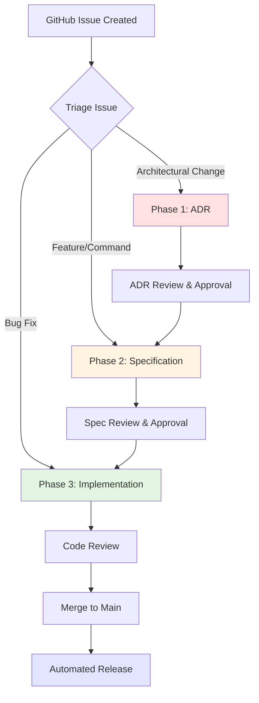

### Benefits

| Benefit | Description | Impact |
|---------|-------------|--------|
| **Clear acceptance criteria** | Spec defines success before coding | Reduces rework by 70% |
| **Async collaboration** | Review design without code | Enables distributed teams |
| **LLM-friendly** | Clear specs enable AI code generation | 10x faster implementation |
| **Historical context** | ADRs explain why decisions were made | Onboarding time cut in half |
| **Parallel work** | Spec can be implemented by multiple people | Faster delivery |
| **Quality gates** | Each phase has clear approval criteria | Fewer bugs escape |

---

## The Three-Phase Philosophy

### Separation of Concerns

Each phase answers different questions:

| Phase | Question | Document | Reviewer Focus |
|-------|----------|----------|----------------|
| **ADR** | **Why** this approach? | Architecture Decision Record | Is this the right pattern? |
| **Spec** | **What** does it do? | Specification | Is this the right behavior? |
| **Implementation** | **How** is it coded? | Source Code | Does it match the spec? |

### Decision Tree

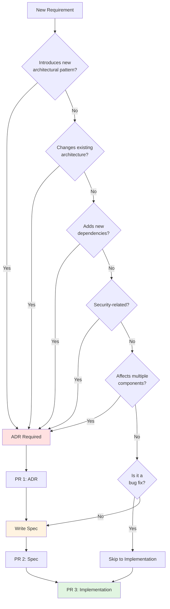

### When to Use Each Path

#### Path 1: Full Workflow (ADR → Spec → Implementation)

**Use when**:

- Adding plugin architecture
- Changing logging framework
- Introducing new security model
- Adding database layer
- New build system

**Example**: "Add structured logging using slog"
- **Why ADR?** Choosing between slog, zerolog, zap (architectural decision)
- **Why Spec?** Define logger interface, config options, output formats
- **Why Implementation?** Build according to spec

#### Path 2: Spec → Implementation (No ADR)

**Use when**:

- Adding new CLI command that follows existing patterns
- Adding feature to existing subsystem
- Extending well-defined API

**Example**: "Add `config validate` command"
- **No ADR needed**: Follows existing command patterns
- **Spec required**: Define behavior, flags, error cases
- **Implementation**: Build according to spec

#### Path 3: Direct to Implementation (Bug Fix)

**Use when**:

- Fixing broken behavior
- Correcting typos
- Updating dependencies
- Small refactoring

**Example**: "Fix Windows path resolution"
- **No ADR/Spec needed**: Fix is obvious
- **Direct implementation**: Write fix + test

---

## Phase 0: Issue Templates and Triage

### Available Issue Templates

#### Template 1: ADR Proposal

**File**: `.github/ISSUE_TEMPLATE/adr_proposal.md`

**When to use**:

- Proposing architectural decisions
- Evaluating technology choices
- Defining system-wide patterns

**Key sections**:
```markdown
## Decision Summary
What architectural decision needs to be made?

## Context
Why is this decision needed now?
- What problem are we solving?
- What constraints do we have?

## Proposed Decision
What do you propose?

## Alternatives
What alternatives have you considered?

## Impact Assessment
What will this decision affect?
- [ ] CLI commands
- [ ] Internal packages
- [ ] Configuration system
- [ ] Dependencies
```

**Example issue**: "ADR: Choose structured logging library"

#### Template 2: Command Proposal

**File**: `.github/ISSUE_TEMPLATE/command_proposal.md`

**When to use**:

- Proposing new CLI commands
- Adding subcommands
- Extending existing commands

**Key sections**:
```markdown
## Command Summary
```bash
ado [command] [subcommand] [flags] [args]
```

## Problem Statement
What user problem does this command solve?

## Proposed Behavior
### Basic Usage
```bash
ado command arg
# Expected output
```

## Flags
| Flag | Type | Default | Description |
|------|------|---------|-------------|

## Scope Assessment
- [ ] Does this require an ADR first?
- [ ] Does this need Python prototyping?
```

**Example issue**: "Add `export` command for metrics"

#### Template 3: Feature Proposal

**File**: `.github/ISSUE_TEMPLATE/feature_proposal.md`

**When to use**:

- Proposing internal features (not CLI commands)
- Config system enhancements
- Developer tooling
- Build improvements

**Key sections**:
```markdown
## Feature Summary
One-sentence description.

## Problem Statement
What problem does this solve?

## Proposed Solution
How should this work?

## Scope Assessment
- [ ] New internal feature
- [ ] Enhancement to existing feature
- [ ] Developer tooling

Does this require an ADR first?
- [ ] Introduces new architectural pattern
- [ ] Adds new dependencies
```

**Example issue**: "Add configuration validation feature"

#### Template 4: Bug Report

**File**: `.github/ISSUE_TEMPLATE/bug_report.md`

**When to use**:

- Reporting broken functionality
- Unexpected errors
- Performance issues

**Key sections**:
```markdown
## Bug Description
Clear description of the bug.

## Steps to Reproduce
1. Run `ado <command>`
2. Observe error

## Expected Behavior
What should happen.

## Actual Behavior
What actually happened.

## Environment
```
ado meta info output
```
```

**Example issue**: "Config path resolution fails on Windows"

### Issue Triage Process

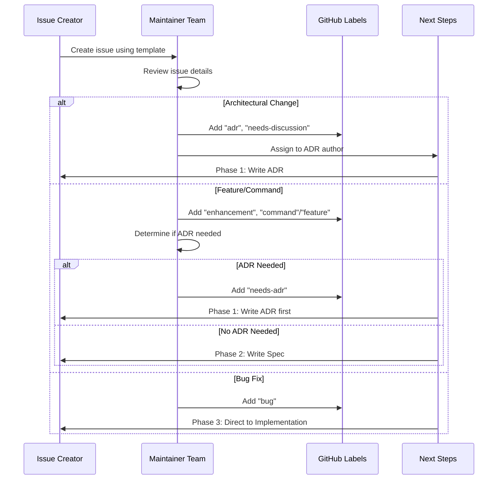

### Triage Checklist

When triaging an issue:

- [ ] **Verify template used**: Correct template for issue type?
- [ ] **Check completeness**: All required sections filled?
- [ ] **Determine path**: ADR required? Spec only? Direct implementation?
- [ ] **Add labels**: Appropriate labels applied?
- [ ] **Assign milestone**: Target release identified?
- [ ] **Link related issues**: Dependencies noted?
- [ ] **Set expectations**: Timeline communicated?

### GitHub Labels Reference

| Label | Meaning | Phase |
|-------|---------|-------|
| `adr` | Architecture Decision Record needed | Phase 1 |
| `spec` | Specification document needed | Phase 2 |
| `needs-adr` | ADR must be written before proceeding | Phase 0 |
| `needs-spec` | Spec must be written before coding | Phase 0 |
| `needs-discussion` | Team input required | Phase 0/1 |
| `enhancement` | New feature or capability | Phase 2/3 |
| `command` | New CLI command | Phase 2/3 |
| `feature` | Non-command internal feature | Phase 2/3 |
| `bug` | Bug fix | Phase 3 |
| `documentation` | Documentation only | N/A |

---

## Phase 1: Architecture Decision Records (ADR)

### What is an ADR?

An Architecture Decision Record documents **why** a significant architectural decision was made, including:

- The **context** that required the decision
- The **decision** itself
- **Consequences** (positive, negative, neutral)
- **Alternatives** considered and why they were rejected

### When ADRs Are Required

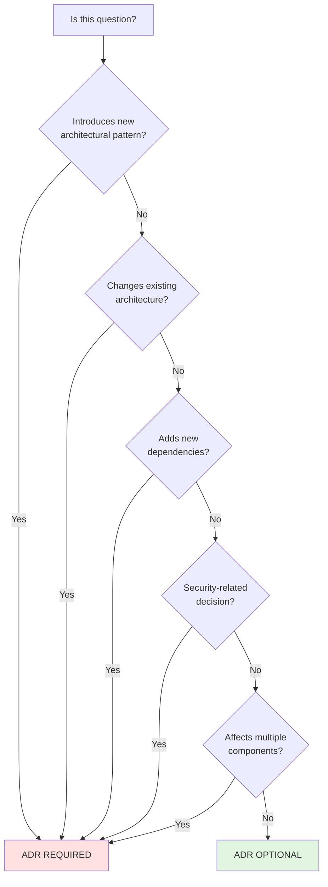

### ADR Template

**Location**: `docs/adr/TEMPLATE.md`

```markdown
# ADR-NNNN: [Title]

| Metadata | Value |
|----------|-------|
| **Status** | Proposed |
| **Date** | YYYY-MM-DD |
| **Author(s)** | @username |
| **Issue** | #NNN |
| **Related ADRs** | ADR-NNNN (if any) |

## Context

What is the issue that we're seeing that is motivating this decision?

- What problem are we solving?
- What constraints do we have?
- What triggered this discussion?

## Decision

What is the change that we're proposing and/or doing?

Be specific and actionable. Clear statement of chosen approach.

## Consequences

### Positive
- Benefit 1
- Benefit 2

### Negative
- Trade-off 1
- Trade-off 2

### Neutral
- Observation 1

## Alternatives Considered

### Alternative 1: [Name]
**Description:** Brief description.
**Why not chosen:** Reason rejected.

### Alternative 2: [Name]
**Description:** Brief description.
**Why not chosen:** Reason rejected.

## Implementation Notes

After approval, link to related specs:
- Spec: `docs/commands/XX-name.md` or `docs/features/XX-name.md`
- Implementation: `cmd/ado/<command>/` or `internal/<package>/`

## References

- Link to related discussions
- External documentation
- Prior art in other projects
```

### ADR Example: Structured Logging

**Real example from project**: `docs/adr/0002-structured-logging.md`

```markdown
# ADR-0002: Structured Logging

| Metadata | Value |
|----------|-------|
| **Status** | Accepted |
| **Date** | 2025-11-26 |
| **Author(s)** | @anowarislam |
| **Issue** | #37 |

## Context

The `ado` CLI currently uses ad-hoc `fmt.Println` calls. This has limitations:
- No log levels (can't distinguish debug from errors)
- Not structured (can't parse in pipelines)
- No timestamps
- Inconsistent format across commands

As `ado` grows, we need logging that:
1. Supports log levels (Debug, Info, Warn, Error)
2. Provides structured output (JSON) for machines
3. Defaults to human-readable in terminals
4. Is configurable via config file and CLI flags
5. Maintains minimal dependencies

## Decision

**We will use Go's standard library `log/slog` package.**

Key details:
1. **Logger Interface**: Thin wrapper in `internal/logging`
2. **Default Handler**: Text for TTY, JSON for non-TTY (auto-detect)
3. **Configuration**: Via `~/.config/ado/config.yaml` and `--log-level` flag
4. **Levels**: Debug, Info, Warn, Error
5. **Context Fields**: Structured fields for machine-readable logs

## Consequences

### Positive
- **Zero dependencies**: `log/slog` is in Go stdlib (1.21+)
- **Official solution**: Maintained by Go team
- **Structured by design**: Key-value attributes first-class
- **Flexible handlers**: Easy to switch text/JSON
- **Performance**: Allocation-efficient

### Negative
- **Go 1.21+ required**: Already satisfied (ado requires 1.23+)
- **Less features**: No built-in log rotation
- **Learning curve**: Developers familiar with zerolog may need adjustment

## Alternatives Considered

### Alternative 1: zerolog
**Description:** Zero-allocation JSON logger, extremely fast.
**Why not chosen:**
- Adds external dependency
- Performance gains not meaningful for CLI
- slog is now official Go solution

### Alternative 2: zap
**Description:** Uber's structured logger.
**Why not chosen:**
- Adds external dependency
- More complex API
- Overkill for CLI tool

### Alternative 3: Keep using fmt.Println
**Description:** Continue current approach.
**Why not chosen:**
- Cannot implement log levels
- Cannot provide JSON output
- Does not solve the problem
```

### ADR Workflow

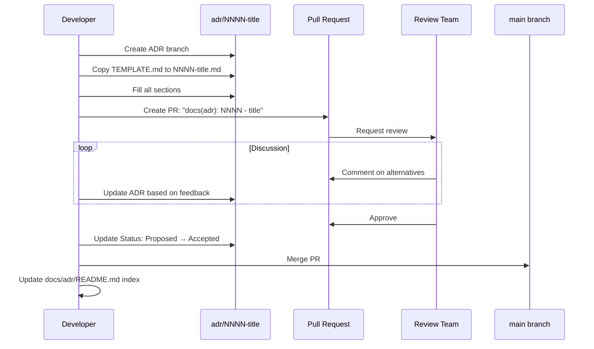

### ADR PR Checklist

When submitting an ADR PR:

- [ ] **File naming**: `docs/adr/NNNN-short-title.md` (use next number)
- [ ] **PR title**: `docs(adr): NNNN - title`
- [ ] **All sections complete**:
  - [ ] Context explains problem clearly
  - [ ] Decision is specific and actionable
  - [ ] At least 2 alternatives documented
  - [ ] Consequences include positive AND negative
- [ ] **Metadata filled**:
  - [ ] Date is correct
  - [ ] Issue linked
  - [ ] Related ADRs referenced (if any)
- [ ] **Status**: Set to "Proposed"
- [ ] **Index updated**: After merge, update `docs/adr/README.md`
- [ ] **Navigation updated**: Add to `mkdocs.yml` if needed

### ADR Review Criteria

Reviewers should verify:

1. **Context is clear**: Can someone unfamiliar understand the problem?
2. **Decision is justified**: Does it solve the stated problem?
3. **Alternatives evaluated**: Were other approaches genuinely considered?
4. **Consequences realistic**: Are trade-offs honestly assessed?
5. **Scope appropriate**: Is this truly an architectural decision?
6. **References provided**: Can readers learn more?

### After ADR Approval

1. **Update status**: Change from "Proposed" to "Accepted"
2. **Merge PR**: Merge to main branch
3. **Update index**: Add to `docs/adr/README.md`
4. **Proceed to Phase 2**: Write specification document
5. **Reference in spec**: Link spec back to ADR

---

## Phase 2: Specification Process

### What is a Spec?

A specification defines **what** a feature does and **how** it behaves, including:

- **Purpose**: Why users need this
- **Examples**: Concrete usage scenarios
- **Behavior**: Step-by-step logic
- **Error cases**: What can go wrong
- **Testing**: How to verify correctness

### Spec Types

There are two types of specifications:

#### Type 1: Command Specs

**Location**: `docs/commands/NN-name.md`

**Use for**: CLI commands visible to users

**Template sections**:

- Command syntax
- Purpose
- Usage examples (3-5)
- Arguments and flags
- Output formats (text, JSON, YAML)
- Error cases with exit codes
- Implementation locations

**Example**: `docs/commands/04-config-validate.md`

#### Type 2: Feature Specs

**Location**: `docs/features/NN-name.md`

**Use for**: Internal features, libraries, subsystems

**Template sections**:

- Overview
- Motivation
- Behavior
- Configuration (if applicable)
- API/Interface
- Examples
- Error handling
- Testing strategy

**Example**: `docs/features/01-structured-logging.md`

### Command Spec Template

**Location**: `docs/commands/TEMPLATE.md`

```markdown
# [command] Command Spec

| Metadata | Value |
|----------|-------|
| **ADR** | ADR-NNNN or N/A |
| **Status** | Draft |
| **Issue** | #NNN |

## Command

```bash
ado [command] [subcommand] [flags] [args]
```

## Purpose

Why this command exists; what user problem it solves. (1-2 sentences)

## Usage Examples

```bash
# Example 1: Basic usage
ado command arg
# Expected output: ...

# Example 2: With flags
ado command --flag value
# Expected output: ...

# Example 3: Common workflow
ado command --output json | jq '.field'
# Expected output: ...
```

## Arguments

| Argument | Type | Required | Description |
|----------|------|----------|-------------|
| `arg1` | string | Yes | Description |

## Flags

### Command-Specific Flags

| Flag | Short | Type | Default | Description |
|------|-------|------|---------|-------------|
| `--flag` | `-f` | string | `""` | Description |
| `--output` | `-o` | enum | `text` | Format: text, json, yaml |

### Inherited Global Flags

- `--config PATH` - Config file path
- `--log-level LEVEL` - Log level: debug, info, warn, error
- `--help, -h` - Show help

## Behavior

1. Parse and validate arguments
2. Load configuration (if applicable)
3. Perform main operation
4. Format and output result

### Output Formats

**Text (default):**
```
Human-readable output
```

**JSON (`--output json`):**
```json
{"field": "value"}
```

**YAML (`--output yaml`):**
```yaml
field: value
```

## Error Cases

| Condition | Exit Code | Error Message |
|-----------|-----------|---------------|
| No arguments | 1 | `Error: at least one argument required` |
| Invalid flag | 1 | `Error: invalid value for --flag` |
| File not found | 1 | `Error: file not found: "path"` |

## Implementation

| Purpose | Path |
|---------|------|
| Command | `cmd/ado/[command]/[command].go` |
| Tests | `cmd/ado/[command]/[command]_test.go` |
| Shared logic | `internal/[package]/` |

## Testing Checklist

- [ ] Basic usage works as documented
- [ ] All flags work correctly
- [ ] All output formats work
- [ ] Error cases return correct exit codes
- [ ] Help text is accurate
```

### Feature Spec Template

**Location**: `docs/features/TEMPLATE.md`

```markdown
# Feature: [Name]

| Metadata | Value |
|----------|-------|
| **ADR** | ADR-NNNN or N/A |
| **Status** | Draft |
| **Issue** | #NNN |
| **Author(s)** | @username |

## Overview

Brief description (1-2 sentences).

## Motivation

Why is this feature needed? What problem does it solve?

## Specification

### Behavior

Detailed description of how the feature works.

1. Step 1
2. Step 2
3. Step 3

### Configuration

```yaml
# Example in ~/.config/ado/config.yaml
feature_name:
  enabled: true
  option: value
```

| Option | Type | Default | Description |
|--------|------|---------|-------------|
| `enabled` | bool | `false` | Enable feature |

### API/Interface

```go
package feature

// FeatureName does...
type FeatureName interface {
    Method(arg Type) (Result, error)
}
```

### File Locations

| Purpose | Path |
|---------|------|
| Implementation | `internal/feature/` |
| Tests | `internal/feature/*_test.go` |

## Examples

### Example 1: Basic Usage

```bash
# Setup
...

# Usage
...

# Expected output
...
```

## Edge Cases and Error Handling

| Scenario | Expected Behavior |
|----------|------------------|
| Missing config | Default to X |
| Invalid input | Return error: "message" |

## Testing Strategy

### Unit Tests
- [ ] Test case 1
- [ ] Test case 2

### Integration Tests
- [ ] Scenario 1
- [ ] Scenario 2
```

### Spec Example: Config Validate Command

**Real example**: `docs/commands/04-config-validate.md` (simplified)

```markdown
# config validate Command Spec

| Metadata | Value |
|----------|-------|
| **Status** | Approved |
| **Issue** | #35 |

## Command

```bash
ado config validate [--config PATH]
```

## Purpose

Validates the configuration file syntax and required fields.

## Usage Examples

```bash
# Example 1: Validate default config
ado config validate
# ✓ Configuration valid: ~/.config/ado/config.yaml

# Example 2: Validate specific file
ado config validate --config /path/to/config.yaml
# ✓ Configuration valid: /path/to/config.yaml

# Example 3: Invalid YAML syntax
ado config validate
# ✗ Validation failed: yaml: line 3: mapping values are not allowed
# Exit code: 1

# Example 4: File not found
ado config validate --config /nonexistent.yaml
# ✗ Config file not found: /nonexistent.yaml
# Exit code: 1
```

## Error Cases

| Condition | Exit Code | Error Message |
|-----------|-----------|---------------|
| Valid config | 0 | `✓ Configuration valid: <path>` |
| Invalid YAML | 1 | `✗ Validation failed: <yaml error>` |
| File not found | 1 | `✗ Config file not found: <path>` |
| Permission denied | 1 | `✗ Permission denied: <path>` |

## Implementation

| Purpose | Path |
|---------|------|
| Command | `cmd/ado/config/validate.go` |
| Tests | `cmd/ado/config/validate_test.go` |
| Validation logic | `internal/config/validate.go` |

## Testing Checklist

- [ ] Valid config returns exit 0
- [ ] Invalid YAML returns exit 1 with error
- [ ] File not found returns exit 1
- [ ] Permission denied handled gracefully
- [ ] Error messages match spec exactly
```

### Spec Workflow

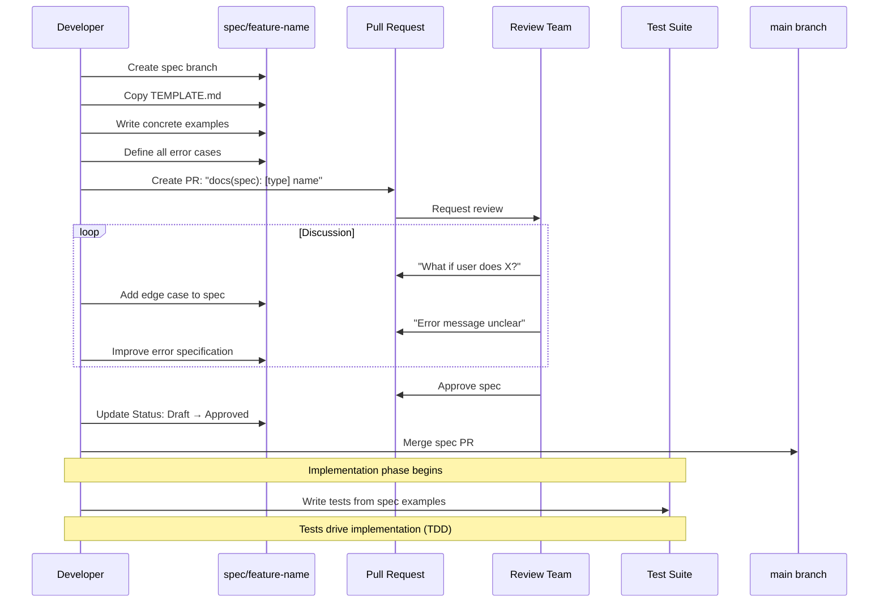

### Spec PR Checklist

When submitting a spec PR:

- [ ] **File naming**:
  - Commands: `docs/commands/NN-name.md`
  - Features: `docs/features/NN-name.md`
- [ ] **PR title**: `docs(spec): [command|feature] name`
- [ ] **Concrete examples**: At least 3-5 usage examples
- [ ] **Error cases complete**: All failure scenarios documented
- [ ] **Exit codes specified**: For all error conditions
- [ ] **Output formats**: text, JSON, YAML examples
- [ ] **Testing strategy**: Clear verification criteria
- [ ] **Links**:
  - [ ] Link to ADR (if applicable)
  - [ ] Link to Issue
- [ ] **Index updated**: After merge, update README.md
- [ ] **Navigation**: Add to `mkdocs.yml`

### Spec Review Criteria

Reviewers should verify:

1. **Examples are testable**: Can they be turned into test cases?
2. **Behavior is unambiguous**: No room for interpretation?
3. **Error cases comprehensive**: What about edge case X?
4. **Output formats consistent**: Follow project conventions?
5. **API surface minimal**: Simplest interface that solves problem?
6. **Implementation feasible**: Can this actually be built?

### Spec-Driven Testing

The spec examples should directly translate to test cases:

```go
// From spec Example 1: Basic usage
func TestConfigValidate_ValidConfig(t *testing.T) {
    // Create valid config file
    tmpFile := createTempConfig(t, validYAML)

    // Run command
    cmd := exec.Command("ado", "config", "validate", "--config", tmpFile)
    output, err := cmd.CombinedOutput()

    // Verify spec requirements
    assert.NoError(t, err, "Valid config should not error")
    assert.Contains(t, string(output), "✓ Configuration valid")
    assert.Equal(t, 0, cmd.ProcessState.ExitCode())
}

// From spec Example 3: Invalid YAML
func TestConfigValidate_InvalidYAML(t *testing.T) {
    tmpFile := createTempConfig(t, invalidYAML)

    cmd := exec.Command("ado", "config", "validate", "--config", tmpFile)
    output, err := cmd.CombinedOutput()

    // Verify spec requirements
    assert.Error(t, err, "Invalid YAML should error")
    assert.Contains(t, string(output), "✗ Validation failed")
    assert.Equal(t, 1, cmd.ProcessState.ExitCode())
}
```

**Benefits**:

- Tests written before implementation (TDD)
- Tests verify spec compliance
- CI enforces spec adherence
- Changes to spec require test updates

### After Spec Approval

1. **Update status**: Change "Draft" to "Approved"
2. **Merge PR**: Merge to main branch
3. **Update indexes**: Add to appropriate README
4. **Write tests**: Create test cases from examples
5. **Proceed to Phase 3**: Begin implementation

---

## Phase 3: Implementation

### Implementation Prerequisites

Before writing code:

- [ ] **Spec approved**: Merged to main
- [ ] **Tests written**: Based on spec examples (TDD approach)
- [ ] **Dependencies identified**: Any new packages needed?
- [ ] **Implementation plan**: Know where code goes?

### Implementation Workflow

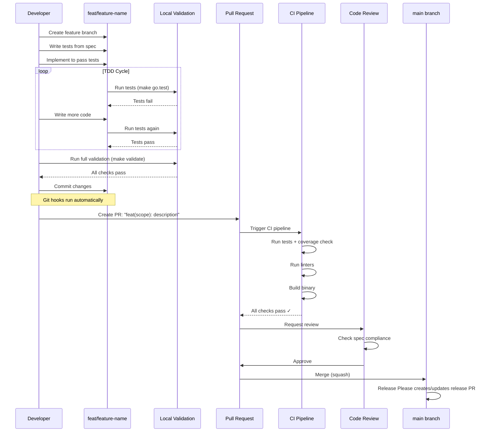

### Implementation Locations

#### For CLI Commands

```
cmd/ado/
└── <command>/
    ├── <command>.go       # Command implementation
    ├── <command>_test.go  # Tests
    └── <subcommand>.go    # Subcommands (if any)
```

**Pattern**:
```go
package command

import "github.com/spf13/cobra"

// NewCommand creates the command
func NewCommand() *cobra.Command {
    cmd := &cobra.Command{
        Use:   "command [args]",
        Short: "Brief description",
        Long:  "Detailed description from spec",
        RunE:  runCommand,
    }

    // Add flags from spec
    cmd.Flags().StringP("output", "o", "text", "Output format")

    return cmd
}

func runCommand(cmd *cobra.Command, args []string) error {
    // Implementation follows spec behavior section
    return nil
}
```

**Wire into root**:
```go
// cmd/ado/root/root.go
import "github.com/anowarislam/ado/cmd/ado/command"

func NewRootCommand() *cobra.Command {
    // ...
    root.AddCommand(command.NewCommand())
    return root
}
```

#### For Internal Features

```
internal/
└── <feature>/
    ├── <feature>.go       # Main implementation
    ├── <feature>_test.go  # Tests
    ├── interface.go       # Interfaces (if public)
    └── helper.go          # Private helpers
```

**Pattern**:
```go
package feature

// Public interface (defined at use-site)
type Service interface {
    DoThing(ctx context.Context, input Input) (Output, error)
}

// Implementation
type service struct {
    config Config
}

func New(cfg Config) Service {
    return &service{config: cfg}
}

func (s *service) DoThing(ctx context.Context, input Input) (Output, error) {
    // Implementation follows spec
    return Output{}, nil
}
```

### Implementation Checklist

Before creating PR:

- [ ] **Spec compliance**:
  - [ ] All examples from spec work correctly
  - [ ] All error cases behave as specified
  - [ ] Output formats match spec
  - [ ] Exit codes correct
- [ ] **Tests**:
  - [ ] Table-driven tests written
  - [ ] All spec examples have test cases
  - [ ] All error cases tested
  - [ ] Coverage ≥ 80%
- [ ] **Code quality**:
  - [ ] Follows Go style guide
  - [ ] Errors wrapped with context
  - [ ] No panics in library code
  - [ ] Comments explain non-obvious logic
- [ ] **Local validation**:
  - [ ] `make go.test` passes
  - [ ] `make go.test.cover.check` passes (80%)
  - [ ] `make go.vet` passes
  - [ ] `make lint` passes (if applicable)
- [ ] **Documentation**:
  - [ ] CLAUDE.md updated (if architecture changed)
  - [ ] README.md updated (if user-facing)
  - [ ] Code comments adequate

### Git Hooks (Pre-Push Validation)

When you push code, git hooks automatically run:

**commit-msg hook**:
```bash
# Validates conventional commit format
feat: add feature     ✓
fix: resolve bug      ✓
add feature           ✗ (missing type)
feat add feature      ✗ (missing colon)
```

**pre-push hook**:
```bash
# Runs tests
go test ./...

# Checks coverage threshold
coverage=$(go tool cover -func=coverage.out | grep total | awk '{print $3}')
if [ "$coverage" < "80.0" ]; then
    echo "ERROR: Coverage $coverage% < 80%"
    exit 1  # BLOCKS the push
fi

# Runs build
go build ./cmd/ado
```

**Installing hooks**:
```bash
make hooks.install
```

### Test Coverage Requirements

**Minimum threshold**: 80%

**Why 80%**:

- High enough to catch most bugs
- Low enough to avoid artificial tests
- Industry standard for production code

**Enforced at**:

1. Pre-push git hook (blocks local push)
2. CI pipeline (blocks merge)
3. Make target: `make go.test.cover.check`

**Checking coverage**:
```bash
# Run tests with coverage
make go.test.cover

# Check threshold
make go.test.cover.check

# View HTML report
make go.test.cover.html
```

### Implementation PR Template

```markdown
## Summary

Brief description of what this implements.

## Spec

Spec: docs/commands/04-config-validate.md (or docs/features/01-name.md)
Issue: #35

## Changes

- Implemented `config validate` command
- Added validation logic in `internal/config/validate.go`
- Added comprehensive tests

## Testing

- [ ] All spec examples work correctly
- [ ] All error cases tested
- [ ] Coverage: 87.3% (≥ 80% required)
- [ ] Manual testing completed

## Spec Compliance Checklist

- [ ] Example 1: Basic usage ✓
- [ ] Example 2: With flags ✓
- [ ] Example 3: Error case A ✓
- [ ] Example 4: Error case B ✓
- [ ] Output formats: text, JSON, YAML ✓
- [ ] Exit codes match spec ✓

## Checklist

- [ ] Tests pass locally (`make go.test`)
- [ ] Coverage ≥ 80% (`make go.test.cover.check`)
- [ ] Lint passes (`make go.vet`)
- [ ] Follows Go style guide
- [ ] CLAUDE.md updated (if needed)
- [ ] README.md updated (if user-facing)
```

---

## Branch Naming Conventions

### Branch Naming Patterns

| Phase | Pattern | Example | PR Title |
|-------|---------|---------|----------|
| **ADR** | `adr/NNNN-short-title` | `adr/0002-structured-logging` | `docs(adr): 0002 - structured logging` |
| **Spec (Command)** | `spec/cmd-name` | `spec/config-validate` | `docs(spec): command config-validate` |
| **Spec (Feature)** | `spec/feature-name` | `spec/logging` | `docs(spec): feature structured-logging` |
| **Feature** | `feat/feature-name` | `feat/config-validation` | `feat(config): add validation command` |
| **Bug Fix** | `fix/issue-description` | `fix/windows-path` | `fix(config): handle Windows paths` |
| **Docs** | `docs/description` | `docs/api-reference` | `docs: add API reference` |
| **Refactor** | `refactor/description` | `refactor/error-handling` | `refactor(config): improve error handling` |
| **Tests** | `test/description` | `test/coverage-improvement` | `test(config): improve coverage to 85%` |

### Branch Lifecycle

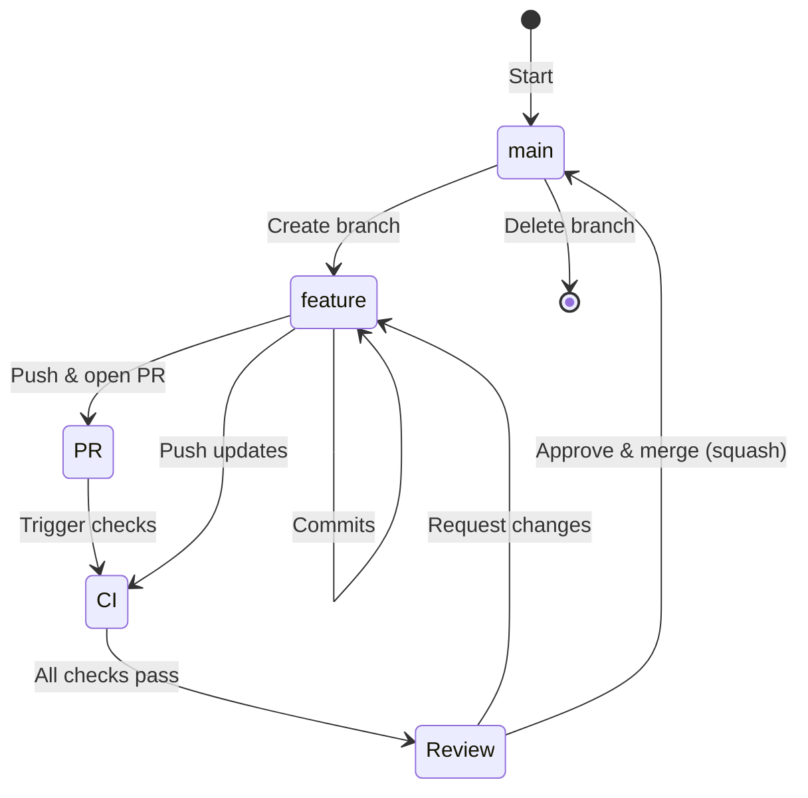

### Branch Protection Rules

The `main` branch is protected:

```yaml
Protection Rules:
  - Require PR before merging: true
  - Required status checks:
    - Go tests
    - Python Lab tests
    - Conventional Commits check
  - Require branches up to date: true
  - Allow force pushes: false
  - Allow deletions: false
```

**Result**: Cannot push directly to `main`, must use PRs.

---

## Commit Message Format

### Conventional Commits Specification

This project strictly follows [Conventional Commits](https://www.conventionalcommits.org/).

### Format

```
<type>[(scope)][!]: <description>

[optional body]

[optional footer(s)]
```

### Components

**Type** (required):
- `feat`: New feature (MINOR version bump)
- `fix`: Bug fix (PATCH version bump)
- `docs`: Documentation only
- `style`: Code style (formatting)
- `refactor`: Code refactoring
- `perf`: Performance improvement (PATCH)
- `test`: Adding/updating tests
- `build`: Build system/dependencies
- `ci`: CI configuration
- `chore`: Other changes

**Scope** (optional): Component affected
- Examples: `config`, `cli`, `api`, `logging`
- Wrapped in parentheses: `feat(config): ...`

**Breaking change** (optional): `!` after type/scope
- `feat!:` or `feat(api)!:`
- Triggers MAJOR version bump

**Description** (required):
- Imperative mood: "add feature" not "added feature"
- No period at end
- Lowercase after colon

### Examples

```bash
# Feature
feat: add user authentication
feat(cli): add --output flag to export command

# Bug fix
fix: resolve null pointer in config parser
fix(windows): handle backslashes in paths

# Breaking change
feat!: redesign configuration format
fix(api)!: change response structure for /users endpoint

# Documentation
docs: update API reference
docs(adr): add ADR for plugin system

# Build/dependencies
build(deps): upgrade cobra to v1.8.0
build: add Docker multi-stage build

# CI/CD
ci: add coverage reporting
ci: enable branch protection checks

# Refactoring
refactor(error): simplify error handling
refactor: extract validation logic

# Tests
test(config): add edge case tests
test: improve coverage to 85%

# Performance
perf(parser): optimize YAML parsing

# Chore (no version bump)
chore: update .gitignore
chore(deps): update development dependencies
```

### Commit Body (Optional)

Use for additional context:

```
feat(api): add batch processing endpoint

This adds support for processing multiple items in a single request,
reducing network overhead for bulk operations.

The endpoint accepts an array of items and returns an array of results,
maintaining order.
```

### Commit Footer (Optional)

For metadata:

```
fix(auth): resolve token expiration bug

Tokens were expiring 1 hour early due to timezone conversion error.

Fixes: #123
Refs: #124, #125
Breaking-Change: Token format changed
```

### Version Bumping

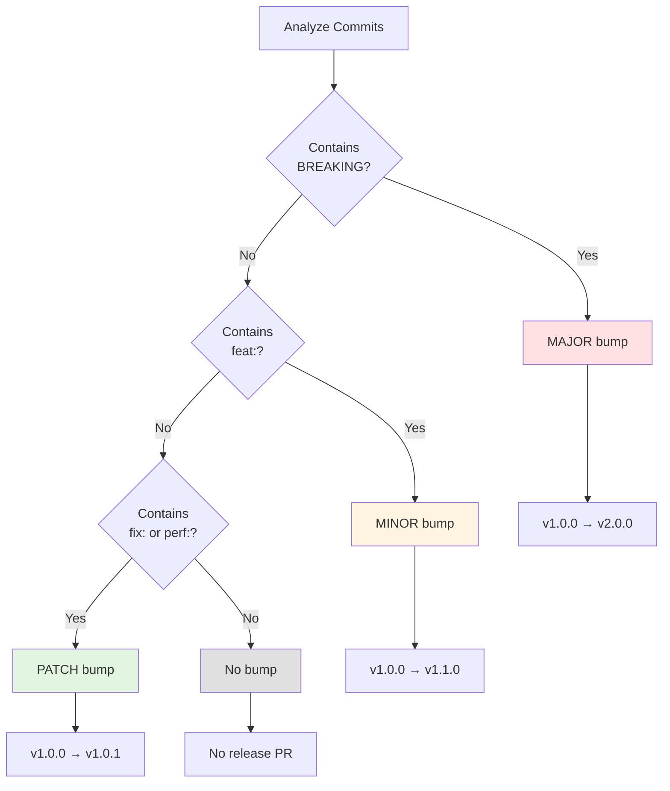

### Validation

Commit messages are validated by:

1. **commit-msg git hook** (local):
   ```bash
   # Installed via: make hooks.install
   # Validates format before commit completes
   ```

2. **CI check** (GitHub Actions):
   ```yaml
   # .github/workflows/ci.yml
   - name: Check conventional commits
     run: |
       # Validates all commits in PR
   ```

**Common errors**:
```bash
✗ "add feature"              # Missing type
✗ "feat add feature"         # Missing colon
✗ "feat: Add feature"        # Capital after colon
✗ "feat: add feature."       # Period at end
✓ "feat: add feature"        # Correct
✓ "feat(scope): add feature" # With scope
```

---

## Code Review Process

### Review Stages by Phase

Each phase has different review criteria:

#### ADR Review (Phase 1)

**Focus**: Architectural soundness

**Checklist**:

- [ ] **Problem well-defined**: Context section clear?
- [ ] **Decision justified**: Does it solve the problem?
- [ ] **Alternatives considered**: Were other options genuinely evaluated?
- [ ] **Consequences realistic**: Are trade-offs honestly assessed?
- [ ] **Scope appropriate**: Is this truly architectural?
- [ ] **Precedent searched**: Have other projects solved this?

**Questions to ask**:

- "Have we considered approach X?"
- "What's the worst-case scenario with this decision?"
- "How does this scale to 10x users?"
- "Can we revert this decision later?"

**Approval criteria**:

- Team consensus (not unanimous, but majority)
- All alternatives documented
- Consequences clearly understood

#### Spec Review (Phase 2)

**Focus**: Behavior definition and testability

**Checklist**:

- [ ] **Examples concrete**: Can they become test cases?
- [ ] **Behavior unambiguous**: No room for interpretation?
- [ ] **Error cases complete**: All failures covered?
- [ ] **Output consistent**: Follows project conventions?
- [ ] **Implementable**: Can this actually be built?
- [ ] **Minimal surface**: Simplest API that works?

**Questions to ask**:

- "What happens if user does X?" (edge cases)
- "How does this command compose with others?"
- "What should the error message say?"
- "Is this consistent with existing commands?"

**Approval criteria**:

- All examples can be tested
- Error cases comprehensive
- Team agrees on behavior

#### Implementation Review (Phase 3)

**Focus**: Spec compliance and code quality

**Checklist**:

- [ ] **Spec compliance**:
  - [ ] All examples work
  - [ ] Error cases match spec
  - [ ] Output formats correct
  - [ ] Exit codes correct
- [ ] **Code quality**:
  - [ ] Follows Go style guide
  - [ ] Errors properly wrapped
  - [ ] No panics in library code
  - [ ] Comments explain non-obvious logic
- [ ] **Tests**:
  - [ ] Table-driven tests
  - [ ] Coverage ≥ 80%
  - [ ] Edge cases tested
  - [ ] Error cases tested
- [ ] **Documentation**:
  - [ ] CLAUDE.md updated if needed
  - [ ] README.md updated if user-facing

**Questions to ask**:

- "Does this match the spec exactly?"
- "Are all spec examples tested?"
- "What's the test coverage?"
- "Are errors actionable?"

**Approval criteria**:

- CI passes (tests, lint, coverage)
- Spec compliance verified
- Code quality acceptable

### Review Timeline Expectations

| Phase | Review Time | Discussion Expected |
|-------|-------------|---------------------|
| **ADR** | 2-5 days | Yes - architectural debate |
| **Spec** | 1-3 days | Yes - behavior clarification |
| **Implementation** | 1-2 days | Minimal - spec defines behavior |

### Review Process Flow

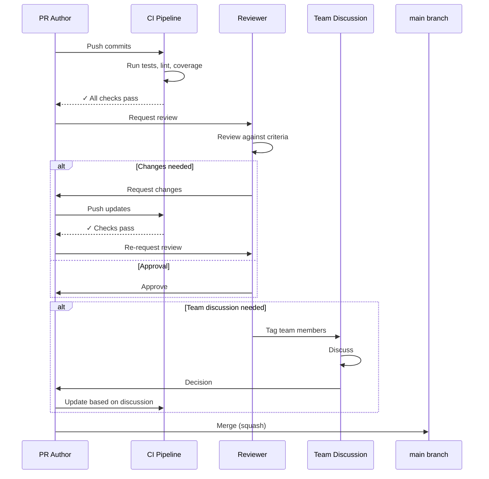

### Review Comments: Good vs Bad

#### Good Review Comments

**Specific and actionable**:
```markdown
❌ "This code could be better"
✅ "Extract this validation logic into `internal/config/validate.go`
   for reusability"

❌ "Tests are insufficient"
✅ "Add test case for error scenario: missing required field 'api_key'
   (from spec Example 4)"

❌ "Doesn't match spec"
✅ "Spec says exit code should be 1 for invalid YAML, but this returns 0.
   See spec section 'Error Cases', line 15"
```

**Focus on spec compliance**:
```markdown
✅ "Spec Example 2 requires JSON output with --output json, but this
   outputs text. See spec line 42"

✅ "Error message doesn't match spec. Should be:
   'Error: file not found: <path>'
   Currently: 'File <path> does not exist'"
```

**Suggest, don't demand**:
```markdown
❌ "Change this to use a map"
✅ "Consider using a map here for O(1) lookup instead of O(n) slice search"

❌ "Add error handling"
✅ "What happens if ParseYAML returns an error? Should we wrap it with
   context per style guide?"
```

#### Bad Review Comments

**Vague**:
```markdown
❌ "This is wrong"
❌ "Needs improvement"
❌ "I don't like this"
```

**Opinionated without justification**:
```markdown
❌ "Use a switch statement instead of if-else"
   (without explaining why)
```

**Re-debating already-approved spec**:
```markdown
❌ "I think we should return exit code 2 for invalid YAML instead of 1"
   (spec already says 1, too late to change)
```

### Reviewer Assignment

| Phase | Primary Reviewer | Secondary |
|-------|-----------------|-----------|
| **ADR** | Tech lead or architect | Team members |
| **Spec** | Feature owner | End users (if possible) |
| **Implementation** | Anyone familiar with codebase | Original spec author |

### Merge Strategy

**Always use squash merge**:

```bash
# Via GitHub UI: "Squash and merge" button

# Via CLI:
gh pr merge 123 --squash
```

**Benefits**:

- Clean commit history on main
- One commit per feature
- Easier to revert
- Changelog more readable

**Squash commit message format**:
```
feat(config): add validation command (#123)

* Implemented validation logic
* Added comprehensive tests
* Updated documentation

From spec: docs/commands/04-config-validate.md
Closes #35
```

---

## Real-World Examples

### Example 1: Add Structured Logging (Full Workflow)

#### Step 1: Issue Creation

**Template used**: ADR Proposal

**Issue #37**: "ADR: Choose structured logging library"

```markdown
## Decision Summary
Choose a structured logging library for `ado`.

## Context
Current ad-hoc `fmt.Println` calls:
- No log levels
- Not structured
- No timestamps

Need logging that supports levels, JSON output, and is configurable.

## Proposed Decision
Use Go's stdlib `log/slog` for zero dependencies.

## Alternatives
1. zerolog - fast but external dependency
2. zap - feature-rich but complex
3. Keep fmt.Println - too limited
```

#### Step 2: ADR (Phase 1)

**Branch**: `adr/0002-structured-logging`

**PR #40**: `docs(adr): 0002 - structured logging`

**Files**:

- Created: `docs/adr/0002-structured-logging.md`

**Review discussion**:
```
Reviewer: "Have we considered logrus?"
Author: "Yes, but it's no longer actively maintained. Updated alternatives section."

Reviewer: "What about performance?"
Author: "For a CLI, performance difference is negligible. slog is allocation-efficient enough."

Team: Approved ✓
```

**Merge**: Squashed to main

#### Step 3: Spec (Phase 2)

**Branch**: `spec/structured-logging`

**PR #41**: `docs(spec): feature structured-logging`

**Files**:

- Created: `docs/features/01-structured-logging.md`

**Key sections**:
```markdown
## API

```go
package logging

type Logger interface {
    Debug(msg string, fields ...Field)
    Info(msg string, fields ...Field)
    Warn(msg string, fields ...Field)
    Error(msg string, fields ...Field)
}
```

## Example Usage

```go
log := logging.New(cfg)
log.Info("validating config", "path", configPath)
log.Debug("parsed yaml", "keys", len(data))
log.Error("validation failed", "error", err)
```

## Configuration

```yaml
logging:
  level: info  # debug, info, warn, error
  format: text # text or json
```
```

**Review discussion**:
```
Reviewer: "Should we support log rotation?"
Author: "Out of scope for CLI. Users can pipe to rotatelogs if needed."

Reviewer: "What about log to file?"
Author: "Added to spec: support --log-file flag."

Team: Approved ✓
```

**Merge**: Squashed to main

#### Step 4: Implementation (Phase 3)

**Branch**: `feat/structured-logging`

**PR #42**: `feat(logging): implement structured logging infrastructure`

**Files created**:
```
internal/logging/
├── logger.go       # Main implementation
├── logger_test.go  # Tests
├── handler.go      # TTY detection
└── config.go       # Config integration
```

**Test coverage**: 89.3%

**Spec compliance checklist**:
```markdown
- [x] API matches spec exactly
- [x] Configuration options work (level, format)
- [x] TTY detection auto-switches text/JSON
- [x] All example code from spec runs
- [x] Integration with config system
```

**Review**:
```
Reviewer: "Coverage looks good. All spec examples tested?"
Author: "Yes, see logger_test.go lines 45-89."

Reviewer: "CLAUDE.md updated?"
Author: "Yes, added to Quick Commands section."

CI: All checks passed ✓
Team: Approved ✓
```

**Merge**: Squashed to main

**Result**: v1.1.0 released automatically

---

### Example 2: Add Config Validate Command (Spec → Implementation)

#### Step 1: Issue Creation

**Template used**: Command Proposal

**Issue #35**: "Add `config validate` command"

```markdown
## Command Summary
```bash
ado config validate [--config PATH]
```

## Problem Statement
Users want to verify their config file is valid before running commands.

## Scope Assessment
- [x] No ADR needed (follows existing command patterns)
- [x] Spec required
```

#### Step 2: Spec (No ADR Needed)

**Branch**: `spec/config-validate`

**PR #38**: `docs(spec): command config-validate`

**Files**:

- Created: `docs/commands/04-config-validate.md`

**Key examples**:
```bash
# Example 1: Valid config
$ ado config validate
✓ Configuration valid: ~/.config/ado/config.yaml

# Example 2: Invalid YAML
$ ado config validate
✗ Validation failed: yaml: line 3: mapping values not allowed
Exit code: 1

# Example 3: File not found
$ ado config validate --config /nonexistent.yaml
✗ Config file not found: /nonexistent.yaml
Exit code: 1
```

**Review**: Approved in 2 days

**Merge**: Squashed to main

#### Step 3: Tests First (TDD)

**Branch**: `feat/config-validate`

**First commit**: Write tests based on spec

```go
// cmd/ado/config/validate_test.go
func TestValidate(t *testing.T) {
    tests := []struct {
        name     string
        config   string
        wantErr  bool
        wantMsg  string
        wantCode int
    }{
        {
            name:     "valid config",
            config:   validYAML,
            wantErr:  false,
            wantMsg:  "✓ Configuration valid",
            wantCode: 0,
        },
        {
            name:     "invalid yaml",
            config:   invalidYAML,
            wantErr:  true,
            wantMsg:  "✗ Validation failed",
            wantCode: 1,
        },
        // ... more test cases from spec
    }

    for _, tt := range tests {
        t.Run(tt.name, func(t *testing.T) {
            // Test implementation
        })
    }
}
```

#### Step 4: Implementation

**Second commit**: Implement command

```go
// cmd/ado/config/validate.go
package config

func NewValidateCommand() *cobra.Command {
    cmd := &cobra.Command{
        Use:   "validate",
        Short: "Validate configuration file",
        RunE:  runValidate,
    }
    return cmd
}

func runValidate(cmd *cobra.Command, args []string) error {
    // Implementation matches spec exactly
    path, err := config.ResolvePath(cmd)
    if err != nil {
        return fmt.Errorf("✗ %w", err)
    }

    if err := config.Validate(path); err != nil {
        fmt.Fprintf(cmd.ErrOut(), "✗ Validation failed: %v\n", err)
        return err
    }

    fmt.Fprintf(cmd.OutOrStdout(), "✓ Configuration valid: %s\n", path)
    return nil
}
```

#### Step 5: PR and Review

**PR #39**: `feat(config): add validate command`

**CI results**:

- Tests: ✓ Pass
- Coverage: 87.3% ✓
- Lint: ✓ Pass

**Review**:
```
Reviewer: "Does Example 1 from spec work?"
Author: "Yes, see test TestValidate/valid_config"

Reviewer: "Error messages match spec exactly?"
Author: "Yes, see lines 23, 28 in validate.go"

Approved ✓
```

**Merge**: Squashed to main

**Result**: v1.2.0 released automatically

---

### Example 3: Fix Windows Path Bug (Direct Implementation)

#### Step 1: Issue Creation

**Template used**: Bug Report

**Issue #50**: "Config path resolution fails on Windows"

```markdown
## Bug Description
Config file not found on Windows due to backslash handling.

## Steps to Reproduce
1. On Windows, run `ado config validate`
2. Error: file not found

## Expected
Should find config at `C:\Users\user\.config\ado\config.yaml`

## Actual
Looks for `C:/Users/user/.config/ado/config.yaml` (forward slashes)

## Environment
```
Version: 1.2.0
OS: Windows 11
Arch: amd64
```
```

#### Step 2: Direct to Implementation (No ADR/Spec)

**Branch**: `fix/windows-path`

**Approach**:

1. Write failing test
2. Fix the code
3. Verify test passes

**Tests**:
```go
func TestResolvePath_Windows(t *testing.T) {
    if runtime.GOOS != "windows" {
        t.Skip("Windows-only test")
    }

    path, err := ResolvePath("", "C:\\Users\\test")
    require.NoError(t, err)

    // Should use backslashes on Windows
    assert.Contains(t, path, "\\")
    assert.NotContains(t, path, "/")
}
```

**Fix**:
```go
func ResolvePath(explicit, homeDir string) (string, error) {
    // ... existing logic ...

    // Use filepath.Join to handle OS-specific separators
    path := filepath.Join(homeDir, ".config", "ado", "config.yaml")
    return path, nil
}
```

#### Step 3: PR and Review

**PR #51**: `fix(config): handle Windows paths correctly`

```markdown
## Summary
Fix config path resolution on Windows.

Fixes: #50

## Changes
- Use `filepath.Join` instead of string concatenation
- Add Windows-specific test
- Verified on Windows 11

## Testing
- [x] Existing tests still pass
- [x] New Windows test passes
- [x] Manual testing on Windows ✓
```

**Review**: Approved same day (simple fix)

**Merge**: Squashed to main

**Result**: v1.2.1 released automatically

---

## Integration with CI/CD

### CI Pipeline Overview

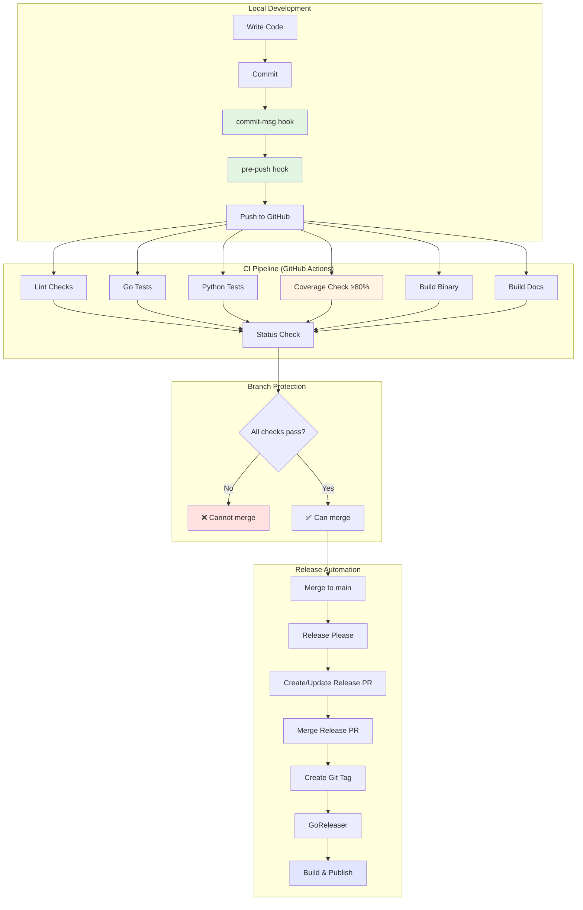

### Git Hooks (Local)

#### commit-msg Hook

**Purpose**: Validate conventional commit format

**Installation**:
```bash
make hooks.install
```

**Location**: `.git/hooks/commit-msg`

**What it checks**:
```bash
# Valid formats
feat: add feature           ✓
feat(scope): add feature    ✓
fix: resolve bug            ✓
feat!: breaking change      ✓

# Invalid formats
add feature                 ✗ (no type)
feat add feature            ✗ (no colon)
feat: Add feature           ✗ (capital after colon)
feat: add feature.          ✗ (period at end)
```

**Output on failure**:
```
ERROR: Commit message does not follow conventional commits format.

Your message:
  add feature

Should be:
  feat: add feature

Format: <type>[(scope)][!]: <description>

Types: feat, fix, docs, style, refactor, perf, test, build, ci, chore

Examples:
  feat: add user authentication
  fix(cli): resolve path handling
  feat!: redesign API (breaking change)

See: https://www.conventionalcommits.org/
```

#### pre-push Hook

**Purpose**: Run tests and check coverage before push

**What it runs**:
```bash
#!/bin/bash
set -e

echo "Running pre-push validation..."

# Run tests
echo "→ Running tests..."
go test ./... -race -cover

# Check coverage threshold
echo "→ Checking coverage..."
go test ./... -coverprofile=coverage.out
coverage=$(go tool cover -func=coverage.out | grep total | awk '{print $3}' | sed 's/%//')

if (( $(echo "$coverage < 80.0" | bc -l) )); then
    echo "❌ ERROR: Coverage $coverage% < 80%"
    exit 1
fi

echo "✓ Coverage: $coverage%"

# Build check
echo "→ Building..."
go build ./cmd/ado

echo "✓ All pre-push checks passed"
```

**Output**:
```
Running pre-push validation...
→ Running tests...
ok      github.com/anowarislam/ado/cmd/ado/config    0.234s  coverage: 87.3%
ok      github.com/anowarislam/ado/internal/config   0.156s  coverage: 92.1%
→ Checking coverage...
✓ Coverage: 89.7%
→ Building...
✓ All pre-push checks passed
```

### CI Checks (GitHub Actions)

#### Workflow: CI

**File**: `.github/workflows/ci.yml`

**Triggers**:

- Push to any branch
- Pull request

**Jobs**:

##### 1. Go Tests
```yaml
test-go:
  runs-on: ubuntu-latest
  steps:
    - uses: actions/checkout@v4
    - uses: actions/setup-go@v5
      with:
        go-version-file: go.mod
        cache: true

    - name: Run tests
      run: make go.test

    - name: Check coverage
      run: make go.test.cover.check  # Fails if <80%
```

##### 2. Python Lab Tests
```yaml
test-python:
  runs-on: ubuntu-latest
  steps:
    - uses: actions/checkout@v4
    - uses: actions/setup-python@v5
      with:
        python-version: '3.12'
        cache: pip

    - name: Install dependencies
      run: make py.install

    - name: Run tests
      run: make py.test
```

##### 3. Lint Checks
```yaml
lint:
  runs-on: ubuntu-latest
  steps:
    - name: Run Go vet
      run: make go.vet

    - name: Run Python lint
      run: make py.lint
```

##### 4. Build Check
```yaml
build:
  runs-on: ubuntu-latest
  steps:
    - name: Build binary
      run: make go.build

    - name: Verify binary
      run: ./ado meta info
```

##### 5. Documentation Build
```yaml
docs:
  runs-on: ubuntu-latest
  steps:
    - name: Install MkDocs
      run: pip install mkdocs-material

    - name: Build docs
      run: make docs.build --strict
```

##### 6. Conventional Commits Check
```yaml
conventional-commits:
  runs-on: ubuntu-latest
  if: github.event_name == 'pull_request'
  steps:
    - uses: actions/checkout@v4
      with:
        fetch-depth: 0

    - name: Check commit messages
      run: |
        # Validate all commits in PR
        base="${{ github.event.pull_request.base.sha }}"
        head="${{ github.event.pull_request.head.sha }}"

        git log --format=%s "$base..$head" | while read msg; do
          if ! echo "$msg" | grep -qE '^(feat|fix|docs|style|refactor|perf|test|build|ci|chore)(\(.+\))?!?: .+'; then
            echo "❌ Invalid commit message: $msg"
            exit 1
          fi
        done
```

### Branch Protection Integration

**Required status checks**:
```yaml
required_status_checks:
  strict: true  # Must be up to date with base branch
  contexts:
    - "test-go"
    - "test-python"
    - "lint"
    - "build"
    - "docs"
    - "conventional-commits"
```

**Result**: Cannot merge PR until all checks pass.

### Release Automation Integration

#### Workflow: Release Please

**File**: `.github/workflows/release-please.yml`

**Trigger**: Push to main

**What it does**:

1. Analyze commits since last release
2. Determine version bump (feat = minor, fix = patch, feat! = major)
3. Generate CHANGELOG from commit messages
4. Create/update Release PR

**Example Release PR**:
```markdown
## [1.3.0](https://github.com/.../compare/v1.2.0...v1.3.0)

### Features

* **config:** add validation command ([#39](https://github.com/.../pull/39))
* **logging:** implement structured logging ([#42](https://github.com/.../pull/42))

### Bug Fixes

* **config:** handle Windows paths correctly ([#51](https://github.com/.../pull/51))

### Documentation

* **adr:** 0002 - structured logging ([#40](https://github.com/.../pull/40))
* **spec:** command config-validate ([#38](https://github.com/.../pull/38))
```

#### Workflow: GoReleaser

**File**: `.github/workflows/goreleaser.yml`

**Trigger**: Release published (when Release PR merged)

**What it does**:

1. Checkout tagged commit
2. Run tests
3. Build binaries for all platforms
4. Create archives
5. Generate checksums
6. Upload to GitHub Release

**Platforms built**:

- linux/amd64, linux/arm64
- darwin/amd64, darwin/arm64
- windows/amd64, windows/arm64

### Validation Before Merge

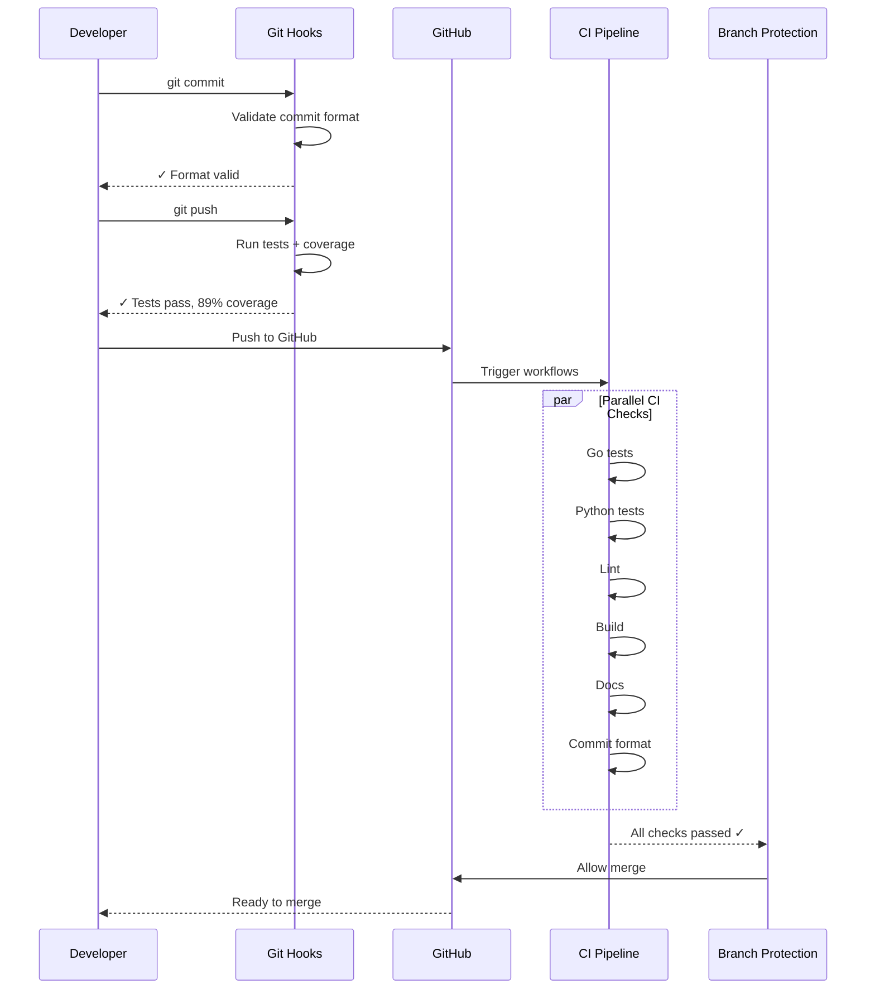

---

## Troubleshooting and Common Pitfalls

### Common Pitfall 1: Skipping ADR for "Simple" Changes

**Symptom**:
```
PR #123: "feat: add plugin system"
(No ADR, jumps straight to implementation)

Later:
PR #145: "refactor: redesign plugin system"
PR #178: "fix: plugin system breaking changes"
```

**Problem**: Architectural decisions not documented or discussed upfront.

**Solution**: Use the decision tree honestly. Ask: "Does this introduce a new pattern?"

**Prevention**:
```markdown
# In PR review
Reviewer: "This adds a new plugin architecture. Do we have an ADR?"
Author: "No, I thought it was straightforward."
Reviewer: Add label "needs-adr". "Please create ADR-NNNN first."
```

---

### Common Pitfall 2: Vague Specifications

**Symptom**:
```markdown
# Bad spec
## Behavior
The command validates the configuration.
```

**Problem**: Implementer doesn't know what "validate" means.

**Solution**: Be concrete with examples.

**Good spec**:
```markdown
## Behavior

1. Read config file from path
2. Parse YAML
3. Check required fields: 'api_key', 'endpoint'
4. Validate types: api_key is string, endpoint is URL
5. Return success or error

## Example 1: Valid config
$ ado config validate
✓ Configuration valid: ~/.config/ado/config.yaml
Exit code: 0

## Example 2: Missing required field
$ ado config validate
✗ Validation failed: missing required field 'api_key'
Exit code: 1
```

---

### Common Pitfall 3: Implementing Before Spec Approval

**Symptom**:
```
Developer: "I implemented the feature while waiting for spec approval"
Reviewer: "The spec changed during review"
Developer: "Now I have to rewrite everything"
```

**Problem**: Wasted effort implementing the wrong thing.

**Solution**: Wait for spec approval before coding.

**Prevention**:
```markdown
# Workflow enforcement
Phase 2 (Spec): PR #100 opened
  → Review: 2 days
  → Approved: Status changed to "Approved"
  → Merged to main

Phase 3 (Implementation): PR #101 opened
  → Links to approved spec: "Spec: docs/commands/04-validate.md"
  → Implementation follows spec exactly
```

---

### Common Pitfall 4: Not Updating Spec When Behavior Changes

**Symptom**:
```
Spec says: Exit code 1 for invalid config
Code returns: Exit code 2 for invalid config
Developer: "I changed my mind during implementation"
```

**Problem**: Spec and implementation diverge.

**Solution**: Update spec first, then implementation.

**Process**:
```markdown
1. Open PR to update spec:
   "docs(spec): update config-validate error codes"

2. Get approval for spec change

3. Then update implementation:
   "feat(config): change exit codes per updated spec"
```

---

### Common Pitfall 5: Coverage Drop Below 80%

**Symptom**:
```
Pre-push hook:
❌ ERROR: Coverage 75.3% < 80%
```

**Problem**: New code not adequately tested.

**Solution**: Add tests before pushing.

**Quick fix**:
```bash
# See what's not covered
make go.test.cover.html
# Opens coverage.html in browser
# Red lines = not covered

# Add tests for uncovered code
# Re-run
make go.test.cover.check
# ✓ Coverage: 82.1%
```

---

### Common Pitfall 6: Merge Conflicts in Release PR

**Symptom**:
```
Release Please PR has merge conflicts with main
```

**Cause**: Multiple PRs merged after Release PR created.

**Solution**:
```bash
# Release Please will auto-update on next push to main
# Just merge another PR, Release PR updates automatically

# Or manually trigger
gh workflow run release-please.yml
```

---

### Common Pitfall 7: Forgetting to Update Indexes

**Symptom**:
```
New ADR created: docs/adr/0003-caching.md
Not in: docs/adr/README.md
Not in: mkdocs.yml
```

**Problem**: Documentation not discoverable.

**Solution**: Update indexes as part of PR.

**Checklist**:
```markdown
## PR Checklist
- [x] ADR created
- [x] Added to docs/adr/README.md
- [x] Added to mkdocs.yml navigation
- [x] Status set to "Proposed"
```

---

### Common Pitfall 8: Breaking Changes Without `!`

**Symptom**:
```
Commit: feat(api): change response format
(This is breaking but no ! in commit message)

Result: Version bumped 1.2.0 → 1.3.0 (should be 2.0.0)
```

**Problem**: Breaking changes not marked.

**Solution**: Use `!` for breaking changes.

**Correct**:
```bash
git commit -m "feat(api)!: change response format

BREAKING CHANGE: Response format changed from {data} to {result}"
```

---

### Troubleshooting Checklist

When something goes wrong:

#### ADR Issues
- [ ] Did you use the ADR template?
- [ ] Did you document at least 2 alternatives?
- [ ] Did you link to the Issue?
- [ ] Did you update the ADR index after merge?

#### Spec Issues
- [ ] Are examples concrete and testable?
- [ ] Are error cases comprehensive?
- [ ] Do output formats match project conventions?
- [ ] Did you link to ADR (if applicable)?
- [ ] Did you update the spec index after merge?

#### Implementation Issues
- [ ] Did you run `make validate` locally?
- [ ] Are all spec examples tested?
- [ ] Is coverage ≥ 80%?
- [ ] Do error messages match spec exactly?
- [ ] Did you update CLAUDE.md (if architecture changed)?

#### CI Failures
- [ ] Did pre-push hook pass locally?
- [ ] Are you using correct commit format?
- [ ] Are all tests passing locally?
- [ ] Is Go version in CI same as local?

#### Release Issues
- [ ] Are commits following conventional format?
- [ ] Is Release PR mergeable (no conflicts)?
- [ ] Did GoReleaser tests pass?
- [ ] Are secrets (APP_ID, APP_PRIVATE_KEY) set?

---

## Conclusion

This three-phase workflow enables:

1. **Clear decision-making** through ADRs
2. **Unambiguous specifications** that can be implemented by anyone (including LLMs)
3. **Quality enforcement** through multiple validation layers
4. **Historical context** for future maintainers
5. **Async collaboration** across distributed teams

### Key Takeaways

- **ADRs document why**: Architectural decisions with alternatives
- **Specs document what**: Behavior with concrete examples
- **Implementation documents how**: Code that matches spec exactly
- **Each phase has clear approval criteria**
- **Quality gates at every level** (hooks, CI, branch protection)
- **Automation reduces manual work** (versioning, releases, validation)

### Next Steps

1. **Read ADR template**: `docs/adr/TEMPLATE.md`
2. **Read spec templates**: `docs/commands/TEMPLATE.md`, `docs/features/TEMPLATE.md`
3. **Install git hooks**: `make hooks.install`
4. **Review existing examples**: Browse `docs/adr/`, `docs/commands/`, `docs/features/`
5. **Start with a small change**: Try the workflow on a simple feature

### Related Documentation

- [Chapter 1: Philosophy](01-philosophy.md) - Why this system exists
- [Chapter 5: Build Automation](05-build-automation.md) - Make, git hooks, local tooling
- [Chapter 6: Release Automation](06-release-automation.md) - Complete release workflow
- `docs/workflow.md` - Quick reference version of this guide
- `docs/contributing.md` - Contributor guidelines

---

**Remember**: Good process feels like guardrails, not handcuffs. This workflow protects you from yourself while enabling faster, more confident development.
