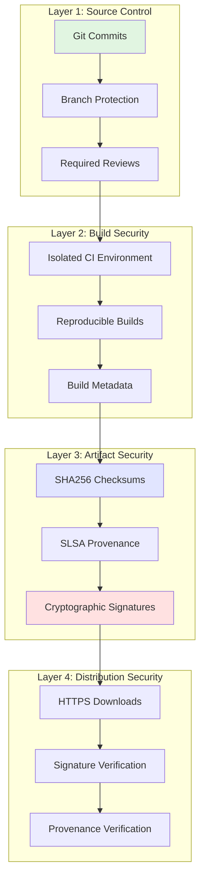
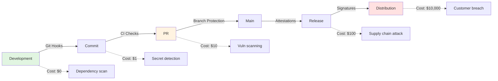
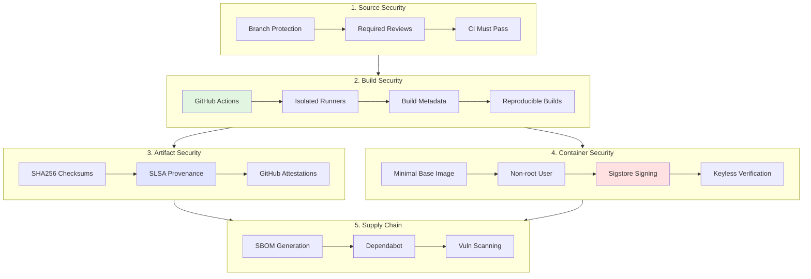
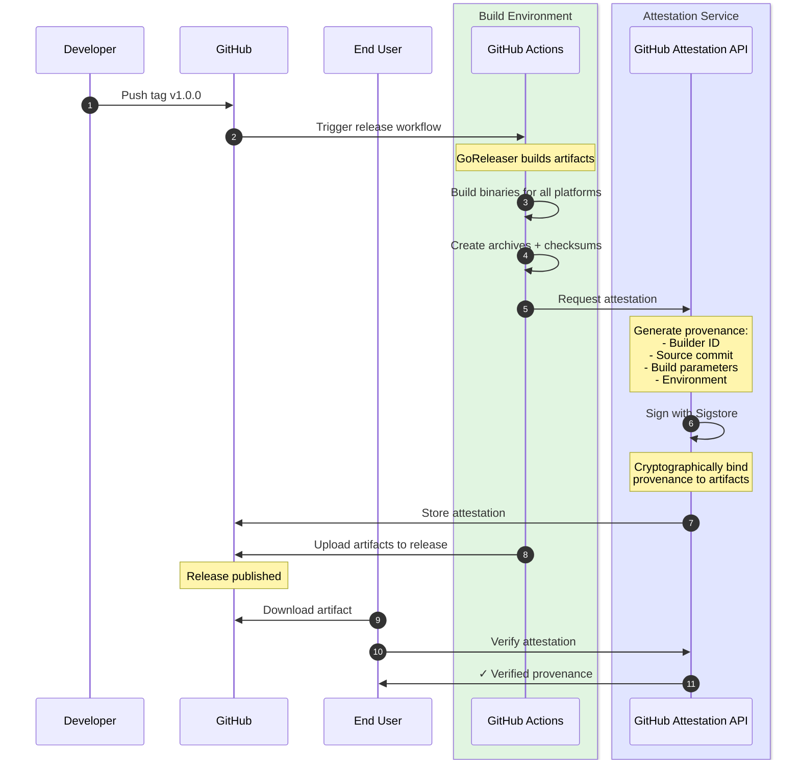
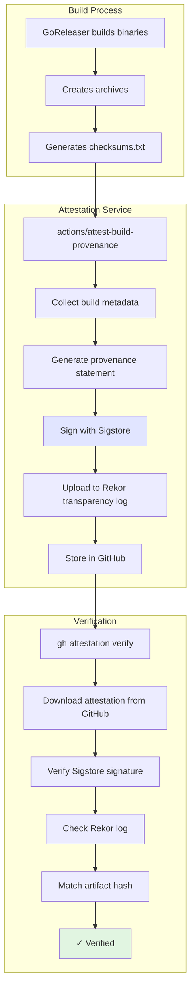
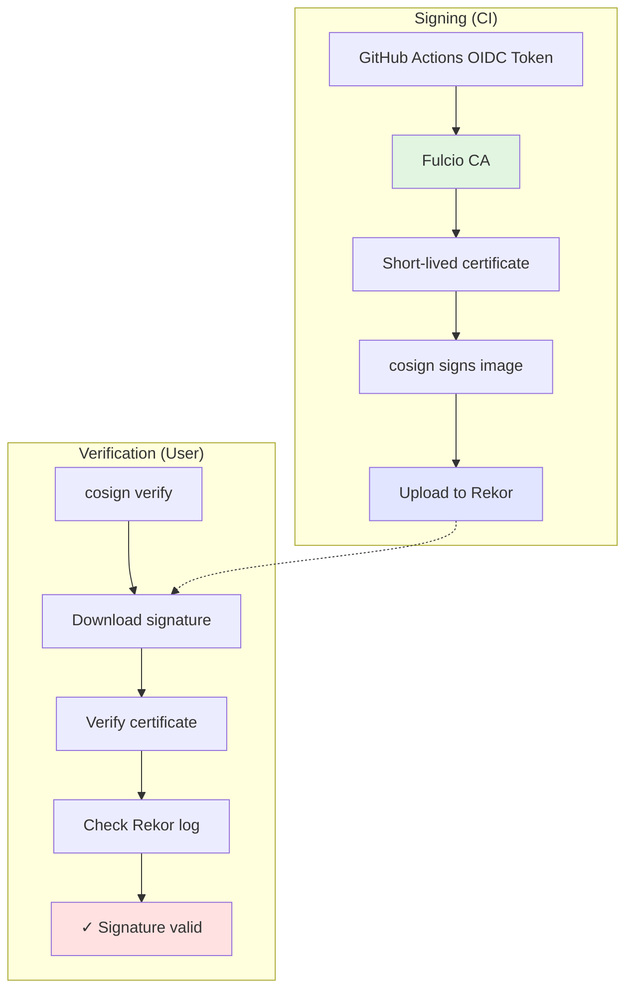
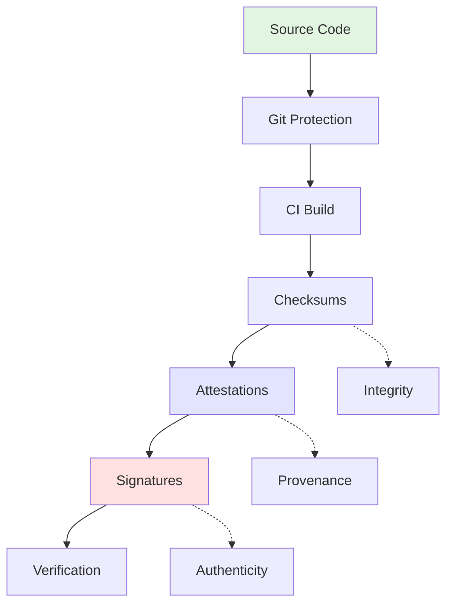

# Chapter 3: Security Features and Implementation

> Building defense-in-depth supply chain security for your releases - from SLSA provenance to container signing.

## Table of Contents

- [Security Philosophy](#security-philosophy)
- [Security Overview](#security-overview)
- [SLSA Provenance](#slsa-provenance)
- [Artifact Attestations](#artifact-attestations)
- [Container Signing](#container-signing)
- [Checksum Verification](#checksum-verification)
- [Supply Chain Security](#supply-chain-security)
- [Secret Management](#secret-management)
- [Verification Workflows](#verification-workflows)
- [Security.md Policy](#securitymd-policy)
- [Security Checklist](#security-checklist)

---

## Security Philosophy

### Defense in Depth

**Core Principle**: No single security measure is perfect. Layer multiple independent security controls so that if one fails, others provide protection.



**Why Defense in Depth**:

- **Attackers must break multiple layers** - not just one
- **Each layer catches different threat types** - checksums catch corruption, signatures catch tampering
- **Independent verification methods** - don't rely on single trust anchor
- **Gradual degradation** - if one layer fails, others still protect

### Zero-Trust Principles

**Philosophy**: Trust nothing, verify everything.

| Traditional Approach | Zero-Trust Approach |
|---------------------|---------------------|
| Trust binaries from GitHub | Verify provenance shows CI built them |
| Trust checksums file | Verify checksums are signed/attested |
| Trust container images | Verify signatures with keyless signing |
| Trust dependencies | SBOM + vulnerability scanning |

**Implementation**:

```bash
# Traditional (trust-based)
curl -LO https://github.com/user/project/releases/download/v1.0.0/binary.tar.gz
tar xzf binary.tar.gz  # Hope it's legitimate

# Zero-trust (verify-based)
curl -LO https://github.com/user/project/releases/download/v1.0.0/binary.tar.gz
gh attestation verify binary.tar.gz --owner user  # Verify provenance
sha256sum -c checksums.txt --ignore-missing       # Verify integrity
tar xzf binary.tar.gz  # Now trust but verified
```

### Shift Security Left

**Philosophy**: Catch security issues as early as possible in the development cycle.



**Key Insight**: A vulnerability caught in development costs 1/10,000th the cost of a customer breach.

---

## Security Overview

### The Security Stack

Our security implementation provides multiple layers of verification:



### Security Properties

| Property | Mechanism | Verification |
|----------|-----------|-------------|
| **Integrity** | SHA256 checksums | `sha256sum -c checksums.txt` |
| **Authenticity** | Sigstore signatures | `cosign verify` |
| **Provenance** | SLSA attestations | `gh attestation verify` |
| **Transparency** | Rekor log | Public audit trail |
| **Non-repudiation** | OIDC certificates | GitHub identity tied to build |

---

## SLSA Provenance

### What is SLSA?

**SLSA** (Supply-chain Levels for Software Artifacts) is a security framework for ensuring the integrity of software artifacts throughout the software supply chain.

**Four Levels**:

| Level | Requirements | Our Implementation |
|-------|-------------|-------------------|
| **SLSA 0** | No guarantees | N/A (we exceed this) |
| **SLSA 1** | Provenance exists | GitHub Actions + attestations |
| **SLSA 2** | Signed provenance | GitHub's signing service |
| **SLSA 3** | Hardened build | **Our target level** |
| **SLSA 4** | 2-person review + hermetic | Future goal |

We achieve **SLSA 3** through:
- ✅ Provenance generated by trusted builder (GitHub Actions)
- ✅ Signed by GitHub's attestation service
- ✅ Non-falsifiable provenance
- ✅ Isolated build environment
- ✅ Parameterless builds (no user input)

### SLSA Provenance Flow



### Provenance Contents

**What's in a SLSA provenance statement**:

```json
{
  "predicateType": "https://slsa.dev/provenance/v1",
  "subject": [
    {
      "name": "ado_1.0.0_linux_amd64.tar.gz",
      "digest": {
        "sha256": "abc123..."
      }
    }
  ],
  "predicate": {
    "buildDefinition": {
      "buildType": "https://github.com/actions/runner",
      "externalParameters": {
        "workflow": {
          "ref": "refs/tags/v1.0.0",
          "repository": "https://github.com/anowarislam/ado"
        }
      }
    },
    "runDetails": {
      "builder": {
        "id": "https://github.com/actions/runner/github-hosted"
      },
      "metadata": {
        "invocationId": "https://github.com/anowarislam/ado/actions/runs/123456"
      }
    }
  }
}
```

**Key Fields**:

- **subject**: The artifact (filename + hash)
- **buildType**: How it was built (GitHub Actions)
- **externalParameters**: Source repo + commit
- **builder.id**: Who built it (GitHub-hosted runner)
- **invocationId**: Link to specific workflow run

---

## Artifact Attestations

### GitHub Native Attestations

**What are attestations?**: Cryptographic proof that links artifacts to the CI workflow that built them.

**Architecture**:



### Implementation

**Workflow Configuration** (`.github/workflows/goreleaser.yml`):

```yaml
name: GoReleaser

permissions:
  contents: write      # Upload release assets
  attestations: write  # Create attestations
  id-token: write      # Sigstore signing

jobs:
  goreleaser:
    runs-on: ubuntu-latest
    steps:
      # ... build steps ...

      - name: Run goreleaser
        id: goreleaser
        uses: goreleaser/goreleaser-action@v6
        with:
          args: release --clean
        env:
          GITHUB_TOKEN: ${{ steps.generate-token.outputs.token }}

      # Generate attestations for all artifacts
      - name: Attest build provenance (binaries)
        uses: actions/attest-build-provenance@v2
        with:
          subject-path: |
            dist/*.tar.gz
            dist/*.zip
            dist/checksums.txt
```

**Key Points**:

- **Automatic**: Runs on every release
- **Zero configuration**: Uses GitHub's defaults
- **Multi-artifact**: Attests all release files
- **Cryptographically signed**: Via Sigstore
- **Publicly logged**: In Rekor transparency log

### Verification Examples

**Basic Verification**:

```bash
# Download an artifact
curl -LO https://github.com/anowarislam/ado/releases/download/v1.0.0/ado_1.0.0_linux_amd64.tar.gz

# Verify attestation
gh attestation verify ado_1.0.0_linux_amd64.tar.gz --owner anowarislam

# Output:
# ✓ Verification succeeded!
#
# Attestation SHA256: 5f4a...
# Signer:
#   https://github.com/anowarislam/ado/.github/workflows/goreleaser.yml@refs/tags/v1.0.0
#
# Predicate type: https://slsa.dev/provenance/v1
```

**JSON Output for Automation**:

```bash
gh attestation verify ado_1.0.0_linux_amd64.tar.gz \
  --owner anowarislam \
  --format json | jq

# Output:
{
  "verified": true,
  "attestation": {
    "type": "https://slsa.dev/provenance/v1",
    "signer": "https://github.com/anowarislam/ado/...",
    "workflow": {
      "name": "GoReleaser",
      "ref": "refs/tags/v1.0.0",
      "sha": "abc123..."
    }
  }
}
```

**Batch Verification**:

```bash
# Verify all artifacts in a release
for file in dist/*.tar.gz dist/*.zip; do
  echo "Verifying $file..."
  gh attestation verify "$file" --owner anowarislam || exit 1
done
```

### Trust Model

**What attestations prove**:

- ✅ Artifact was built by GitHub Actions (not a developer's laptop)
- ✅ Built from specific commit in specific repo
- ✅ Built by specific workflow file
- ✅ No tampering after build

**What attestations DON'T prove**:

- ❌ Source code is free of vulnerabilities
- ❌ Dependencies are secure
- ❌ No supply chain attacks on dependencies
- ❌ Build environment wasn't compromised

**Trust Chain**:

```
User trusts GitHub → GitHub trusts CI runner → CI runner builds artifact
                                               ↓
User verifies attestation ← Sigstore signs ← Attestation created
```

---

## Container Signing

### Why Sign Container Images?

**Problem**: Docker images are mutable - the same tag can point to different images over time.

```bash
# This morning
docker pull ghcr.io/user/project:latest
# SHA256: abc123...

# This afternoon (malicious actor pushes new image)
docker pull ghcr.io/user/project:latest
# SHA256: def456...  # DIFFERENT IMAGE!
```

**Solution**: Cryptographic signatures that bind image digest to identity.

### Sigstore and Cosign

**Sigstore** is a project providing free signing services for open source.

**Components**:



**Key Properties**:

- **Keyless signing**: No private keys to manage
- **OIDC-based**: Tied to GitHub Actions identity
- **Transparent**: All signatures logged publicly
- **Time-limited**: Certificates expire after signing

### Implementation

**Workflow Configuration** (`.github/workflows/goreleaser.yml`):

```yaml
jobs:
  goreleaser:
    runs-on: ubuntu-latest
    permissions:
      id-token: write  # Required for keyless signing
      packages: write  # Push images to GHCR

    steps:
      # ... build steps ...

      # Install cosign
      - name: Install cosign
        uses: sigstore/cosign-installer@v3

      # Sign images with keyless signing
      - name: Sign container images
        env:
          REGISTRY: ghcr.io/anowarislam/ado
          GIT_TAG: ${{ github.event.inputs.tag || github.ref_name }}
        run: |
          # Strip 'v' prefix - GoReleaser tags images as 1.2.3, not v1.2.3
          VERSION="${GIT_TAG#v}"

          # Sign version-specific tag
          cosign sign --yes "${REGISTRY}:${VERSION}"

          # Sign latest tag
          cosign sign --yes "${REGISTRY}:latest"
```

**Key Points**:

- **`--yes` flag**: Non-interactive signing (required for CI)
- **No key files**: Uses GitHub's OIDC token
- **Multiple tags**: Sign both versioned and latest tags
- **Automatic**: Runs on every release

### Verification Examples

**Basic Verification**:

```bash
# Verify a specific version
cosign verify ghcr.io/anowarislam/ado:1.0.0 \
  --certificate-identity-regexp="https://github.com/anowarislam/ado/" \
  --certificate-oidc-issuer="https://token.actions.githubusercontent.com"

# Output:
# Verification for ghcr.io/anowarislam/ado:1.0.0 --
# The following checks were performed on each of these signatures:
#   - The cosign claims were validated
#   - Existence of the claims in the transparency log was verified offline
#   - The code-signing certificate was verified using trusted certificate authority certificates
#
# [
#   {
#     "critical": {
#       "identity": {
#         "docker-reference": "ghcr.io/anowarislam/ado"
#       },
#       "image": {
#         "docker-manifest-digest": "sha256:abc123..."
#       }
#     }
#   }
# ]
```

**Policy-Based Verification**:

```bash
# Create a policy file
cat > policy.yaml <<EOF
apiVersion: policy.sigstore.dev/v1beta1
kind: ClusterImagePolicy
metadata:
  name: ado-image-policy
spec:
  images:
  - glob: "ghcr.io/anowarislam/ado**"
  authorities:
  - keyless:
      identities:
      - issuerRegExp: "https://token.actions.githubusercontent.com"
        subjectRegExp: "https://github.com/anowarislam/ado/"
EOF

# Verify with policy
cosign verify --policy policy.yaml ghcr.io/anowarislam/ado:1.0.0
```

**Automated Verification in CI/CD**:

```yaml
# In your deployment pipeline
- name: Verify container signature
  run: |
    cosign verify ghcr.io/anowarislam/ado:${{ env.VERSION }} \
      --certificate-identity-regexp="https://github.com/anowarislam/ado/" \
      --certificate-oidc-issuer="https://token.actions.githubusercontent.com" \
      > /dev/null
    echo "✓ Container signature verified"
```

### Verification Policies

**What to verify**:

| Field | Purpose | Example |
|-------|---------|---------|
| **Certificate identity** | Who signed it | `https://github.com/anowarislam/ado/.github/workflows/goreleaser.yml` |
| **OIDC issuer** | Authentication source | `https://token.actions.githubusercontent.com` |
| **Digest** | Specific image version | `sha256:abc123...` |

**Trust model**:

```
User trusts:
  1. GitHub (issues OIDC tokens)
  2. Sigstore (Fulcio CA)
  3. Rekor (transparency log)

Verification proves:
  1. Image was signed by GitHub Actions workflow
  2. From specific repository
  3. No tampering since signing
```

---

## Checksum Verification

### SHA256 Checksums

**What are checksums?**: Fixed-size hash values that uniquely identify files.

**Properties**:

- **Deterministic**: Same file always produces same hash
- **One-way**: Can't reverse hash to get file
- **Collision-resistant**: Near-impossible to find two files with same hash
- **Small**: 32 bytes for SHA256 (256 bits)

### Generation

**GoReleaser Configuration** (`.goreleaser.yaml`):

```yaml
checksum:
  name_template: checksums.txt
  algorithm: sha256
```

**Generated File** (`checksums.txt`):

```
abc123... ado_1.0.0_darwin_amd64.tar.gz
def456... ado_1.0.0_darwin_arm64.tar.gz
789ghi... ado_1.0.0_linux_amd64.tar.gz
...
```

### Verification Methods

**Method 1: Verify Single File**:

```bash
# Download file and checksums
curl -LO https://github.com/anowarislam/ado/releases/download/v1.0.0/ado_1.0.0_linux_amd64.tar.gz
curl -LO https://github.com/anowarislam/ado/releases/download/v1.0.0/checksums.txt

# Verify
sha256sum -c checksums.txt --ignore-missing

# Output:
# ado_1.0.0_linux_amd64.tar.gz: OK
```

**Method 2: Verify All Files**:

```bash
# Download all artifacts
for file in $(cat checksums.txt | awk '{print $2}'); do
  curl -LO "https://github.com/anowarislam/ado/releases/download/v1.0.0/$file"
done

# Verify all
sha256sum -c checksums.txt

# Output:
# ado_1.0.0_darwin_amd64.tar.gz: OK
# ado_1.0.0_darwin_arm64.tar.gz: OK
# ado_1.0.0_linux_amd64.tar.gz: OK
# ...
```

**Method 3: Manual Verification**:

```bash
# Calculate hash
sha256sum ado_1.0.0_linux_amd64.tar.gz

# Compare with checksums.txt
grep ado_1.0.0_linux_amd64.tar.gz checksums.txt

# Should match exactly
```

**Method 4: Programmatic Verification** (Go):

```go
package main

import (
    "crypto/sha256"
    "fmt"
    "io"
    "os"
)

func verifyChecksum(filepath string, expectedSum string) error {
    f, err := os.Open(filepath)
    if err != nil {
        return err
    }
    defer f.Close()

    h := sha256.New()
    if _, err := io.Copy(h, f); err != nil {
        return err
    }

    actualSum := fmt.Sprintf("%x", h.Sum(nil))
    if actualSum != expectedSum {
        return fmt.Errorf("checksum mismatch: got %s, want %s",
            actualSum, expectedSum)
    }
    return nil
}
```

### Checksum Trust Model

**What checksums prove**:

- ✅ File integrity (not corrupted during download)
- ✅ Exact match to released version

**What checksums DON'T prove**:

- ❌ File authenticity (who created it)
- ❌ Build provenance (how it was built)
- ❌ No malware (content is safe)

**Attack scenario checksums prevent**:

```
Developer → GitHub → User
              ↓
         Network corruption
              ↓
         Checksum fails
```

**Attack scenario checksums DON'T prevent**:

```
Attacker → GitHub Release (compromises account)
    ↓
  Uploads malicious binary + valid checksums
    ↓
  User downloads → Checksums match → ✓
    ↓
  But binary is malicious!
```

**Solution**: Combine checksums with attestations and signatures.

---

## Supply Chain Security

### Software Bill of Materials (SBOM)

**What is an SBOM?**: A complete inventory of all components in your software.

**Why SBOMs matter**:

- **Transparency**: Know what's in your software
- **Vulnerability management**: Identify affected components
- **Compliance**: Required by many regulations
- **Incident response**: Quick dependency analysis

**SBOM Generation** (using syft):

```yaml
# In .github/workflows/goreleaser.yml
- name: Generate SBOM
  run: |
    curl -sSfL https://raw.githubusercontent.com/anchore/syft/main/install.sh | sh -s -- -b /usr/local/bin
    syft packages dir:. -o spdx-json > sbom.spdx.json

- name: Upload SBOM
  uses: actions/upload-artifact@v4
  with:
    name: sbom
    path: sbom.spdx.json
```

**SBOM Contents**:

```json
{
  "spdxVersion": "SPDX-2.3",
  "name": "ado",
  "packages": [
    {
      "name": "github.com/spf13/cobra",
      "versionInfo": "v1.8.0",
      "filesAnalyzed": false,
      "licenseConcluded": "Apache-2.0",
      "externalRefs": [
        {
          "referenceCategory": "PACKAGE-MANAGER",
          "referenceType": "purl",
          "referenceLocator": "pkg:golang/github.com/spf13/cobra@v1.8.0"
        }
      ]
    }
    // ... more packages ...
  ]
}
```

### Dependency Scanning with Dependabot

**Configuration** (`.github/dependabot.yml`):

```yaml
version: 2
updates:
  # Go dependencies
  - package-ecosystem: "gomod"
    directory: "/"
    schedule:
      interval: "weekly"
      day: "monday"
    open-pull-requests-limit: 10
    labels:
      - "dependencies"
      - "go"
    commit-message:
      prefix: "build(deps)"
      include: "scope"

  # GitHub Actions
  - package-ecosystem: "github-actions"
    directory: "/"
    schedule:
      interval: "weekly"
      day: "monday"
    labels:
      - "dependencies"
      - "ci"
    commit-message:
      prefix: "ci(deps)"

  # Python dependencies (lab)
  - package-ecosystem: "pip"
    directory: "/lab/py"
    schedule:
      interval: "weekly"
      day: "monday"
    labels:
      - "dependencies"
      - "python"
    commit-message:
      prefix: "build(deps)"
```

**Benefits**:

- **Automatic PR creation**: Dependabot opens PRs for updates
- **Security alerts**: Notifies of known vulnerabilities
- **Changelogs included**: PRs show what changed
- **Configurable**: Control update frequency and scope

**Auto-merge Workflow** (`.github/workflows/dependabot-auto-merge.yml`):

```yaml
name: Dependabot Auto-merge

on:
  pull_request:
    types: [opened, synchronize]

permissions:
  pull-requests: write
  contents: write

jobs:
  auto-merge:
    if: github.actor == 'dependabot[bot]'
    runs-on: ubuntu-latest
    steps:
      - name: Check if PR is from Dependabot
        id: is_dependabot
        run: echo "is_bot=${{ github.actor == 'dependabot[bot]' }}" >> $GITHUB_OUTPUT

      - name: Enable auto-merge for Dependabot PRs
        if: steps.is_dependabot.outputs.is_bot == 'true'
        run: gh pr merge --auto --squash "$PR_URL"
        env:
          PR_URL: ${{ github.event.pull_request.html_url }}
          GITHUB_TOKEN: ${{ secrets.GITHUB_TOKEN }}
```

### Vulnerability Scanning

**GitHub Security Scanning** (automatic):

```yaml
# Enabled by default for public repos
# For private repos: Settings → Security → Code security and analysis

# What's scanned:
# - Dependency vulnerabilities (Dependabot)
# - Code scanning (CodeQL)
# - Secret scanning
```

**Trivy Scanning** (in CI):

```yaml
- name: Run Trivy vulnerability scanner
  uses: aquasecurity/trivy-action@master
  with:
    scan-type: 'fs'
    scan-ref: '.'
    format: 'sarif'
    output: 'trivy-results.sarif'

- name: Upload Trivy results to GitHub Security
  uses: github/codeql-action/upload-sarif@v3
  with:
    sarif_file: 'trivy-results.sarif'
```

**Container Scanning**:

```yaml
- name: Scan container image
  uses: aquasecurity/trivy-action@master
  with:
    image-ref: 'ghcr.io/anowarislam/ado:${{ github.ref_name }}'
    format: 'sarif'
    output: 'trivy-container-results.sarif'
```

### Dependency Pinning

**Why pin dependencies?**:

- **Reproducible builds**: Same inputs → same outputs
- **Security**: Prevent surprise updates
- **Stability**: Avoid breaking changes

**Go Dependencies** (automatic with `go.mod`):

```go
// go.mod
module github.com/anowarislam/ado

go 1.23

require (
    github.com/spf13/cobra v1.8.0
    // Exact versions pinned
)
```

**GitHub Actions** (pin to SHA):

```yaml
# ❌ Don't do this (mutable)
- uses: actions/checkout@v4

# ✅ Do this (immutable)
- uses: actions/checkout@b4ffde65f46336ab88eb53be808477a3936bae11 # v4.1.1
```

**Docker Base Images** (pin to digest):

```dockerfile
# ❌ Don't do this (mutable)
FROM alpine:3.21

# ✅ Do this (immutable)
FROM alpine:3.21@sha256:abc123...
```

---

## Secret Management

### GitHub Secrets

**Types of Secrets**:

| Type | Scope | Use Case |
|------|-------|----------|
| **Repository secrets** | Single repo | API keys, tokens |
| **Organization secrets** | All repos in org | Shared credentials |
| **Environment secrets** | Specific deployment | Production keys |

**Configuration**:

```yaml
# Access secrets in workflows
jobs:
  build:
    runs-on: ubuntu-latest
    steps:
      - name: Use secret
        env:
          API_KEY: ${{ secrets.API_KEY }}
        run: |
          # Secret is automatically masked in logs
          echo "Using API key"  # ✅ Safe
          echo "$API_KEY"        # ❌ Would show *** in logs
```

**Best Practices**:

- ✅ Use least-privilege secrets
- ✅ Rotate regularly
- ✅ Never print secrets to logs
- ✅ Use environment secrets for production
- ❌ Don't commit secrets to code
- ❌ Don't use secrets in PR titles/descriptions

### OIDC Tokens (Keyless Authentication)

**What is OIDC?**: OpenID Connect - standard for federated authentication.

**Why OIDC?**:

- **No static secrets**: Tokens are short-lived (hours)
- **Automatic rotation**: New token per workflow run
- **Scoped**: Tied to specific workflow and repo
- **Auditable**: All token usage logged

**Configuration**:

```yaml
permissions:
  id-token: write  # Required for OIDC

jobs:
  deploy:
    runs-on: ubuntu-latest
    steps:
      # GitHub automatically provides OIDC token
      - name: Configure AWS credentials
        uses: aws-actions/configure-aws-credentials@v4
        with:
          role-to-assume: arn:aws:iam::123456789:role/GitHubActions
          aws-region: us-east-1
          # No static credentials needed!
```

**Token Claims**:

```json
{
  "iss": "https://token.actions.githubusercontent.com",
  "sub": "repo:anowarislam/ado:ref:refs/heads/main",
  "aud": "https://github.com/anowarislam",
  "repository": "anowarislam/ado",
  "workflow": "Release",
  "job_workflow_ref": "anowarislam/ado/.github/workflows/release.yml@refs/heads/main"
}
```

### GitHub App Tokens

**Why GitHub Apps?**:

- **Fine-grained permissions**: Only what's needed
- **Short-lived tokens**: 1 hour max
- **Installation scoped**: Per-repo or per-org
- **Audit trail**: All actions logged under app identity

**Workflow Setup**:

```yaml
- name: Generate token
  id: generate-token
  uses: actions/create-github-app-token@v1
  with:
    app-id: ${{ secrets.APP_ID }}
    private-key: ${{ secrets.APP_PRIVATE_KEY }}

- name: Use token
  env:
    GITHUB_TOKEN: ${{ steps.generate-token.outputs.token }}
  run: |
    # Token is valid for 1 hour
    gh pr create --title "Release" --body "..."
```

**Permissions**:

```yaml
# When creating GitHub App, set permissions:
# Repository permissions:
#   - Contents: Read and write
#   - Pull requests: Read and write
#   - Metadata: Read-only (auto-selected)
```

### Secret Scanning

**GitHub Secret Scanning** (automatic):

```yaml
# Enabled by default, scans for:
# - GitHub tokens
# - AWS keys
# - Azure keys
# - Google Cloud keys
# - Many more providers
```

**Custom Patterns**:

```yaml
# .github/secret_scanning.yml
patterns:
  - name: Custom API Key
    regex: 'custom_key_[a-zA-Z0-9]{32}'
    secret_type: custom_api_key
```

**Handling Leaked Secrets**:

1. **Revoke immediately**: Rotate compromised secret
2. **Audit usage**: Check access logs
3. **Update in GitHub**: New secret value
4. **Investigate**: How did leak occur?

---

## Verification Workflows

### User Verification Guide

**Complete Verification Workflow**:

```bash
#!/bin/bash
set -euo pipefail

VERSION="1.0.0"
OWNER="anowarislam"
REPO="ado"
PLATFORM="linux_amd64"

# 1. Download artifact
echo "Downloading artifact..."
curl -LO "https://github.com/${OWNER}/${REPO}/releases/download/v${VERSION}/${REPO}_${VERSION}_${PLATFORM}.tar.gz"

# 2. Download checksums
echo "Downloading checksums..."
curl -LO "https://github.com/${OWNER}/${REPO}/releases/download/v${VERSION}/checksums.txt"

# 3. Verify checksum
echo "Verifying checksum..."
sha256sum -c checksums.txt --ignore-missing || {
  echo "❌ Checksum verification failed!"
  exit 1
}
echo "✓ Checksum verified"

# 4. Verify attestation
echo "Verifying build provenance..."
gh attestation verify "${REPO}_${VERSION}_${PLATFORM}.tar.gz" --owner "${OWNER}" || {
  echo "❌ Attestation verification failed!"
  exit 1
}
echo "✓ Attestation verified"

# 5. Extract and use
echo "Extracting..."
tar xzf "${REPO}_${VERSION}_${PLATFORM}.tar.gz"
echo "✓ Verification complete - safe to use"
```

### Container Verification

**Complete Container Verification**:

```bash
#!/bin/bash
set -euo pipefail

IMAGE="ghcr.io/anowarislam/ado"
VERSION="1.0.0"

# 1. Verify signature
echo "Verifying container signature..."
cosign verify "${IMAGE}:${VERSION}" \
  --certificate-identity-regexp="https://github.com/anowarislam/ado/" \
  --certificate-oidc-issuer="https://token.actions.githubusercontent.com" \
  > /dev/null || {
  echo "❌ Signature verification failed!"
  exit 1
}
echo "✓ Signature verified"

# 2. Inspect SBOM (if available)
echo "Checking SBOM..."
cosign download sbom "${IMAGE}:${VERSION}" || echo "No SBOM found"

# 3. Pull and use
echo "Pulling image..."
docker pull "${IMAGE}:${VERSION}"
echo "✓ Container verified - safe to use"
```

### Automated Verification in CI

**Example Deployment Pipeline**:

```yaml
name: Deploy

on:
  workflow_dispatch:
    inputs:
      version:
        description: 'Version to deploy'
        required: true

jobs:
  deploy:
    runs-on: ubuntu-latest
    steps:
      - name: Verify artifact
        run: |
          VERSION="${{ github.event.inputs.version }}"

          # Download
          curl -LO "https://github.com/anowarislam/ado/releases/download/v${VERSION}/ado_${VERSION}_linux_amd64.tar.gz"

          # Verify attestation
          gh attestation verify "ado_${VERSION}_linux_amd64.tar.gz" --owner anowarislam

          # Extract
          tar xzf "ado_${VERSION}_linux_amd64.tar.gz"

      - name: Deploy
        run: |
          # Deploy verified artifact
          ./deploy.sh
```

### Verification Policy Example

**Policy as Code** (OPA):

```rego
package verify

# Require attestation verification
require_attestation {
    input.attestation.verified == true
    startswith(input.attestation.signer, "https://github.com/anowarislam/ado")
}

# Require signature verification
require_signature {
    input.signature.verified == true
    input.signature.issuer == "https://token.actions.githubusercontent.com"
}

# Require checksum match
require_checksum {
    input.checksum.matched == true
}

# All checks must pass
allow {
    require_attestation
    require_signature
    require_checksum
}
```

---

## Security.md Policy

### Complete Security Policy

**Template** (`SECURITY.md`):

```markdown
# Security Policy

## Supported Versions

| Version | Supported          |
| ------- | ------------------ |
| 1.x.x   | ✅                 |
| < 1.0   | ❌                 |

## Reporting a Vulnerability

**Please do NOT report security vulnerabilities through public GitHub issues.**

### How to Report

Use **GitHub Security Advisories**:

1. Go to the [Security tab](https://github.com/anowarislam/ado/security/advisories)
2. Click "Report a vulnerability"
3. Fill out the form

### What to Include

- **Type of vulnerability** (e.g., RCE, XSS, etc.)
- **Full paths** of affected source files
- **Location** of affected code (tag/branch/commit)
- **Step-by-step reproduction** instructions
- **Proof-of-concept** or exploit code (if possible)
- **Impact assessment**
- **Suggested fix** (if you have one)

### Response Timeline

- **Initial Response**: Within 48 hours
- **Status Update**: Within 7 days with assessment
- **Resolution Target**: Within 90 days for confirmed vulnerabilities

### What to Expect

1. **Acknowledgment** within 48 hours
2. **Assessment** of severity
3. **Regular updates** on progress
4. **Notification** before public disclosure
5. **Credit** in security advisory (with permission)

## Scope

**In Scope:**
- The `ado` binary and functionality
- Go source code in `cmd/` and `internal/`
- Build and release infrastructure
- Container images published to ghcr.io

**Out of Scope:**
- Python lab code (`lab/py/`) - experimental only
- Third-party dependencies (report to upstream)
- Social engineering attacks
- Physical attacks

## Verification

### Verifying Downloads

All releases include SHA256 checksums:

\```bash
curl -LO https://github.com/anowarislam/ado/releases/download/vX.Y.Z/checksums.txt
sha256sum -c checksums.txt --ignore-missing
\```

### Verifying Build Provenance

All artifacts have cryptographic attestations:

\```bash
gh attestation verify ado_X.Y.Z_linux_amd64.tar.gz --owner anowarislam
\```

### Container Image Verification

Container images are signed with Sigstore:

\```bash
cosign verify ghcr.io/anowarislam/ado:vX.Y.Z \
  --certificate-identity-regexp="https://github.com/anowarislam/ado/" \
  --certificate-oidc-issuer="https://token.actions.githubusercontent.com"
\```

## Security Best Practices

### For Users

1. **Always verify artifacts** before use
2. **Use specific versions**, not `latest`
3. **Review release notes** before upgrading
4. **Keep dependencies updated**

### For Contributors

1. **Never commit secrets** to version control
2. **Use pre-commit hooks** to catch issues early
3. **Follow conventional commits** for changelog tracking
4. **Test security features** in PRs

## Acknowledgments

We thank the following security researchers:

*No acknowledgments yet. Be the first!*
```

### Security Contact

**Options for security contact**:

1. **GitHub Security Advisories** (recommended):
   - Private disclosure
   - Coordinated release
   - CVE assignment

2. **Email** (alternative):
   - security@your-domain.com
   - PGP key for encryption

3. **Bug Bounty** (for larger projects):
   - HackerOne
   - Bugcrowd
   - Self-hosted

---

## Security Checklist

### Implementation Checklist

**Source Control Security**:

- [ ] Branch protection enabled on main
- [ ] Require PR reviews
- [ ] Require CI checks to pass
- [ ] Signed commits (optional but recommended)

**Build Security**:

- [ ] Builds run in isolated CI environment
- [ ] No user input in build process
- [ ] Reproducible builds enabled
- [ ] Build logs publicly accessible

**Artifact Security**:

- [ ] SHA256 checksums generated
- [ ] SLSA provenance attestations created
- [ ] Checksums included in attestations
- [ ] All artifacts attested

**Container Security**:

- [ ] Minimal base image (scratch or distroless)
- [ ] Non-root user
- [ ] Signed with Sigstore/cosign
- [ ] Keyless signing configured
- [ ] Verification documented

**Supply Chain Security**:

- [ ] SBOM generated (SPDX or CycloneDX)
- [ ] Dependabot enabled
- [ ] Dependency pinning enforced
- [ ] Vulnerability scanning configured
- [ ] Auto-merge for safe updates

**Secret Management**:

- [ ] GitHub secrets properly scoped
- [ ] OIDC tokens used where possible
- [ ] GitHub App for release automation
- [ ] Secret scanning enabled
- [ ] No secrets in code

**Documentation**:

- [ ] SECURITY.md created
- [ ] Verification instructions documented
- [ ] Trust model explained
- [ ] Security contact defined

### Verification Checklist

**For Each Release**:

- [ ] Checksums generated and published
- [ ] Attestations created for all artifacts
- [ ] Container images signed
- [ ] SBOM available
- [ ] Release notes include security changes
- [ ] Verification instructions in release notes

**Periodic Security Reviews**:

- [ ] Review dependency updates monthly
- [ ] Audit CI workflows quarterly
- [ ] Review secret usage quarterly
- [ ] Update security documentation as needed
- [ ] Test verification workflows quarterly

---

## Common Security Pitfalls

### Pitfall 1: Mutable Dependencies

**Problem**:
```yaml
# Actions pinned to tags (mutable)
- uses: actions/checkout@v4
```

**Solution**:
```yaml
# Pin to SHA (immutable)
- uses: actions/checkout@b4ffde65f46336ab88eb53be808477a3936bae11 # v4.1.1
```

### Pitfall 2: Secrets in Logs

**Problem**:
```bash
echo "API_KEY=$API_KEY"  # Exposes secret
```

**Solution**:
```bash
echo "Using API key"     # GitHub masks $API_KEY automatically
```

### Pitfall 3: Unsigned Container Images

**Problem**:
```yaml
# Build and push only
docker push ghcr.io/user/project:latest
```

**Solution**:
```yaml
# Build, push, and sign
docker push ghcr.io/user/project:latest
cosign sign --yes ghcr.io/user/project:latest
```

### Pitfall 4: No Verification Documentation

**Problem**: Users don't know how to verify artifacts.

**Solution**: Include verification in README and release notes.

### Pitfall 5: Trusting `latest` Tags

**Problem**:
```bash
docker pull ghcr.io/user/project:latest  # What version is this?
```

**Solution**:
```bash
docker pull ghcr.io/user/project:1.0.0  # Specific, verifiable version
```

---

## Conclusion

### Security Layers Summary



**Key Takeaways**:

1. **Defense in depth**: Multiple independent security layers
2. **Verify everything**: Checksums + attestations + signatures
3. **Keyless signing**: No private keys to manage
4. **Supply chain security**: SBOM + scanning + pinning
5. **Documentation**: Make verification easy for users

**Next Chapter**: [05-development-workflow.md](05-development-workflow.md) - Issues → ADR → Spec → Implementation

---

**Remember**: Security is not a feature you add at the end - it's a foundation you build from the start.
