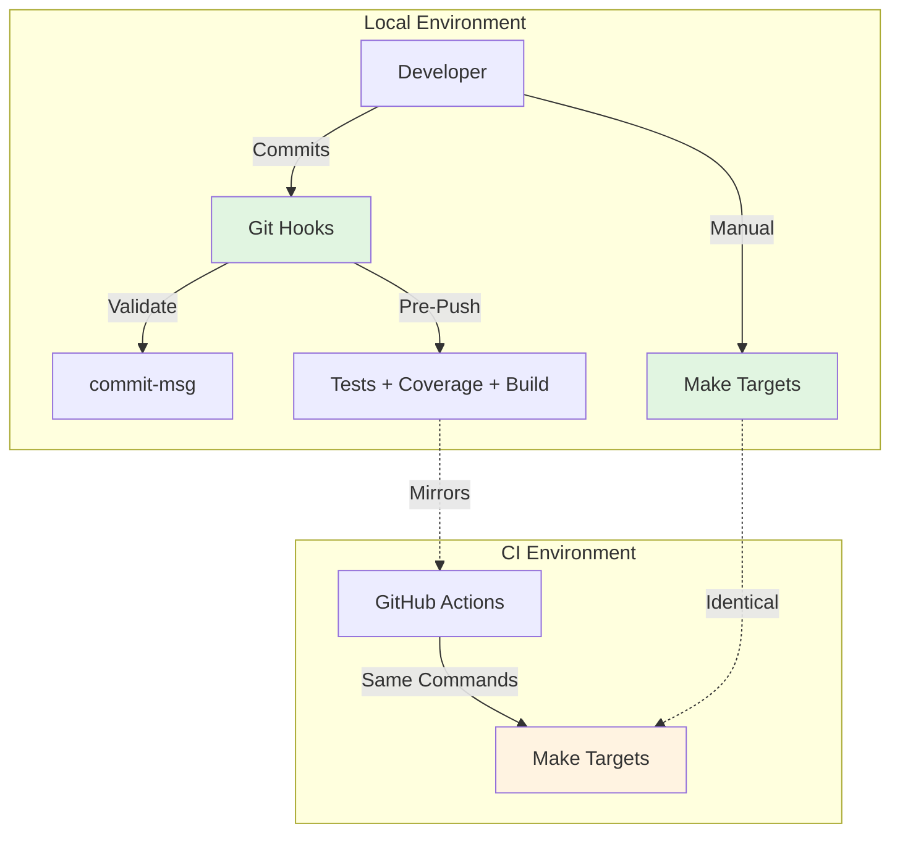
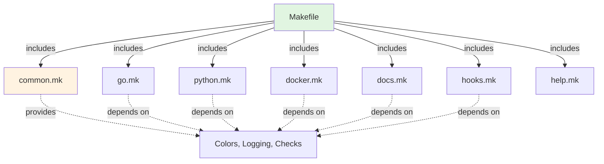
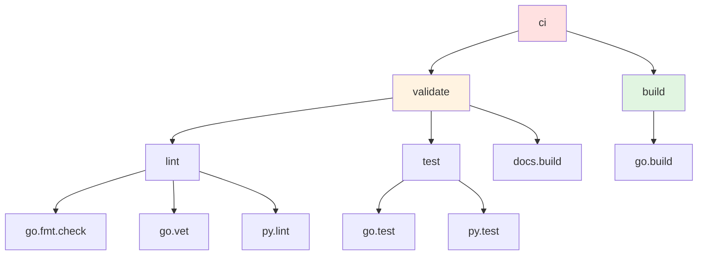
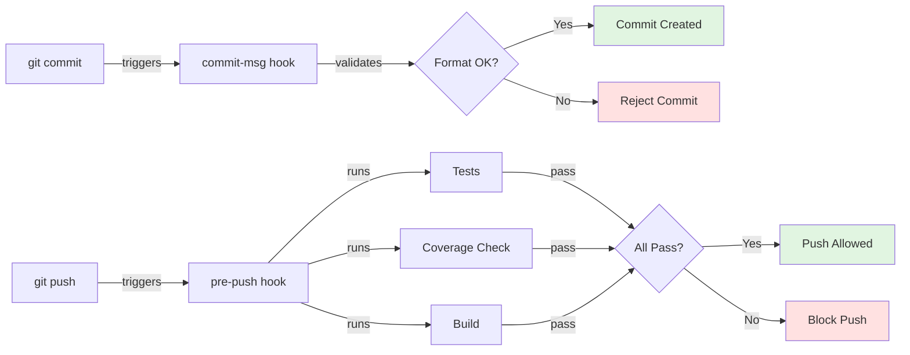
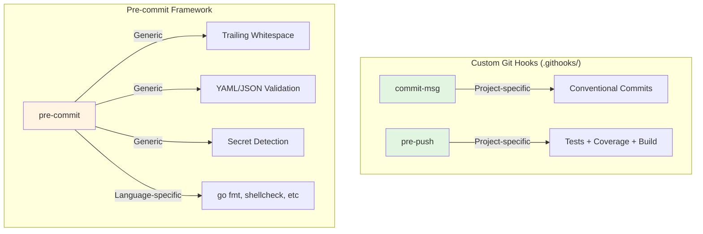
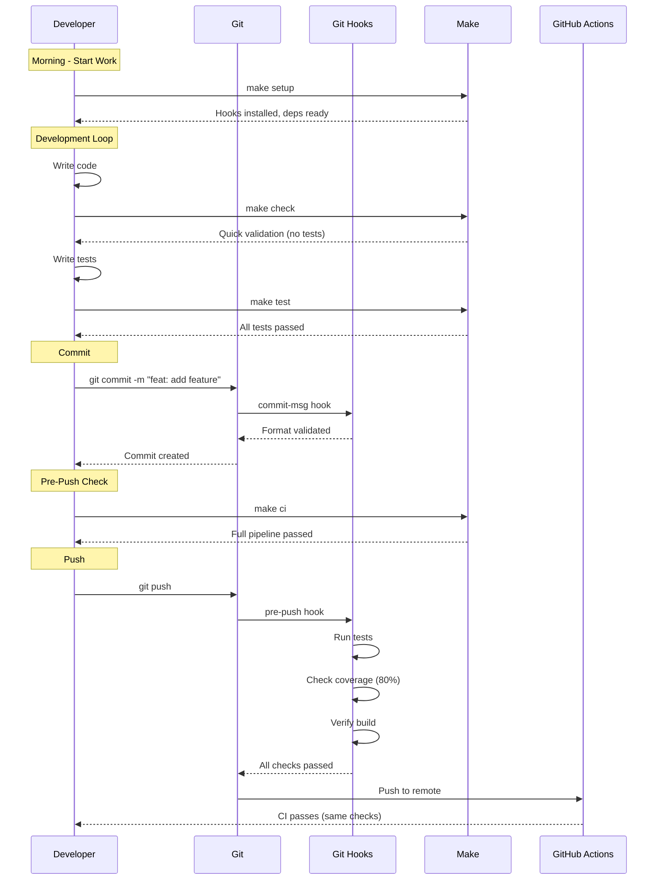
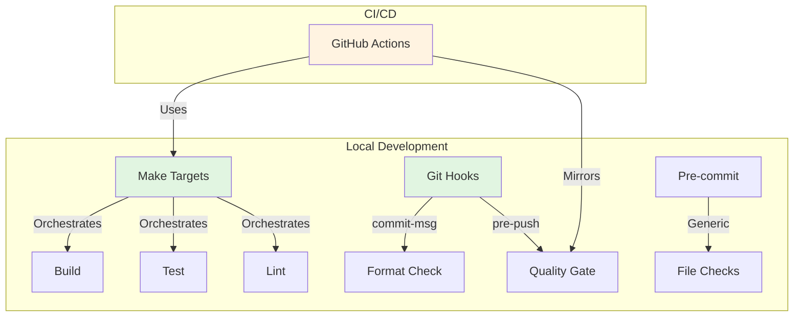

# Chapter 5: Build Automation - Make, Git Hooks, and Local Tooling

> Building a robust local development environment that mirrors CI/CD and catches errors before they reach the repository.

## Table of Contents

- [Introduction](#introduction)
- [Makefile System Architecture](#makefile-system-architecture)
- [Common.mk Module](#commonmk-module)
- [Language-Specific Modules](#language-specific-modules)
- [Composite Targets](#composite-targets)
- [Git Hooks Implementation](#git-hooks-implementation)
- [Pre-commit Framework](#pre-commit-framework)
- [Local Development Workflow](#local-development-workflow)
- [Make Best Practices](#make-best-practices)

---

## Introduction

### The Local-First Philosophy

The foundation of effective CI/CD is a powerful local development environment that catches issues before they reach the repository. This chapter covers the complete build automation stack that makes this possible.

**Key Principle**: If a check runs in CI, it should be runnable locally with identical results.



### Why Make?

**Make is the universal build language**:

- ✅ Available on all Unix systems (including macOS, Linux, WSL)
- ✅ 50+ years of stability and maturity
- ✅ Declarative dependency graphs
- ✅ Language-agnostic orchestration
- ✅ Shell-based (maximum portability)

**Alternative Considered**: Task runners like `just`, `task`, or language-specific tools were rejected because:
- They require installation (Make is always present)
- They lack Make's maturity and ecosystem
- They don't provide significant advantages for our use case

---

## Makefile System Architecture

### Directory Structure

```
ado/
├── Makefile                 # Main entry point (includes all modules)
├── make/
│   ├── common.mk           # Shared variables, colors, utilities
│   ├── go.mk               # Go build, test, lint targets
│   ├── python.mk           # Python lab targets
│   ├── docker.mk           # Container build targets
│   ├── docs.mk             # Documentation build targets
│   ├── hooks.mk            # Git hooks management
│   └── help.mk             # Help system
├── .githooks/
│   ├── commit-msg          # Conventional commit validation
│   └── pre-push            # Tests + coverage + build
└── .pre-commit-config.yaml # Pre-commit framework config
```

### Modular Design Pattern

The Makefile system uses a **modular include pattern**:



### Main Makefile

The root `Makefile` serves as the entry point and orchestrator:

```makefile
# ==============================================================================
# ado Makefile
# ==============================================================================
# Main entry point - includes all sub-makefiles from make/
#
# Usage:
#   make help        Show all available targets
#   make setup       First-time project setup
#   make build       Build the binary
#   make test        Run all tests
#   make ci          Run full CI pipeline locally
#
# See make/*.mk for individual target definitions.
# ==============================================================================

.DEFAULT_GOAL := help

# ------------------------------------------------------------------------------
# Include Sub-Makefiles
# Order matters: common.mk must be first as it defines shared variables
# ------------------------------------------------------------------------------
include make/common.mk
include make/go.mk
include make/python.mk
include make/docker.mk
include make/docs.mk
include make/hooks.mk
include make/help.mk

# ==============================================================================
# Composite Targets
# ==============================================================================
# High-level targets that combine multiple sub-targets

# ------------------------------------------------------------------------------
# Setup
# ------------------------------------------------------------------------------
.PHONY: setup
setup: hooks.install go.deps py.install ## First-time project setup
	$(call log_header,"Setup Complete")
	@echo ""
	@echo "Next steps:"
	@echo "  make build    Build the binary"
	@echo "  make test     Run all tests"
	@echo "  make help     Show all targets"
	@echo ""

# ------------------------------------------------------------------------------
# Build
# ------------------------------------------------------------------------------
.PHONY: build
build: go.build ## Build the project (alias for go.build)

# ------------------------------------------------------------------------------
# Test
# ------------------------------------------------------------------------------
.PHONY: test
test: go.test py.test ## Run all tests (Go + Python)

.PHONY: test.cover
test.cover: go.test.cover py.test.cover ## Run all tests with coverage

# ------------------------------------------------------------------------------
# Lint
# ------------------------------------------------------------------------------
.PHONY: lint
lint: go.fmt.check go.vet py.lint ## Run all linters

.PHONY: fmt
fmt: go.fmt py.fmt ## Format all code

# ------------------------------------------------------------------------------
# Validation (mirrors CI)
# ------------------------------------------------------------------------------
.PHONY: validate
validate: lint test docs.build ## Run all validations (lint + test + docs)
	$(call log_header,"Validation Complete")
	$(call log_success,"All checks passed!")

.PHONY: ci
ci: validate build ## Run full CI pipeline locally
	$(call log_header,"CI Pipeline Complete")
	$(call log_success,"Ready to push!")

# ------------------------------------------------------------------------------
# Quick Checks
# ------------------------------------------------------------------------------
.PHONY: check
check: go.fmt.check go.vet ## Quick syntax/lint check (no tests)
	$(call log_success,"Quick check passed")

.PHONY: pre-commit
pre-commit: check test ## Run before committing
	$(call log_success,"Pre-commit checks passed")

# ==============================================================================
# Info
# ==============================================================================
.PHONY: info
info: version ## Show project information
	@echo ""
	@echo "Directories:"
	@echo "  Root:     $(PROJECT_ROOT)"
	@echo "  Docs:     $(DOCS_DIR)"
	@echo "  Build:    $(BUILD_DIR)"
	@echo ""
	@echo "Binaries:"
	@ls -la $(GO_BINARY) 2>/dev/null || echo "  (not built yet - run 'make build')"
```

### Key Design Decisions

#### 1. Include Order Matters

```makefile
# common.mk MUST be first - it defines variables used by all other modules
include make/common.mk
include make/go.mk      # Can use common.mk variables
include make/python.mk  # Can use common.mk variables
```

#### 2. .PHONY Targets

All targets are marked as `.PHONY` because they don't create files:

```makefile
.PHONY: build test lint

build: go.build
test: go.test py.test
lint: go.fmt.check go.vet py.lint
```

**Why**: Without `.PHONY`, Make would check for files named `build`, `test`, etc.

#### 3. Target Naming Convention

```
<namespace>.<action>[.<modifier>]

Examples:
  go.build          # Namespace: go, Action: build
  go.test.cover     # Namespace: go, Action: test, Modifier: cover
  py.lint.fix       # Namespace: py, Action: lint, Modifier: fix
```

---

## Common.mk Module

### The Foundation Layer

`common.mk` provides the shared infrastructure for all other modules:

```makefile
# ==============================================================================
# Common Variables and Utilities
# ==============================================================================
# Shared configuration for all Makefiles

# ------------------------------------------------------------------------------
# Shell Configuration
# ------------------------------------------------------------------------------
SHELL := /bin/bash
.SHELLFLAGS := -eu -o pipefail -c
.DELETE_ON_ERROR:
MAKEFLAGS += --warn-undefined-variables
MAKEFLAGS += --no-builtin-rules

# ------------------------------------------------------------------------------
# Project Info
# ------------------------------------------------------------------------------
PROJECT_NAME := ado
PROJECT_ROOT := $(shell pwd)
VERSION := $(shell git describe --tags --always --dirty 2>/dev/null || echo "dev")
COMMIT := $(shell git rev-parse --short HEAD 2>/dev/null || echo "unknown")
BUILD_TIME := $(shell date -u '+%Y-%m-%dT%H:%M:%SZ')

# ------------------------------------------------------------------------------
# Directories
# ------------------------------------------------------------------------------
BIN_DIR := $(PROJECT_ROOT)
BUILD_DIR := $(PROJECT_ROOT)/dist
DOCS_DIR := $(PROJECT_ROOT)/docs
SITE_DIR := $(PROJECT_ROOT)/site

# ------------------------------------------------------------------------------
# Terminal Colors (if supported)
# ------------------------------------------------------------------------------
TERM_SUPPORTS_COLOR := $(shell tput colors 2>/dev/null || echo 0)
ifeq ($(shell test $(TERM_SUPPORTS_COLOR) -ge 8 && echo yes),yes)
    COLOR_RESET := $(shell tput sgr0)
    COLOR_BOLD := $(shell tput bold)
    COLOR_RED := $(shell tput setaf 1)
    COLOR_GREEN := $(shell tput setaf 2)
    COLOR_YELLOW := $(shell tput setaf 3)
    COLOR_BLUE := $(shell tput setaf 4)
    COLOR_CYAN := $(shell tput setaf 6)
else
    COLOR_RESET :=
    COLOR_BOLD :=
    COLOR_RED :=
    COLOR_GREEN :=
    COLOR_YELLOW :=
    COLOR_BLUE :=
    COLOR_CYAN :=
endif

# ------------------------------------------------------------------------------
# Output Helpers
# ------------------------------------------------------------------------------
define log_info
	@printf "$(COLOR_CYAN)▸$(COLOR_RESET) %s\n" $(1)
endef

define log_success
	@printf "$(COLOR_GREEN)✓$(COLOR_RESET) %s\n" $(1)
endef

define log_warn
	@printf "$(COLOR_YELLOW)⚠$(COLOR_RESET) %s\n" $(1)
endef

define log_error
	@printf "$(COLOR_RED)✗$(COLOR_RESET) %s\n" $(1)
endef

define log_header
	@printf "\n$(COLOR_BOLD)$(COLOR_BLUE)=== %s ===$(COLOR_RESET)\n" $(1)
endef

# ------------------------------------------------------------------------------
# Dependency Checks
# ------------------------------------------------------------------------------
define check_tool
	@command -v $(1) >/dev/null 2>&1 || { \
		printf "$(COLOR_RED)✗$(COLOR_RESET) Required tool '$(1)' not found. $(2)\n"; \
		exit 1; \
	}
endef

# Check Go is installed
.PHONY: _check-go
_check-go:
	$(call check_tool,go,Please install Go from https://go.dev/dl/)

# Check Python is installed
.PHONY: _check-python
_check-python:
	$(call check_tool,python3,Please install Python 3.12+)

# Check Docker is installed
.PHONY: _check-docker
_check-docker:
	$(call check_tool,docker,Please install Docker from https://docs.docker.com/get-docker/)

# Check Git is installed
.PHONY: _check-git
_check-git:
	$(call check_tool,git,Please install Git)

# ------------------------------------------------------------------------------
# Common Targets
# ------------------------------------------------------------------------------
.PHONY: version
version: ## Show project version info
	@echo "Project:    $(PROJECT_NAME)"
	@echo "Version:    $(VERSION)"
	@echo "Commit:     $(COMMIT)"
	@echo "Build Time: $(BUILD_TIME)"

.PHONY: clean
clean: go.clean py.clean docs.clean ## Clean all build artifacts
	$(call log_success,"All build artifacts cleaned")

.PHONY: deps
deps: _check-go _check-python ## Verify all dependencies are installed
	$(call log_info,"Checking Go dependencies...")
	@go mod verify
	$(call log_success,"All dependencies verified")
```

### Shell Configuration Deep Dive

```makefile
SHELL := /bin/bash
.SHELLFLAGS := -eu -o pipefail -c
```

**Breakdown**:

- `SHELL := /bin/bash` - Use bash for all commands (not sh)
- `-e` - Exit immediately on error
- `-u` - Error on undefined variables
- `-o pipefail` - Pipe failure propagates (not just last command)
- `-c` - Execute command string

**Impact**:

```makefile
# Without pipefail:
target:
	false | true   # Succeeds (true is last)

# With pipefail:
target:
	false | true   # Fails (false failed in pipe)
```

### Color Detection System

The color system gracefully degrades on terminals without color support:

```makefile
TERM_SUPPORTS_COLOR := $(shell tput colors 2>/dev/null || echo 0)
ifeq ($(shell test $(TERM_SUPPORTS_COLOR) -ge 8 && echo yes),yes)
    COLOR_GREEN := $(shell tput setaf 2)
else
    COLOR_GREEN :=
endif
```

**Output Examples**:

```bash
# With color:
✓ All tests passed

# Without color (CI logs):
✓ All tests passed
```

### Logging Functions

The logging functions provide consistent output across all targets:

```makefile
define log_info
	@printf "$(COLOR_CYAN)▸$(COLOR_RESET) %s\n" $(1)
endef

define log_success
	@printf "$(COLOR_GREEN)✓$(COLOR_RESET) %s\n" $(1)
endef
```

**Usage in Targets**:

```makefile
go.build:
	$(call log_info,"Building $(PROJECT_NAME)...")
	@go build -o $(GO_BINARY) ./cmd/ado
	$(call log_success,"Built: $(GO_BINARY)")
```

**Output**:

```
▸ Building ado...
✓ Built: /path/to/ado
```

### Dependency Check Pattern

The `check_tool` function validates required tools:

```makefile
define check_tool
	@command -v $(1) >/dev/null 2>&1 || { \
		printf "$(COLOR_RED)✗$(COLOR_RESET) Required tool '$(1)' not found. $(2)\n"; \
		exit 1; \
	}
endef

.PHONY: _check-go
_check-go:
	$(call check_tool,go,Please install Go from https://go.dev/dl/)
```

**Usage**:

```makefile
go.build: _check-go  ## Build requires Go
	@go build -o $(GO_BINARY) ./cmd/ado
```

---

## Language-Specific Modules

### Go.mk - Complete Go Toolchain

```makefile
# ==============================================================================
# Go Targets
# ==============================================================================
# Go build, test, and development targets

# ------------------------------------------------------------------------------
# Variables
# ------------------------------------------------------------------------------
GO ?= go
GO_ENV ?= env GOCACHE=$(PROJECT_ROOT)/.gocache
GO_BUILD_CMD ?= ./cmd/ado
GO_BINARY ?= $(PROJECT_ROOT)/ado

# Build flags
GO_LDFLAGS := -s -w \
	-X github.com/anowarislam/ado/internal/meta.Version=$(VERSION) \
	-X github.com/anowarislam/ado/internal/meta.Commit=$(COMMIT) \
	-X github.com/anowarislam/ado/internal/meta.BuildTime=$(BUILD_TIME)

# Packages to test/vet (exclude main package which has no testable code)
GO_TEST_PKGS ?= ./cmd/ado/... ./internal/...

# Test flags
GO_TEST_FLAGS ?= -race -timeout 30s
GO_COVER_FLAGS ?= -coverprofile=coverage.out -covermode=atomic

# ------------------------------------------------------------------------------
# Build Targets
# ------------------------------------------------------------------------------
.PHONY: go.build go.build.all go.install

go.build: _check-go ## Build the ado binary
	$(call log_info,"Building $(PROJECT_NAME)...")
	@$(GO_ENV) $(GO) build -ldflags "$(GO_LDFLAGS)" -o $(GO_BINARY) $(GO_BUILD_CMD)
	$(call log_success,"Built: $(GO_BINARY)")

go.build.all: _check-go ## Build for all platforms (via goreleaser)
	$(call log_info,"Building for all platforms...")
	@command -v goreleaser >/dev/null 2>&1 || { \
		echo "goreleaser not installed. Install from https://goreleaser.com"; \
		exit 1; \
	}
	@goreleaser build --snapshot --clean
	$(call log_success,"All platform builds complete in dist/")

go.install: _check-go ## Install binary to GOPATH/bin
	$(call log_info,"Installing $(PROJECT_NAME)...")
	@$(GO_ENV) $(GO) install -ldflags "$(GO_LDFLAGS)" $(GO_BUILD_CMD)
	$(call log_success,"Installed to $$(go env GOPATH)/bin/$(PROJECT_NAME)")

# ------------------------------------------------------------------------------
# Test Targets
# ------------------------------------------------------------------------------
.PHONY: go.test go.test.cover go.test.verbose go.test.race go.bench

go.test: _check-go ## Run Go tests
	$(call log_info,"Running Go tests...")
	@$(GO_ENV) $(GO) test $(GO_TEST_FLAGS) $(GO_TEST_PKGS)
	$(call log_success,"All Go tests passed")

go.test.cover: _check-go ## Run Go tests with coverage report
	$(call log_info,"Running Go tests with coverage...")
	@$(GO_ENV) $(GO) test $(GO_TEST_FLAGS) $(GO_COVER_FLAGS) $(GO_TEST_PKGS)
	@$(GO) tool cover -func=coverage.out | tail -1
	$(call log_success,"Coverage report: coverage.out")

go.test.cover.html: go.test.cover ## Generate HTML coverage report
	$(call log_info,"Generating HTML coverage report...")
	@$(GO) tool cover -html=coverage.out -o coverage.html
	$(call log_success,"Coverage report: coverage.html")
	@echo "Open coverage.html in a browser to view the report"

go.test.cover.check: go.test.cover ## Check coverage meets threshold (80%)
	$(call log_info,"Checking coverage threshold (80%)...")
	@COVERAGE=$$($(GO) tool cover -func=coverage.out | grep total | awk '{print $$3}' | tr -d '%'); \
	if [ "$${COVERAGE%.*}" -lt 80 ]; then \
		echo "$(COLOR_RED)Coverage $${COVERAGE}% is below 80% threshold$(COLOR_RESET)"; \
		exit 1; \
	fi
	$(call log_success,"Coverage meets threshold")

go.test.verbose: _check-go ## Run Go tests with verbose output
	$(call log_info,"Running Go tests (verbose)...")
	@$(GO_ENV) $(GO) test -v $(GO_TEST_FLAGS) $(GO_TEST_PKGS)

go.test.race: _check-go ## Run Go tests with race detector
	$(call log_info,"Running Go tests with race detector...")
	@$(GO_ENV) $(GO) test -race $(GO_TEST_PKGS)
	$(call log_success,"No race conditions detected")

go.bench: _check-go ## Run Go benchmarks
	$(call log_info,"Running Go benchmarks...")
	@$(GO_ENV) $(GO) test -bench=. -benchmem $(GO_TEST_PKGS)

# ------------------------------------------------------------------------------
# Lint Targets
# ------------------------------------------------------------------------------
.PHONY: go.fmt go.fmt.check go.vet go.lint go.tidy

go.fmt: ## Format Go sources
	$(call log_info,"Formatting Go sources...")
	@$(GO) fmt ./...
	$(call log_success,"Go sources formatted")

go.fmt.check: ## Check Go code formatting (fails if not formatted)
	$(call log_info,"Checking Go formatting...")
	@test -z "$$(gofmt -l .)" || { \
		echo "$(COLOR_RED)Go files need formatting:$(COLOR_RESET)"; \
		gofmt -l .; \
		exit 1; \
	}
	$(call log_success,"Go formatting check passed")

go.vet: _check-go ## Run go vet on all packages
	$(call log_info,"Running go vet...")
	@$(GO_ENV) $(GO) vet $(GO_TEST_PKGS)
	$(call log_success,"go vet passed")

go.lint: _check-go ## Run golangci-lint (if installed)
	$(call log_info,"Running golangci-lint...")
	@command -v golangci-lint >/dev/null 2>&1 || { \
		echo "golangci-lint not installed. Falling back to go vet."; \
		$(MAKE) --no-print-directory go.vet; \
		exit 0; \
	}
	@golangci-lint run ./...
	$(call log_success,"golangci-lint passed")

go.tidy: _check-go ## Sync Go module dependencies
	$(call log_info,"Tidying Go modules...")
	@$(GO) mod tidy
	$(call log_success,"Go modules tidied")

# ------------------------------------------------------------------------------
# Dependency Targets
# ------------------------------------------------------------------------------
.PHONY: go.deps go.deps.update go.deps.graph

go.deps: _check-go ## Download Go dependencies
	$(call log_info,"Downloading Go dependencies...")
	@$(GO) mod download
	@$(GO) mod verify
	$(call log_success,"Go dependencies downloaded and verified")

go.deps.update: _check-go ## Update Go dependencies
	$(call log_info,"Updating Go dependencies...")
	@$(GO) get -u ./...
	@$(GO) mod tidy
	$(call log_success,"Go dependencies updated")

go.deps.graph: _check-go ## Show Go dependency graph
	@$(GO) mod graph

# ------------------------------------------------------------------------------
# Cleanup Targets
# ------------------------------------------------------------------------------
.PHONY: go.clean

go.clean: ## Remove Go build artifacts
	$(call log_info,"Cleaning Go build artifacts...")
	@rm -rf .gocache
	@rm -f $(GO_BINARY)
	@rm -f coverage.out
	$(call log_success,"Go build artifacts cleaned")
```

### Python.mk - Lab Environment Management

```makefile
# ==============================================================================
# Python Lab Targets
# ==============================================================================
# Python lab development, testing, and linting targets

# ------------------------------------------------------------------------------
# Variables
# ------------------------------------------------------------------------------
PYTHON ?= python3
VENV := $(PROJECT_ROOT)/.venv
VENV_BIN := $(VENV)/bin
PIP := $(VENV_BIN)/pip
PYTEST := $(VENV_BIN)/pytest
RUFF := $(VENV_BIN)/ruff
LAB_DIR := $(PROJECT_ROOT)/lab/py

# Python version check
PYTHON_MIN_VERSION := 3.12

# ------------------------------------------------------------------------------
# Environment Targets
# ------------------------------------------------------------------------------
.PHONY: py.env py.env.check py.install py.install.dev

py.env: ## Create Python virtual environment
	$(call log_info,"Creating Python virtual environment...")
	@if [ ! -d "$(VENV)" ]; then \
		$(PYTHON) -m venv "$(VENV)"; \
		$(PIP) install --upgrade pip; \
	fi
	$(call log_success,"Virtual environment ready: $(VENV)")

py.env.check: ## Check Python version
	$(call log_info,"Checking Python version...")
	@$(PYTHON) -c "import sys; v=sys.version_info; exit(0 if v >= (3,12) else 1)" || { \
		echo "$(COLOR_RED)Python $(PYTHON_MIN_VERSION)+ required$(COLOR_RESET)"; \
		$(PYTHON) --version; \
		exit 1; \
	}
	$(call log_success,"Python version OK: $$($(PYTHON) --version)")

py.install: py.env ## Install lab package and requirements
	$(call log_info,"Installing lab package...")
	@"$(PIP)" install -e "$(LAB_DIR)[dev]"
	$(call log_success,"Lab package installed")

py.install.dev: py.env ## Install development dependencies only
	$(call log_info,"Installing dev dependencies...")
	@"$(PIP)" install ruff pytest pytest-cov
	$(call log_success,"Dev dependencies installed")

# ------------------------------------------------------------------------------
# Test Targets
# ------------------------------------------------------------------------------
.PHONY: py.test py.test.verbose py.test.cover

py.test: py.env ## Run Python lab tests
	$(call log_info,"Running Python tests...")
	@if [ ! -x "$(PYTEST)" ]; then \
		echo "pytest not found. Run 'make py.install' first."; \
		exit 1; \
	fi
	@if [ -d "$(LAB_DIR)" ]; then \
		"$(PYTEST)" "$(LAB_DIR)" -q; \
	else \
		echo "No lab/py directory present."; \
	fi
	$(call log_success,"Python tests passed")

py.test.verbose: py.env ## Run Python tests with verbose output
	$(call log_info,"Running Python tests (verbose)...")
	@"$(PYTEST)" "$(LAB_DIR)" -v

py.test.cover: py.env ## Run Python tests with coverage
	$(call log_info,"Running Python tests with coverage...")
	@"$(PYTEST)" "$(LAB_DIR)" --cov="$(LAB_DIR)" --cov-report=term-missing

# ------------------------------------------------------------------------------
# Lint Targets
# ------------------------------------------------------------------------------
.PHONY: py.lint py.lint.fix py.fmt

py.lint: py.env ## Lint Python code with ruff
	$(call log_info,"Linting Python code...")
	@if [ ! -x "$(RUFF)" ]; then \
		echo "ruff not found. Run 'make py.install' first."; \
		exit 1; \
	fi
	@"$(RUFF)" check "$(LAB_DIR)"
	$(call log_success,"Python lint passed")

py.lint.fix: py.env ## Lint and auto-fix Python code
	$(call log_info,"Linting and fixing Python code...")
	@"$(RUFF)" check --fix "$(LAB_DIR)"
	$(call log_success,"Python lint fixes applied")

py.fmt: py.env ## Format Python code with ruff
	$(call log_info,"Formatting Python code...")
	@"$(RUFF)" format "$(LAB_DIR)"
	$(call log_success,"Python code formatted")

# ------------------------------------------------------------------------------
# Cleanup Targets
# ------------------------------------------------------------------------------
.PHONY: py.clean py.clean.cache

py.clean: ## Remove Python virtual environment
	$(call log_info,"Cleaning Python environment...")
	@rm -rf "$(VENV)"
	@rm -rf "$(LAB_DIR)/__pycache__"
	@rm -rf "$(LAB_DIR)/.pytest_cache"
	@rm -rf "$(LAB_DIR)/*.egg-info"
	$(call log_success,"Python environment cleaned")

py.clean.cache: ## Remove Python cache files only
	$(call log_info,"Cleaning Python cache...")
	@find "$(LAB_DIR)" -type d -name "__pycache__" -exec rm -rf {} + 2>/dev/null || true
	@find "$(LAB_DIR)" -type f -name "*.pyc" -delete 2>/dev/null || true
	$(call log_success,"Python cache cleaned")
```

### Docker.mk - Container Management

```makefile
# ==============================================================================
# Docker Targets
# ==============================================================================
# Container build and management targets

# ------------------------------------------------------------------------------
# Variables
# ------------------------------------------------------------------------------
DOCKER ?= docker
DOCKER_IMAGE := ghcr.io/anowarislam/ado
DOCKER_TAG ?= $(VERSION)
DOCKERFILE := Dockerfile
DOCKERFILE_GORELEASER := goreleaser.Dockerfile

# Build arguments
DOCKER_BUILD_ARGS := \
	--build-arg VERSION=$(VERSION) \
	--build-arg COMMIT=$(COMMIT) \
	--build-arg BUILD_TIME=$(BUILD_TIME)

# ------------------------------------------------------------------------------
# Targets
# ------------------------------------------------------------------------------
.PHONY: docker.build docker.build.multi docker.run docker.test

docker.build: _check-docker ## Build Docker image for current platform
	$(call log_info,"Building Docker image...")
	@$(DOCKER) build \
		$(DOCKER_BUILD_ARGS) \
		-t $(DOCKER_IMAGE):$(DOCKER_TAG) \
		-t $(DOCKER_IMAGE):latest \
		-f $(DOCKERFILE) \
		.
	$(call log_success,"Image built: $(DOCKER_IMAGE):$(DOCKER_TAG)")

docker.build.multi: _check-docker ## Build multi-arch Docker image
	$(call log_info,"Building multi-arch Docker image...")
	@$(DOCKER) buildx build \
		$(DOCKER_BUILD_ARGS) \
		--platform linux/amd64,linux/arm64 \
		-t $(DOCKER_IMAGE):$(DOCKER_TAG) \
		-f $(DOCKERFILE) \
		.
	$(call log_success,"Multi-arch image built")

docker.run: docker.build ## Run Docker container
	$(call log_info,"Running container...")
	@$(DOCKER) run --rm $(DOCKER_IMAGE):$(DOCKER_TAG) meta info

docker.test: _check-docker ## Test GoReleaser Dockerfile build
	$(call log_info,"Testing GoReleaser Dockerfile...")
	@mkdir -p dist/docker-test
	@CGO_ENABLED=0 GOOS=linux GOARCH=amd64 go build -o dist/docker-test/ado ./cmd/ado
	@cp LICENSE dist/docker-test/
	@cp README.md dist/docker-test/
	@cp $(DOCKERFILE_GORELEASER) dist/docker-test/Dockerfile
	@cd dist/docker-test && $(DOCKER) build -t $(DOCKER_IMAGE):test .
	@$(DOCKER) run --rm $(DOCKER_IMAGE):test meta info
	@$(DOCKER) rmi $(DOCKER_IMAGE):test
	@rm -rf dist/docker-test
	$(call log_success,"GoReleaser Dockerfile test passed")
```

---

## Composite Targets

### Target Dependency Graph



### Composite Target Patterns

#### Setup Target

First-time project initialization:

```makefile
.PHONY: setup
setup: hooks.install go.deps py.install ## First-time project setup
	$(call log_header,"Setup Complete")
	@echo ""
	@echo "Next steps:"
	@echo "  make build    Build the binary"
	@echo "  make test     Run all tests"
	@echo "  make help     Show all targets"
	@echo ""
```

**Usage**:

```bash
$ git clone https://github.com/anowarislam/ado.git
$ cd ado
$ make setup
```

**Output**:

```
▸ Installing git hooks...
✓ Git hooks installed from .githooks/
  • commit-msg: Validates conventional commit format
  • pre-push:   Runs tests, coverage check, and build
▸ Downloading Go dependencies...
✓ Go dependencies downloaded and verified
▸ Creating Python virtual environment...
✓ Virtual environment ready: /path/to/.venv
▸ Installing lab package...
✓ Lab package installed

=== Setup Complete ===

Next steps:
  make build    Build the binary
  make test     Run all tests
  make help     Show all targets
```

#### Validate Target (Mirrors CI)

The validate target runs the exact same checks as CI:

```makefile
.PHONY: validate
validate: lint test docs.build ## Run all validations (lint + test + docs)
	$(call log_header,"Validation Complete")
	$(call log_success,"All checks passed!")
```

**CI Equivalence**:

```yaml
# .github/workflows/ci.yml
- name: Lint
  run: make lint

- name: Test
  run: make test

- name: Build Docs
  run: make docs.build
```

#### CI Target (Full Local Pipeline)

Run the complete CI pipeline locally before pushing:

```makefile
.PHONY: ci
ci: validate build ## Run full CI pipeline locally
	$(call log_header,"CI Pipeline Complete")
	$(call log_success,"Ready to push!")
```

**Usage**:

```bash
$ make ci

=== Validation ===
▸ Checking Go formatting...
✓ Go formatting check passed
▸ Running go vet...
✓ go vet passed
▸ Linting Python code...
✓ Python lint passed
▸ Running Go tests...
✓ All Go tests passed
▸ Running Python tests...
✓ Python tests passed
▸ Building documentation...
✓ Documentation built in site/

=== Validation Complete ===
✓ All checks passed!

▸ Building ado...
✓ Built: /path/to/ado

=== CI Pipeline Complete ===
✓ Ready to push!
```

#### Quick Check Target

Fast pre-commit check (no tests):

```makefile
.PHONY: check
check: go.fmt.check go.vet ## Quick syntax/lint check (no tests)
	$(call log_success,"Quick check passed")
```

**Use Case**: Quick validation during active development before running full test suite.

---

## Git Hooks Implementation

### Hook Architecture



### Commit-msg Hook

Location: `.githooks/commit-msg`

```bash
#!/usr/bin/env bash
#
# Git commit-msg hook to enforce Conventional Commits format.
# Install: make hooks.install (or: git config core.hooksPath .githooks)
#
# Format: <type>[(scope)][!]: <description>
#
# Types:
#   feat     - New feature (bumps minor version)
#   fix      - Bug fix (bumps patch version)
#   docs     - Documentation only
#   style    - Code style (formatting, whitespace)
#   refactor - Code refactoring (no feature/fix)
#   perf     - Performance improvement
#   test     - Adding/updating tests
#   build    - Build system or dependencies
#   ci       - CI configuration
#   chore    - Other changes (no version bump)
#
# Breaking changes:
#   Add ! after type/scope: feat!: or feat(api)!:
#   This bumps major version (or minor if < v1.0.0)
#
# Examples:
#   feat: add export command
#   fix(config): resolve path resolution on Windows
#   feat!: change CLI flag syntax
#   docs: update README with examples

set -euo pipefail

COMMIT_MSG_FILE="$1"
COMMIT_MSG=$(head -1 "$COMMIT_MSG_FILE")

# Skip merge commits and fixup/squash commits
if [[ "$COMMIT_MSG" =~ ^Merge|^fixup!|^squash!|^amend! ]]; then
    exit 0
fi

# Conventional commit pattern:
# type(optional-scope)optional-!: description
PATTERN="^(feat|fix|docs|style|refactor|perf|test|build|ci|chore)(\([a-zA-Z0-9_-]+\))?\!?: .{1,}"

if ! [[ "$COMMIT_MSG" =~ $PATTERN ]]; then
    echo ""
    echo "ERROR: Invalid commit message format"
    echo ""
    echo "Your message:"
    echo "  $COMMIT_MSG"
    echo ""
    echo "Expected format:"
    echo "  <type>[(scope)][!]: <description>"
    echo ""
    echo "Valid types: feat, fix, docs, style, refactor, perf, test, build, ci, chore"
    echo ""
    echo "Examples:"
    echo "  feat: add new export command"
    echo "  fix(config): resolve Windows path issue"
    echo "  feat!: breaking change to CLI flags"
    echo ""
    exit 1
fi

# Check minimum description length (at least 10 chars after the colon)
DESCRIPTION="${COMMIT_MSG#*: }"
if [[ ${#DESCRIPTION} -lt 10 ]]; then
    echo ""
    echo "ERROR: Commit description too short (minimum 10 characters)"
    echo ""
    echo "Your description: '$DESCRIPTION'"
    echo ""
    exit 1
fi

exit 0
```

**Key Features**:

1. **Regex Validation**: Enforces conventional commit format
2. **Skip Special Commits**: Merges, fixups, and squashes bypass validation
3. **Minimum Length**: Descriptions must be at least 10 characters
4. **Clear Error Messages**: Shows expected format and examples

**Example Failure**:

```bash
$ git commit -m "add feature"

ERROR: Invalid commit message format

Your message:
  add feature

Expected format:
  <type>[(scope)][!]: <description>

Valid types: feat, fix, docs, style, refactor, perf, test, build, ci, chore

Examples:
  feat: add new export command
  fix(config): resolve Windows path issue
  feat!: breaking change to CLI flags
```

### Pre-push Hook

Location: `.githooks/pre-push`

```bash
#!/usr/bin/env bash
#
# Git pre-push hook to validate code before pushing.
# Install: make hooks.install (or: git config core.hooksPath .githooks)
#
# This hook runs slower checks that shouldn't block every commit
# but must pass before pushing to remote:
#   1. Go tests with race detector
#   2. Coverage threshold check (80% minimum)
#   3. Build verification
#   4. Documentation validation (if mkdocs available)
#   5. Python lab tests (if Python files changed)
#
# Skip with: git push --no-verify (use sparingly!)

set -euo pipefail

# Colors for output
RED='\033[0;31m'
GREEN='\033[0;32m'
YELLOW='\033[1;33m'
NC='\033[0m' # No Color

echo -e "${YELLOW}Running pre-push checks...${NC}"
echo ""

# Change to repository root
cd "$(git rev-parse --show-toplevel)"

# Check if Go is available
if ! command -v go &> /dev/null; then
    echo -e "${RED}ERROR: Go is not installed${NC}"
    exit 1
fi

# 1. Run tests with race detector
echo -e "▸ Running tests with race detector..."
if ! go test -race -timeout 60s ./cmd/ado/... ./internal/... 2>&1; then
    echo ""
    echo -e "${RED}ERROR: Tests failed${NC}"
    echo "Fix the failing tests before pushing."
    exit 1
fi
echo -e "${GREEN}✓ All tests passed${NC}"
echo ""

# 2. Check coverage threshold (80%)
echo -e "▸ Checking coverage threshold (80%)..."
COVERAGE_FILE=$(mktemp)
go test -coverprofile="$COVERAGE_FILE" -covermode=atomic ./cmd/ado/... ./internal/... > /dev/null 2>&1

COVERAGE=$(go tool cover -func="$COVERAGE_FILE" | grep total | awk '{print $3}' | tr -d '%')
rm -f "$COVERAGE_FILE"

if [ -z "$COVERAGE" ]; then
    echo -e "${RED}ERROR: Could not determine coverage${NC}"
    exit 1
fi

# Compare coverage (handle floating point)
COVERAGE_INT=${COVERAGE%.*}
if [ "$COVERAGE_INT" -lt 80 ]; then
    echo -e "${RED}ERROR: Coverage ${COVERAGE}% is below 80% threshold${NC}"
    echo "Add tests to improve coverage before pushing."
    exit 1
fi
echo -e "${GREEN}✓ Coverage: ${COVERAGE}% (threshold: 80%)${NC}"
echo ""

# 3. Verify build
echo -e "▸ Verifying build..."
if ! go build -o /dev/null ./cmd/ado 2>&1; then
    echo ""
    echo -e "${RED}ERROR: Build failed${NC}"
    echo "Fix build errors before pushing."
    exit 1
fi
echo -e "${GREEN}✓ Build successful${NC}"
echo ""

# 4. Validate documentation (if mkdocs available)
if command -v mkdocs &> /dev/null && [ -f "mkdocs.yml" ]; then
    echo -e "▸ Validating documentation..."
    if ! mkdocs build --strict > /tmp/mkdocs-build.log 2>&1; then
        echo ""
        echo -e "${RED}ERROR: Documentation build failed${NC}"
        echo "Run 'mkdocs build --strict' to see detailed errors:"
        echo ""
        tail -20 /tmp/mkdocs-build.log
        echo ""
        echo "Common issues:"
        echo "  - Broken internal links"
        echo "  - Missing anchor targets"
        echo "  - Invalid markdown syntax"
        rm -f /tmp/mkdocs-build.log
        exit 1
    fi
    rm -f /tmp/mkdocs-build.log
    # Clean up built site
    rm -rf site/
    echo -e "${GREEN}✓ Documentation validated${NC}"
    echo ""
fi

# 5. Python lab tests (if Python files changed)
if git diff --name-only @{push}..HEAD 2>/dev/null | grep -q "^lab/py/"; then
    if command -v python3 &> /dev/null && [ -f "lab/py/pyproject.toml" ]; then
        echo -e "▸ Running Python lab tests..."
        if ! make py.test > /dev/null 2>&1; then
            echo ""
            echo -e "${RED}ERROR: Python lab tests failed${NC}"
            echo "Run 'make py.test' to see detailed errors."
            exit 1
        fi
        echo -e "${GREEN}✓ Python lab tests passed${NC}"
        echo ""
    fi
fi

echo -e "${GREEN}All pre-push checks passed!${NC}"
exit 0
```

**Key Features**:

1. **Five-Phase Validation**: Tests → Coverage → Build → Docs → Python
2. **Race Detector**: Catches concurrency bugs
3. **Coverage Enforcement**: 80% minimum threshold
4. **Documentation Validation**: Catches broken links early (if mkdocs installed)
5. **Python Lab Testing**: Validates Python changes (if applicable)
6. **Graceful Degradation**: Skips checks if tools unavailable
7. **Clear Progress**: Shows which check is running
8. **Helpful Errors**: Explains what failed and how to fix

**Example Output (Success)**:

```bash
$ git push

Running pre-push checks...

▸ Running tests with race detector...
✓ All tests passed

▸ Checking coverage threshold (80%)...
✓ Coverage: 84.2% (threshold: 80%)

▸ Verifying build...
✓ Build successful

All pre-push checks passed!
```

**Example Output (Failure)**:

```bash
$ git push

Running pre-push checks...

▸ Running tests with race detector...

ERROR: Tests failed
Fix the failing tests before pushing.
error: failed to push some refs to 'origin'
```

### Hook Installation System

The `hooks.mk` module manages hook installation:

```makefile
# ==============================================================================
# Git Hooks and Pre-commit Targets
# ==============================================================================

# ------------------------------------------------------------------------------
# Variables
# ------------------------------------------------------------------------------
HOOKS_DIR := .githooks
PRECOMMIT ?= pre-commit

# ------------------------------------------------------------------------------
# Git Hooks Targets
# ------------------------------------------------------------------------------
.PHONY: hooks.install hooks.uninstall hooks.status

hooks.install: _check-git ## Install git hooks (commit-msg + pre-push)
	$(call log_info,"Installing git hooks...")
	@git config core.hooksPath $(HOOKS_DIR)
	$(call log_success,"Git hooks installed from $(HOOKS_DIR)/")
	@echo "  • commit-msg: Validates conventional commit format"
	@echo "  • pre-push:   Runs tests, coverage check, and build"

hooks.uninstall: ## Uninstall git hooks
	$(call log_info,"Uninstalling git hooks...")
	@git config --unset core.hooksPath || true
	$(call log_success,"Git hooks uninstalled")

hooks.status: ## Show git hooks status
	@echo "Hooks path: $$(git config core.hooksPath || echo 'default (.git/hooks)')"
	@echo ""
	@echo "Available hooks in $(HOOKS_DIR)/:"
	@ls -la $(HOOKS_DIR)/ 2>/dev/null || echo "  (none)"
```

**Usage**:

```bash
# Install hooks (done automatically by 'make setup')
$ make hooks.install
▸ Installing git hooks...
✓ Git hooks installed from .githooks/
  • commit-msg: Validates conventional commit format
  • pre-push:   Runs tests, coverage check, and build

# Check status
$ make hooks.status
Hooks path: .githooks

Available hooks in .githooks/:
total 16
drwxr-xr-x  4 user  staff  128 Nov 26 01:51 .
drwxr-xr-x 40 user  staff 1280 Nov 26 01:51 ..
-rwx--x--x  1 user  staff 2184 Nov 24 23:25 commit-msg
-rwxr-xr-x  1 user  staff 2217 Nov 26 01:51 pre-push

# Uninstall if needed
$ make hooks.uninstall
▸ Uninstalling git hooks...
✓ Git hooks uninstalled
```

---

## Pre-commit Framework

### Configuration File

Location: `.pre-commit-config.yaml`

```yaml
# Pre-commit hooks configuration
# Install: pip install pre-commit && pre-commit install
# Run manually: pre-commit run --all-files
# Documentation: https://pre-commit.com

repos:
  # General hooks
  - repo: https://github.com/pre-commit/pre-commit-hooks
    rev: v4.6.0
    hooks:
      - id: trailing-whitespace
        args: [--markdown-linebreak-ext=md]
      - id: end-of-file-fixer
      - id: check-yaml
      - id: check-json
      - id: check-added-large-files
        args: ['--maxkb=500']
      - id: check-merge-conflict
      - id: detect-private-key
      - id: mixed-line-ending
        args: ['--fix=lf']

  # Conventional commits
  - repo: https://github.com/compilerla/conventional-pre-commit
    rev: v3.4.0
    hooks:
      - id: conventional-pre-commit
        stages: [commit-msg]
        args: [feat, fix, docs, style, refactor, perf, test, build, ci, chore, revert]

  # Go hooks
  - repo: https://github.com/dnephin/pre-commit-golang
    rev: v0.5.1
    hooks:
      - id: go-fmt
      - id: go-vet
      - id: go-mod-tidy

  # Markdown
  - repo: https://github.com/igorshubovych/markdownlint-cli
    rev: v0.42.0
    hooks:
      - id: markdownlint
        args: ['--fix', '--disable', 'MD013', 'MD033', 'MD041', '--']

  # Shell scripts
  - repo: https://github.com/shellcheck-py/shellcheck-py
    rev: v0.10.0.1
    hooks:
      - id: shellcheck

  # YAML
  - repo: https://github.com/adrienverge/yamllint
    rev: v1.35.1
    hooks:
      - id: yamllint
        args: ['-d', '{extends: relaxed, rules: {line-length: {max: 120}}}']

# CI configuration
ci:
  autofix_commit_msg: 'style: auto-fix by pre-commit hooks'
  autofix_prs: true
  autoupdate_commit_msg: 'build(deps): update pre-commit hooks'
  autoupdate_schedule: monthly
  skip: [go-vet, go-mod-tidy]  # These need Go installed
```

### Pre-commit vs Custom Git Hooks

**We use BOTH systems** for different purposes:



**Division of Responsibility**:

| Custom Git Hooks | Pre-commit Framework |
|------------------|----------------------|
| Project-specific logic | Generic file checks |
| Business rules | Code formatting |
| Complex validation | Simple validation |
| Requires project context | Stateless checks |

### Pre-commit Make Targets

```makefile
# ------------------------------------------------------------------------------
# Pre-commit Targets
# ------------------------------------------------------------------------------
.PHONY: precommit.install precommit.uninstall precommit.run precommit.update

precommit.install: ## Install pre-commit framework hooks
	$(call log_info,"Installing pre-commit hooks...")
	@command -v $(PRECOMMIT) >/dev/null 2>&1 || { \
		echo "Installing pre-commit..."; \
		pip install pre-commit; \
	}
	@$(PRECOMMIT) install
	@$(PRECOMMIT) install --hook-type commit-msg
	$(call log_success,"Pre-commit hooks installed")

precommit.uninstall: ## Uninstall pre-commit hooks
	$(call log_info,"Uninstalling pre-commit hooks...")
	@$(PRECOMMIT) uninstall || true
	$(call log_success,"Pre-commit hooks uninstalled")

precommit.run: ## Run pre-commit on all files
	$(call log_info,"Running pre-commit on all files...")
	@$(PRECOMMIT) run --all-files

precommit.update: ## Update pre-commit hooks to latest versions
	$(call log_info,"Updating pre-commit hooks...")
	@$(PRECOMMIT) autoupdate
	$(call log_success,"Pre-commit hooks updated")
```

**Usage**:

```bash
# Install pre-commit framework (optional - git hooks are primary)
$ make precommit.install
▸ Installing pre-commit hooks...
✓ Pre-commit hooks installed

# Run all pre-commit checks manually
$ make precommit.run
▸ Running pre-commit on all files...
Trim Trailing Whitespace.....................................Passed
Fix End of Files.............................................Passed
Check Yaml...................................................Passed
Check JSON...................................................Passed
Check for added large files..................................Passed
Check for merge conflicts....................................Passed
Detect Private Key...........................................Passed
Mixed line ending............................................Passed
go-fmt.......................................................Passed
go-vet.......................................................Passed
shellcheck...................................................Passed

# Update hooks to latest versions
$ make precommit.update
▸ Updating pre-commit hooks...
Updating https://github.com/pre-commit/pre-commit-hooks ... already up to date.
Updating https://github.com/dnephin/pre-commit-golang ... updating v0.5.1 -> v0.5.2.
✓ Pre-commit hooks updated
```

---

## Local Development Workflow

### The Developer Day



### Typical Command Flow

#### 1. First-Time Setup

```bash
# Clone repository
git clone https://github.com/anowarislam/ado.git
cd ado

# One-time setup
make setup
```

**What happens**:

1. Installs git hooks (`.githooks/commit-msg`, `.githooks/pre-push`)
2. Downloads Go dependencies
3. Creates Python virtual environment
4. Installs Python lab package

#### 2. Active Development

```bash
# Quick syntax check (fast - no tests)
make check

# Run tests
make test

# Format code
make fmt
```

#### 3. Before Commit

```bash
# Full validation (lint + test + docs)
make validate
```

#### 4. Commit

```bash
# Commit (commit-msg hook validates format)
git commit -m "feat(config): add validation command"
```

**Hook validates**:

- Conventional commit format
- Minimum description length
- Valid commit type

#### 5. Before Push

```bash
# Run full CI pipeline locally
make ci
```

**Runs**:

1. Lint (go.fmt.check, go.vet, py.lint)
2. Test (go.test, py.test)
3. Docs build (docs.build)
4. Binary build (go.build)

#### 6. Push

```bash
# Push (pre-push hook validates code)
git push
```

**Hook runs**:

1. Tests with race detector
2. Coverage check (80% minimum)
3. Build verification

### Emergency Bypass

**Commit message hook bypass** (use sparingly):

```bash
# Skip commit-msg validation (not recommended)
git commit --no-verify -m "wip"
```

**Pre-push hook bypass** (use sparingly):

```bash
# Skip pre-push checks (not recommended)
git push --no-verify
```

**When to use**:

- Pushing WIP to personal branch
- Emergency hotfix (follow up with proper validation)
- Known false positive (fix hook, then use)

**When NOT to use**:

- Pushing to main/master
- Creating pull requests
- Avoiding fixing real issues

### Coverage Workflow

```bash
# Run tests with coverage
make go.test.cover

# Output:
# ▸ Running Go tests with coverage...
# ok      github.com/anowarislam/ado/cmd/ado/config       0.234s  coverage: 85.7% of statements
# ok      github.com/anowarislam/ado/cmd/ado/meta         0.189s  coverage: 100.0% of statements
# ok      github.com/anowarislam/ado/internal/config      0.345s  coverage: 82.4% of statements
# total:                                                  (statements)    84.2%
# ✓ Coverage report: coverage.out

# Generate HTML report
make go.test.cover.html

# Open coverage.html in browser to see line-by-line coverage

# Check threshold (80%)
make go.test.cover.check
# ▸ Checking coverage threshold (80%)...
# ✓ Coverage meets threshold
```

---

## Make Best Practices

### Pattern: Dependency Declaration

**Good**:

```makefile
.PHONY: go.build
go.build: _check-go ## Build requires Go
	@go build -o $(GO_BINARY) ./cmd/ado
```

**Why**: Automatic tool validation before running command.

### Pattern: Fail Fast

**Good**:

```makefile
SHELL := /bin/bash
.SHELLFLAGS := -eu -o pipefail -c
```

**Why**: Errors propagate immediately, preventing cascading failures.

### Pattern: Idempotent Targets

**Good**:

```makefile
py.env: ## Create Python virtual environment
	@if [ ! -d "$(VENV)" ]; then \
		$(PYTHON) -m venv "$(VENV)"; \
	fi
```

**Why**: Safe to run multiple times without side effects.

### Pattern: Clear Output

**Good**:

```makefile
go.test:
	$(call log_info,"Running Go tests...")
	@go test $(GO_TEST_FLAGS) $(GO_TEST_PKGS)
	$(call log_success,"All Go tests passed")
```

**Bad**:

```makefile
go.test:
	@go test $(GO_TEST_FLAGS) $(GO_TEST_PKGS)
```

**Why**: User feedback shows progress and results clearly.

### Pattern: Graceful Degradation

**Good**:

```makefile
go.lint: _check-go ## Run golangci-lint (if installed)
	@command -v golangci-lint >/dev/null 2>&1 || { \
		echo "golangci-lint not installed. Falling back to go vet."; \
		$(MAKE) --no-print-directory go.vet; \
		exit 0; \
	}
	@golangci-lint run ./...
```

**Why**: Works even if optional tools aren't installed.

### Pattern: Target Documentation

**Good**:

```makefile
go.test: _check-go ## Run Go tests
	@go test $(GO_TEST_FLAGS) $(GO_TEST_PKGS)
```

**Why**: `make help` automatically extracts and displays descriptions.

### Anti-Pattern: Hardcoded Paths

**Bad**:

```makefile
build:
	@go build -o /Users/me/bin/ado ./cmd/ado
```

**Good**:

```makefile
GO_BINARY ?= $(PROJECT_ROOT)/ado

build:
	@go build -o $(GO_BINARY) ./cmd/ado
```

**Why**: Portable across systems and users.

### Anti-Pattern: Silent Failures

**Bad**:

```makefile
test:
	@go test ./... || true
```

**Good**:

```makefile
test:
	@go test ./...
```

**Why**: Failures should fail the build, not be hidden.

### Anti-Pattern: Unnecessary Recursion

**Bad**:

```makefile
build:
	$(MAKE) go.build
```

**Good**:

```makefile
build: go.build
```

**Why**: Dependency declaration is clearer and more efficient.

### Debugging Make

#### Show Variable Values

```bash
# Print a variable
make -n GO_BINARY
# Output: /path/to/ado

# Print all variables
make -p | less
```

#### Dry Run

```bash
# Show commands without executing
make -n build

# Output:
# go build -ldflags "-s -w -X github.com/anowarislam/ado/internal/meta.Version=..." -o /path/to/ado ./cmd/ado
```

#### Verbose Mode

```bash
# Show all commands (even those prefixed with @)
make build VERBOSE=1
```

Add to Makefile:

```makefile
ifdef VERBOSE
  .SHELLFLAGS := -x -eu -o pipefail -c
endif
```

---

## Complete Example: Adding a New Language

Let's walk through adding Rust support to demonstrate the patterns:

### Step 1: Create rust.mk

```makefile
# ==============================================================================
# Rust Targets
# ==============================================================================
# Rust build and test targets

# ------------------------------------------------------------------------------
# Variables
# ------------------------------------------------------------------------------
CARGO ?= cargo
RUST_PROJECT := ./rust-lab
RUST_TARGET := $(BUILD_DIR)/rust-lab

# ------------------------------------------------------------------------------
# Build Targets
# ------------------------------------------------------------------------------
.PHONY: rust.build rust.test rust.lint rust.clean

rust.build: _check-rust ## Build Rust project
	$(call log_info,"Building Rust project...")
	@cd $(RUST_PROJECT) && $(CARGO) build --release
	@cp $(RUST_PROJECT)/target/release/rust-lab $(RUST_TARGET)
	$(call log_success,"Built: $(RUST_TARGET)")

rust.test: _check-rust ## Run Rust tests
	$(call log_info,"Running Rust tests...")
	@cd $(RUST_PROJECT) && $(CARGO) test
	$(call log_success,"Rust tests passed")

rust.lint: _check-rust ## Lint Rust code
	$(call log_info,"Linting Rust code...")
	@cd $(RUST_PROJECT) && $(CARGO) clippy -- -D warnings
	$(call log_success,"Rust lint passed")

rust.clean: ## Clean Rust build artifacts
	$(call log_info,"Cleaning Rust artifacts...")
	@cd $(RUST_PROJECT) && $(CARGO) clean
	@rm -f $(RUST_TARGET)
	$(call log_success,"Rust artifacts cleaned")

# ------------------------------------------------------------------------------
# Dependency Check
# ------------------------------------------------------------------------------
.PHONY: _check-rust
_check-rust:
	$(call check_tool,cargo,Please install Rust from https://rustup.rs/)
```

### Step 2: Update Main Makefile

```makefile
# Add to includes
include make/rust.mk

# Add to composite targets
test: go.test py.test rust.test ## Run all tests

lint: go.fmt.check go.vet py.lint rust.lint ## Run all linters

clean: go.clean py.clean rust.clean ## Clean all build artifacts
```

### Step 3: Update common.mk

```makefile
# Add check target
.PHONY: _check-rust
_check-rust:
	$(call check_tool,cargo,Please install Rust from https://rustup.rs/)
```

### Result

```bash
$ make help

Build:
  rust.build         Build Rust project

Test:
  rust.test          Run Rust tests

Lint:
  rust.lint          Lint Rust code

$ make test
▸ Running Go tests...
✓ All Go tests passed
▸ Running Python tests...
✓ Python tests passed
▸ Running Rust tests...
✓ Rust tests passed
```

---

## Conclusion

### Key Takeaways

1. **Modular Design**: Split Make functionality into focused modules
2. **Local-First**: Run the same checks locally as in CI
3. **Git Hooks**: Enforce quality at commit and push time
4. **Clear Feedback**: Use colored output and progress indicators
5. **Graceful Degradation**: Work with minimal tools, enhance with optional ones
6. **Documentation**: Self-documenting targets via `make help`

### The Complete Stack



### Next Steps

- **Chapter 6**: CI/CD Implementation (GitHub Actions workflows)
- **Chapter 7**: Release Automation (Release-Please + GoReleaser)
- **Chapter 8**: Supply Chain Security (Signing, SBOM, Provenance)

---

## Appendix: Quick Reference

### Essential Make Commands

```bash
# Setup
make setup              # First-time project setup
make help               # Show all available targets

# Build
make build              # Build binary
make go.build           # Build Go binary explicitly

# Test
make test               # Run all tests
make test.cover         # Run tests with coverage
make go.test.cover.html # Generate HTML coverage report

# Lint
make lint               # Run all linters
make fmt                # Format all code
make check              # Quick check (no tests)

# Validation
make validate           # Lint + test + docs
make ci                 # Full CI pipeline locally

# Git Hooks
make hooks.install      # Install git hooks
make hooks.status       # Show hook status
make precommit.run      # Run pre-commit checks

# Clean
make clean              # Remove all build artifacts
make go.clean           # Remove Go artifacts only
```

### Git Hook Bypass

```bash
# Skip commit-msg hook (use sparingly)
git commit --no-verify -m "message"

# Skip pre-push hook (use sparingly)
git push --no-verify
```

### Coverage Commands

```bash
# Generate coverage report
make go.test.cover

# HTML report
make go.test.cover.html
open coverage.html

# Check 80% threshold
make go.test.cover.check
```

### Debug Make

```bash
# Dry run (show commands)
make -n build

# Print variable
make -n GO_BINARY

# All variables
make -p | less

# Verbose mode
make build VERBOSE=1
```

---

**End of Chapter 5**
