# Chapter 6: Complete Release Automation Workflow

> From commit to production - a comprehensive guide to zero-touch release automation using release-please, GoReleaser, and modern build tools.

## Table of Contents

- [Release Automation Overview](#release-automation-overview)
- [The Complete Release Pipeline](#the-complete-release-pipeline)
- [Conventional Commits in Depth](#conventional-commits-in-depth)
- [Release-Please Configuration](#release-please-configuration)
- [Version Bumping Rules](#version-bumping-rules)
- [CHANGELOG Generation](#changelog-generation)
- [Build Automation - Go](#build-automation-go)
- [Build Automation - Python](#build-automation-python)
- [Multi-Platform Builds](#multi-platform-builds)
- [Container Images](#container-images)
- [Release PR Workflow](#release-pr-workflow)
- [GitHub Releases](#github-releases)
- [Publishing Workflows](#publishing-workflows)
- [Troubleshooting Release Issues](#troubleshooting-release-issues)
- [Advanced Patterns](#advanced-patterns)

---

## Release Automation Overview

### What is Zero-Touch Release?

Zero-touch release automation means that from the moment you merge a pull request to your main branch, everything else happens automatically:

1. **Version calculation** based on commit messages
2. **CHANGELOG generation** with proper categorization
3. **Release PR creation** that batches all changes
4. **Binary/package building** for multiple platforms
5. **Artifact signing** for supply chain security
6. **Publishing** to package registries
7. **Documentation updates** with release notes

**Zero human intervention required after merge.**

### The Benefits

| Benefit | Impact |
|---------|--------|
| **No manual version bumps** | Eliminates human error in versioning |
| **Consistent changelogs** | Always properly formatted and complete |
| **Faster releases** | From merge to published in minutes |
| **Reduced cognitive load** | Developers focus on features, not releases |
| **Audit trail** | Every release tied to specific commits |
| **Batching support** | Release when ready, not after every PR |
| **Supply chain security** | Automated signing and provenance |

### Core Technologies

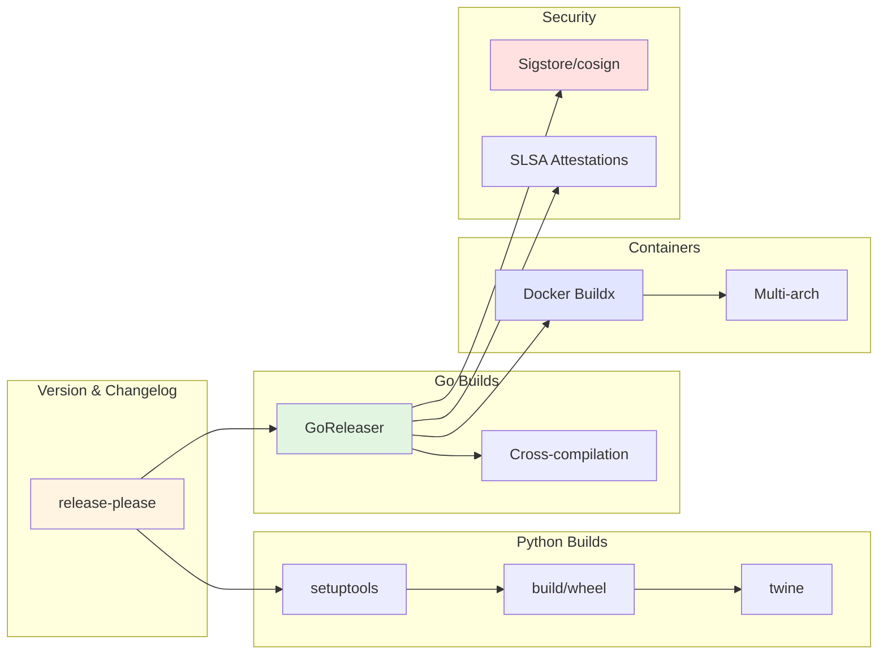

---

## The Complete Release Pipeline

### High-Level Architecture

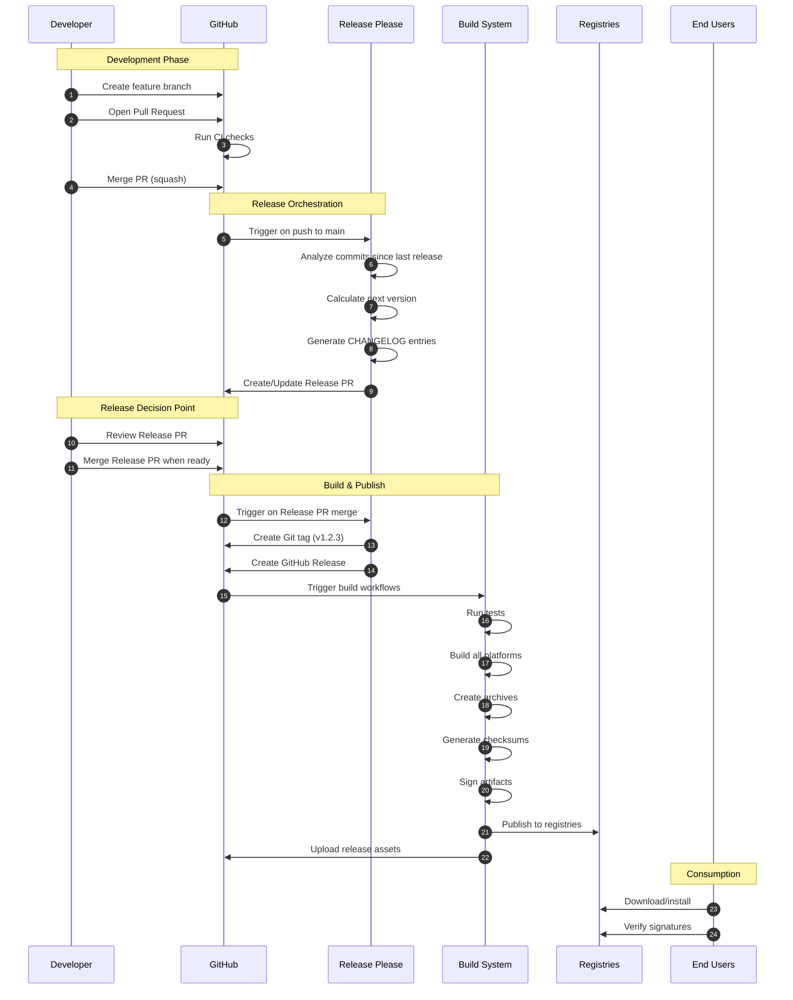

### Three-Stage Process

The release automation follows a three-stage process:

#### Stage 1: Accumulation (Ongoing)

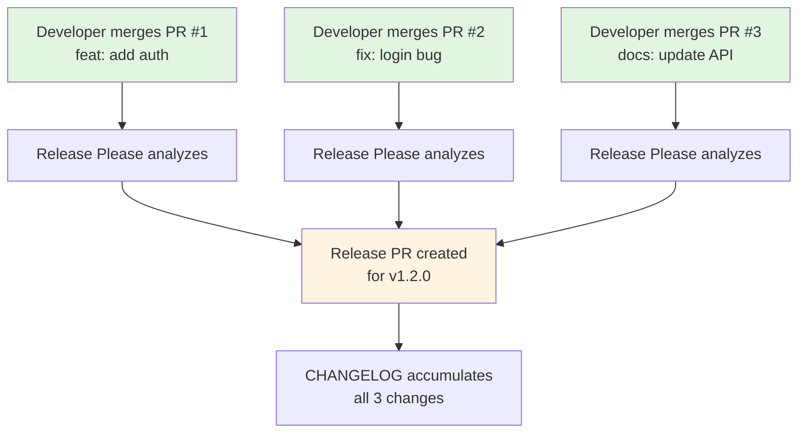

**Key Point**: Release Please creates ONE Release PR and keeps updating it as more PRs merge. You control when to release by choosing when to merge this Release PR.

#### Stage 2: Release (Developer Decision)

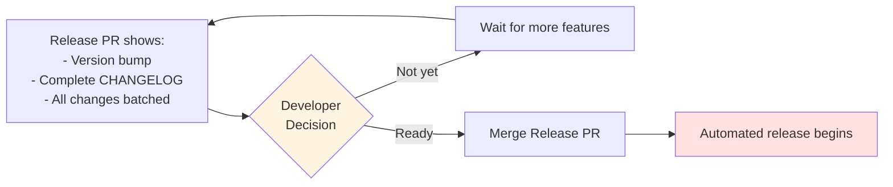

**Key Point**: You have full control. Merge immediately for continuous delivery, or batch changes for scheduled releases.

#### Stage 3: Build & Publish (Fully Automated)

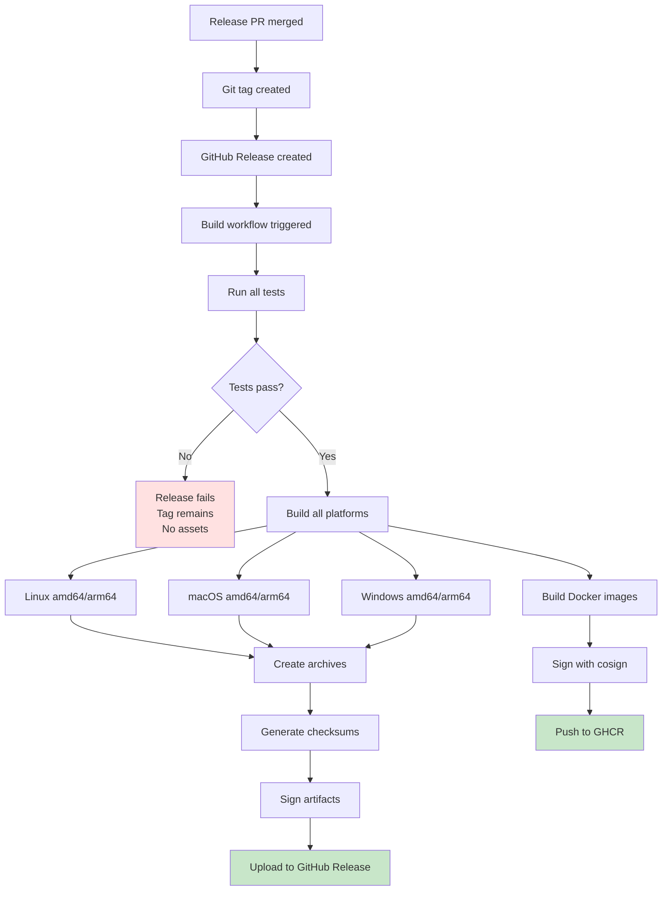

**Key Point**: Everything from tag creation to artifact publishing is automatic. Failed tests prevent the release from completing.

---

## Conventional Commits in Depth

### Why Conventional Commits?

Conventional Commits is a specification for writing commit messages in a standardized format. This format is machine-readable, enabling automated tooling.

**Format**:
```
<type>[(optional scope)][optional !]: <description>

[optional body]

[optional footer(s)]
```

### Anatomy of a Conventional Commit

```
feat(api): add user authentication endpoint

Implement JWT-based authentication for the /users endpoint.
This adds support for Bearer token authentication and
includes middleware for token validation.

BREAKING CHANGE: API now requires authentication header
Closes #123
```

**Breakdown**:

| Element | Value | Purpose |
|---------|-------|---------|
| **type** | `feat` | Triggers MINOR version bump |
| **scope** | `api` | Groups commits by subsystem |
| **!** | (absent) | Would indicate breaking change |
| **description** | `add user authentication endpoint` | Short summary |
| **body** | Multiple lines | Detailed explanation |
| **footer** | `BREAKING CHANGE: ...` | Triggers MAJOR version bump |
| **footer** | `Closes #123` | Links to issue |

### Commit Types

#### Version-Bumping Types

These types trigger version changes:

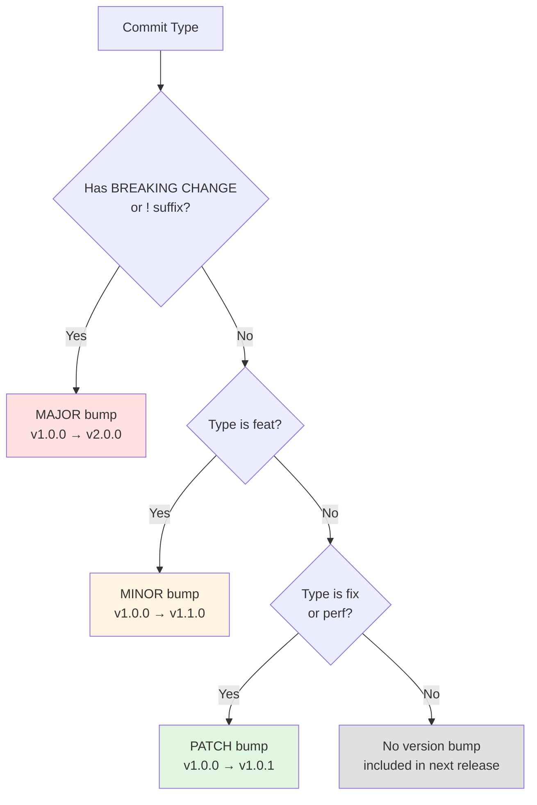

#### Complete Type Reference

| Type | Description | Version Impact | Changelog Section | Example |
|------|-------------|----------------|-------------------|---------|
| **feat** | New feature | MINOR | Features | `feat(cli): add --verbose flag` |
| **fix** | Bug fix | PATCH | Bug Fixes | `fix(parser): handle empty input` |
| **perf** | Performance improvement | PATCH | Performance Improvements | `perf(db): optimize query caching` |
| **revert** | Revert previous commit | PATCH | Reverts | `revert: feat(api): add auth` |
| **build** | Build system changes | None* | Dependencies | `build(deps): bump go to 1.21` |
| **ci** | CI configuration changes | None* | CI/CD | `ci: add coverage reporting` |
| **refactor** | Code refactoring | None* | Code Refactoring | `refactor: simplify error handling` |
| **docs** | Documentation | None* | Documentation | `docs: update README` |
| **test** | Test additions/changes | None* | (hidden) | `test: add auth tests` |
| **chore** | Maintenance tasks | None* | (hidden) | `chore: update .gitignore` |
| **style** | Code style changes | None* | (hidden) | `style: fix formatting` |

*These types don't bump version alone, but are included in releases triggered by feat/fix commits.

### Breaking Changes

There are TWO ways to indicate a breaking change:

#### Method 1: ! Suffix (Recommended)

```bash
# MAJOR version bump
feat!: redesign configuration file format

# With scope
fix(api)!: change response structure for /users
```

#### Method 2: Footer

```bash
feat: add new authentication method

BREAKING CHANGE: Old API keys are no longer supported.
Users must migrate to JWT tokens.
```

**Best Practice**: Use `!` for simple breaking changes, footer for complex ones requiring explanation.

### Practical Examples

#### Feature Development

```bash
# Adding a new feature
git commit -m "feat(cli): add support for environment variable configuration"

# With detailed body
git commit -m "feat(api): implement rate limiting

Add configurable rate limiting middleware using token bucket algorithm.
Supports per-user and global limits with Redis backend.

Closes #456"
```

#### Bug Fixes

```bash
# Simple fix
git commit -m "fix(parser): handle UTF-8 BOM correctly"

# Fix with scope and details
git commit -m "fix(auth): prevent token expiration race condition

When token refresh and expiration occurred simultaneously,
users would be logged out incorrectly. Added mutex to
serialize token operations.

Fixes #789"
```

#### Breaking Changes

```bash
# API change with breaking change indicator
git commit -m "feat(api)!: change /users response format from XML to JSON"

# Configuration change with detailed explanation
git commit -m "refactor(config)!: migrate from YAML to TOML

BREAKING CHANGE: Configuration files must be migrated from .yaml to .toml format.
Run 'ado config migrate' to automatically convert your config files.

Migration guide: docs/migration/yaml-to-toml.md"
```

#### Dependencies and Maintenance

```bash
# Dependency updates
git commit -m "build(deps): upgrade cobra to v1.8.0"

# CI improvements
git commit -m "ci: add parallel test execution"

# Documentation
git commit -m "docs(api): add OpenAPI specification"
```

### Scope Guidelines

Scopes organize commits by component or subsystem. Be consistent within your project.

**Common Scopes for CLI Projects**:

| Scope | Usage |
|-------|-------|
| `cli` | CLI interface, flags, commands |
| `api` | API endpoints or clients |
| `config` | Configuration handling |
| `parser` | Parsing logic |
| `auth` | Authentication/authorization |
| `db` | Database operations |
| `ci` | CI/CD pipeline |
| `deps` | Dependency management |
| `docker` | Container-related changes |

**Example Commit History**:
```
feat(cli): add --json output format
fix(parser): handle escaped quotes in strings
build(deps): update all dependencies to latest
ci: enable dependabot auto-merge
docs(cli): add examples for all commands
refactor(config): simplify path resolution
```

### Multi-Line Commits

For complex changes, use the full format:

```bash
git commit -m "feat(api): implement GraphQL endpoint

Add GraphQL support alongside REST API.

Features:
- Schema-first design with code generation
- Automatic query optimization
- Built-in authentication integration
- Comprehensive error handling

This is a non-breaking addition - REST API remains unchanged.

Closes #123, #124
Co-authored-by: Jane Doe <jane@example.com>"
```

### Common Mistakes and Fixes

❌ **Wrong**: `Updated README` (no type)
✅ **Right**: `docs: update README with installation instructions`

❌ **Wrong**: `feat: fix bug in parser` (feat for a fix)
✅ **Right**: `fix(parser): handle edge case in tokenizer`

❌ **Wrong**: `fix!: update dependencies` (breaking change for deps)
✅ **Right**: `build(deps)!: upgrade to Python 3.12`

❌ **Wrong**: `WIP feat(cli): add new command` (WIP in message)
✅ **Right**: Work in feature branch, squash when ready with proper message

---

## Release-Please Configuration

### Configuration Architecture

Release-please uses two configuration files:

```
project/
├── release-please-config.json    # How to release
└── .release-please-manifest.json # What version we're at
```

### release-please-config.json

This file defines **how** your project should be released.

#### Complete Configuration Example

```json
{
  "$schema": "https://raw.githubusercontent.com/googleapis/release-please/main/schemas/config.json",
  "packages": {
    ".": {
      "release-type": "go",
      "changelog-path": "CHANGELOG.md",
      "bump-minor-pre-major": true,
      "bump-patch-for-minor-pre-major": true,
      "extra-files": [],
      "changelog-sections": [
        {"type": "feat", "section": "Features"},
        {"type": "fix", "section": "Bug Fixes"},
        {"type": "perf", "section": "Performance Improvements"},
        {"type": "revert", "section": "Reverts"},
        {"type": "build", "section": "Dependencies"},
        {"type": "ci", "section": "CI/CD"},
        {"type": "refactor", "section": "Code Refactoring"},
        {"type": "docs", "section": "Documentation"}
      ]
    }
  },
  "include-component-in-tag": false,
  "include-v-in-tag": true,
  "pull-request-title-pattern": "chore${scope}: release${component} ${version}",
  "pull-request-header": "## Release ${version}",
  "separate-pull-requests": false,
  "group-pull-request-title-pattern": "chore: release ${version}",
  "release-search-depth": 400,
  "commit-search-depth": 500
}
```

#### Configuration Options Explained

##### Package Configuration

```json
"packages": {
  ".": {
    // Package at repository root
  }
}
```

For monorepos, you can have multiple packages:

```json
"packages": {
  ".": { /* root package */ },
  "packages/frontend": { /* frontend package */ },
  "packages/backend": { /* backend package */ }
}
```

##### Release Type

```json
"release-type": "go"
```

Supported release types:

| Type | Use Case | File Updates |
|------|----------|--------------|
| `go` | Go projects | None (uses git tags) |
| `python` | Python packages | `pyproject.toml`, `setup.py`, `__version__.py` |
| `node` | Node.js packages | `package.json`, `package-lock.json` |
| `rust` | Rust projects | `Cargo.toml` |
| `simple` | Generic projects | `version.txt` |

For Go projects, version is tracked only in Git tags, not in source files.

##### Pre-1.0 Versioning

```json
"bump-minor-pre-major": true,
"bump-patch-for-minor-pre-major": true
```

These options control version bumping before reaching 1.0.0:

**Standard Semantic Versioning** (post-1.0.0):
- Breaking change → MAJOR (1.0.0 → 2.0.0)
- Feature → MINOR (1.0.0 → 1.1.0)
- Fix → PATCH (1.0.0 → 1.0.1)

**Pre-1.0 Behavior** (with these flags):
- Breaking change → MINOR (0.1.0 → 0.2.0)
- Feature → MINOR (0.1.0 → 0.2.0)
- Fix → PATCH (0.1.0 → 0.1.1)

**Rationale**: Before 1.0.0, APIs are unstable. MINOR versions can break things.

##### Extra Files

```json
"extra-files": [
  "internal/version/version.go",
  "docs/VERSION"
]
```

List additional files where version numbers should be updated. Useful for:
- Embedding version in source code
- Updating documentation
- Syncing version across files

**Example for Go**:

```json
"extra-files": [
  {
    "type": "go",
    "path": "internal/meta/version.go",
    "glob": false
  }
]
```

Release-please will update:
```go
const Version = "1.2.3"
```

##### Changelog Sections

```json
"changelog-sections": [
  {"type": "feat", "section": "Features"},
  {"type": "fix", "section": "Bug Fixes"},
  {"type": "docs", "section": "Documentation", "hidden": false}
]
```

Control which commit types appear in CHANGELOG and their section headers.

**Hidden Sections**:
```json
{"type": "test", "section": "Tests", "hidden": true}
```

Commits will be tracked but not shown in CHANGELOG.

**Custom Sections**:
```json
{"type": "security", "section": "Security Fixes"}
```

If you use custom types, define them here.

##### Tag Configuration

```json
"include-v-in-tag": true,
"include-component-in-tag": false
```

**include-v-in-tag**:
- `true`: Tags are `v1.0.0` (Go convention)
- `false`: Tags are `1.0.0` (Python/npm convention)

**include-component-in-tag** (monorepo):
- `true`: Tags are `frontend-v1.0.0`, `backend-v1.0.0`
- `false`: Tags are `v1.0.0` (single package)

##### Pull Request Customization

```json
"pull-request-title-pattern": "chore${scope}: release${component} ${version}",
"pull-request-header": "## Release ${version}"
```

Customize how release PRs are created:

**Variables**:
- `${version}`: The new version (1.2.3)
- `${component}`: Package name (for monorepos)
- `${scope}`: Scope string

**Example Result**:
```
Title: chore: release 1.2.3
Body:
## Release 1.2.3

### Features
* add authentication
* add logging

### Bug Fixes
* fix crash on startup
```

##### Search Depth

```json
"release-search-depth": 400,
"commit-search-depth": 500
```

How far back to search in commit history:
- **release-search-depth**: How many commits to search for last release
- **commit-search-depth**: Maximum commits to analyze for current release

**Increase if**:
- You have very active repositories
- Initial release with long history
- Commits aren't being found

### .release-please-manifest.json

This file tracks the **current version** of each package.

```json
{
  ".": "1.1.4"
}
```

For monorepos:

```json
{
  ".": "1.0.0",
  "packages/frontend": "2.3.1",
  "packages/backend": "1.8.7"
}
```

**Important**:
- Release-please updates this file automatically
- Commit this file to your repository
- Don't edit manually (let release-please manage it)
- Start with `"0.0.0"` for new projects

### Python-Specific Configuration

For Python projects, use the `python` release type:

```json
{
  "$schema": "https://raw.githubusercontent.com/googleapis/release-please/main/schemas/config.json",
  "packages": {
    ".": {
      "release-type": "python",
      "package-name": "myproject",
      "changelog-path": "CHANGELOG.md",
      "bump-minor-pre-major": true,
      "bump-patch-for-minor-pre-major": true,
      "extra-files": [
        "src/myproject/__init__.py"
      ]
    }
  },
  "include-v-in-tag": false
}
```

**Key Differences**:
- `release-type: "python"`
- `include-v-in-tag: false` (Python convention)
- `extra-files` includes `__init__.py` for version

Release-please will update:

**pyproject.toml**:
```toml
[project]
version = "1.2.3"
```

**src/myproject/__init__.py**:
```python
__version__ = "1.2.3"
```

---

## Version Bumping Rules

### Semantic Versioning Primer

Semantic Versioning (SemVer) uses three numbers: `MAJOR.MINOR.PATCH`

```
    1  .  2  .  3
    │     │     │
    │     │     └─ PATCH: Backward-compatible bug fixes
    │     └─────── MINOR: Backward-compatible features
    └───────────── MAJOR: Breaking changes
```

### Version Bumping Decision Tree

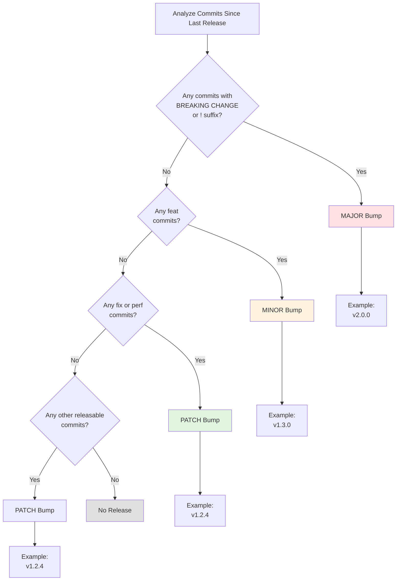

### Concrete Examples

#### Scenario 1: Mixed Commits

**Commits since last release (v1.2.3)**:
```
feat(api): add GraphQL endpoint
fix(parser): handle unicode
docs: update README
build(deps): update dependencies
```

**Analysis**:
- Has `feat` → Triggers MINOR bump
- Has `fix` → Would trigger PATCH, but feat takes precedence
- `docs` and `build` are included but don't affect version

**Result**: `v1.2.3` → `v1.3.0`

**CHANGELOG**:
```markdown
## [1.3.0] - 2024-01-15

### Features
* **api:** add GraphQL endpoint

### Bug Fixes
* **parser:** handle unicode

### Documentation
* update README

### Dependencies
* **deps:** update dependencies
```

#### Scenario 2: Breaking Change

**Commits since last release (v1.2.3)**:
```
feat(config)!: migrate to TOML format
fix(cli): improve error messages
```

**Analysis**:
- Has breaking change (`!`) → Triggers MAJOR bump
- Other commits are included

**Result**: `v1.2.3` → `v2.0.0`

**CHANGELOG**:
```markdown
## [2.0.0] - 2024-01-15

### ⚠ BREAKING CHANGES

* **config:** migrate to TOML format

### Features
* **config:** migrate to TOML format

### Bug Fixes
* **cli:** improve error messages
```

#### Scenario 3: Fixes Only

**Commits since last release (v1.2.3)**:
```
fix(auth): prevent race condition
fix(db): close connections properly
perf(query): optimize index usage
```

**Analysis**:
- Only `fix` and `perf` commits
- Both trigger PATCH bump

**Result**: `v1.2.3` → `v1.2.4`

#### Scenario 4: No Releasable Commits

**Commits since last release (v1.2.3)**:
```
docs: fix typos
test: add unit tests
chore: update .gitignore
style: format code
```

**Analysis**:
- No `feat`, `fix`, `perf`, or breaking changes
- These commits don't trigger releases

**Result**: No Release PR created

**Note**: These commits will be included in the next release triggered by a releasable commit.

### Pre-1.0.0 Behavior

With `bump-minor-pre-major: true` and `bump-patch-for-minor-pre-major: true`:

| Commit Type | Normal (≥1.0.0) | Pre-1.0.0 |
|-------------|-----------------|-----------|
| Breaking change | 1.0.0 → 2.0.0 | 0.1.0 → 0.2.0 |
| `feat` | 1.0.0 → 1.1.0 | 0.1.0 → 0.2.0 |
| `fix` | 1.0.0 → 1.0.1 | 0.1.0 → 0.1.1 |

**Why?**: Before 1.0.0, APIs are considered unstable. Breaking changes in MINOR versions are acceptable.

**Reaching 1.0.0**:

To release 1.0.0, manually create a commit:

```bash
git commit --allow-empty -m "feat: release 1.0.0

RELEASE AS: 1.0.0"
```

Or update `.release-please-manifest.json`:
```json
{
  ".": "1.0.0"
}
```

### Edge Cases

#### Multiple Breaking Changes

**Commits**:
```
feat(api)!: change response format
feat(cli)!: remove deprecated flags
fix: minor bug
```

**Result**: One MAJOR bump (not two)
- `v1.2.3` → `v2.0.0`

**CHANGELOG**: All breaking changes listed in `⚠ BREAKING CHANGES` section

#### Revert Commits

**Commits**:
```
feat(api): add new endpoint
revert: feat(api): add new endpoint
```

**Result**: PATCH bump
- Reverts are treated as fixes
- Both commits appear in CHANGELOG

#### Manual Version Override

Use `RELEASE AS` footer:

```bash
git commit -m "feat: major release

RELEASE AS: 2.0.0"
```

Forces version to `2.0.0` regardless of conventional commit rules.

---

## CHANGELOG Generation

### CHANGELOG Structure

Release-please generates standardized CHANGELOGs following [Keep a Changelog](https://keepachangelog.com/) format.

#### Example CHANGELOG

```markdown
# Changelog

## [1.2.0](https://github.com/user/repo/compare/v1.1.0...v1.2.0) (2024-01-15)

### Features

* **api:** add GraphQL support ([#123](https://github.com/user/repo/issues/123)) ([abc123d](https://github.com/user/repo/commit/abc123d))
* **cli:** add --json output format ([def456e](https://github.com/user/repo/commit/def456e))

### Bug Fixes

* **parser:** handle UTF-8 BOM correctly ([ghi789f](https://github.com/user/repo/commit/ghi789f))

### Performance Improvements

* **db:** optimize query caching ([jkl012g](https://github.com/user/repo/commit/jkl012g))

### Dependencies

* **deps:** bump golang.org/x/text to v0.14.0 ([mno345h](https://github.com/user/repo/commit/mno345h))

### CI/CD

* add code coverage reporting ([pqr678i](https://github.com/user/repo/commit/pqr678i))

### Documentation

* update API documentation ([stu901j](https://github.com/user/repo/commit/stu901j))

## [1.1.0](https://github.com/user/repo/compare/v1.0.0...v1.1.0) (2024-01-01)

...
```

### CHANGELOG Components

#### Version Header

```markdown
## [1.2.0](https://github.com/user/repo/compare/v1.1.0...v1.2.0) (2024-01-15)
```

**Components**:
- **Version**: `[1.2.0]` - The new version number
- **Comparison Link**: Link to GitHub compare view showing all changes
- **Date**: ISO format date of release

#### Section Headers

```markdown
### Features
### Bug Fixes
### Performance Improvements
```

Sections are created based on `changelog-sections` configuration. Order matters - they appear in CHANGELOG in the order defined.

#### Commit Entries

```markdown
* **api:** add GraphQL support ([#123](https://github.com/user/repo/issues/123)) ([abc123d](https://github.com/user/repo/commit/abc123d))
```

**Format**:
- `**scope:**` - Scope from commit (if present)
- Description - Commit description
- `[#123]` - Issue/PR number (if referenced)
- `[abc123d]` - Short commit hash with link

#### Breaking Changes Section

For releases with breaking changes:

```markdown
### ⚠ BREAKING CHANGES

* **config:** Configuration file format changed from YAML to TOML. Run migration tool to convert.
* **api:** /users endpoint now returns JSON instead of XML
```

This section appears FIRST, before all other sections.

### Customizing CHANGELOG Output

#### Hiding Sections

To track commits without showing them in CHANGELOG:

```json
"changelog-sections": [
  {"type": "feat", "section": "Features"},
  {"type": "test", "section": "Tests", "hidden": true},
  {"type": "chore", "section": "Chores", "hidden": true}
]
```

**Result**: `test` and `chore` commits are processed but not included in CHANGELOG.

#### Custom Sections

Add custom commit types and sections:

```json
"changelog-sections": [
  {"type": "feat", "section": "Features"},
  {"type": "fix", "section": "Bug Fixes"},
  {"type": "security", "section": "Security Fixes"},
  {"type": "deprecate", "section": "Deprecations"}
]
```

Use in commits:
```bash
git commit -m "security: patch XSS vulnerability"
git commit -m "deprecate(api): mark /v1/users as deprecated"
```

#### Section Ordering

The order in the configuration determines the order in CHANGELOG:

```json
"changelog-sections": [
  {"type": "feat", "section": "Features"},          // First
  {"type": "fix", "section": "Bug Fixes"},          // Second
  {"type": "perf", "section": "Performance"}        // Third
]
```

**Best Practice**: Put most important sections first (Features, Breaking Changes, Bug Fixes).

### CHANGELOG and Git History

#### What Gets Included

Only commits **since the last release** are included:

```
v1.0.0 (tag)
  ↓
[commit 1: feat: add feature A]  ← Included in v1.1.0
[commit 2: fix: fix bug B]       ← Included in v1.1.0
[commit 3: docs: update docs]    ← Included in v1.1.0
  ↓
v1.1.0 (tag)
  ↓
[commit 4: feat: add feature C]  ← Will be in next release
```

#### Squash Merges vs. Merge Commits

**Squash Merge** (Recommended):
```bash
gh pr merge --squash
```

Results in ONE commit in CHANGELOG:
```markdown
### Features
* **api:** add authentication (#123)
```

**Merge Commit**:
```bash
gh pr merge --merge
```

Results in MULTIPLE commits:
```markdown
### Features
* **api:** implement JWT validation
* **api:** add middleware for auth
* **api:** update tests
* Merge pull request #123
```

**Recommendation**: Use squash merges for cleaner CHANGELOGs.

#### Handling Merge Conflicts in CHANGELOG

If you have manual edits in CHANGELOG, release-please may create conflicts.

**Solution 1**: Don't manually edit CHANGELOG
- Let release-please fully manage it

**Solution 2**: Edit after release
- Merge Release PR
- Manually edit CHANGELOG
- Commit changes
- They'll be preserved in future releases

**Solution 3**: Use extra-files
- Put custom notes in separate file
- Include via extra-files configuration

### CHANGELOG for Monorepos

For monorepos with multiple packages:

```markdown
# Changelog

## [frontend-v2.0.0] (2024-01-15)

### Features - Frontend
* add dark mode
* improve performance

## [backend-v1.5.0] (2024-01-15)

### Features - Backend
* add GraphQL API
```

Or separate CHANGELOGs:

```
packages/
  frontend/
    CHANGELOG.md  (frontend releases only)
  backend/
    CHANGELOG.md  (backend releases only)
```

**Configuration**:
```json
{
  "packages": {
    "packages/frontend": {
      "changelog-path": "packages/frontend/CHANGELOG.md",
      "release-type": "node"
    },
    "packages/backend": {
      "changelog-path": "packages/backend/CHANGELOG.md",
      "release-type": "python"
    }
  }
}
```

---

## Build Automation - Go

### GoReleaser Overview

GoReleaser automates the entire Go release process:

1. **Cross-compilation** for multiple OS/architecture combinations
2. **Archive creation** (tar.gz, zip)
3. **Checksum generation** for verification
4. **Docker image building** (multi-arch)
5. **Asset uploading** to GitHub Releases
6. **Homebrew formula** generation (optional)
7. **Snap/deb/rpm packaging** (optional)

### Complete .goreleaser.yaml

```yaml
version: 2

project_name: ado

# Metadata injected at build time
before:
  hooks:
    - go mod tidy
    - go generate ./...

# Build configuration
builds:
  - id: ado
    binary: ado
    main: ./cmd/ado
    env:
      - CGO_ENABLED=0
    goos:
      - linux
      - darwin
      - windows
    goarch:
      - amd64
      - arm64
    # ARM variants (for Raspberry Pi, etc.)
    goarm:
      - "6"
      - "7"
    # Ignore certain combinations
    ignore:
      - goos: windows
        goarch: arm64  # Windows on ARM64 not widely used yet
    # Inject version info via ldflags
    ldflags:
      - -s -w  # Strip debug info for smaller binaries
      - -X github.com/anowarislam/ado/internal/meta.Version={{.Version}}
      - -X github.com/anowarislam/ado/internal/meta.Commit={{.Commit}}
      - -X github.com/anowarislam/ado/internal/meta.BuildTime={{.Date}}
      - -X github.com/anowarislam/ado/internal/meta.BuiltBy=goreleaser

# Archive configuration
archives:
  - id: default
    format: tar.gz
    name_template: "{{ .ProjectName }}_{{ .Version }}_{{ .Os }}_{{ .Arch }}"
    # Override format for Windows (zip is more common)
    format_overrides:
      - goos: windows
        format: zip
    # Files to include in archives
    files:
      - LICENSE
      - README.md
      - CHANGELOG.md
      - docs/**/*

# Checksum generation
checksum:
  name_template: checksums.txt
  algorithm: sha256

# Changelog (not used - release-please handles this)
changelog:
  sort: asc
  filters:
    exclude:
      - "^docs:"
      - "^test:"
      - "^chore:"
      - Merge pull request
      - Merge branch

# GitHub Release configuration
release:
  github:
    owner: anowarislam
    name: ado
  draft: false
  prerelease: auto  # Auto-detect based on version (v0.x.x or vX.Y.Z-rc.1)
  mode: replace  # Replace existing release if re-running
  header: |
    ## Release {{ .Tag }}

    See [CHANGELOG.md](https://github.com/anowarislam/ado/blob/{{ .Tag }}/CHANGELOG.md) for details.

# Docker images
dockers:
  # AMD64 image
  - id: ado-amd64
    goos: linux
    goarch: amd64
    dockerfile: goreleaser.Dockerfile
    use: buildx
    image_templates:
      - "ghcr.io/anowarislam/ado:{{ .Version }}-amd64"
      - "ghcr.io/anowarislam/ado:latest-amd64"
    extra_files:
      - LICENSE
      - README.md
    build_flag_templates:
      - "--platform=linux/amd64"
      - "--label=org.opencontainers.image.title={{ .ProjectName }}"
      - "--label=org.opencontainers.image.description=CLI tool for development"
      - "--label=org.opencontainers.image.url=https://github.com/anowarislam/ado"
      - "--label=org.opencontainers.image.source=https://github.com/anowarislam/ado"
      - "--label=org.opencontainers.image.version={{ .Version }}"
      - "--label=org.opencontainers.image.created={{ .Date }}"
      - "--label=org.opencontainers.image.revision={{ .FullCommit }}"
      - "--label=org.opencontainers.image.licenses=MIT"

  # ARM64 image
  - id: ado-arm64
    goos: linux
    goarch: arm64
    dockerfile: goreleaser.Dockerfile
    use: buildx
    image_templates:
      - "ghcr.io/anowarislam/ado:{{ .Version }}-arm64"
      - "ghcr.io/anowarislam/ado:latest-arm64"
    extra_files:
      - LICENSE
      - README.md
    build_flag_templates:
      - "--platform=linux/arm64"
      - "--label=org.opencontainers.image.title={{ .ProjectName }}"
      - "--label=org.opencontainers.image.description=CLI tool for development"
      - "--label=org.opencontainers.image.url=https://github.com/anowarislam/ado"
      - "--label=org.opencontainers.image.source=https://github.com/anowarislam/ado"
      - "--label=org.opencontainers.image.version={{ .Version }}"
      - "--label=org.opencontainers.image.created={{ .Date }}"
      - "--label=org.opencontainers.image.revision={{ .FullCommit }}"
      - "--label=org.opencontainers.image.licenses=MIT"

# Multi-arch Docker manifests
docker_manifests:
  - name_template: "ghcr.io/anowarislam/ado:{{ .Version }}"
    image_templates:
      - "ghcr.io/anowarislam/ado:{{ .Version }}-amd64"
      - "ghcr.io/anowarislam/ado:{{ .Version }}-arm64"

  - name_template: "ghcr.io/anowarislam/ado:latest"
    image_templates:
      - "ghcr.io/anowarislam/ado:latest-amd64"
      - "ghcr.io/anowarislam/ado:latest-arm64"

# Snapshots (for testing without tags)
snapshot:
  name_template: "{{ .Tag }}-SNAPSHOT-{{ .ShortCommit }}"
```

### Configuration Deep Dive

#### Build Configuration

**Basic Build**:
```yaml
builds:
  - id: ado
    binary: ado           # Output binary name
    main: ./cmd/ado       # Path to main package
    env:
      - CGO_ENABLED=0     # Pure Go builds (no C dependencies)
```

**Why CGO_ENABLED=0?**
- **Fully static binaries**: No runtime dependencies
- **Easy cross-compilation**: No C toolchain needed
- **Smaller binaries**: No C library linking
- **Better compatibility**: Works everywhere

**OS and Architecture Matrix**:
```yaml
    goos:
      - linux
      - darwin   # macOS
      - windows
    goarch:
      - amd64
      - arm64
    goarm:
      - "6"      # Raspberry Pi 1/Zero
      - "7"      # Raspberry Pi 2/3/4
```

This creates a build matrix:
- linux/amd64
- linux/arm64
- linux/arm/v6
- linux/arm/v7
- darwin/amd64 (Intel Mac)
- darwin/arm64 (M1/M2 Mac)
- windows/amd64
- windows/arm64

**Ignoring Combinations**:
```yaml
    ignore:
      - goos: darwin
        goarch: "386"  # No 32-bit macOS
      - goos: windows
        goarch: arm64  # Uncommon
```

#### Version Injection via ldflags

**In Go Code** (`internal/meta/version.go`):
```go
package meta

var (
    Version   = "dev"
    Commit    = "unknown"
    BuildTime = "unknown"
    BuiltBy   = "unknown"
)

func Info() string {
    return fmt.Sprintf("Version: %s, Commit: %s, Built: %s",
        Version, Commit, BuildTime)
}
```

**In .goreleaser.yaml**:
```yaml
    ldflags:
      - -s -w
      - -X github.com/anowarislam/ado/internal/meta.Version={{.Version}}
      - -X github.com/anowarislam/ado/internal/meta.Commit={{.Commit}}
      - -X github.com/anowarislam/ado/internal/meta.BuildTime={{.Date}}
```

**Available Template Variables**:

| Variable | Example | Description |
|----------|---------|-------------|
| `{{.Version}}` | `1.2.3` | Version without 'v' prefix |
| `{{.Tag}}` | `v1.2.3` | Full git tag |
| `{{.Commit}}` | `abc123d` | Short commit hash |
| `{{.FullCommit}}` | `abc123def456...` | Full commit hash |
| `{{.Date}}` | `2024-01-15T10:30:00Z` | Build timestamp |
| `{{.ProjectName}}` | `ado` | Project name from config |

**ldflags Explained**:
- `-s`: Strip symbol table
- `-w`: Strip DWARF debugging info
- `-X package.Variable=value`: Set variable at link time

**Binary Size Comparison**:
```
With debug info:     12 MB
With -s -w:          8 MB  (33% smaller)
```

#### Archive Formats

```yaml
archives:
  - format: tar.gz
    name_template: "{{ .ProjectName }}_{{ .Version }}_{{ .Os }}_{{ .Arch }}"
    format_overrides:
      - goos: windows
        format: zip
```

**Output**:
```
ado_1.2.3_linux_amd64.tar.gz
ado_1.2.3_darwin_arm64.tar.gz
ado_1.2.3_windows_amd64.zip
```

**Including Files**:
```yaml
    files:
      - LICENSE
      - README.md
      - CHANGELOG.md
      - docs/**/*
      - completions/*  # Shell completions
```

#### Checksums

```yaml
checksum:
  name_template: checksums.txt
  algorithm: sha256
```

**Generates** `checksums.txt`:
```
abc123...  ado_1.2.3_linux_amd64.tar.gz
def456...  ado_1.2.3_darwin_arm64.tar.gz
ghi789...  ado_1.2.3_windows_amd64.zip
```

**Verification**:
```bash
# Download checksums
curl -LO https://github.com/user/repo/releases/download/v1.2.3/checksums.txt

# Verify a file
sha256sum -c checksums.txt --ignore-missing
```

### Local Testing

Test GoReleaser locally without creating releases:

```bash
# Check configuration validity
goreleaser check

# Build snapshot (no tag required)
goreleaser build --snapshot --clean

# Full release simulation
goreleaser release --snapshot --clean --skip-publish

# Test only Docker builds
goreleaser release --snapshot --clean --skip-publish \
  --config .goreleaser.yaml --id ado-amd64
```

**Output**:
```
dist/
├── ado_linux_amd64/
│   └── ado
├── ado_darwin_arm64/
│   └── ado
├── ado_windows_amd64/
│   └── ado.exe
├── ado_1.2.3_linux_amd64.tar.gz
├── ado_1.2.3_darwin_arm64.tar.gz
├── ado_1.2.3_windows_amd64.zip
└── checksums.txt
```

### Advanced Features

#### Homebrew Tap

Automatically create/update Homebrew formula:

```yaml
brews:
  - repository:
      owner: anowarislam
      name: homebrew-tap
    folder: Formula
    homepage: "https://github.com/anowarislam/ado"
    description: "CLI development tool"
    license: "MIT"
    test: |
      system "#{bin}/ado version"
    install: |
      bin.install "ado"
```

**Creates**: `homebrew-tap/Formula/ado.rb`

**Users install**:
```bash
brew tap anowarislam/tap
brew install ado
```

#### Snapcraft (Linux Snap)

```yaml
snapcrafts:
  - name: ado
    summary: CLI development tool
    description: |
      Comprehensive CLI tool for development workflows.
    grade: stable
    confinement: classic
    apps:
      ado:
        command: ado
```

**Publish to Snap Store** (requires credentials).

#### AUR (Arch Linux)

```yaml
aurs:
  - name: ado-bin
    homepage: "https://github.com/anowarislam/ado"
    description: "CLI development tool"
    maintainers:
      - "Your Name <email@example.com>"
    license: "MIT"
    private_key: "{{ .Env.AUR_KEY }}"
    git_url: "ssh://aur@aur.archlinux.org/ado-bin.git"
```

---

## Build Automation - Python

### Python Packaging Overview

Python packaging has evolved significantly. Modern approach:

1. **pyproject.toml**: Single source of truth
2. **build**: PEP 517-compliant build tool
3. **wheel**: Binary distribution format
4. **twine**: Upload to PyPI
5. **setuptools**: Build backend (most common)

### Complete pyproject.toml

```toml
[project]
name = "ado-cli"
version = "1.2.3"  # Updated by release-please
description = "CLI development tool"
readme = "README.md"
requires-python = ">=3.10"
license = {text = "MIT"}
authors = [
    {name = "Your Name", email = "you@example.com"}
]
keywords = ["cli", "development", "tools"]
classifiers = [
    "Development Status :: 4 - Beta",
    "Intended Audience :: Developers",
    "License :: OSI Approved :: MIT License",
    "Programming Language :: Python :: 3",
    "Programming Language :: Python :: 3.10",
    "Programming Language :: Python :: 3.11",
    "Programming Language :: Python :: 3.12",
]

# Runtime dependencies
dependencies = [
    "click>=8.1.0",
    "pyyaml>=6.0.0",
    "rich>=13.0.0",
]

# Optional dependencies
[project.optional-dependencies]
dev = [
    "pytest>=8.0.0",
    "pytest-cov>=4.0.0",
    "ruff>=0.1.0",
    "mypy>=1.0.0",
]

# CLI entrypoints
[project.scripts]
ado = "ado_cli.cli:main"

# URLs
[project.urls]
Homepage = "https://github.com/anowarislam/ado"
Documentation = "https://ado.readthedocs.io"
Repository = "https://github.com/anowarislam/ado"
Changelog = "https://github.com/anowarislam/ado/blob/main/CHANGELOG.md"

# Build system
[build-system]
requires = ["setuptools>=61.0", "wheel"]
build-backend = "setuptools.build_meta"

# Setuptools configuration
[tool.setuptools]
packages = ["ado_cli"]

[tool.setuptools.package-data]
ado_cli = ["py.typed"]

# Ruff linter
[tool.ruff]
line-length = 100
target-version = "py310"

[tool.ruff.lint]
select = ["E", "F", "W", "I", "N", "UP", "B", "A"]
ignore = ["E501"]  # Line too long (handled by formatter)

# pytest
[tool.pytest.ini_options]
minversion = "8.0"
addopts = "-ra -q --strict-markers --cov=ado_cli --cov-report=term-missing --cov-report=html"
testpaths = ["tests"]

# Coverage
[tool.coverage.run]
source = ["ado_cli"]
omit = ["*/tests/*", "*/__pycache__/*"]

[tool.coverage.report]
exclude_lines = [
    "pragma: no cover",
    "def __repr__",
    "raise AssertionError",
    "raise NotImplementedError",
    "if __name__ == .__main__.:",
    "if TYPE_CHECKING:",
]

# MyPy
[tool.mypy]
python_version = "3.10"
warn_return_any = true
warn_unused_configs = true
disallow_untyped_defs = true
```

### Project Structure

```
myproject/
├── pyproject.toml
├── README.md
├── LICENSE
├── CHANGELOG.md
├── src/
│   └── ado_cli/
│       ├── __init__.py      # Version here
│       ├── cli.py
│       ├── config.py
│       └── py.typed         # PEP 561 marker
├── tests/
│   ├── __init__.py
│   ├── test_cli.py
│   └── test_config.py
└── docs/
    └── ...
```

### Version Management

**src/ado_cli/__init__.py**:
```python
"""ADO CLI - Development tool."""

__version__ = "1.2.3"

__all__ = ["__version__"]
```

**Release-please configuration**:
```json
{
  "packages": {
    ".": {
      "release-type": "python",
      "package-name": "ado-cli",
      "extra-files": [
        "src/ado_cli/__init__.py"
      ]
    }
  }
}
```

When release-please creates a release PR, it updates:
1. `pyproject.toml` → `version = "1.2.3"`
2. `src/ado_cli/__init__.py` → `__version__ = "1.2.3"`

### Build Process

#### Manual Build

```bash
# Install build tools
pip install build twine

# Build distributions
python -m build

# Output:
# dist/
#   ado_cli-1.2.3-py3-none-any.whl  (wheel - binary distribution)
#   ado_cli-1.2.3.tar.gz            (sdist - source distribution)

# Check packages
twine check dist/*

# Upload to TestPyPI (for testing)
twine upload --repository testpypi dist/*

# Upload to PyPI (production)
twine upload dist/*
```

#### GitHub Actions Workflow

**`.github/workflows/python-release.yml`**:
```yaml
name: Python Release

on:
  release:
    types: [published]

jobs:
  build-and-publish:
    name: Build and Publish to PyPI
    runs-on: ubuntu-latest

    steps:
      - name: Checkout code
        uses: actions/checkout@v4
        with:
          fetch-depth: 0

      - name: Set up Python
        uses: actions/setup-python@v5
        with:
          python-version: "3.11"

      - name: Install build dependencies
        run: |
          python -m pip install --upgrade pip
          pip install build twine

      - name: Build distributions
        run: python -m build

      - name: Check distributions
        run: twine check dist/*

      - name: Publish to PyPI
        env:
          TWINE_USERNAME: __token__
          TWINE_PASSWORD: ${{ secrets.PYPI_TOKEN }}
        run: twine upload dist/*

      - name: Upload to GitHub Release
        uses: actions/upload-release-asset@v1
        env:
          GITHUB_TOKEN: ${{ secrets.GITHUB_TOKEN }}
        with:
          upload_url: ${{ github.event.release.upload_url }}
          asset_path: ./dist/ado_cli-${{ github.event.release.tag_name }}.tar.gz
          asset_name: ado_cli-${{ github.event.release.tag_name }}.tar.gz
          asset_content_type: application/gzip
```

### PyPI Configuration

#### Creating PyPI Token

1. Go to https://pypi.org/manage/account/token/
2. Click "Add API token"
3. Name: `ado-cli-github-actions`
4. Scope: "Entire account" or specific project
5. Copy token (starts with `pypi-`)

#### Adding to GitHub Secrets

```bash
# Via GitHub CLI
gh secret set PYPI_TOKEN

# Or via UI:
# Settings → Secrets and variables → Actions → New repository secret
# Name: PYPI_TOKEN
# Value: pypi-AgEIcHlwaS5vcmc...
```

#### TestPyPI (Recommended for Testing)

1. Create account at https://test.pypi.org/
2. Create token
3. Add to GitHub secrets as `TEST_PYPI_TOKEN`
4. Test upload:

```yaml
      - name: Publish to TestPyPI
        env:
          TWINE_USERNAME: __token__
          TWINE_PASSWORD: ${{ secrets.TEST_PYPI_TOKEN }}
        run: twine upload --repository testpypi dist/*
```

5. Install from TestPyPI:
```bash
pip install --index-url https://test.pypi.org/simple/ ado-cli
```

### Package Metadata

#### Classifiers

Classifiers help users find your package. Full list: https://pypi.org/classifiers/

```toml
classifiers = [
    # Development Status
    "Development Status :: 3 - Alpha",
    "Development Status :: 4 - Beta",
    "Development Status :: 5 - Production/Stable",

    # Intended Audience
    "Intended Audience :: Developers",
    "Intended Audience :: System Administrators",

    # License
    "License :: OSI Approved :: MIT License",

    # Python Versions
    "Programming Language :: Python :: 3",
    "Programming Language :: Python :: 3.10",
    "Programming Language :: Python :: 3.11",
    "Programming Language :: Python :: 3.12",

    # Topics
    "Topic :: Software Development :: Libraries :: Python Modules",
    "Topic :: System :: Systems Administration",

    # Operating System
    "Operating System :: OS Independent",

    # Typing
    "Typing :: Typed",
]
```

#### Entry Points

CLI commands are defined via entry points:

```toml
[project.scripts]
ado = "ado_cli.cli:main"
ado-admin = "ado_cli.admin:main"
```

**Creates executables**:
- Linux/Mac: `/usr/local/bin/ado`
- Windows: `C:\Python\Scripts\ado.exe`

**Implementation**:
```python
# src/ado_cli/cli.py
import click

@click.group()
def main():
    """ADO CLI - Development tool."""
    pass

@main.command()
def version():
    """Show version."""
    from ado_cli import __version__
    click.echo(f"ado version {__version__}")

if __name__ == "__main__":
    main()
```

### Type Hints and py.typed

For libraries supporting type checking:

**src/ado_cli/py.typed** (empty file):
```
# This file marks this package as PEP 561 compliant
```

**pyproject.toml**:
```toml
[tool.setuptools.package-data]
ado_cli = ["py.typed"]
```

**Enables type checking for users**:
```python
from ado_cli import SomeClass

def process(obj: SomeClass) -> None:
    # MyPy can now check this
    pass
```

### Advanced: C Extensions

For packages with C extensions:

**pyproject.toml**:
```toml
[build-system]
requires = ["setuptools>=61.0", "wheel", "Cython>=3.0.0"]
build-backend = "setuptools.build_meta"
```

**setup.py** (still needed for extensions):
```python
from setuptools import setup, Extension

setup(
    ext_modules=[
        Extension(
            "ado_cli._speedups",
            sources=["src/ado_cli/_speedups.c"],
        )
    ]
)
```

This creates platform-specific wheels:
```
ado_cli-1.2.3-cp311-cp311-macosx_11_0_arm64.whl
ado_cli-1.2.3-cp311-cp311-manylinux_2_17_x86_64.whl
ado_cli-1.2.3-cp311-cp311-win_amd64.whl
```

---

## Multi-Platform Builds

### Cross-Compilation Strategy

**The Problem**: You develop on macOS but need to release for Linux and Windows.

**The Solution**: Cross-compilation or multi-platform build matrix.

### Go Cross-Compilation

Go has EXCELLENT cross-compilation support built-in.

#### Manual Cross-Compilation

```bash
# Build for Linux amd64
GOOS=linux GOARCH=amd64 go build -o dist/ado-linux-amd64

# Build for macOS arm64 (M1/M2)
GOOS=darwin GOARCH=arm64 go build -o dist/ado-darwin-arm64

# Build for Windows amd64
GOOS=windows GOARCH=amd64 go build -o dist/ado-windows-amd64.exe

# Build for all platforms
for os in linux darwin windows; do
  for arch in amd64 arm64; do
    output="dist/ado-$os-$arch"
    if [ "$os" = "windows" ]; then
      output="${output}.exe"
    fi

    GOOS=$os GOARCH=$arch go build -o "$output" ./cmd/ado
  done
done
```

#### Platform Matrix

All valid GOOS/GOARCH combinations:

| GOOS | GOARCH | Common Use |
|------|--------|------------|
| linux | amd64 | Servers, WSL |
| linux | arm64 | ARM servers, Raspberry Pi 3+
| linux | arm | Raspberry Pi 1/2 |
| darwin | amd64 | Intel Macs |
| darwin | arm64 | M1/M2/M3 Macs |
| windows | amd64 | Windows 64-bit |
| windows | 386 | Windows 32-bit (rare) |
| freebsd | amd64 | FreeBSD servers |
| openbsd | amd64 | OpenBSD servers |

Full list: `go tool dist list`

#### Build Tags

Conditional compilation for platform-specific code:

**main_linux.go**:
```go
//go:build linux

package main

func platformInit() {
    // Linux-specific initialization
}
```

**main_darwin.go**:
```go
//go:build darwin

package main

func platformInit() {
    // macOS-specific initialization
}
```

**main_windows.go**:
```go
//go:build windows

package main

func platformInit() {
    // Windows-specific initialization
}
```

### Python Cross-Platform Builds

Python wheels can be:
1. **Pure Python** (`-py3-none-any.whl`) - works on all platforms
2. **Platform-specific** (`-cp311-cp311-macosx_11_0_arm64.whl`) - C extensions

#### Pure Python Wheels

Most Python projects are pure Python:

```bash
python -m build
# Creates: ado_cli-1.2.3-py3-none-any.whl
```

This ONE wheel works on Linux, macOS, Windows.

#### Platform-Specific Wheels (C Extensions)

For packages with C extensions, use cibuildwheel:

**`.github/workflows/build-wheels.yml`**:
```yaml
name: Build Wheels

on:
  release:
    types: [published]

jobs:
  build_wheels:
    name: Build wheels on ${{ matrix.os }}
    runs-on: ${{ matrix.os }}
    strategy:
      matrix:
        os: [ubuntu-latest, macos-latest, windows-latest]

    steps:
      - uses: actions/checkout@v4

      - name: Build wheels
        uses: pypa/cibuildwheel@v2.16
        env:
          CIBW_BUILD: "cp310-* cp311-* cp312-*"
          CIBW_SKIP: "*-win32 *-manylinux_i686"

      - name: Upload wheels
        uses: actions/upload-artifact@v4
        with:
          name: wheels-${{ matrix.os }}
          path: ./wheelhouse/*.whl
```

**Creates**:
```
ado_cli-1.2.3-cp310-cp310-linux_x86_64.whl
ado_cli-1.2.3-cp311-cp311-macosx_11_0_arm64.whl
ado_cli-1.2.3-cp312-cp312-win_amd64.whl
... (many more)
```

### Docker Multi-Platform Builds

#### Using Docker Buildx

```bash
# Create buildx builder
docker buildx create --name multiplatform --use

# Build for multiple platforms
docker buildx build \
  --platform linux/amd64,linux/arm64 \
  --tag ghcr.io/user/repo:latest \
  --push \
  .
```

#### In GoReleaser

```yaml
dockers:
  - id: app-amd64
    goos: linux
    goarch: amd64
    use: buildx
    build_flag_templates:
      - "--platform=linux/amd64"

  - id: app-arm64
    goos: linux
    goarch: arm64
    use: buildx
    build_flag_templates:
      - "--platform=linux/arm64"

docker_manifests:
  - name_template: "ghcr.io/user/repo:{{ .Version }}"
    image_templates:
      - "ghcr.io/user/repo:{{ .Version }}-amd64"
      - "ghcr.io/user/repo:{{ .Version }}-arm64"
```

**How it works**:

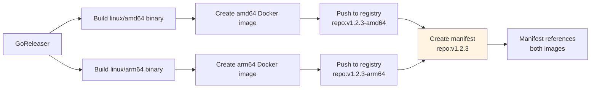

**User experience**:
```bash
# Automatically pulls correct architecture
docker pull ghcr.io/user/repo:v1.2.3

# On amd64: gets amd64 image
# On arm64: gets arm64 image
```

### GitHub Actions Build Matrix

For projects needing to test on multiple platforms:

```yaml
name: Build

on: [push, pull_request]

jobs:
  build:
    name: Build on ${{ matrix.os }}
    runs-on: ${{ matrix.os }}
    strategy:
      matrix:
        os: [ubuntu-latest, macos-latest, windows-latest]
        go-version: ['1.21', '1.22', '1.23']

    steps:
      - uses: actions/checkout@v4

      - name: Set up Go
        uses: actions/setup-go@v5
        with:
          go-version: ${{ matrix.go-version }}

      - name: Build
        run: go build -v ./...

      - name: Test
        run: go test -v ./...
```

**Creates 9 jobs**:
- ubuntu-latest + Go 1.21
- ubuntu-latest + Go 1.22
- ubuntu-latest + Go 1.23
- macos-latest + Go 1.21
- ... (9 total combinations)

---

## Container Images

### Multi-Architecture Container Strategy

Modern container images should support multiple architectures for broad compatibility.

### Docker Manifest Lists

A manifest list is a pointer to multiple architecture-specific images:

```
ghcr.io/user/repo:v1.2.3
  ├─ linux/amd64 → ghcr.io/user/repo:v1.2.3-amd64
  ├─ linux/arm64 → ghcr.io/user/repo:v1.2.3-arm64
  └─ linux/arm/v7 → ghcr.io/user/repo:v1.2.3-armv7
```

When you `docker pull ghcr.io/user/repo:v1.2.3`, Docker automatically selects the correct image for your platform.

### Complete Container Workflow

#### Dockerfile for GoReleaser

**goreleaser.Dockerfile**:
```dockerfile
FROM scratch

# Copy CA certificates for HTTPS
COPY --from=alpine:latest /etc/ssl/certs/ca-certificates.crt /etc/ssl/certs/

# Copy binary (provided by GoReleaser)
COPY ado /ado

# Non-root user
USER 65534:65534

ENTRYPOINT ["/ado"]
```

**Why `scratch`?**
- **Minimal attack surface**: No shell, no libraries, nothing but your binary
- **Tiny size**: 5-10 MB total
- **Security**: Can't exec into container
- **Performance**: Instant startup

**Requirements for scratch**:
- Static binary (CGO_ENABLED=0)
- No runtime dependencies
- Self-contained

#### Multi-Stage Build Dockerfile

For building from source:

**Dockerfile**:
```dockerfile
# Stage 1: Build
FROM golang:1.23-alpine AS builder

WORKDIR /build

# Dependencies
COPY go.mod go.sum ./
RUN go mod download

# Build
COPY . .
RUN CGO_ENABLED=0 GOOS=linux go build \
    -ldflags="-s -w" \
    -o ado \
    ./cmd/ado

# Stage 2: Runtime
FROM scratch

COPY --from=builder /etc/ssl/certs/ca-certificates.crt /etc/ssl/certs/
COPY --from=builder /build/ado /ado

USER 65534:65534

ENTRYPOINT ["/ado"]
```

**Benefits**:
- Build tools not in final image
- Reproducible builds
- Layer caching for faster rebuilds

#### GoReleaser Docker Configuration

```yaml
dockers:
  # AMD64 Image
  - id: ado-amd64
    goos: linux
    goarch: amd64
    dockerfile: goreleaser.Dockerfile
    use: buildx
    image_templates:
      - "ghcr.io/{{ .Env.GITHUB_REPOSITORY_OWNER }}/ado:{{ .Version }}-amd64"
      - "ghcr.io/{{ .Env.GITHUB_REPOSITORY_OWNER }}/ado:latest-amd64"
    build_flag_templates:
      - "--platform=linux/amd64"
      - "--label=org.opencontainers.image.title={{ .ProjectName }}"
      - "--label=org.opencontainers.image.description=CLI development tool"
      - "--label=org.opencontainers.image.url={{ .GitURL }}"
      - "--label=org.opencontainers.image.source={{ .GitURL }}"
      - "--label=org.opencontainers.image.version={{ .Version }}"
      - "--label=org.opencontainers.image.created={{ .Date }}"
      - "--label=org.opencontainers.image.revision={{ .FullCommit }}"
      - "--label=org.opencontainers.image.licenses=MIT"
    extra_files:
      - LICENSE
      - README.md

  # ARM64 Image
  - id: ado-arm64
    goos: linux
    goarch: arm64
    dockerfile: goreleaser.Dockerfile
    use: buildx
    image_templates:
      - "ghcr.io/{{ .Env.GITHUB_REPOSITORY_OWNER }}/ado:{{ .Version }}-arm64"
      - "ghcr.io/{{ .Env.GITHUB_REPOSITORY_OWNER }}/ado:latest-arm64"
    build_flag_templates:
      - "--platform=linux/arm64"
      - "--label=org.opencontainers.image.title={{ .ProjectName }}"
      - "--label=org.opencontainers.image.description=CLI development tool"
      - "--label=org.opencontainers.image.url={{ .GitURL }}"
      - "--label=org.opencontainers.image.source={{ .GitURL }}"
      - "--label=org.opencontainers.image.version={{ .Version }}"
      - "--label=org.opencontainers.image.created={{ .Date }}"
      - "--label=org.opencontainers.image.revision={{ .FullCommit }}"
      - "--label=org.opencontainers.image.licenses=MIT"
    extra_files:
      - LICENSE
      - README.md

docker_manifests:
  # Version tag
  - name_template: "ghcr.io/{{ .Env.GITHUB_REPOSITORY_OWNER }}/ado:{{ .Version }}"
    image_templates:
      - "ghcr.io/{{ .Env.GITHUB_REPOSITORY_OWNER }}/ado:{{ .Version }}-amd64"
      - "ghcr.io/{{ .Env.GITHUB_REPOSITORY_OWNER }}/ado:{{ .Version }}-arm64"

  # Latest tag
  - name_template: "ghcr.io/{{ .Env.GITHUB_REPOSITORY_OWNER }}/ado:latest"
    image_templates:
      - "ghcr.io/{{ .Env.GITHUB_REPOSITORY_OWNER }}/ado:latest-amd64"
      - "ghcr.io/{{ .Env.GITHUB_REPOSITORY_OWNER }}/ado:latest-arm64"
```

#### OCI Labels

Labels provide metadata about the image:

```yaml
    build_flag_templates:
      - "--label=org.opencontainers.image.title={{ .ProjectName }}"
      - "--label=org.opencontainers.image.description=CLI development tool"
      - "--label=org.opencontainers.image.version={{ .Version }}"
      - "--label=org.opencontainers.image.created={{ .Date }}"
      - "--label=org.opencontainers.image.revision={{ .FullCommit }}"
      - "--label=org.opencontainers.image.source={{ .GitURL }}"
      - "--label=org.opencontainers.image.licenses=MIT"
      - "--label=org.opencontainers.image.vendor=Your Organization"
      - "--label=org.opencontainers.image.authors=you@example.com"
      - "--label=org.opencontainers.image.documentation=https://docs.example.com"
```

**View labels**:
```bash
docker inspect ghcr.io/user/repo:v1.2.3 | jq '.[0].Config.Labels'
```

**Benefits**:
- Metadata searchable in registries
- Build provenance tracking
- License compliance

### GitHub Container Registry (GHCR)

#### Authentication

**In GitHub Actions**:
```yaml
- name: Login to GHCR
  uses: docker/login-action@v3
  with:
    registry: ghcr.io
    username: ${{ github.actor }}
    password: ${{ secrets.GITHUB_TOKEN }}
```

**Locally**:
```bash
# Create personal access token with read:packages, write:packages
echo $GITHUB_TOKEN | docker login ghcr.io -u USERNAME --password-stdin
```

#### Making Images Public

By default, GHCR images are private. To make public:

1. Go to package page: `https://github.com/users/USERNAME/packages/container/PACKAGE`
2. Package settings → Change visibility → Public

Or via API:
```bash
gh api \
  --method PATCH \
  -H "Accept: application/vnd.github+json" \
  /user/packages/container/ado/versions/VERSION_ID \
  -f visibility='public'
```

### Container Signing

**See Chapter 3 for details on cosign signing.**

Quick summary:

```yaml
- name: Install cosign
  uses: sigstore/cosign-installer@v3

- name: Sign images
  env:
    REGISTRY: ghcr.io/user/repo
  run: |
    cosign sign --yes "${REGISTRY}:${VERSION}"
    cosign sign --yes "${REGISTRY}:latest"
```

**Verification**:
```bash
cosign verify ghcr.io/user/repo:v1.2.3 \
  --certificate-identity-regexp="https://github.com/user/repo/" \
  --certificate-oidc-issuer="https://token.actions.githubusercontent.com"
```

### Alternative: Docker Hub

For Docker Hub instead of GHCR:

```yaml
dockers:
  - image_templates:
      - "username/repo:{{ .Version }}-amd64"
      - "username/repo:latest-amd64"

docker_manifests:
  - name_template: "username/repo:{{ .Version }}"
    image_templates:
      - "username/repo:{{ .Version }}-amd64"
      - "username/repo:{{ .Version }}-arm64"
```

**Authentication**:
```yaml
- name: Login to Docker Hub
  uses: docker/login-action@v3
  with:
    username: ${{ secrets.DOCKERHUB_USERNAME }}
    password: ${{ secrets.DOCKERHUB_TOKEN }}
```

---

## Release PR Workflow

### Understanding the Release PR

The Release PR is the control point for when releases happen.

#### Release PR Lifecycle

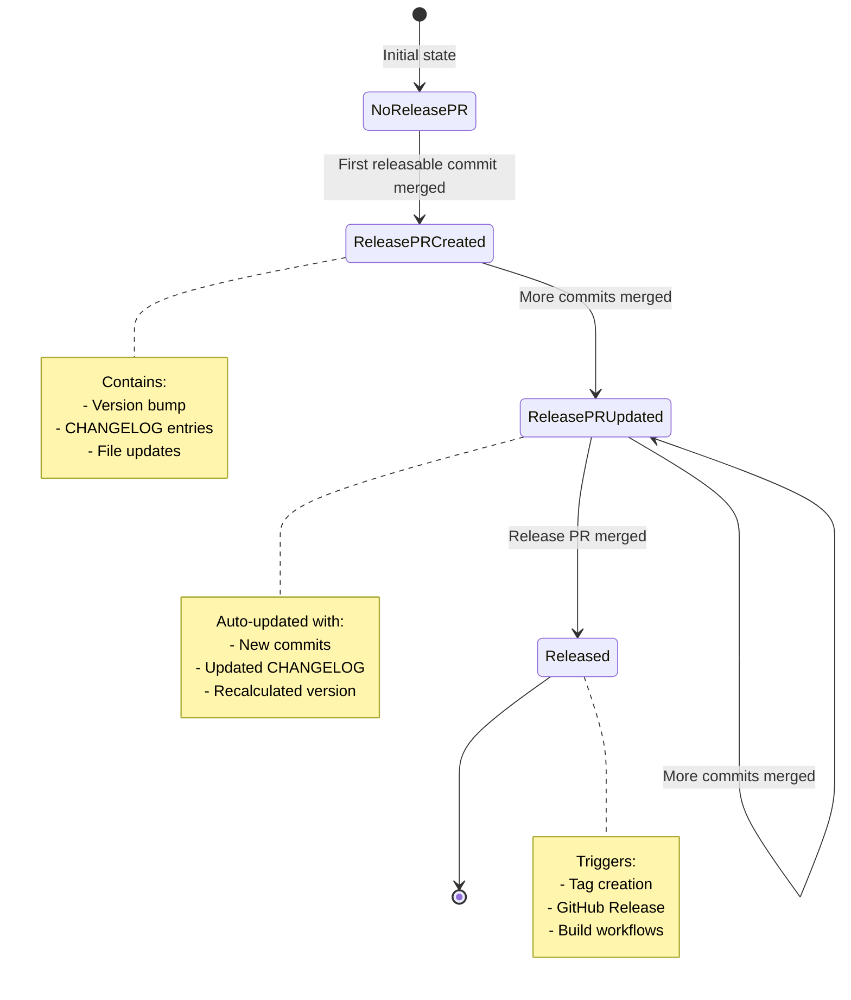

### Anatomy of a Release PR

#### Title

```
chore: release 1.2.0
```

Or for monorepos:
```
chore: release frontend 2.0.0
```

#### Body

```markdown
## [1.2.0](https://github.com/user/repo/compare/v1.1.0...v1.2.0) (2024-01-15)

### Features

* **api:** add GraphQL endpoint ([#123](https://github.com/user/repo/pull/123)) ([abc123](https://github.com/user/repo/commit/abc123))
* **cli:** add --json output ([#124](https://github.com/user/repo/pull/124)) ([def456](https://github.com/user/repo/commit/def456))

### Bug Fixes

* **parser:** handle unicode ([#125](https://github.com/user/repo/pull/125)) ([ghi789](https://github.com/user/repo/commit/ghi789))

---
This PR was generated with [Release Please](https://github.com/googleapis/release-please).
```

#### Files Changed

**For Go projects**:
- `CHANGELOG.md` - Updated with new entries
- `.release-please-manifest.json` - Version updated

**For Python projects**:
- `CHANGELOG.md`
- `.release-please-manifest.json`
- `pyproject.toml` - version field
- `src/package/__init__.py` - __version__ variable

**For Node projects**:
- `CHANGELOG.md`
- `.release-please-manifest.json`
- `package.json` - version field
- `package-lock.json` - version field

### Batching Behavior

**Scenario**: Multiple PRs merged before Release PR is merged

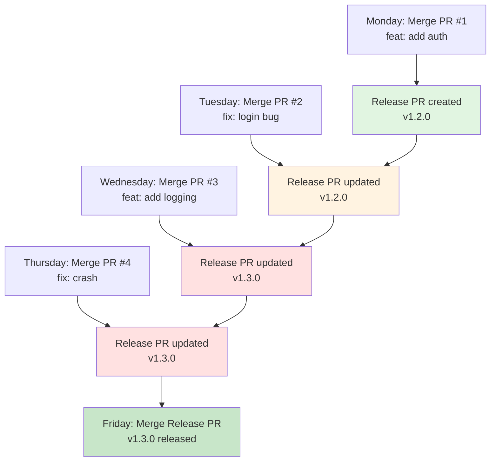

**Key Points**:
1. Release PR created on first releasable commit
2. Auto-updated as more commits merge
3. Version recalculated based on ALL commits
4. One release contains all changes

### Version Recalculation

**Monday**: `feat` → v1.2.0
**Wednesday**: `feat` added → v1.3.0 (MINOR bumps accumulate)
**Final**: v1.3.0 includes everything

**If there was a breaking change on Thursday**:
**Thursday**: `feat!` → v2.0.0 (version recalculated)

### Managing the Release PR

#### Viewing the Release PR

```bash
# List open Release PRs
gh pr list --label "autorelease: pending"

# View specific Release PR
gh pr view 123

# See the diff
gh pr diff 123
```

#### When to Merge

**Continuous Delivery Approach**:
- Merge Release PR immediately after each feature PR
- Rapid releases (multiple per day possible)
- Good for: SaaS, high-velocity teams

**Batched Release Approach**:
- Let Release PR accumulate changes
- Merge weekly/biweekly/at milestones
- Good for: Scheduled releases, major features

**Triggered by Events**:
- Merge when critical bug fix is included
- Merge before deadline (end of sprint, etc.)
- Merge when feature set is complete

#### Merging the Release PR

```bash
# Via GitHub CLI
gh pr merge 123 --squash

# Or via UI
# Review → Squash and merge
```

**What happens next**:
1. Release Please workflow triggers (on push to main)
2. Detects Release PR was merged
3. Creates Git tag (e.g., `v1.2.0`)
4. Creates GitHub Release with CHANGELOG as body
5. GoReleaser workflow triggers (on release published event)
6. Binaries built and uploaded

**Timeframe**: Tag created within 30-60 seconds, binaries available within 5-10 minutes.

### Editing the Release PR

**Can you edit the Release PR?** Yes, but with caveats.

#### Editing CHANGELOG

If you edit CHANGELOG in the Release PR, your changes will be preserved in the file but **release-please will regenerate it on the next run**.

**Recommendation**: Don't edit CHANGELOG in Release PR. If you need to edit:
1. Merge Release PR
2. Manually edit CHANGELOG on main
3. Commit changes
4. Future releases will preserve your edits

#### Editing Version

Don't manually edit version in `.release-please-manifest.json`. Release-please manages this automatically.

**To force a specific version**, add `RELEASE AS` footer to a commit:
```bash
git commit --allow-empty -m "chore: release

RELEASE AS: 2.0.0"
```

### Troubleshooting Release PRs

#### Release PR Not Created

**Possible causes**:
1. No releasable commits (only `docs`, `test`, `chore` without scope)
2. Commits don't follow conventional commit format
3. Release-please configuration error

**Debug**:
```bash
# Check recent commits
git log --oneline -10

# Verify commit message format
git log -1 --format="%B"

# Check workflow runs
gh run list --workflow=release-please.yml
```

#### Release PR Stuck/Outdated

**If Release PR shows conflicts**:
1. Checkout the release PR branch locally
2. Rebase on main
3. Push (force if needed)

```bash
gh pr checkout 123
git rebase main
git push --force-with-lease
```

#### Multiple Release PRs

**Should only have ONE Release PR open.**

If you have multiple:
1. Close older ones
2. Retrigger release-please workflow

```bash
# Close old Release PRs
gh pr close 120 --comment "Superseded by #123"

# Retrigger workflow
gh workflow run release-please.yml
```

---

## GitHub Releases

### GitHub Release Structure

When the Release PR is merged, release-please creates a GitHub Release.

#### Release Components

```
GitHub Release v1.2.0
├─ Tag: v1.2.0
├─ Title: Release v1.2.0 (or custom from config)
├─ Body: CHANGELOG content
├─ Assets: (uploaded by GoReleaser)
│  ├─ ado_1.2.0_linux_amd64.tar.gz
│  ├─ ado_1.2.0_darwin_arm64.tar.gz
│  ├─ ado_1.2.0_windows_amd64.zip
│  ├─ checksums.txt
│  └─ attestation files
└─ Metadata:
   ├─ Created at: 2024-01-15T10:30:00Z
   ├─ Author: release-please[bot]
   └─ Draft: false
```

### Release Creation Workflow

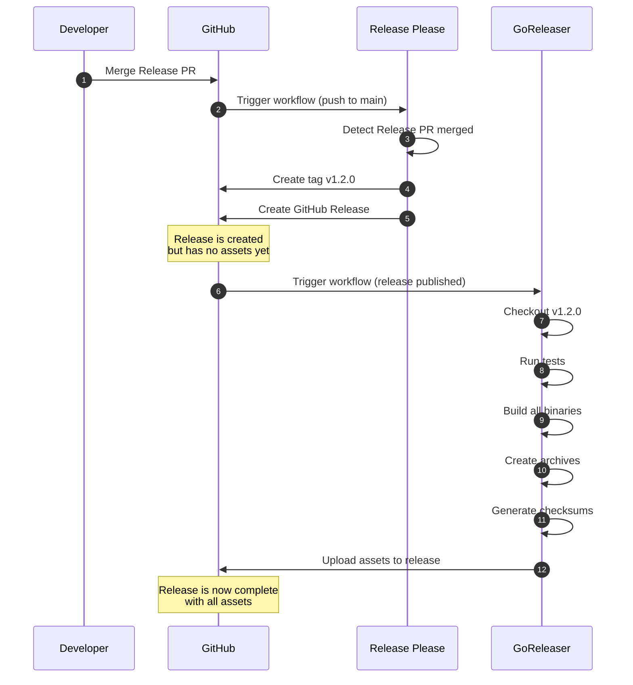

### Release Body Customization

#### Default Body

By default, the release body is the CHANGELOG content:

```markdown
## [1.2.0](https://github.com/user/repo/compare/v1.1.0...v1.2.0) (2024-01-15)

### Features

* **api:** add GraphQL endpoint

### Bug Fixes

* **parser:** handle unicode
```

#### Custom Header

In `.goreleaser.yaml`:

```yaml
release:
  header: |
    ## Release {{ .Tag }}

    Full changelog: [CHANGELOG.md](https://github.com/user/repo/blob/{{ .Tag }}/CHANGELOG.md)

    ### Installation

    **macOS (Homebrew)**:
    ```bash
    brew install user/tap/ado
    ```

    **Linux/macOS (curl)**:
    ```bash
    curl -sSL https://raw.githubusercontent.com/user/repo/main/install.sh | bash
    ```

    **Windows (Scoop)**:
    ```powershell
    scoop install ado
    ```
```

#### Footer

```yaml
release:
  footer: |
    ---

    **Docker**: `docker pull ghcr.io/user/repo:{{ .Version }}`

    **Verification**:
    ```bash
    # Verify checksum
    sha256sum -c checksums.txt --ignore-missing

    # Verify attestation
    gh attestation verify ado_{{ .Version }}_linux_amd64.tar.gz --owner user
    ```

    **Full documentation**: https://docs.example.com
```

### Asset Management

#### Assets Uploaded by GoReleaser

```
Release v1.2.0
├─ ado_1.2.0_linux_amd64.tar.gz        (binary archive)
├─ ado_1.2.0_linux_arm64.tar.gz
├─ ado_1.2.0_darwin_amd64.tar.gz
├─ ado_1.2.0_darwin_arm64.tar.gz
├─ ado_1.2.0_windows_amd64.zip
├─ ado_1.2.0_windows_arm64.zip
├─ checksums.txt                        (SHA256 checksums)
└─ multiple-attestation-*.jsonl         (SLSA attestations)
```

#### Extra Assets

Upload additional files:

```yaml
release:
  extra_files:
    - glob: ./dist/*.deb
    - glob: ./dist/*.rpm
    - glob: ./install.sh
```

### Pre-releases

#### Automatic Pre-release Detection

```yaml
release:
  prerelease: auto
```

**Auto-detected as pre-release**:
- `v0.1.0` (any v0.x.x version)
- `v1.2.3-rc.1` (release candidates)
- `v1.2.3-alpha.1` (alpha versions)
- `v1.2.3-beta.2` (beta versions)

**Marked as stable**:
- `v1.0.0`
- `v1.2.3`
- `v2.0.0`

#### Manual Pre-release

```yaml
release:
  prerelease: true  # All releases marked pre-release
```

Or via commit message:
```bash
git commit -m "feat: new feature

RELEASE AS: 1.2.3-rc.1"
```

### Draft Releases

```yaml
release:
  draft: true
```

**Creates draft releases** that must be manually published.

**Use case**: Review release before making public.

**Workflow**:
1. GoReleaser creates draft release with assets
2. Review assets and release notes
3. Manually publish via UI or API

```bash
# Publish draft release
gh release edit v1.2.0 --draft=false
```

### Release Notes Enhancement

#### Auto-Generated Contributors

```yaml
release:
  github:
    owner: user
    name: repo
  footer: |
    ## Contributors

    {{ range .Contributors }}
    * @{{ .Login }}
    {{ end }}
```

**Note**: GoReleaser can include contributor list based on commits since last release.

#### Linking PRs and Issues

Release-please automatically links PRs:

```markdown
### Features

* **api:** add GraphQL ([#123](https://github.com/user/repo/pull/123))
```

This creates clickable links to the PR.

### Viewing Releases

```bash
# List releases
gh release list

# View specific release
gh release view v1.2.0

# Download release assets
gh release download v1.2.0

# Download specific asset
gh release download v1.2.0 -p 'ado_1.2.0_linux_amd64.tar.gz'
```

---

## Publishing Workflows

### Complete Publishing Pipeline

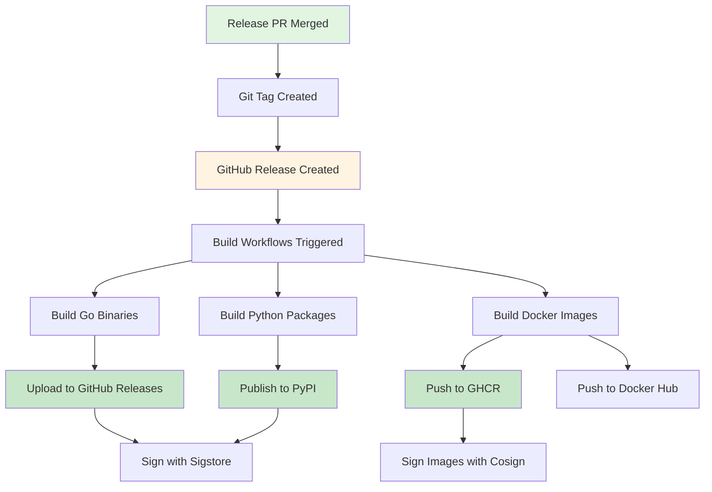

### GitHub Releases Publishing

**Handled by GoReleaser** (see Build Automation - Go section).

Assets uploaded:
- Binaries for all platforms
- Archives (tar.gz, zip)
- Checksums
- SLSA attestations

### PyPI Publishing

**Complete workflow** in `.github/workflows/pypi-publish.yml`:

```yaml
name: Publish to PyPI

on:
  release:
    types: [published]

permissions:
  contents: read
  id-token: write  # For trusted publishing

jobs:
  publish:
    name: Publish to PyPI
    runs-on: ubuntu-latest
    environment: release  # Optional: use GitHub environment

    steps:
      - name: Checkout code
        uses: actions/checkout@v4

      - name: Set up Python
        uses: actions/setup-python@v5
        with:
          python-version: "3.11"

      - name: Install build tools
        run: |
          python -m pip install --upgrade pip
          pip install build twine

      - name: Build distributions
        run: python -m build

      - name: Check distributions
        run: twine check dist/*

      # Option 1: API Token Authentication
      - name: Publish to PyPI (with token)
        if: ${{ !env.USE_TRUSTED_PUBLISHING }}
        env:
          TWINE_USERNAME: __token__
          TWINE_PASSWORD: ${{ secrets.PYPI_TOKEN }}
        run: twine upload dist/*

      # Option 2: Trusted Publishing (Recommended)
      - name: Publish to PyPI (trusted publishing)
        if: ${{ env.USE_TRUSTED_PUBLISHING }}
        uses: pypa/gh-action-pypi-publish@release/v1
```

#### PyPI Trusted Publishing

**Recommended approach** - no API token needed!

**Setup**:
1. Go to PyPI project settings
2. Navigate to "Publishing" tab
3. Add GitHub Actions publisher:
   - Owner: `your-username`
   - Repository: `your-repo`
   - Workflow: `pypi-publish.yml`
   - Environment: `release` (optional)

**Benefits**:
- No long-lived tokens
- Automatic token rotation
- Better security
- Simpler configuration

**Usage**:
```yaml
- name: Publish to PyPI
  uses: pypa/gh-action-pypi-publish@release/v1
```

That's it! No credentials needed.

### Container Registry Publishing

#### GitHub Container Registry (GHCR)

**Authentication** (in GoReleaser workflow):

```yaml
- name: Login to GHCR
  uses: docker/login-action@v3
  with:
    registry: ghcr.io
    username: ${{ github.actor }}
    password: ${{ secrets.GITHUB_TOKEN }}
```

**Publishing** handled by GoReleaser's docker configuration.

#### Docker Hub

**Additional authentication**:

```yaml
- name: Login to Docker Hub
  uses: docker/login-action@v3
  with:
    username: ${{ secrets.DOCKERHUB_USERNAME }}
    password: ${{ secrets.DOCKERHUB_TOKEN }}
```

**Secrets to create**:
- `DOCKERHUB_USERNAME`: Your Docker Hub username
- `DOCKERHUB_TOKEN`: Access token from Docker Hub

**GoReleaser config**:
```yaml
dockers:
  - image_templates:
      - "username/repo:{{ .Version }}"
      - "username/repo:latest"
      - "ghcr.io/user/repo:{{ .Version }}"
      - "ghcr.io/user/repo:latest"
```

Pushes to BOTH registries.

### Homebrew Tap Publishing

**For macOS distribution**:

```yaml
brews:
  - repository:
      owner: user
      name: homebrew-tap
      token: "{{ .Env.HOMEBREW_TAP_GITHUB_TOKEN }}"
    folder: Formula
    homepage: "https://github.com/user/repo"
    description: "CLI development tool"
    license: "MIT"

    # Test the installation
    test: |
      system "#{bin}/ado --version"

    # Installation script
    install: |
      bin.install "ado"
```

**Setup**:
1. Create `homebrew-tap` repository
2. Create GitHub token with `repo` scope
3. Add as `HOMEBREW_TAP_GITHUB_TOKEN` secret
4. GoReleaser will automatically commit formula

**Users install**:
```bash
brew tap user/tap
brew install ado
```

### Verification Publishing

Publish verification instructions alongside releases.

**SECURITY.md**:
```markdown
# Security

## Verifying Releases

All releases are signed and include cryptographic attestations.

### Verify Checksums

```bash
# Download checksums
curl -LO https://github.com/user/repo/releases/download/v1.2.0/checksums.txt

# Verify
sha256sum -c checksums.txt --ignore-missing
```

### Verify Build Provenance

```bash
# Requires GitHub CLI
gh attestation verify ado_1.2.0_linux_amd64.tar.gz --owner user
```

### Verify Container Images

```bash
# Install cosign
brew install cosign

# Verify
cosign verify ghcr.io/user/repo:1.2.0 \
  --certificate-identity-regexp="https://github.com/user/repo/" \
  --certificate-oidc-issuer="https://token.actions.githubusercontent.com"
```
```

---

## Troubleshooting Release Issues

### Common Issues and Solutions

#### Issue: Release PR Not Created

**Symptoms**:
- Merged PR but no Release PR appeared
- Expected version bump didn't happen

**Causes & Solutions**:

**1. Non-Releasable Commits**

Only these commit types trigger releases:
- `feat` → MINOR bump
- `fix` → PATCH bump
- `perf` → PATCH bump
- `revert` → PATCH bump
- Breaking changes → MAJOR bump

These DON'T trigger releases alone:
- `docs`, `test`, `chore`, `style`, `ci`, `build`, `refactor`

**Check**:
```bash
git log --oneline -10
```

**Solution**: Commits will be included in next release triggered by `feat`/`fix`.

**2. Invalid Commit Format**

```bash
# ❌ Wrong
Updated README
Added new feature
fix bug in parser

# ✅ Right
docs: update README
feat: add new feature
fix: resolve parser bug
```

**Check commit message**:
```bash
git log -1 --format="%B"
```

**Solution**: Ensure commits follow conventional commit format. Install commit-msg hook to enforce this.

**3. Configuration Error**

**Check workflow runs**:
```bash
gh run list --workflow=release-please.yml --limit 5
gh run view <run-id> --log
```

**Common config issues**:
- Wrong `release-type`
- Invalid JSON in `release-please-config.json`
- Incorrect package path

**Validate config**:
```bash
# Check JSON validity
cat release-please-config.json | jq .

# Check manifest
cat .release-please-manifest.json | jq .
```

#### Issue: GoReleaser Fails

**Symptoms**:
- Release created but no assets
- Build workflow failed

**Causes & Solutions**:

**1. Tests Failing**

GoReleaser runs tests before building. If tests fail, no binaries are created.

**Check**:
```bash
# Run tests locally
go test ./...

# Check workflow logs
gh run view <run-id> --log
```

**Solution**: Fix failing tests, then re-run workflow:
```bash
gh workflow run goreleaser.yml -f tag=v1.2.0
```

**2. Invalid .goreleaser.yaml**

**Validate config**:
```bash
goreleaser check
```

**Common errors**:
- Invalid YAML syntax
- Unknown fields
- Missing required fields

**3. Docker Build Fails**

**Check Docker setup**:
```bash
# Test locally
docker buildx create --use
goreleaser release --snapshot --clean
```

**Common causes**:
- Missing Dockerfile
- Invalid build context
- Platform not supported

**4. Permission Issues**

**Check permissions** in workflow:
```yaml
permissions:
  contents: write      # Required for uploading assets
  packages: write      # Required for GHCR
  id-token: write      # Required for signing
  attestations: write  # Required for attestations
```

#### Issue: Version Not Bumped Correctly

**Symptoms**:
- Expected MINOR bump but got PATCH
- Expected MAJOR bump but got MINOR

**Causes & Solutions**:

**1. Pre-1.0.0 Behavior**

Before v1.0.0, with `bump-minor-pre-major: true`:
- Breaking changes → MINOR (0.1.0 → 0.2.0)
- Features → MINOR
- Fixes → PATCH

**Solution**: This is expected. To reach 1.0.0:
```bash
git commit --allow-empty -m "feat: release 1.0.0

RELEASE AS: 1.0.0"
```

**2. Missing Breaking Change Indicator**

```bash
# ❌ Breaking change but no indicator
feat: change API response format

# ✅ Correct
feat!: change API response format

# ✅ Also correct
feat: change API response format

BREAKING CHANGE: API response format changed from XML to JSON
```

**3. Multiple Commit Types**

If you have both `feat` and `fix`, `feat` wins (MINOR bump).

If you have breaking change, it always wins (MAJOR bump).

#### Issue: CHANGELOG Missing Commits

**Symptoms**:
- Some commits not in CHANGELOG
- Expected section missing

**Causes & Solutions**:

**1. Hidden Sections**

Check `changelog-sections`:
```json
{"type": "test", "section": "Tests", "hidden": true}
```

**Solution**: Remove `"hidden": true` or set to `false`.

**2. Commits After Last Release**

Only commits since last release are included.

**Check last release**:
```bash
git describe --tags --abbrev=0
git log <last-tag>..HEAD --oneline
```

**3. Squash Merge Issues**

If using squash merge, ensure PR title follows conventional commits:

```
feat(api): add GraphQL support (#123)
```

**GitHub Settings**: Ensure "Default commit message" for squash merges uses "Pull request title".

#### Issue: Container Images Not Published

**Symptoms**:
- Release successful but Docker images missing
- Images not in registry

**Causes & Solutions**:

**1. Registry Authentication Failed**

**Check workflow logs** for authentication errors.

**For GHCR**:
```yaml
- name: Login to GHCR
  uses: docker/login-action@v3
  with:
    registry: ghcr.io
    username: ${{ github.actor }}
    password: ${{ secrets.GITHUB_TOKEN }}  # NOT app token!
```

**Important**: Use `GITHUB_TOKEN`, not GitHub App token for Docker registry.

**2. Buildx Not Set Up**

```yaml
- name: Set up QEMU
  uses: docker/setup-qemu-action@v3

- name: Set up Docker Buildx
  uses: docker/setup-buildx-action@v3
```

**3. Missing Permissions**

```yaml
permissions:
  packages: write  # Required for pushing to GHCR
```

#### Issue: Signing Failed

**Symptoms**:
- Build successful but signing failed
- cosign errors in logs

**Causes & Solutions**:

**1. Missing id-token Permission**

```yaml
permissions:
  id-token: write  # Required for keyless signing
```

**2. Wrong Tag Format**

GoReleaser uses version WITHOUT 'v' prefix in Docker tags:

```bash
# GitHub tag: v1.2.3
# Docker tag: 1.2.3  (not v1.2.3)

# Signing:
VERSION="${GIT_TAG#v}"  # Strip 'v' prefix
cosign sign --yes "${REGISTRY}:${VERSION}"
```

**3. Cosign Not Installed**

```yaml
- name: Install cosign
  uses: sigstore/cosign-installer@v3
```

### Debugging Workflows

#### View Workflow Runs

```bash
# List recent runs
gh run list --limit 10

# Filter by workflow
gh run list --workflow=goreleaser.yml --limit 5

# View specific run
gh run view <run-id>

# View logs
gh run view <run-id> --log

# View failed jobs
gh run view <run-id> --log-failed
```

#### Re-running Workflows

**Re-run failed jobs**:
```bash
gh run rerun <run-id> --failed
```

**Re-run entire workflow**:
```bash
gh run rerun <run-id>
```

**Manually trigger GoReleaser**:
```bash
gh workflow run goreleaser.yml -f tag=v1.2.0
```

#### Local Testing

**Test GoReleaser locally**:
```bash
# Check config
goreleaser check

# Snapshot release (no tag needed)
goreleaser release --snapshot --clean --skip-publish

# Test Docker builds
goreleaser release --snapshot --clean --skip-publish \
  --config .goreleaser.yaml
```

**Test release-please locally**:

Release-please doesn't have a great local testing story. Best approach:

1. Fork repository
2. Test on fork
3. Apply learnings to main repo

#### Workflow Debugging Tips

**1. Add debug output**:
```yaml
- name: Debug information
  run: |
    echo "Event: ${{ github.event_name }}"
    echo "Ref: ${{ github.ref }}"
    echo "Tag: ${{ github.ref_name }}"
    git describe --tags --abbrev=0
    git log -5 --oneline
```

**2. Enable debug logging**:

Repository Settings → Secrets → Add:
- `ACTIONS_RUNNER_DEBUG` = `true`
- `ACTIONS_STEP_DEBUG` = `true`

**3. Use act for local testing**:
```bash
# Install act (runs GitHub Actions locally)
brew install act

# Run workflow locally
act push
act release
```

### Recovery Procedures

#### Fixing a Bad Release

**Scenario**: Released v1.2.0 but it has critical bug.

**Option 1: Yank Release**

```bash
# Delete release (keeps tag)
gh release delete v1.2.0

# Delete tag
git push origin :refs/tags/v1.2.0
```

**Then**:
1. Fix bug
2. Update `.release-please-manifest.json` back to `1.1.0`
3. Create fix PR
4. Merge to trigger new release

**Option 2: Patch Release**

Don't delete bad release. Instead:

1. Create hotfix PR with `fix:` commit
2. Merge to create v1.2.1 patch release
3. Document in CHANGELOG

#### Skipping Failed CI Release

If Release PR was created but you don't want to release:

**Option 1: Close Release PR**
```bash
gh pr close <release-pr-number>
```

Next releasable commit will create new Release PR.

**Option 2: Edit manifest**

If you need to reset version:

```json
{
  ".": "1.1.0"
}
```

Commit this to main.

#### Forcing a Specific Version

```bash
# Create empty commit with version override
git commit --allow-empty -m "chore: release

RELEASE AS: 2.0.0"

git push origin main
```

This forces version to 2.0.0 regardless of conventional commit rules.

---

## Advanced Patterns

### Monorepo Release Automation

For repositories with multiple packages:

#### Configuration

**release-please-config.json**:
```json
{
  "$schema": "https://raw.githubusercontent.com/googleapis/release-please/main/schemas/config.json",
  "packages": {
    "packages/frontend": {
      "release-type": "node",
      "package-name": "frontend",
      "changelog-path": "CHANGELOG.md"
    },
    "packages/backend": {
      "release-type": "python",
      "package-name": "backend",
      "changelog-path": "CHANGELOG.md"
    }
  },
  "separate-pull-requests": true,
  "include-component-in-tag": true
}
```

**.release-please-manifest.json**:
```json
{
  "packages/frontend": "2.3.1",
  "packages/backend": "1.8.7"
}
```

#### Workflow Behavior

**Separate PRs** (`separate-pull-requests: true`):
- Each package gets its own Release PR
- Can release independently
- Tags: `frontend-v2.3.2`, `backend-v1.8.8`

**Combined PR** (`separate-pull-requests: false`):
- One Release PR for all packages
- Coordinated releases
- Tags: `frontend-v2.3.2`, `backend-v1.8.8` (created together)

#### Path-Based Triggering

Release only when specific paths change:

**workflows/release-frontend.yml**:
```yaml
on:
  push:
    branches:
      - main
    paths:
      - 'packages/frontend/**'

jobs:
  release-please:
    runs-on: ubuntu-latest
    steps:
      - uses: googleapis/release-please-action@v4
        with:
          config-file: release-please-config.json
          manifest-file: .release-please-manifest.json
          path: packages/frontend
```

### Custom Release Strategies

#### Release Branches

For maintaining multiple release lines:

**Example**: Support both v1.x and v2.x

**Workflow**:
```yaml
on:
  push:
    branches:
      - main          # v2.x releases
      - release/1.x   # v1.x maintenance releases
```

**Configuration**:
```json
{
  "branches": ["main", "release/1.x"]
}
```

#### Release Candidates

**Automated RC Creation**:

```yaml
on:
  push:
    branches:
      - main
      - next        # RC branch

jobs:
  release-please:
    runs-on: ubuntu-latest
    steps:
      - uses: googleapis/release-please-action@v4
        with:
          release-type: go
          prerelease: ${{ github.ref == 'refs/heads/next' }}
          prerelease-type: rc
```

**Results**:
- `main` → `v1.2.0`
- `next` → `v1.3.0-rc.1`, `v1.3.0-rc.2`, ...

### Integration with Package Managers

#### npm Integration

**package.json** automatically updated:

```json
{
  "version": "1.2.3",
  "scripts": {
    "postversion": "npm publish"
  }
}
```

**Workflow**:
```yaml
- name: Publish to npm
  run: npm publish
  env:
    NODE_AUTH_TOKEN: ${{ secrets.NPM_TOKEN }}
```

#### Cargo Integration

**Cargo.toml** updated by release-please:

```toml
[package]
version = "1.2.3"
```

**Workflow**:
```yaml
- name: Publish to crates.io
  run: cargo publish
  env:
    CARGO_REGISTRY_TOKEN: ${{ secrets.CARGO_TOKEN }}
```

### Automated Dependency Updates

Integrate Dependabot with release automation:

**.github/dependabot.yml**:
```yaml
version: 2
updates:
  - package-ecosystem: "gomod"
    directory: "/"
    schedule:
      interval: "weekly"
    commit-message:
      prefix: "build"
      prefix-development: "build"
      include: "scope"
```

**Result**: Dependabot creates PRs with:
```
build(deps): bump golang.org/x/text from 0.13.0 to 0.14.0
```

This triggers PATCH release automatically when merged.

### Release Notifications

#### Slack Integration

**workflow**:
```yaml
- name: Notify Slack
  if: ${{ steps.release.outputs.release_created }}
  uses: slackapi/slack-github-action@v1
  with:
    payload: |
      {
        "text": "New release: ${{ steps.release.outputs.tag_name }}",
        "blocks": [
          {
            "type": "section",
            "text": {
              "type": "mrkdwn",
              "text": "*Release ${{ steps.release.outputs.tag_name }}*\n${{ steps.release.outputs.html_url }}"
            }
          }
        ]
      }
  env:
    SLACK_WEBHOOK_URL: ${{ secrets.SLACK_WEBHOOK }}
```

#### Discord Integration

```yaml
- name: Notify Discord
  if: ${{ steps.release.outputs.release_created }}
  uses: sarisia/actions-status-discord@v1
  with:
    webhook: ${{ secrets.DISCORD_WEBHOOK }}
    title: "New Release: ${{ steps.release.outputs.tag_name }}"
    description: "Check it out: ${{ steps.release.outputs.html_url }}"
```

### Metrics and Analytics

Track release frequency and velocity:

**workflow**:
```yaml
- name: Record release metrics
  if: ${{ steps.release.outputs.release_created }}
  run: |
    curl -X POST https://metrics.example.com/releases \
      -H "Content-Type: application/json" \
      -d '{
        "version": "${{ steps.release.outputs.tag_name }}",
        "timestamp": "${{ github.event.head_commit.timestamp }}",
        "commits": ${{ steps.release.outputs.pr }}
      }'
```

**Track**:
- Release frequency
- Time between releases
- Commits per release
- Breaking changes frequency

---

## Summary

### Quick Reference Card

#### Release Flow

```
1. Developer merges PR (feat/fix/etc)
2. Release Please creates/updates Release PR
3. Developer merges Release PR (when ready)
4. Tag created, GitHub Release created
5. Build workflows trigger
6. Binaries built and uploaded
7. Docker images built and pushed
8. Everything signed and verified
```

#### Essential Configurations

**release-please-config.json**:
```json
{
  "packages": {".": {"release-type": "go"}},
  "include-v-in-tag": true
}
```

**.release-please-manifest.json**:
```json
{".": "0.0.0"}
```

**.goreleaser.yaml**:
```yaml
version: 2
project_name: myproject
builds:
  - binary: myproject
    main: ./cmd/myproject
    env: [CGO_ENABLED=0]
    goos: [linux, darwin, windows]
    goarch: [amd64, arm64]
```

#### Commit Message Cheat Sheet

```bash
feat: new feature           # MINOR bump
fix: bug fix               # PATCH bump
feat!: breaking change     # MAJOR bump
build(deps): update deps   # No bump (included in next release)
docs: update docs          # No bump
```

#### Commands

```bash
# Check release PR
gh pr list --label "autorelease: pending"

# View release
gh release view v1.2.0

# Download assets
gh release download v1.2.0

# Verify attestation
gh attestation verify file.tar.gz --owner user

# Re-run workflow
gh workflow run goreleaser.yml -f tag=v1.2.0
```

### Next Steps

1. **Implement**: Start with basic release-please + GoReleaser setup
2. **Test**: Create test releases in a sandbox repo
3. **Secure**: Add signing and attestations (Chapter 3)
4. **Iterate**: Add Docker, Homebrew, etc. as needed
5. **Monitor**: Track metrics and improve

**Further Reading**:
- [Release Please Documentation](https://github.com/googleapis/release-please)
- [GoReleaser Documentation](https://goreleaser.com/)
- [Conventional Commits Spec](https://www.conventionalcommits.org/)
- [Semantic Versioning](https://semver.org/)

---

**You now have a complete understanding of release automation. Zero-touch releases are within reach!**
