# Chapter 8: Troubleshooting Guide and Common Pitfalls

> A comprehensive reference for diagnosing and resolving issues across the entire CI/CD pipeline, from local git hooks to production releases.

## Table of Contents

- [How to Use This Guide](#how-to-use-this-guide)
- [Quick Diagnostic Decision Tree](#quick-diagnostic-decision-tree)
- [Git Hook Failures](#git-hook-failures)
- [Coverage Failures](#coverage-failures)
- [CI Pipeline Failures](#ci-pipeline-failures)
- [Release Automation Issues](#release-automation-issues)
- [Build Failures](#build-failures)
- [Container Issues](#container-issues)
- [Publishing Failures](#publishing-failures)
- [Security Verification Failures](#security-verification-failures)
- [Integration Issues](#integration-issues)
- [Performance Problems](#performance-problems)
- [Merge Conflicts](#merge-conflicts)
- [Common Pitfalls](#common-pitfalls)
- [Emergency Procedures](#emergency-procedures)
- [Debug Tools and Commands](#debug-tools-and-commands)

---

## How to Use This Guide

This guide is organized by **failure location** rather than symptom. Use this approach:

1. **Identify where the failure occurs**: Local hooks, CI, release automation, etc.
2. **Find the relevant section** below
3. **Follow the diagnostic steps** to identify root cause
4. **Apply the solution** and verify the fix

### Severity Indicators

Throughout this guide, you'll see these indicators:

- 🟢 **Low Severity**: Can be fixed later, doesn't block work
- 🟡 **Medium Severity**: Blocks specific workflow, workaround available
- 🔴 **High Severity**: Blocks all work, immediate fix required
- 🚨 **Critical**: Production issue, requires emergency procedures

### When to Ask for Help

Ask for help when:
- ✅ You've tried the solutions in this guide
- ✅ The error message is not documented here
- ✅ You've checked GitHub Actions logs thoroughly
- ✅ The issue affects the entire team, not just your local setup

Use workarounds/bypasses when:
- 🚨 Production is broken
- 🚨 Critical hotfix needed
- 🚨 CI infrastructure issues (GitHub down)

---

## Quick Diagnostic Decision Tree

Use this flowchart to quickly navigate to the right section:


---

## Git Hook Failures

Git hooks are your first line of defense. They run locally before code reaches GitHub.

### commit-msg Hook Failures

**Location**: `.githooks/commit-msg`
**Trigger**: After `git commit` (validates commit message format)

#### Symptom: "Invalid commit message format"

```
ERROR: Invalid commit message format

Your message:
  Added new feature

Expected format:
  <type>[(scope)][!]: <description>
```

**Severity**: 🟡 Medium (blocks commit)

**Root Causes**:

1. **Missing type prefix**
   - Your message: `Added new feature`
   - Correct: `feat: add new feature`

2. **Wrong type**
   - Your message: `feature: add new feature`
   - Correct: `feat: add new feature`
   - Valid types: `feat`, `fix`, `docs`, `style`, `refactor`, `perf`, `test`, `build`, `ci`, `chore`

3. **Missing colon**
   - Your message: `feat add new feature`
   - Correct: `feat: add new feature`

4. **Description too short**
   - Your message: `feat: add auth`
   - Correct: `feat: add authentication system`
   - Minimum: 10 characters after the colon

**Solutions**:

```bash
# Check your commit message format
git log --oneline -1

# Amend your commit message (if just committed)
git commit --amend

# See the pattern validation in the hook
cat .githooks/commit-msg | grep PATTERN
```

**Pattern Explained**:

```regex
^(feat|fix|docs|style|refactor|perf|test|build|ci|chore)(\([a-zA-Z0-9_-]+\))?\!?: .{1,}
```

- `^` - Start of line
- `(feat|fix|...)` - One of the valid types (required)
- `(\([a-zA-Z0-9_-]+\))?` - Optional scope in parentheses
- `\!?` - Optional breaking change indicator
- `: ` - Colon and space (required)
- `.{1,}` - At least 1 character for description

**Valid Examples**:

```
✅ feat: add user authentication
✅ fix(auth): resolve token expiration bug
✅ feat!: breaking change to API
✅ docs: update installation instructions
✅ refactor(core): simplify config loading
```

**Invalid Examples**:

```
❌ Added feature (no type)
❌ feature: add auth (wrong type - should be 'feat')
❌ feat add auth (missing colon)
❌ feat: add (description too short)
❌ feat(scope: add feature (missing closing parenthesis)
```

#### Symptom: Hook not running at all

```bash
# You commit with invalid format, but no error appears
git commit -m "bad format"
# [main abc1234] bad format  <-- Should have been blocked!
```

**Severity**: 🟡 Medium (hooks not enforced)

**Root Causes**:

1. **Hooks not installed**
2. **Hooks path not configured**
3. **Hook file not executable**

**Diagnostic Commands**:

```bash
# Check if hooks are configured
git config core.hooksPath
# Expected: .githooks

# Check if hook file exists and is executable
ls -la .githooks/commit-msg
# Expected: -rwxr-xr-x (executable bit set)

# Test hook manually
.githooks/commit-msg .git/COMMIT_EDITMSG
```

**Solutions**:

```bash
# Install hooks
make hooks.install

# Or manually
git config core.hooksPath .githooks

# Make hook executable if needed
chmod +x .githooks/commit-msg
chmod +x .githooks/pre-push

# Verify installation
make hooks.status
```

#### Bypassing commit-msg Hook (Emergency Only)

```bash
# Skip the hook (NOT RECOMMENDED)
git commit --no-verify -m "emergency fix"

# Better: Fix the message format
git commit -m "fix: emergency authentication issue"
```

**Warning**: Bypassing commit-msg means:
- CI PR title validation will fail
- Release-please won't correctly categorize the commit
- CHANGELOG generation will be incorrect

---

### pre-push Hook Failures

**Location**: `.githooks/pre-push`
**Trigger**: Before `git push` (runs tests, coverage check, build)

The pre-push hook runs three checks:


#### Symptom: "Tests failed"

```
▸ Running tests with race detector...

ERROR: Tests failed
Fix the failing tests before pushing.
```

**Severity**: 🔴 High (blocks push, code is broken)

**Diagnostic Steps**:

```bash
# Run tests locally with same flags as hook
go test -race -timeout 60s ./cmd/ado/... ./internal/...

# Run with verbose output to see which test failed
go test -v -race -timeout 60s ./cmd/ado/... ./internal/...

# Run specific test file
go test -v -race ./internal/config/...

# Run specific test
go test -v -race -run TestValidate ./internal/config/...
```

**Common Root Causes**:

1. **Race condition detected**
   ```
   WARNING: DATA RACE
   Read at 0x00c0000a8000 by goroutine 7:
   ```
   - **Solution**: Fix concurrent access to shared variables
   - Use channels or sync.Mutex
   - See [Go race detector docs](https://go.dev/doc/articles/race_detector)

2. **Test timeout**
   ```
   panic: test timed out after 60s
   ```
   - **Solution**: Reduce test complexity or increase timeout
   - Check for infinite loops or deadlocks

3. **Environment-specific failure**
   ```
   TestConfigPath failed: expected /home/user/.config, got /Users/user/.config
   ```
   - **Solution**: Use `filepath.Join()` for cross-platform paths
   - Check test assumptions about environment

**Solutions**:

```bash
# Fix the tests and verify
go test -race -timeout 60s ./cmd/ado/... ./internal/...

# If tests pass, try pushing again
git push

# Emergency bypass (NOT RECOMMENDED)
git push --no-verify
```

#### Symptom: "Coverage below 80% threshold"

```
▸ Checking coverage threshold (80%)...

ERROR: Coverage 78.5% is below 80% threshold
Add tests to improve coverage before pushing.
```

**Severity**: 🟡 Medium (blocks push, but code works)

**Diagnostic Steps**:

```bash
# Run coverage check locally
make go.test.cover

# Generate HTML report to see uncovered lines
make go.test.cover.html
open coverage.html

# Check coverage by package
go test -coverprofile=coverage.out ./cmd/ado/... ./internal/...
go tool cover -func=coverage.out
```

**Example Output**:

```
github.com/anowarislam/ado/internal/config/config.go:10:    Load        100.0%
github.com/anowarislam/ado/internal/config/config.go:20:    Validate     85.7%
github.com/anowarislam/ado/internal/config/paths.go:15:     ResolvePath  66.7%  ← Low!
total:                                                       (statements)  78.5%
```

**Root Causes**:

1. **New code added without tests**
   - You added a new function but didn't test it

2. **Error paths not tested**
   - Happy path tested, but error handling isn't

3. **Edge cases missing**
   - Only common cases tested

**Solutions**:

```bash
# 1. Identify uncovered code (see HTML report)
make go.test.cover.html
open coverage.html  # Red lines = not covered

# 2. Add tests for uncovered lines
# Focus on the lowest-coverage files first

# 3. Verify new coverage
make go.test.cover.check

# 4. Commit test improvements
git add internal/config/paths_test.go
git commit -m "test(config): improve path resolution coverage to 90%"
git push
```

**Pattern: Table-Driven Tests for Coverage**

```go
func TestResolvePath(t *testing.T) {
    tests := []struct {
        name    string
        input   string
        want    string
        wantErr bool
    }{
        {
            name:  "absolute path",
            input: "/etc/config",
            want:  "/etc/config",
        },
        {
            name:  "relative path",
            input: "config",
            want:  filepath.Join(os.Getenv("HOME"), ".config", "ado", "config"),
        },
        {
            name:    "empty path",
            input:   "",
            wantErr: true,
        },
        // Add more cases to cover all branches
    }

    for _, tt := range tests {
        t.Run(tt.name, func(t *testing.T) {
            got, err := ResolvePath(tt.input)
            if (err != nil) != tt.wantErr {
                t.Errorf("ResolvePath() error = %v, wantErr %v", err, tt.wantErr)
                return
            }
            if got != tt.want {
                t.Errorf("ResolvePath() = %v, want %v", got, tt.want)
            }
        })
    }
}
```

#### Symptom: "Build failed"

```
▸ Verifying build...

ERROR: Build failed
Fix build errors before pushing.
```

**Severity**: 🔴 High (blocks push, code doesn't compile)

**Diagnostic Steps**:

```bash
# Build manually to see full error
go build -o /dev/null ./cmd/ado

# Check for syntax errors
go vet ./cmd/ado/... ./internal/...

# Format check
gofmt -l .
```

**Common Errors**:

1. **Undefined identifier**
   ```
   internal/config/config.go:45:9: undefined: utils.ParsePath
   ```
   - Missing import or typo in function name

2. **Import cycle**
   ```
   import cycle not allowed
   package github.com/anowarislam/ado/internal/config
       imports github.com/anowarislam/ado/internal/meta
       imports github.com/anowarislam/ado/internal/config
   ```
   - Refactor to break the cycle (extract to separate package)

3. **Type mismatch**
   ```
   cannot use cfg (type Config) as type *Config in argument
   ```
   - Add `&` to take address: `&cfg`

**Solutions**:

```bash
# Fix compilation errors
# Verify build works
go build ./cmd/ado

# Commit fixes
git add .
git commit -m "fix: resolve build errors in config package"
git push
```

#### Bypassing pre-push Hook (Emergency Only)

```bash
# Skip all pre-push checks
git push --no-verify

# Better: Fix the underlying issue
make test        # Run tests
make go.test.cover.check  # Check coverage
make build       # Verify build
git push         # Push with confidence
```

**Warning**: Bypassing pre-push means:
- Broken tests might reach CI
- Coverage might drop below threshold in CI
- Build might fail in CI
- You'll waste time waiting for CI to tell you what the hook would have caught instantly

---

## Coverage Failures

Coverage failures can occur in two places: locally (pre-push hook) and in CI. Both use the same 80% threshold.

### Understanding Coverage Calculation

```mermaid
graph LR
    A[Source Code] --> B[Instrumented Code]
    B --> C[Test Execution]
    C --> D[Coverage Data]
    D --> E[Coverage Report]

    E --> F{Total Coverage}
    F -->|≥80%| G[✓ Pass]
    F -->|<80%| H[✗ Fail]

    style G fill:#e1f5e1
    style H fill:#ffe1e1
```



**How Coverage is Calculated**:

```bash
# Coverage = (Covered Statements) / (Total Statements) * 100

# Example:
# Total statements: 1000
# Covered statements: 850
# Coverage: 85.0%
```

### Coverage Measurement Issues

#### Symptom: Coverage differs between local and CI

```
Local:  82.5% ✓
CI:     79.8% ✗
```

**Severity**: 🟡 Medium (frustrating but fixable)

**Root Causes**:

1. **Different test packages included**
   - Local: Only testing `./internal/config`
   - CI: Testing `./cmd/ado/... ./internal/...`

2. **Platform-specific code**
   - Some code only runs on Linux (CI) or macOS (local)
   - Build tags affect what's compiled

3. **Cached test results**
   - Old coverage data mixed with new

**Diagnostic Commands**:

```bash
# Run EXACTLY same command as CI
go test -coverprofile=coverage.out -covermode=atomic ./cmd/ado/... ./internal/...
go tool cover -func=coverage.out | grep total

# Compare with CI command (see .github/workflows/ci.yml line 69)
cat .github/workflows/ci.yml | grep -A5 "go test"

# Clear test cache
go clean -testcache
```

**Solutions**:

```bash
# 1. Use make target to ensure consistency
make go.test.cover

# 2. Check coverage matches CI
make go.test.cover.check

# 3. If still different, check for platform-specific code
grep -r "//go:build" . --include="*.go"

# 4. Add tests for platform-specific code or mark as unreachable
```

#### Symptom: Coverage dropped after refactoring

```
Previous commit: 85.2%
Current commit:  78.9%
Diff:           -6.3% ❌
```

**Severity**: 🟡 Medium (you need to add tests)

**Root Causes**:

1. **Added new code without tests**
2. **Moved tested code to untested package**
3. **Deleted tests accidentally**

**Diagnostic Steps**:

```bash
# Compare coverage between commits
git stash
make go.test.cover
# Note the coverage percentage

git stash pop
make go.test.cover
# Compare the percentages

# See which files have coverage changes
make go.test.cover.html
# Open coverage.html and look for red (uncovered) lines

# Check git diff for deleted tests
git diff HEAD~1 -- '*_test.go'
```

**Solutions**:

1. **Add tests for new code**
2. **Restore accidentally deleted tests**
3. **Move tests along with code during refactoring**

```bash
# Generate coverage and identify gaps
make go.test.cover.html
open coverage.html

# Add tests for uncovered lines
# Focus on the functions shown in red

# Verify improvement
make go.test.cover.check
```

### Coverage Threshold Debates

**"Why 80%?"**

The 80% threshold is chosen because:
- ✅ High enough to catch most bugs
- ✅ Low enough to be achievable without busywork
- ✅ Industry standard for production code
- ❌ 100% coverage is usually wasteful (testing getters/setters)
- ❌ Below 70% provides insufficient safety

**Adjusting the Threshold**:

```bash
# In .githooks/pre-push line 60
if [ "$COVERAGE_INT" -lt 80 ]; then  # Change 80 to desired threshold

# In .github/workflows/ci.yml line 76
if [ "$COVERAGE_INT" -lt 80 ]; then  # Change 80 to desired threshold

# In make/go.mk line 76
if [ "$${COVERAGE%.*}" -lt 80 ]; then  # Change 80 to desired threshold
```

**Warning**: Lowering the threshold is a slippery slope. Every reduction must be justified and documented in an ADR.

---

## CI Pipeline Failures

CI failures occur in GitHub Actions after you push. The CI pipeline has four parallel jobs:

```mermaid
graph TB
    A[Push to GitHub] --> B[CI Workflow Triggered]

    B --> C[Commits Job]
    B --> D[Go Job]
    B --> E[Python Job]
    B --> F[Docs Job]
    B --> G[Docker Job]

    C --> H{All Pass?}
    D --> H
    E --> H
    F --> H
    G --> H

    H -->|Yes| I[✓ PR can merge]
    H -->|No| J[✗ PR blocked]

    style I fill:#e1f5e1
    style J fill:#ffe1e1
```



### Conventional Commits Job Failure

**File**: `.github/workflows/ci.yml` (lines 10-42)
**Runs on**: Pull requests only
**Purpose**: Validates PR title follows conventional commits

#### Symptom: "PR title does not follow Conventional Commits format"

```yaml
ERROR: PR title does not follow Conventional Commits format

Your title:
  Add new feature

Expected format:
  <type>[(scope)][!]: <description>

Valid types: feat, fix, docs, style, refactor, perf, test, build, ci, chore
```

**Severity**: 🟡 Medium (blocks PR merge)

**Root Cause**: PR title doesn't match the pattern (note: individual commit messages don't matter if you're using squash merge)

**Solutions**:

```bash
# Option 1: Edit PR title on GitHub
# Go to your PR page and click "Edit" next to the title

# Option 2: Use gh CLI
gh pr edit <pr-number> --title "feat: add new feature"

# Verify the pattern
echo "feat: add new feature" | grep -E "^(feat|fix|docs|style|refactor|perf|test|build|ci|chore)(\([a-zA-Z0-9_-]+\))?\!?: .{10,}"
```

**Why PR Title Matters**:

When using squash merge (default), GitHub creates a single commit with:
- **Commit message** = PR title
- **Commit body** = PR description + list of commits

This single commit is what release-please analyzes for version bumping and CHANGELOG generation.

**Valid PR Titles**:

```
✅ feat: add user authentication system
✅ fix(auth): resolve token expiration in production
✅ docs: update installation instructions
✅ refactor(core): simplify configuration loading
✅ feat!: change CLI flag syntax (breaking change)
```

**Invalid PR Titles**:

```
❌ Add feature (no type)
❌ Feature: add auth (wrong type - should be 'feat')
❌ feat add auth (missing colon)
❌ feat: add (description too short - min 10 chars)
```

---

### Go Job Failure

**File**: `.github/workflows/ci.yml` (lines 44-92)
**Steps**: Format check → Verify dependencies → Vet → Test → Coverage check → Build → Upload coverage

#### Symptom: Format check failed

```
▸ Format check
test -z "$(gofmt -l .)"
Error: Process completed with exit code 1.
```

**Severity**: 🟢 Low (easy to fix)

**Root Cause**: Go files not formatted with `gofmt`

**Diagnostic Locally**:

```bash
# Check which files need formatting
gofmt -l .

# Example output:
# internal/config/config.go
# internal/meta/info.go
```

**Solutions**:

```bash
# Format all Go files
make go.fmt
# or
go fmt ./...

# Verify formatting
gofmt -l .
# Should return nothing

# Commit and push
git add .
git commit -m "style: format Go code with gofmt"
git push
```

**Prevention**: Set up editor integration:

- **VS Code**: Install Go extension, enable "Format on Save"
- **GoLand**: Enabled by default
- **Vim**: Use `vim-go` with `:GoFmt` on save

#### Symptom: Verify dependencies failed

```
▸ Verify dependencies
go mod verify
go: github.com/spf13/cobra@v1.7.0: missing go.sum entry
Error: Process completed with exit code 1.
```

**Severity**: 🟡 Medium (security issue)

**Root Cause**: `go.sum` is out of sync with `go.mod`

**Solutions**:

```bash
# Download dependencies and update go.sum
go mod download
go mod verify

# If that doesn't work, regenerate go.sum
rm go.sum
go mod tidy

# Commit the updated go.sum
git add go.sum
git commit -m "build: update go.sum checksums"
git push
```

**Warning**: Never commit code without a corresponding `go.sum` entry. This breaks supply chain security.

#### Symptom: Vet failed

```
▸ Vet
make go.vet
internal/config/config.go:45:2: Printf call has possible formatting directive %d
Error: Process completed with exit code 1.
```

**Severity**: 🟡 Medium (potential bug)

**Root Cause**: `go vet` found suspicious code patterns

**Common vet Errors**:

1. **Printf formatting issues**
   ```go
   // Wrong
   fmt.Printf("User ID: %d", userIDString)  // %d expects int, got string

   // Correct
   fmt.Printf("User ID: %s", userIDString)
   ```

2. **Unreachable code**
   ```go
   // Wrong
   return nil
   fmt.Println("Done")  // Unreachable!

   // Correct
   fmt.Println("Done")
   return nil
   ```

3. **Composite literal with unkeyed fields**
   ```go
   // Wrong (fragile if struct changes)
   cfg := Config{"value", 123, true}

   // Correct
   cfg := Config{
       Name:    "value",
       Timeout: 123,
       Enabled: true,
   }
   ```

**Solutions**:

```bash
# Run vet locally
make go.vet

# Fix the issues reported
# Then commit
git add .
git commit -m "fix: resolve go vet warnings in config package"
git push
```

#### Symptom: Test failed (in CI but passed locally)

```
▸ Test
go test -coverprofile=coverage.out -covermode=atomic ./cmd/ado/... ./internal/...
--- FAIL: TestConfigLoad (0.00s)
    config_test.go:42: expected /etc/config, got /home/runner/.config/ado/config
Error: Process completed with exit code 1.
```

**Severity**: 🔴 High (environment-specific bug)

**Root Causes**:

1. **Hardcoded paths**
   - Test expects `/home/user/.config` but CI uses `/home/runner/.config`

2. **Environment variables**
   - `$HOME`, `$USER`, `$PWD` differ between local and CI

3. **File system differences**
   - CI uses Linux, you might use macOS or Windows

4. **Permissions**
   - CI runner has different file permissions

**Solutions**:

1. **Use platform-agnostic paths**
   ```go
   // Wrong
   configPath := "/home/user/.config/ado"

   // Correct
   configPath := filepath.Join(os.UserHomeDir(), ".config", "ado")
   ```

2. **Mock environment in tests**
   ```go
   func TestConfigLoad(t *testing.T) {
       // Save original HOME
       originalHome := os.Getenv("HOME")
       defer os.Setenv("HOME", originalHome)

       // Set test HOME
       tmpDir := t.TempDir()
       os.Setenv("HOME", tmpDir)

       // Now test...
   }
   ```

3. **Use temp directories**
   ```go
   func TestWriteConfig(t *testing.T) {
       dir := t.TempDir()  // Cleaned up automatically
       cfgPath := filepath.Join(dir, "config.yaml")
       // ...
   }
   ```

**Debugging CI Failures**:

```bash
# Check the CI logs
gh run list --limit 5
gh run view <run-id> --log

# Re-run the failed job
gh run rerun <run-id>

# Run in Docker to simulate CI environment
docker run --rm -v $(pwd):/app -w /app golang:1.23 go test ./cmd/ado/... ./internal/...
```

#### Symptom: Coverage check failed in CI (passed locally)

```
▸ Check coverage threshold (80%)
Total coverage: 79.2%
Error: Coverage 79.2% is below 80% threshold
Error: Process completed with exit code 1.
```

**Severity**: 🟡 Medium (see [Coverage Failures](#coverage-failures) section)

---

### Python Job Failure

**File**: `.github/workflows/ci.yml` (lines 94-118)
**Steps**: Install dependencies → Lint → Test

#### Symptom: Lint failed

```
▸ Lint
ruff check lab/py/
lab/py/src/ado_lab/utils.py:45:5: E501 Line too long (92 > 88 characters)
Error: Process completed with exit code 1.
```

**Severity**: 🟢 Low (style issue)

**Solutions**:

```bash
# Run ruff locally
ruff check lab/py/

# Auto-fix what can be fixed
ruff check --fix lab/py/

# Format code
ruff format lab/py/

# Or use make target
make py.lint
make py.fmt

# Commit fixes
git add lab/py/
git commit -m "style: fix Python linting issues"
git push
```

#### Symptom: Python tests failed

```
▸ Test
make py.test
pytest lab/py/tests/
FAILED tests/test_utils.py::test_parse_config
Error: Process completed with exit code 1.
```

**Solutions**:

```bash
# Run tests locally
make py.test

# Or directly with pytest
cd lab/py
pytest -v

# Debug specific test
pytest -v tests/test_utils.py::test_parse_config

# Fix the failing test, then commit
git add .
git commit -m "test(py): fix config parsing test"
git push
```

---

### Docs Job Failure

**File**: `.github/workflows/ci.yml` (lines 120-141)
**Steps**: Install MkDocs → Copy CHANGELOG → Build docs

#### Symptom: Build docs failed

```
▸ Build docs
mkdocs build --strict
ERROR - Doc file 'commands/export.md' contains a link to 'features/structured-logging.md', but this file does not exist.
Error: Process completed with exit code 1.
```

**Severity**: 🟡 Medium (broken documentation)

**Root Cause**: Broken internal links in Markdown files

**Solutions**:

```bash
# Build docs locally
make docs.build

# Or with MkDocs directly
pip install mkdocs-material mkdocs-minify-plugin
mkdocs build --strict

# Fix broken links
# The error message shows which file has the problem

# Common issues:
# 1. File was renamed but links not updated
# 2. File was deleted but still referenced
# 3. Typo in link path

# Example fix:
# In docs/commands/export.md, change:
# [Structured Logging](features/structured-logging.md)  ❌
# to:
# [Structured Logging](../features/structured-logging.md)  ✅

# Verify fix
make docs.build

# Commit
git add docs/
git commit -m "docs: fix broken link in export command documentation"
git push
```

**Common Link Issues**:

1. **Wrong relative path**
   ```markdown
   <!-- From docs/commands/export.md -->

   ❌ [Feature](features/foo.md)
   ✅ [Feature](../features/foo.md)
   ```

2. **Missing file extension**
   ```markdown
   ❌ [ADR 0001](adr/0001-logging)
   ✅ [ADR 0001](adr/0001-logging.md)
   ```

3. **Broken anchor links**
   ```markdown
   ❌ [Installation](#installation-guide)  <!-- Section doesn't exist -->
   ✅ [Installation](#installation)        <!-- Section exists -->
   ```

---

### Docker Job Failure

**File**: `.github/workflows/ci.yml` (lines 143-158)
**Purpose**: Tests GoReleaser Dockerfile to catch build issues before release

#### Symptom: Docker test failed

```
▸ Test GoReleaser Dockerfile
make docker.test
docker: Error response from daemon: dockerfile parse error
Error: Process completed with exit code 1.
```

**Severity**: 🔴 High (will break release)

**Root Cause**: `goreleaser.Dockerfile` has syntax errors or missing dependencies

**Solutions**:

```bash
# Test Dockerfile locally
make docker.test

# Or manually
docker build -f goreleaser.Dockerfile -t ado:test .

# Check GoReleaser config
goreleaser check

# Common issues:
# 1. Missing build stage
# 2. Wrong base image
# 3. Missing COPY instructions

# Fix the Dockerfile, then test again
make docker.test

# Commit
git add goreleaser.Dockerfile
git commit -m "fix: correct Dockerfile syntax"
git push
```

---

## Release Automation Issues

Release automation uses release-please to create Release PRs and trigger builds. Issues here can block releases.

### Release PR Not Created

#### Symptom: Merged PR to main, but no Release PR appeared

```
Timeline:
1. Merged PR #42: feat: add new export command
2. Waited 5 minutes
3. No Release PR created

Expected: Release PR should be auto-created
Actual: Nothing happened
```

**Severity**: 🟡 Medium (blocks release)

**Root Causes**:

1. **Commit message doesn't trigger version bump**
2. **Release-please workflow didn't run**
3. **GitHub App token issue**
4. **Already have an open Release PR**

**Diagnostic Steps**:

```bash
# 1. Check if release-please workflow ran
gh run list --workflow=release-please.yml --limit 5

# 2. View the latest run logs
gh run view <run-id> --log

# 3. Check for existing Release PR
gh pr list --label "autorelease: pending"

# 4. Check your merged commit message
git log --oneline -1 origin/main
```

**Solution 1: Commit doesn't trigger bump**

If your commit type doesn't cause a version bump:

| Commit Type | Triggers Version Bump? |
|-------------|------------------------|
| `feat:` | ✅ Yes (minor) |
| `fix:` | ✅ Yes (patch) |
| `feat!:` or `fix!:` | ✅ Yes (major) |
| `docs:` | ❌ No |
| `style:` | ❌ No |
| `refactor:` | ❌ No |
| `test:` | ❌ No |
| `chore:` | ❌ No |
| `ci:` | ❌ No |
| `build:` | ❌ No |

**Why**: `docs:`, `style:`, etc. don't indicate user-facing changes, so no release is needed.

**If you need a release anyway**:

```bash
# Merge a PR with a version-bump commit
# Create a simple PR with:
git checkout -b chore/trigger-release
git commit --allow-empty -m "chore: trigger release for documentation updates"
git push -u origin chore/trigger-release
gh pr create --title "chore: trigger release" --body "Release accumulated changes"
# Merge the PR
```

**Solution 2: Workflow didn't run**

```bash
# Check workflow status
gh run list --workflow=release-please.yml --limit 1

# If no recent run, manually trigger
gh workflow run release-please.yml

# Wait 30 seconds, then check for Release PR
gh pr list --label "autorelease: pending"
```

**Solution 3: GitHub App token issue**

The workflow uses a GitHub App for authentication:

```yaml
- name: Generate token
  id: generate-token
  uses: actions/create-github-app-token@v1
  with:
    app-id: ${{ secrets.APP_ID }}
    private-key: ${{ secrets.APP_PRIVATE_KEY }}
```

Check if secrets are set:

```bash
# List repository secrets (doesn't show values)
gh secret list

# Expected:
# APP_ID                Updated 2024-XX-XX
# APP_PRIVATE_KEY       Updated 2024-XX-XX

# If missing, see docs/recipes/07-github-integrations.md for setup
```

**Solution 4: Already have open Release PR**

Release-please maintains ONE Release PR and updates it:

```bash
# Check for existing Release PR
gh pr list --label "autorelease: pending"

# If one exists, your new commit should be added to it
# View the Release PR to verify
gh pr view <pr-number>

# If the PR seems stale, close and recreate
gh pr close <pr-number>
gh workflow run release-please.yml
```

---

### Wrong Version Bumped

#### Symptom: Release PR shows wrong version

```
Expected: v1.2.0 (minor bump for feat)
Actual:   v1.1.5 (patch bump)
```

**Severity**: 🟡 Medium (incorrect versioning)

**Root Causes**:

1. **Commit type mismatch**
   - Used `fix:` instead of `feat:`
   - Version bumping rules:
     - `feat:` → minor bump (1.1.0 → 1.2.0)
     - `fix:` → patch bump (1.1.0 → 1.1.1)
     - `feat!:` or `fix!:` → major bump (1.1.0 → 2.0.0)

2. **Pre-1.0.0 special rules**
   - Before v1.0.0, breaking changes bump minor, not major
   - `feat!:` → 0.2.0 → 0.3.0 (not 1.0.0)

3. **Squash merge renamed commit**
   - GitHub sometimes renames commits during squash
   - Your PR title: `feat: add auth`
   - Squashed commit: `Add auth (#42)` (lost the type!)

**Diagnostic Steps**:

```bash
# Check the actual commit message on main
git log --oneline -5 origin/main

# Check Release PR body (shows which commits it analyzed)
gh pr view <release-pr-number>

# Check release-please config
cat release-please-config.json
```

**Solutions**:

**Solution 1: Commit type was wrong**

Close the Release PR and merge a corrective commit:

```bash
# Close incorrect Release PR
gh pr close <release-pr-number>

# Create a new commit with correct type
git checkout -b fix/release-version
git commit --allow-empty -m "feat: trigger correct version bump"
git push -u origin fix/release-version
gh pr create --title "feat: trigger correct version bump" --body "Corrects version for previous feature addition"

# Merge, then release-please will create new Release PR with correct version
```

**Solution 2: Pre-1.0.0 behavior**

This is by design. To force 1.0.0:

```bash
# Edit .release-please-manifest.json
{
  ".": "0.9.0"  # Change to "1.0.0"
}

# Commit
git add .release-please-manifest.json
git commit -m "chore: prepare for 1.0.0 release"
git push

# Next Release PR will use 1.0.0 as base
```

**Solution 3: Squash merge lost type**

**Prevention**: Always set PR title to conventional commit format. GitHub uses the PR title as the squashed commit message.

```bash
# Before merging, edit PR title on GitHub:
"Add auth feature" ❌
↓
"feat: add authentication system" ✅

# Or via gh CLI:
gh pr edit <pr-number> --title "feat: add authentication system"
```

---

### Release PR Merge Didn't Trigger Build

#### Symptom: Merged Release PR, but GoReleaser didn't run

```
Timeline:
1. Merged Release PR #45
2. Git tag v1.2.0 created ✓
3. GitHub Release created ✓
4. But GoReleaser workflow didn't run ✗

Expected: Build artifacts uploaded to release
Actual: Release is empty (no binaries)
```

**Severity**: 🔴 High (release is incomplete)

**Root Causes**:

1. **GoReleaser workflow not triggered by release event**
2. **Workflow dispatch needed (manual trigger)**
3. **Release is a draft (doesn't trigger workflow)**

**Diagnostic Steps**:

```bash
# Check if GoReleaser workflow ran
gh run list --workflow=goreleaser.yml --limit 5

# Check release details
gh release view v1.2.0

# Check if release is draft
gh release view v1.2.0 --json isDraft

# Check workflow trigger configuration
cat .github/workflows/goreleaser.yml | grep -A5 "on:"
```

**Solutions**:

**Solution 1: Manually trigger GoReleaser**

```bash
# Trigger workflow for specific tag
gh workflow run goreleaser.yml -f tag=v1.2.0

# Monitor progress
gh run list --workflow=goreleaser.yml --limit 1
gh run watch

# Verify artifacts uploaded
gh release view v1.2.0
```

**Solution 2: Release was draft**

```bash
# Publish the draft release (triggers workflow)
gh release edit v1.2.0 --draft=false

# Wait for GoReleaser to run
gh run watch
```

**Solution 3: Workflow trigger is wrong**

Check `.github/workflows/goreleaser.yml`:

```yaml
on:
  release:
    types: [published]  # ← Must be 'published', not 'created' or 'released'
  workflow_dispatch:
    inputs:
      tag:
        description: 'Tag to release (e.g., v1.0.0)'
        required: true
        type: string
```

---

## Build Failures

Build failures occur during the GoReleaser workflow when creating release artifacts.

### Go Build Failures

#### Symptom: "Build failed for linux/amd64"

```
▸ Build amd64 binary
Error: build failed: exit status 2
main.go:10:2: undefined: invalidPackage
```

**Severity**: 🔴 High (blocks release)

**Root Cause**: Code compiles locally but fails on specific platforms

**Common Issues**:

1. **Platform-specific imports**
   ```go
   // This fails on Windows
   import "syscall/unix"

   // Correct: use build tags
   //go:build !windows

   import "syscall/unix"
   ```

2. **Missing ldflags variables**
   ```go
   // internal/meta/info.go
   var Version string  // Set via ldflags

   // If ldflags not set correctly in .goreleaser.yaml:
   ldflags:
     - -X github.com/anowarislam/ado/internal/meta.Version={{.Version}}
   ```

3. **Dependency issues**
   ```bash
   # go.mod references local module
   replace github.com/anowarislam/ado/internal => ./internal  ❌
   ```

**Solutions**:

```bash
# Test cross-compilation locally
GOOS=linux GOARCH=amd64 go build ./cmd/ado
GOOS=darwin GOARCH=arm64 go build ./cmd/ado
GOOS=windows GOARCH=amd64 go build ./cmd/ado

# Use GoReleaser locally (same as CI)
goreleaser build --snapshot --clean

# Check dist/ directory for all binaries
ls -R dist/

# If successful, commit and push
# GoReleaser in CI will use same config
```

---

### Python Build Failures

If building Python packages:

#### Symptom: "setup.py install failed"

```
▸ Build Python package
error: could not create 'dist/': Permission denied
```

**Solutions**:

```bash
# Test build locally
cd lab/py
python -m build

# Check dist/ directory
ls dist/
# Should contain: ado_lab-0.1.0.tar.gz, ado_lab-0.1.0-py3-none-any.whl

# Clean and retry
rm -rf dist/ build/ *.egg-info
python -m build
```

---

## Container Issues

Container issues occur when building Docker images during releases.

### Docker Build Failures

#### Symptom: "failed to solve with frontend dockerfile.v0"

```
▸ Building Docker image
ERROR: failed to solve: process "/bin/sh -c go build" did not complete successfully: exit code: 2
```

**Severity**: 🔴 High (blocks container release)

**Root Causes**:

1. **Wrong build context**
2. **Missing files in context**
3. **Build args not passed**
4. **Base image not found**

**Diagnostic Steps**:

```bash
# Test Dockerfile locally
docker build -f goreleaser.Dockerfile -t ado:test .

# Test with same args as GoReleaser
docker build \
  -f goreleaser.Dockerfile \
  --build-arg VERSION=1.2.0 \
  --build-arg COMMIT=$(git rev-parse HEAD) \
  --build-arg BUILD_TIME=$(date -u +"%Y-%m-%dT%H:%M:%SZ") \
  -t ado:test .

# Check GoReleaser config
cat .goreleaser.yaml | grep -A20 "dockers:"
```

**Solutions**:

1. **Fix Dockerfile paths**
   ```dockerfile
   # Wrong (context is repo root)
   COPY cmd/ado/main.go .

   # Correct
   COPY . .
   ```

2. **Add missing files**
   ```yaml
   # .goreleaser.yaml
   dockers:
     - extra_files:
         - LICENSE
         - README.md
         - go.mod  # ← Add if needed
         - go.sum
   ```

---

### Multi-Arch Build Failures

#### Symptom: "exec format error" when running container on ARM Mac

```
docker run ghcr.io/anowarislam/ado:latest
exec /usr/local/bin/ado: exec format error
```

**Severity**: 🟡 Medium (works on some platforms, not others)

**Root Cause**: Image only built for amd64, not arm64

**Check Image Platforms**:

```bash
# Inspect image
docker manifest inspect ghcr.io/anowarislam/ado:latest

# Look for platforms list
"manifests": [
  {
    "platform": {
      "architecture": "amd64",
      "os": "linux"
    }
  },
  {
    "platform": {
      "architecture": "arm64",  ← Should be present
      "os": "linux"
    }
  }
]
```

**Solutions**:

1. **Verify GoReleaser config has both architectures**
   ```yaml
   # .goreleaser.yaml
   dockers:
     - id: ado-amd64
       goarch: amd64
       # ...

     - id: ado-arm64
       goarch: arm64
       # ...

   docker_manifests:
     - name_template: "ghcr.io/anowarislam/ado:{{ .Version }}"
       image_templates:
         - "ghcr.io/anowarislam/ado:{{ .Version }}-amd64"
         - "ghcr.io/anowarislam/ado:{{ .Version }}-arm64"
   ```

2. **Test multi-arch locally**
   ```bash
   # Build both architectures
   docker buildx build --platform linux/amd64,linux/arm64 -f goreleaser.Dockerfile -t ado:multi .

   # Test on your platform
   docker run --rm ado:multi ado version
   ```

---

## Publishing Failures

Publishing failures occur when uploading artifacts to registries.

### GitHub Releases Publishing Failures

#### Symptom: "failed to upload asset"

```
▸ Upload release assets
Error: unable to upload asset checksums.txt: HTTP 422
```

**Severity**: 🔴 High (release incomplete)

**Root Causes**:

1. **Asset already exists** (duplicate upload)
2. **Token permissions insufficient**
3. **Network timeout**

**Solutions**:

```bash
# Check what's already uploaded
gh release view v1.2.0 --json assets

# Delete duplicate asset
gh release delete-asset v1.2.0 checksums.txt

# Re-trigger workflow
gh run rerun <run-id>
```

---

### Container Registry Publishing Failures

#### Symptom: "denied: permission_denied: write_package"

```
▸ Push Docker image to GHCR
Error: failed to push ghcr.io/anowarislam/ado:latest: denied
```

**Severity**: 🔴 High (container not published)

**Root Causes**:

1. **Token lacks package write permission**
2. **Not logged into GHCR**
3. **Repository visibility mismatch**

**Diagnostic Steps**:

```bash
# Check workflow permissions
cat .github/workflows/goreleaser.yml | grep -A5 "permissions:"

# Should include:
# permissions:
#   packages: write

# Test GHCR login locally
echo $GITHUB_TOKEN | docker login ghcr.io -u $GITHUB_USERNAME --password-stdin

# Test push
docker tag ado:test ghcr.io/$GITHUB_USERNAME/ado:test
docker push ghcr.io/$GITHUB_USERNAME/ado:test
```

**Solutions**:

1. **Fix workflow permissions**
   ```yaml
   # .github/workflows/goreleaser.yml
   permissions:
     contents: write
     packages: write  # ← Must be present
     id-token: write
   ```

2. **Check package visibility**
   - Go to GitHub → Packages → ado
   - Ensure visibility matches repository (public/private)

---

## Security Verification Failures

Security features include artifact attestations and container signing.

### Attestation Failures

#### Symptom: "failed to generate attestation"

```
▸ Attest build provenance
Error: failed to generate attestation: unable to determine provenance
```

**Severity**: 🟡 Medium (artifacts work but lack provenance)

**Root Causes**:

1. **Missing id-token permission**
2. **Artifacts not found**
3. **GitHub Actions version too old**

**Solutions**:

1. **Check permissions**
   ```yaml
   permissions:
     id-token: write  # ← Required for attestations
     attestations: write  # ← Required
   ```

2. **Verify artifacts exist**
   ```yaml
   - name: Attest build provenance (binaries)
     uses: actions/attest-build-provenance@v2
     with:
       subject-path: |
         dist/*.tar.gz  # ← Check these files exist
         dist/*.zip
         dist/checksums.txt
   ```

**Verify Attestation**:

```bash
# Download artifact
gh release download v1.2.0 -p "ado_1.2.0_linux_amd64.tar.gz"

# Verify attestation
gh attestation verify ado_1.2.0_linux_amd64.tar.gz -o anowarislam
```

---

### Container Signing Failures

#### Symptom: "cosign sign failed"

```
▸ Sign container images
Error: signing ghcr.io/anowarislam/ado:1.2.0: failed to sign
```

**Severity**: 🟡 Medium (container works but unsigned)

**Root Causes**:

1. **Image not pushed yet** (signing happens before push)
2. **Keyless signing not enabled** (id-token permission missing)
3. **Wrong image tag** (tag mismatch)

**Solutions**:

1. **Check execution order**
   ```yaml
   # GoReleaser pushes images
   - name: Run goreleaser
     # ...

   # Then sign (must be after)
   - name: Sign container images
     run: |
       cosign sign --yes ghcr.io/anowarislam/ado:1.2.0
   ```

2. **Check tag format**
   ```bash
   # GoReleaser strips 'v' prefix from tags
   # Git tag:    v1.2.0
   # Image tag:  1.2.0 (without 'v')

   # Script handles this:
   VERSION="${GIT_TAG#v}"
   cosign sign --yes "${REGISTRY}:${VERSION}"
   ```

**Verify Signature**:

```bash
# Verify container signature
cosign verify ghcr.io/anowarislam/ado:1.2.0 \
  --certificate-identity-regexp="https://github.com/anowarislam/ado" \
  --certificate-oidc-issuer="https://token.actions.githubusercontent.com"
```

---

## Integration Issues

### Dependabot Issues

#### Symptom: Dependabot PRs not auto-merging

```
Expected: Dependabot PR auto-merges if CI passes
Actual: PR stays open, not merged
```

**Severity**: 🟢 Low (manual merge works)

**Diagnostic Steps**:

```bash
# Check if Dependabot auto-merge workflow exists
ls .github/workflows/dependabot-auto-merge.yml

# Check recent workflow runs
gh run list --workflow=dependabot-auto-merge.yml --limit 5

# View specific run
gh run view <run-id> --log
```

**Root Causes**:

1. **Workflow not triggered** (missing workflow_run event)
2. **GitHub App token not set**
3. **Branch protection blocks auto-merge**

**Solutions**:

See `docs/recipes/07-github-integrations.md` for full Dependabot setup.

---

### GitHub App Token Issues

#### Symptom: "Resource not accessible by integration"

```
▸ Generate token
Error: Resource not accessible by integration
```

**Severity**: 🔴 High (blocks automation)

**Root Cause**: GitHub App not installed or lacks permissions

**Solutions**:

```bash
# List installed GitHub Apps
gh api /repos/$OWNER/$REPO/installation

# Check secrets are set
gh secret list
# Should show: APP_ID, APP_PRIVATE_KEY

# Reinstall app with correct permissions:
# 1. Go to GitHub Settings → Developer settings → GitHub Apps
# 2. Find your app
# 3. Click "Install App"
# 4. Grant permissions: Contents (write), Pull Requests (write), Issues (write)
```

---

## Performance Problems

### Slow CI

#### Symptom: CI takes >5 minutes to complete

**Severity**: 🟢 Low (annoying but not blocking)

**Common Causes**:

1. **No caching**
   - Go modules re-downloaded every run
   - Python dependencies reinstalled

2. **Running unnecessary jobs**
   - Docker job runs even when no Dockerfile changed

3. **Slow tests**
   - Tests with sleep() or network calls

**Solutions**:

1. **Enable caching**
   ```yaml
   - name: Set up Go
     uses: actions/setup-go@v6
     with:
       go-version: "1.23"
       cache: true  # ← Caches Go modules
   ```

2. **Use path filters**
   ```yaml
   on:
     push:
       paths:
         - '**.go'  # Only run on Go file changes
         - 'go.mod'
         - 'go.sum'
   ```

3. **Optimize tests**
   ```go
   // Slow
   time.Sleep(5 * time.Second)

   // Fast
   select {
   case <-done:
   case <-time.After(5 * time.Second):
       t.Fatal("timeout")
   }
   ```

**Benchmark Your CI**:

```bash
# Check workflow timing
gh run view <run-id> --log | grep "Completed job"

# Compare with previous runs
gh run list --limit 10 --json conclusion,startedAt,updatedAt
```

---

## Merge Conflicts

### Conflicts in Release PRs

#### Symptom: Release PR has conflicts with main

```
This branch has conflicts that must be resolved
Conflicting files:
  - CHANGELOG.md
  - go.mod
```

**Severity**: 🟡 Medium (blocks release)

**Root Causes**:

1. **Manual edits to CHANGELOG.md**
   - Never edit CHANGELOG.md manually
   - It's auto-generated by release-please

2. **Version bumps in go.mod or other files**

3. **Long-lived Release PR** (many commits merged while PR open)

**Solutions**:

**Option 1: Close and recreate** (recommended)

```bash
# Close the conflicted Release PR
gh pr close <release-pr-number>

# Trigger new Release PR creation
gh workflow run release-please.yml

# Wait for new PR (should be conflict-free)
gh pr list --label "autorelease: pending"
```

**Option 2: Manual resolution** (not recommended)

```bash
# Checkout Release PR branch
gh pr checkout <release-pr-number>

# Merge main into it
git merge main

# Resolve conflicts (accept Release PR's version of CHANGELOG)
git checkout --theirs CHANGELOG.md

# Commit resolution
git commit
git push
```

**Prevention**:

- ✅ Never manually edit CHANGELOG.md
- ✅ Merge Release PRs promptly (don't leave open for weeks)
- ✅ If conflicts occur, close and recreate

---

## Common Pitfalls

### Anti-Patterns to Avoid

#### 1. Bypassing Hooks Habitually

```bash
# DON'T make this a habit
git push --no-verify
```

**Why Bad**: You'll forget to run checks, push broken code, waste CI time.

**Correct Approach**: Fix the underlying issue. Hooks exist for a reason.

#### 2. Manual CHANGELOG Edits

```bash
# DON'T edit CHANGELOG.md manually
vim CHANGELOG.md
```

**Why Bad**: Release-please will overwrite your changes, or create conflicts.

**Correct Approach**: Use commit messages. The CHANGELOG generates from commits.

#### 3. Committing Without Testing

```bash
# DON'T do this
git add .
git commit -m "feat: add feature"
git push
# (wait for CI to tell you tests fail)
```

**Why Bad**: Wastes time, blocks others, makes you look careless.

**Correct Approach**: Run local checks first.

```bash
make test
make build
git add .
git commit -m "feat: add feature"
git push  # Confident it will pass
```

#### 4. Force Pushing to Main

```bash
# DON'T EVER do this
git push --force origin main
```

**Why Bad**: Breaks history, breaks release automation, breaks everything.

**Correct Approach**: Never force push to main. Use branch protection to prevent it.

#### 5. Mixing Multiple Changes in One PR

```bash
# DON'T do this
feat: add auth + fix config bug + update docs + refactor utils
```

**Why Bad**: Hard to review, hard to revert, unclear version bump.

**Correct Approach**: One PR = One logical change.

```bash
PR #1: feat: add authentication
PR #2: fix: resolve config bug
PR #3: docs: update installation guide
```

#### 6. Ignoring Coverage Drops

```bash
# DON'T ignore this
Coverage dropped from 85% to 78%
[push anyway with --no-verify]
```

**Why Bad**: Technical debt accumulates, bugs slip through.

**Correct Approach**: Add tests before pushing.

#### 7. Not Reading CI Logs

```bash
# DON'T do this
[CI fails]
[immediately re-run without checking logs]
[fails again]
[re-run again]
```

**Why Bad**: Wastes CI resources, doesn't fix the problem.

**Correct Approach**: Read the logs, identify root cause, fix locally.

```bash
gh run view <run-id> --log | less
# Identify the error
# Fix locally
# Verify fix with `make ci`
# Push
```

---

## Emergency Procedures

### Rollback a Bad Release

#### Scenario: Released v1.2.0, but it's broken in production

**Steps**:

```bash
# 1. Delete the bad release
gh release delete v1.2.0 --yes

# 2. Delete the bad tag
git push --delete origin v1.2.0

# 3. Revert the Release PR merge commit
git revert <release-pr-merge-commit-sha>
git push origin main

# 4. Create hotfix
git checkout -b hotfix/revert-broken-change
# Make fixes
git commit -m "fix: revert broken change from v1.2.0"
git push -u origin hotfix/revert-broken-change

# 5. Merge hotfix PR immediately

# 6. Merge new Release PR (will be v1.2.1 with fixes)
```

---

### Force Release Without PR

#### Scenario: Need to release NOW, can't wait for Release PR workflow

```bash
# 1. Manually create tag
git tag -a v1.2.1 -m "Emergency release: fix critical auth bug"
git push origin v1.2.1

# 2. Manually create GitHub release
gh release create v1.2.1 \
  --title "v1.2.1" \
  --notes "Emergency patch release - fixes critical authentication bug"

# 3. Trigger GoReleaser manually
gh workflow run goreleaser.yml -f tag=v1.2.1

# 4. Clean up: Update manifest so release-please doesn't get confused
# Edit .release-please-manifest.json
{
  ".": "1.2.1"
}
git add .release-please-manifest.json
git commit -m "chore: update release manifest after emergency release"
git push
```

**Warning**: This bypasses the normal release process. Use only in emergencies.

---

### Bypass All Checks for Critical Hotfix

#### Scenario: Production is down, need to merge fix NOW

```bash
# 1. Disable branch protection temporarily
gh api -X PUT repos/$OWNER/$REPO/branches/main/protection \
  -f required_status_checks='null' \
  -f enforce_admins=false \
  -f required_pull_request_reviews='null'

# 2. Push fix directly to main
git checkout main
git pull
# Make critical fix
git add .
git commit -m "fix!: emergency fix for production outage"
git push --no-verify

# 3. Manually trigger release
git tag v1.2.2
git push origin v1.2.2
gh workflow run goreleaser.yml -f tag=v1.2.2

# 4. RE-ENABLE branch protection immediately
gh api -X PUT repos/$OWNER/$REPO/branches/main/protection \
  --input .github/branch-protection.json

# 5. Document the incident
# Create post-mortem issue explaining why emergency procedure was used
gh issue create --title "Post-mortem: Emergency hotfix v1.2.2" \
  --body "Describe what happened, why normal process was bypassed, and how to prevent in future"
```

**Warning**: Only use in true emergencies (production outage, security vulnerability).

---

## Debug Tools and Commands

### GitHub CLI (gh) Commands

```bash
# View workflow runs
gh run list --limit 10
gh run list --workflow=ci.yml
gh run list --workflow=release-please.yml

# View specific run
gh run view <run-id>
gh run view <run-id> --log
gh run view <run-id> --log > ci.log  # Save for analysis

# Re-run failed workflow
gh run rerun <run-id>
gh run rerun <run-id> --failed  # Only re-run failed jobs

# Watch run in real-time
gh run watch

# List pull requests
gh pr list
gh pr list --label "autorelease: pending"
gh pr list --state closed --limit 5

# View PR details
gh pr view <pr-number>
gh pr view <pr-number> --json title,body,commits

# Edit PR
gh pr edit <pr-number> --title "new title"

# List releases
gh release list --limit 10

# View release
gh release view v1.2.0
gh release view v1.2.0 --json assets

# Download release assets
gh release download v1.2.0

# Repository secrets
gh secret list
gh secret set APP_ID
gh secret set APP_PRIVATE_KEY < key.pem

# API calls
gh api repos/$OWNER/$REPO/actions/workflows
gh api repos/$OWNER/$REPO/releases/latest
```

---

### Git Debug Commands

```bash
# View commit history
git log --oneline -10
git log --graph --oneline --all

# Check specific commit
git show <commit-sha>

# View tags
git tag -l
git describe --tags

# Check remote state
git fetch origin
git log origin/main --oneline -5

# Check hook configuration
git config core.hooksPath
git config --list | grep hook

# Test hook manually
.githooks/commit-msg .git/COMMIT_EDITMSG
.githooks/pre-push origin https://github.com/$OWNER/$REPO

# Diff between commits
git diff main origin/main
git diff v1.1.0 v1.2.0
```

---

### Local Debugging

```bash
# Run full CI locally
make ci

# Run specific checks
make test
make lint
make build
make go.test.cover.check

# Check coverage HTML
make go.test.cover.html
open coverage.html

# Test Docker build
make docker.test

# Build docs
make docs.build

# Test GoReleaser locally (without publishing)
goreleaser build --snapshot --clean
ls -R dist/

# Check goreleaser config
goreleaser check
```

---

### Workflow Debugging Tips

1. **Enable debug logging**
   ```bash
   # Set repository variable
   gh variable set ACTIONS_STEP_DEBUG --body "true"
   gh variable set ACTIONS_RUNNER_DEBUG --body "true"

   # Re-run workflow
   # Logs will be much more verbose
   ```

2. **Use workflow_dispatch for testing**
   ```yaml
   on:
     push:
     workflow_dispatch:  # Allows manual triggering
   ```

3. **Add debug steps**
   ```yaml
   - name: Debug - Show environment
     run: |
       echo "Git ref: ${{ github.ref }}"
       echo "Event: ${{ github.event_name }}"
       env
   ```

4. **Use act to run workflows locally**
   ```bash
   # Install act
   brew install act

   # Run workflow locally
   act -j go  # Run 'go' job from ci.yml
   act -j goreleaser  # Run GoReleaser job
   ```

---

## Quick Reference: Error to Solution

| Error Message | Section | Severity |
|---------------|---------|----------|
| "Invalid commit message format" | [commit-msg Hook](#commit-msg-hook-failures) | 🟡 |
| "Tests failed" | [pre-push Hook](#pre-push-hook-failures) | 🔴 |
| "Coverage below 80%" | [Coverage Failures](#coverage-failures) | 🟡 |
| "PR title does not follow Conventional Commits" | [Commits Job](#conventional-commits-job-failure) | 🟡 |
| "Format check failed" | [Go Job](#symptom-format-check-failed) | 🟢 |
| "go: missing go.sum entry" | [Go Job](#symptom-verify-dependencies-failed) | 🟡 |
| "Doc file contains broken link" | [Docs Job](#symptom-build-docs-failed) | 🟡 |
| "Release PR not created" | [Release Automation](#release-pr-not-created) | 🟡 |
| "Wrong version bumped" | [Release Automation](#wrong-version-bumped) | 🟡 |
| "Build failed for linux/amd64" | [Build Failures](#go-build-failures) | 🔴 |
| "failed to solve with frontend dockerfile" | [Container Issues](#docker-build-failures) | 🔴 |
| "exec format error" | [Multi-Arch](#multi-arch-build-failures) | 🟡 |
| "denied: permission_denied" | [Container Publishing](#container-registry-publishing-failures) | 🔴 |
| "failed to generate attestation" | [Security Verification](#attestation-failures) | 🟡 |
| "cosign sign failed" | [Security Verification](#container-signing-failures) | 🟡 |

---

## Summary

This troubleshooting guide covers the most common issues you'll encounter across the entire CI/CD pipeline:

✅ **Local Issues**: Git hooks (commit-msg, pre-push), coverage calculation
✅ **CI Issues**: All four jobs (commits, go, python, docs, docker)
✅ **Release Issues**: Release-please, version bumping, Release PR creation
✅ **Build Issues**: Cross-compilation, Docker builds, multi-arch
✅ **Publishing Issues**: GitHub Releases, container registries
✅ **Security Issues**: Attestations, container signing
✅ **Emergency Procedures**: Rollbacks, force releases, bypassing checks

**General Troubleshooting Philosophy**:

1. **Local first**: Always test locally before pushing
2. **Read the logs**: CI logs contain 99% of the answers
3. **Understand the pipeline**: Know what each step does and why
4. **Fix root causes**: Don't just bypass errors
5. **Document workarounds**: If you find a new issue, update this guide

**When in Doubt**:

```bash
# This sequence solves 80% of issues:
git pull
make ci       # Run full pipeline locally
# [Fix any errors]
git push      # Push with confidence
```

---

**Next Steps**:
- [Chapter 9: Implementation Guide](09-implementation-guide.md) - Step-by-step setup
- [Chapter 7: GitHub Integrations](07-github-integrations.md) - GitHub App setup
- [Chapter 6: Release Automation](06-release-automation.md) - Understanding release-please

For issues not covered in this guide, check:
- GitHub Actions logs: `gh run view <run-id> --log`
- Release-please docs: https://github.com/googleapis/release-please
- GoReleaser docs: https://goreleaser.com/
- Project issues: `gh issue list`
