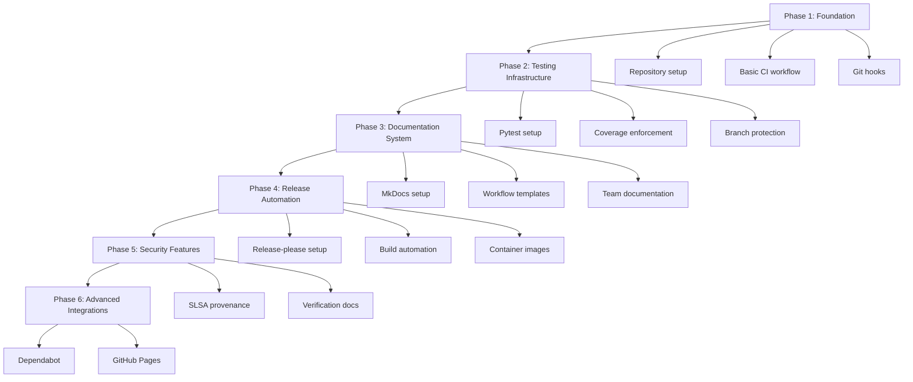

# Chapter 9: Step-by-Step Implementation Guide

> Your practical playbook for implementing a production-grade CI/CD system from scratch.

## Table of Contents

- [Overview](#overview)
- [Prerequisites](#prerequisites)
- [Implementation Paths](#implementation-paths)
- [Phase 1: Foundation](#phase-1-foundation)
- [Phase 2: Testing Infrastructure](#phase-2-testing-infrastructure)
- [Phase 3: Documentation System](#phase-3-documentation-system)
- [Phase 4: Release Automation](#phase-4-release-automation)
- [Phase 5: Security Features](#phase-5-security-features)
- [Phase 6: Advanced Integrations](#phase-6-advanced-integrations)
- [Validation and Testing](#validation-and-testing)
- [Team Onboarding](#team-onboarding)
- [Ongoing Maintenance](#ongoing-maintenance)

---

## Overview

This chapter provides a complete, step-by-step implementation guide with three different paths:

| Path | Scope | Best For |
|------|-------|----------|
| **Quick Start** | Minimal features | Solo developers, prototypes, immediate needs |
| **Standard** | Incremental implementation | Small teams (2-5 people), startup projects |
| **Comprehensive** | Complete system | Production teams, long-lived projects, compliance needs |

This guide follows the **Standard path**, with notes on quick start shortcuts and comprehensive additions.

### Implementation Dependencies



---

## Prerequisites

### Required Before Starting

**1. Git Repository**
- GitHub repository (public or private)
- Admin access to repository settings
- Branch protection available (not restricted to Enterprise)

**2. Development Environment**
- Python 3.10+ installed
- Git 2.30+ installed
- Make installed (usually pre-installed on macOS/Linux)
- Text editor with Markdown support

**3. GitHub Account Setup**
- GitHub account with 2FA enabled
- Access to repository secrets
- GitHub CLI (`gh`) installed and authenticated

**4. Basic Knowledge**
- Git fundamentals (commit, push, pull, merge)
- Command line basics
- YAML syntax
- Markdown formatting

### Optional but Recommended

- Docker installed (for container testing)
- PyPI account (for package publishing)
- Codecov account (for coverage reporting)
- Understanding of conventional commits

### Validation Checklist

Run these commands to verify prerequisites:

```bash
# Check Python version (need 3.10+)
python3 --version

# Check Git version (need 2.30+)
git --version

# Check Make
make --version

# Check GitHub CLI
gh --version

# Verify gh authentication
gh auth status

# Check Docker (optional)
docker --version
```

**Expected output example**:
```
Python 3.12.0
git version 2.42.0
GNU Make 4.3
gh version 2.40.0
✓ Logged in to github.com as yourusername
Docker version 24.0.0
```

---

## Implementation Paths

### Quick Start

**Goal**: Get basic CI/CD working quickly

**Includes**:

- Basic CI workflow (lint + test)
- Commit message validation
- GitHub Actions only (no local hooks yet)

**Skip**:

- Release automation
- Security features
- Advanced integrations

**Use when**: Prototyping, proof of concept, immediate need

---

### Standard Path

**Goal**: Production-ready CI/CD for small teams

**Includes**:

- Complete CI pipeline
- Git hooks for local validation
- Release automation
- Basic security (checksums)
- Documentation system

**Skip**:

- SLSA provenance (can add later)
- Container signing (if not using containers)
- GitHub App (use GITHUB_TOKEN initially)

**Use when**: Startup projects, small teams, standard projects

---

### Comprehensive Path

**Goal**: Enterprise-grade CI/CD with all features

**Includes**: Everything from Standard path, plus:
- SLSA provenance and attestations
- Container signing with Sigstore
- GitHub App for authentication
- Dependabot automation
- Advanced monitoring

**Use when**: Production systems, compliance requirements, large teams

---

## Phase 1: Foundation

### Step 1: Repository Setup

**Goal**: Set up basic repository structure and first CI workflow

#### Task 1.1: Create Directory Structure

Create the following directories:

```bash
# From project root
mkdir -p .github/workflows
mkdir -p .githooks
mkdir -p make
mkdir -p docs/{adr,features,commands,recipes,style}
mkdir -p tests
```

**Expected structure**:
```
your-project/
├── .github/
│   └── workflows/
├── .githooks/
├── make/
├── docs/
│   ├── adr/
│   ├── features/
│   ├── commands/
│   ├── recipes/
│   └── style/
├── tests/
├── your_package/
│   └── __init__.py
└── pyproject.toml
```

✅ **Validation**: `tree -L 2 -d` shows all directories

---

#### Task 1.2: Create Basic CI Workflow

Create `.github/workflows/ci.yml`:

```yaml
name: CI

on:
  push:
    branches: [main]
  pull_request:
    branches: [main]

jobs:
  python:
    name: Python Tests
    runs-on: ubuntu-latest

    steps:
      - uses: actions/checkout@v4

      - uses: actions/setup-python@v5
        with:
          python-version: "3.12"
          cache: pip

      - name: Install dependencies
        run: |
          python -m pip install --upgrade pip
          pip install -e ".[dev]"

      - name: Lint with ruff
        run: ruff check .

      - name: Run tests
        run: pytest tests/ -v
```

✅ **Validation**:
```bash
# Push to GitHub and check Actions tab
git add .github/workflows/ci.yml
git commit -m "ci: add basic CI workflow"
git push
gh run list --limit 1
```

---

#### Task 1.3: Setup pyproject.toml

Create or update `pyproject.toml` with CI-friendly configuration:

```toml
[project]
name = "your-package"
version = "0.1.0"
description = "Your project description"
requires-python = ">=3.10"
dependencies = [
    "click>=8.1.0",
]

[project.optional-dependencies]
dev = [
    "pytest>=7.4.0",
    "pytest-cov>=4.1.0",
    "ruff>=0.1.0",
]

[build-system]
requires = ["setuptools>=68.0"]
build-backend = "setuptools.build_meta"

[tool.ruff]
line-length = 100
target-version = "py310"

[tool.ruff.lint]
select = ["E", "F", "W", "I"]
ignore = []

[tool.pytest.ini_options]
testpaths = ["tests"]
python_files = "test_*.py"
python_functions = "test_*"
```

✅ **Validation**:
```bash
pip install -e ".[dev]"
ruff check .
pytest tests/ -v
```

---

### Step 2: Git Hooks

**Goal**: Install local quality gates that run before push

#### Task 1.4: Create commit-msg Hook

Create `.githooks/commit-msg`:

```bash
#!/bin/bash
# Validates conventional commit format

COMMIT_MSG_FILE=$1
COMMIT_MSG=$(cat "$COMMIT_MSG_FILE")

# Skip merge commits
if echo "$COMMIT_MSG" | grep -q "^Merge "; then
    exit 0
fi

# Conventional commit regex
PATTERN="^(feat|fix|docs|style|refactor|perf|test|build|ci|chore)(\([a-z0-9_-]+\))?\!?: .{1,}"

if ! echo "$COMMIT_MSG" | grep -qE "$PATTERN"; then
    echo "ERROR: Commit message does not follow conventional commits format"
    echo ""
    echo "Format: <type>[(scope)][!]: <description>"
    echo ""
    echo "Types: feat, fix, docs, style, refactor, perf, test, build, ci, chore"
    echo ""
    echo "Examples:"
    echo "  feat(auth): add OAuth2 support"
    echo "  fix: handle missing config file"
    echo "  docs: update README"
    exit 1
fi

exit 0
```

Make it executable:
```bash
chmod +x .githooks/commit-msg
```

✅ **Validation**:
```bash
# Test the hook
echo "bad commit message" | .githooks/commit-msg /dev/stdin
# Should fail with error message

echo "feat: add feature" | .githooks/commit-msg /dev/stdin
# Should succeed (no output)
```

---

#### Task 1.5: Create pre-push Hook

Create `.githooks/pre-push`:

```bash
#!/bin/bash
# Runs tests and coverage check before push

set -e

echo "🔍 Running pre-push checks..."

# Run tests with race detector (if Go) or just tests (if Python)
echo "📦 Running tests..."
if pytest tests/ -v; then
    echo "✅ Tests passed"
else
    echo "❌ Tests failed"
    exit 1
fi

# Check coverage
echo "📊 Checking coverage..."
coverage run -m pytest tests/
coverage report --fail-under=80

if [ $? -eq 0 ]; then
    echo "✅ Coverage above 80%"
else
    echo "❌ Coverage below 80%"
    exit 1
fi

# Build check
echo "🔨 Checking build..."
if python -m build --wheel; then
    echo "✅ Build successful"
    rm -rf dist/  # Clean up
else
    echo "❌ Build failed"
    exit 1
fi

echo "✅ All pre-push checks passed!"
exit 0
```

Make it executable:
```bash
chmod +x .githooks/pre-push
```

✅ **Validation**:
```bash
# Test the hook
./.githooks/pre-push
# Should run tests and coverage
```

---

#### Task 1.6: Configure Git to Use Hooks

Create `Makefile` with hooks installation:

```makefile
.PHONY: hooks.install
hooks.install:
	@echo "Installing git hooks..."
	git config core.hooksPath .githooks
	@echo "✅ Git hooks installed"

.PHONY: hooks.uninstall
hooks.uninstall:
	@echo "Uninstalling git hooks..."
	git config --unset core.hooksPath
	@echo "✅ Git hooks uninstalled"
```

Install hooks:
```bash
make hooks.install
```

✅ **Validation**:
```bash
# Try to commit with bad message
git add Makefile
git commit -m "bad message"
# Should be rejected by commit-msg hook
```

---

### Step 3: Conventional Commits CI Check

**Goal**: Add PR title validation

#### Task 1.7: Add Conventional Commits Job to CI

Update `.github/workflows/ci.yml` to add:

```yaml
jobs:
  conventional-commits:
    name: Conventional Commits
    runs-on: ubuntu-latest
    if: github.event_name == 'pull_request'

    steps:
      - uses: amannn/action-semantic-pull-request@v5
        env:
          GITHUB_TOKEN: ${{ secrets.GITHUB_TOKEN }}
        with:
          types: |
            feat
            fix
            docs
            style
            refactor
            perf
            test
            build
            ci
            chore
          requireScope: false
          subjectPattern: ^.{10,}$
          subjectPatternError: |
            Subject must be at least 10 characters long
```

✅ **Validation**: Create a PR with bad title, should fail CI

---

### Phase 1 Checklist

- [x] Directory structure created
- [x] Basic CI workflow running
- [x] pyproject.toml configured
- [x] commit-msg hook installed
- [x] pre-push hook installed
- [x] Hooks configured with Make
- [x] PR title validation added
- [x] All checks pass on a test PR

**Phase 1 Complete!** You now have basic CI/CD with local quality gates.

---

## Phase 2: Testing Infrastructure

### Step 1: Pytest Setup

**Goal**: Comprehensive test infrastructure with coverage

#### Task 2.1: Enhanced Pytest Configuration

Update `pyproject.toml`:

```toml
[tool.pytest.ini_options]
testpaths = ["tests"]
python_files = "test_*.py"
python_functions = "test_*"
addopts = [
    "-v",
    "--strict-markers",
    "--cov=your_package",
    "--cov-report=term-missing",
    "--cov-report=html",
    "--cov-branch",
]

[tool.coverage.run]
branch = true
source = ["your_package"]

[tool.coverage.report]
precision = 2
show_missing = true
skip_covered = false
fail_under = 80

[tool.coverage.html]
directory = "htmlcov"
```

Install coverage tools:
```bash
pip install pytest-cov coverage
```

✅ **Validation**:
```bash
pytest tests/ --cov
# Should show coverage report
```

---

#### Task 2.2: Create Test Helpers

Create `tests/conftest.py`:

```python
"""Pytest configuration and fixtures."""
import pytest
from click.testing import CliRunner
from pathlib import Path


@pytest.fixture
def cli_runner():
    """Provide Click CLI test runner."""
    return CliRunner()


@pytest.fixture
def tmp_config(tmp_path):
    """Provide temporary config file."""
    config_file = tmp_path / "config.yaml"
    config_file.write_text("test: value\n")
    return config_file


@pytest.fixture
def mock_home(tmp_path, monkeypatch):
    """Mock HOME directory."""
    home = tmp_path / "home"
    home.mkdir()
    monkeypatch.setenv("HOME", str(home))
    return home
```

✅ **Validation**: Fixtures should be available in all tests

---

#### Task 2.3: Write Example Tests

Create `tests/test_example.py`:

```python
"""Example test patterns."""
import pytest


def test_basic_example():
    """Basic test example."""
    assert 1 + 1 == 2


@pytest.mark.parametrize("input,expected", [
    ("hello", "HELLO"),
    ("world", "WORLD"),
    ("", ""),
])
def test_uppercase(input, expected):
    """Test with multiple inputs."""
    assert input.upper() == expected


def test_with_cli_runner(cli_runner):
    """Test CLI command."""
    from your_package.cli import cli

    result = cli_runner.invoke(cli, ["--version"])
    assert result.exit_code == 0


def test_with_temp_file(tmp_path):
    """Test file operations."""
    test_file = tmp_path / "test.txt"
    test_file.write_text("content")
    assert test_file.read_text() == "content"
```

Run tests:
```bash
pytest tests/ -v --cov
```

✅ **Validation**: All tests pass, coverage shown

---

### Step 2: Coverage Enforcement

**Goal**: Enforce 80% coverage in CI and pre-push

#### Task 2.4: Update CI with Coverage

Update `.github/workflows/ci.yml` python job:

```yaml
      - name: Run tests with coverage
        run: |
          pytest tests/ --cov --cov-report=xml --cov-report=term

      - name: Check coverage threshold
        run: |
          coverage report --fail-under=80

      - name: Upload coverage to Codecov
        uses: codecov/codecov-action@v4
        with:
          file: ./coverage.xml
          flags: unittests
          name: codecov-your-project
        continue-on-error: true
```

✅ **Validation**: CI fails if coverage drops below 80%

---

#### Task 2.5: Create Makefile Test Targets

Create `make/python.mk`:

```makefile
PYTHON := python3
PYTEST := pytest
COVERAGE := coverage

.PHONY: py.test
py.test:
	$(PYTEST) tests/ -v

.PHONY: py.test.cover
py.test.cover:
	$(PYTEST) tests/ --cov --cov-report=term-missing

.PHONY: py.test.cover.html
py.test.cover.html:
	$(PYTEST) tests/ --cov --cov-report=html
	@echo "Coverage report: htmlcov/index.html"

.PHONY: py.test.cover.check
py.test.cover.check:
	$(PYTEST) tests/ --cov
	$(COVERAGE) report --fail-under=80

.PHONY: py.lint
py.lint:
	ruff check .

.PHONY: py.lint.fix
py.lint.fix:
	ruff check --fix .

.PHONY: py.fmt
py.fmt:
	ruff format .
```

Update main `Makefile`:

```makefile
include make/python.mk

.PHONY: test
test: py.test

.PHONY: lint
lint: py.lint

.PHONY: validate
validate: lint test

.PHONY: help
help:
	@echo "Available targets:"
	@echo "  test          - Run tests"
	@echo "  lint          - Run linter"
	@echo "  validate      - Run lint + test"
	@echo "  hooks.install - Install git hooks"
```

✅ **Validation**:
```bash
make test
make lint
make validate
```

---

### Step 3: Branch Protection

**Goal**: Require CI passage before merge

#### Task 2.6: Configure Branch Protection

Navigate to GitHub Settings → Branches → Add rule for `main`:

**Settings**:

- ✅ Require a pull request before merging
- ✅ Require status checks to pass before merging
  - Required checks:
    - `Python Tests`
    - `Conventional Commits` (if using PRs)
- ✅ Require branches to be up to date before merging
- ✅ Do not allow bypassing the above settings

✅ **Validation**: Try to push directly to main (should fail)

---

### Phase 2 Checklist

- [x] Pytest configured with coverage
- [x] Test helpers and fixtures created
- [x] Example tests written
- [x] Coverage enforced at 80%
- [x] CI updated with coverage checks
- [x] Makefile test targets created
- [x] Branch protection enabled
- [x] All tests pass with coverage above 80%

**Phase 2 Complete!** You now have comprehensive testing infrastructure.

---

## Phase 3: Documentation System

### Step 1: MkDocs Setup

**Goal**: Documentation build and deployment

#### Task 3.1: Install and Configure MkDocs

Install MkDocs:
```bash
pip install mkdocs mkdocs-material
```

Create `mkdocs.yml`:

```yaml
site_name: Your Project Documentation
site_url: https://yourusername.github.io/your-project
repo_url: https://github.com/yourusername/your-project
repo_name: yourusername/your-project

theme:
  name: material
  features:
    - navigation.tabs
    - navigation.sections
    - navigation.expand
    - search.suggest
    - content.code.copy
  palette:
    - scheme: default
      primary: indigo
      accent: indigo
      toggle:
        icon: material/brightness-7
        name: Switch to dark mode
    - scheme: slate
      primary: indigo
      accent: indigo
      toggle:
        icon: material/brightness-4
        name: Switch to light mode

nav:
  - Home: index.md
  - Development:
    - Workflow: workflow.md
    - Contributing: contributing.md
  - Architecture:
    - ADRs: adr/README.md
  - Reference:
    - Commands: commands/README.md

markdown_extensions:
  - pymdownx.highlight
  - pymdownx.superfences
  - pymdownx.tabbed
  - admonition
  - tables
```

Create `docs/index.md`:

```markdown
# Your Project

Welcome to your project documentation.

## Quick Start

\`\`\`bash
pip install your-package
your-command --help
\`\`\`

## Features

- Feature 1
- Feature 2
```

✅ **Validation**:
```bash
mkdocs build --strict
mkdocs serve
# Visit http://127.0.0.1:8000
```

---

#### Task 3.2: Add Docs Build to CI

Add to `.github/workflows/ci.yml`:

```yaml
  docs:
    name: Documentation
    runs-on: ubuntu-latest

    steps:
      - uses: actions/checkout@v4

      - uses: actions/setup-python@v5
        with:
          python-version: "3.12"

      - name: Install MkDocs
        run: pip install mkdocs mkdocs-material

      - name: Build docs
        run: mkdocs build --strict
```

✅ **Validation**: CI builds docs successfully

---

### Step 2: Workflow Templates

**Goal**: Create ADR and spec templates

#### Task 3.3: Create ADR Template

Create `docs/adr/TEMPLATE.md`:

```markdown
# ADR-NNNN: Title

| Status | Proposed / Accepted / Deprecated / Superseded |
|--------|-----------------------------------------------|
| Date | YYYY-MM-DD |
| Authors | @username |
| Issue | #123 |
| Related ADRs | ADR-XXXX |

## Context

What is the issue motivating this decision?

## Decision

What are we deciding to do?

## Consequences

### Positive
- Benefit 1
- Benefit 2

### Negative
- Trade-off 1
- Trade-off 2

### Neutral
- Observation 1

## Alternatives Considered

### Alternative 1: Name
**Pros**:

- Pro 1

**Cons**:

- Con 1

**Why Rejected**: Reason

## Implementation Notes

Guidance for implementers.

## References

- [Link 1](url)
```

Create `docs/adr/README.md`:

```markdown
# Architecture Decision Records

| Number | Title | Status |
|--------|-------|--------|
| [0001](0001-example.md) | Example ADR | Accepted |
```

✅ **Validation**: Template can be copied and filled out

---

#### Task 3.4: Create Spec Templates

Create `docs/commands/TEMPLATE.md` and `docs/features/TEMPLATE.md` (see Chapter 4 for full templates).

Create index files for each directory.

✅ **Validation**: All templates render in MkDocs

---

### Step 3: Workflow Documentation

**Goal**: Document the development workflow

#### Task 3.5: Create Workflow Guide

Create `docs/workflow.md` documenting:
- Three-phase workflow
- When to use ADR vs Spec
- Branch naming conventions
- Commit message format
- PR process

(See Chapter 4 for complete workflow documentation)

✅ **Validation**: Team can follow workflow guide

---

### Phase 3 Checklist

- [x] MkDocs installed and configured
- [x] Documentation builds in CI
- [x] ADR template created
- [x] Command and feature spec templates created
- [x] Workflow guide written
- [x] All documentation renders correctly
- [x] Team has reviewed workflow

**Phase 3 Complete!** You now have a documentation system.

---

## Phase 4: Release Automation

### Step 1: Release-Please Setup

**Goal**: Automated versioning and CHANGELOG

#### Task 4.1: Create Release-Please Config

Create `release-please-config.json`:

```json
{
  "release-type": "python",
  "bump-minor-pre-major": true,
  "bump-patch-for-minor-pre-major": true,
  "changelog-sections": [
    {"type": "feat", "section": "Features"},
    {"type": "fix", "section": "Bug Fixes"},
    {"type": "perf", "section": "Performance Improvements"},
    {"type": "docs", "section": "Documentation"},
    {"type": "refactor", "section": "Code Refactoring"}
  ],
  "include-v-in-tag": true
}
```

Create `.release-please-manifest.json`:

```json
{
  ".": "0.1.0"
}
```

✅ **Validation**: Files are valid JSON

---

#### Task 4.2: Add Release-Please Workflow

Create `.github/workflows/release-please.yml`:

```yaml
name: Release Please

on:
  push:
    branches:
      - main

permissions:
  contents: write
  pull-requests: write

jobs:
  release-please:
    runs-on: ubuntu-latest
    steps:
      - uses: googleapis/release-please-action@v4
        with:
          release-type: python
```

✅ **Validation**: Merge a feat commit, Release PR should be created

---

### Step 2: Build Automation

**Goal**: Build and publish packages

#### Task 4.3: Configure Build System

Ensure `pyproject.toml` has:

```toml
[build-system]
requires = ["setuptools>=68.0", "wheel"]
build-backend = "setuptools.build_meta"

[project]
name = "your-package"
dynamic = ["version"]

[tool.setuptools.dynamic]
version = {attr = "your_package.__version__"}
```

Create `your_package/__init__.py`:

```python
"""Your package."""
__version__ = "0.1.0"
```

✅ **Validation**:
```bash
python -m build
# Should create dist/ with wheel and sdist
```

---

#### Task 4.4: Add PyPI Publishing Workflow

Create `.github/workflows/publish.yml`:

```yaml
name: Publish to PyPI

on:
  release:
    types: [published]

permissions:
  contents: read
  id-token: write  # For trusted publishing

jobs:
  publish:
    runs-on: ubuntu-latest

    steps:
      - uses: actions/checkout@v4

      - uses: actions/setup-python@v5
        with:
          python-version: "3.12"

      - name: Install build tools
        run: pip install build twine

      - name: Build package
        run: python -m build

      - name: Publish to PyPI
        uses: pypa/gh-action-pypi-publish@release/v1
```

✅ **Validation**: Workflow file is valid

---

### Step 3: Container Images

**Goal**: Multi-arch container builds (if applicable)

#### Task 4.5: Create Dockerfile

Create `Dockerfile`:

```dockerfile
FROM python:3.12-slim

WORKDIR /app

COPY pyproject.toml .
COPY your_package/ ./your_package/

RUN pip install --no-cache-dir -e .

ENTRYPOINT ["your-command"]
CMD ["--help"]
```

Test locally:
```bash
docker build -t your-project:test .
docker run your-project:test
```

✅ **Validation**: Container builds and runs

---

#### Task 4.6: Add Container Build to Release (optional)

Add container build job to publish workflow if needed.

---

### Phase 4 Checklist

- [x] Release-please configured
- [x] Release workflow created
- [x] Build system configured
- [x] PyPI publishing workflow created
- [x] Dockerfile created (if applicable)
- [x] Test release created successfully

**Phase 4 Complete!** You now have automated releases.

---

## Phase 5: Security Features

### Step 1: SLSA Provenance

**Goal**: Add build attestations

#### Task 5.1: Add Attestation to Publish Workflow

Update `.github/workflows/publish.yml`:

```yaml
      - name: Attest build provenance
        uses: actions/attest-build-provenance@v1
        with:
          subject-path: 'dist/*'
```

✅ **Validation**: Next release should have attestations

---

### Step 2: Verification Documentation

**Goal**: Document how users verify releases

#### Task 5.2: Create SECURITY.md

Create `SECURITY.md`:

```markdown
# Security Policy

## Reporting Vulnerabilities

Please report security vulnerabilities via GitHub Security Advisories:
https://github.com/yourusername/your-project/security/advisories/new

## Verifying Releases

### Verify Checksums

\`\`\`bash
curl -LO https://github.com/yourusername/your-project/releases/download/vX.Y.Z/checksums.txt
sha256sum -c checksums.txt --ignore-missing
\`\`\`

### Verify Provenance

\`\`\`bash
gh attestation verify your-package-X.Y.Z.tar.gz --owner yourusername
\`\`\`

## Supported Versions

| Version | Supported |
|---------|-----------|
| 1.x.x | ✅ Yes |
| 0.x.x | ❌ No |
```

✅ **Validation**: Instructions work for actual releases

---

### Phase 5 Checklist

- [x] SLSA provenance added
- [x] SECURITY.md created
- [x] Verification instructions tested
- [x] Security policy documented

**Phase 5 Complete!** You now have security features.

---

## Phase 6: Advanced Integrations

### Step 1: Dependabot

**Goal**: Automated dependency updates

#### Task 6.1: Configure Dependabot

Create `.github/dependabot.yml`:

```yaml
version: 2
updates:
  - package-ecosystem: "pip"
    directory: "/"
    schedule:
      interval: "weekly"
    groups:
      dev-dependencies:
        patterns:
          - "pytest*"
          - "ruff"
    commit-message:
      prefix: "build"
      include: "scope"

  - package-ecosystem: "github-actions"
    directory: "/"
    schedule:
      interval: "weekly"
    commit-message:
      prefix: "ci"
```

✅ **Validation**: Dependabot creates update PRs

---

### Step 2: GitHub Pages

**Goal**: Publish documentation

#### Task 6.2: Add Docs Deploy Workflow

Create `.github/workflows/docs.yml`:

```yaml
name: Documentation

on:
  release:
    types: [published]
  push:
    branches: [main]
    paths: ['docs/**']

permissions:
  contents: read
  pages: write
  id-token: write

jobs:
  deploy:
    runs-on: ubuntu-latest
    steps:
      - uses: actions/checkout@v4

      - uses: actions/setup-python@v5
        with:
          python-version: "3.12"

      - name: Install dependencies
        run: pip install mkdocs mkdocs-material

      - name: Build docs
        run: mkdocs build

      - name: Upload artifact
        uses: actions/upload-pages-artifact@v3
        with:
          path: 'site'

      - name: Deploy to GitHub Pages
        uses: actions/deploy-pages@v4
```

Enable GitHub Pages in repository settings → Pages → Source: GitHub Actions

✅ **Validation**: Docs deployed to https://yourusername.github.io/your-project

---

### Phase 6 Checklist

- [x] Dependabot configured
- [x] GitHub Pages deployed
- [x] All integrations working
- [x] Documentation published

**Phase 6 Complete!** You now have advanced integrations.

---

## Validation and Testing

### Complete System Test

Run through this checklist to validate everything works:

1. **Local Development**
   ```bash
   # Clone repo fresh
   git clone your-repo test-clone
   cd test-clone

   # Setup
   make hooks.install
   pip install -e ".[dev]"

   # Run tests
   make test
   make lint
   make validate
   ```

2. **Commit Validation**
   ```bash
   # Try bad commit (should fail)
   git commit --allow-empty -m "bad message"

   # Try good commit (should succeed)
   git commit --allow-empty -m "test: validate commit message"
   ```

3. **CI Pipeline**
   ```bash
   # Create test PR
   git checkout -b test/ci-validation
   echo "# Test" > test.md
   git add test.md
   git commit -m "test: validate CI pipeline"
   git push origin test/ci-validation

   # Create PR and verify all checks pass
   gh pr create --title "test: validate CI pipeline" --body "Testing"
   ```

4. **Release Process**
   ```bash
   # Merge a feature commit to main
   git checkout main
   git commit --allow-empty -m "feat: trigger release"
   git push

   # Verify Release PR created
   gh pr list --label "autorelease: pending"

   # Merge Release PR
   gh pr merge <number> --squash

   # Verify GitHub Release created
   gh release list
   ```

5. **Documentation**
   ```bash
   # Check docs site is live
   curl -I https://yourusername.github.io/your-project
   ```

6. **Security**
   ```bash
   # Verify latest release has attestations
   gh attestation verify your-package-X.Y.Z.tar.gz --owner yourusername
   ```

**All checks passing?** ✅ Your CI/CD system is fully operational!

---

## Team Onboarding

### Training Materials

Create these documents for new team members:

1. **Quick Start Guide** (`docs/quickstart.md`)
   - How to set up local environment
   - Running tests
   - Making first commit

2. **Development Guide** (`docs/contributing.md`)
   - Full workflow
   - Commit message format
   - PR process

3. **FAQ** (`docs/faq.md`)
   - Common issues
   - Bypass procedures
   - Who to ask for help

### Onboarding Checklist for New Developers

Give each new team member this checklist:

```markdown
## Initial Setup
- [ ] Clone repository
- [ ] Run `make hooks.install`
- [ ] Run `pip install -e ".[dev]"`
- [ ] Run `make validate` (should pass)
- [ ] Create test branch
- [ ] Make test commit (verify hooks work)

## First Contribution
- [ ] Read docs/workflow.md
- [ ] Read docs/contributing.md
- [ ] Pick "good first issue"
- [ ] Create spec (if needed)
- [ ] Implement with tests
- [ ] Achieve 80%+ coverage
- [ ] Create PR
- [ ] Address review comments
- [ ] Merge PR

## Advanced Skills
- [ ] Review ADRs in docs/adr/
- [ ] Understand release process
- [ ] Review a peer's PR
- [ ] Write an ADR (if architectural change needed)
```

---

## Ongoing Maintenance

### Daily Tasks (Automated)

- ✅ Dependabot creates PRs for updates
- ✅ CI runs on all PRs
- ✅ Release PRs created automatically

### Weekly Tasks (Human)

- Review and merge Dependabot PRs
- Review Release PRs (merge when ready)
- Check coverage trends (Codecov dashboard)
- Monitor CI performance

### Monthly Tasks

- Review ADRs for relevance
- Update documentation
- Review and update branch protection rules
- Audit dependencies for security

### Quarterly Tasks

- Review all ADRs (mark deprecated if needed)
- Update CI/CD system itself (GitHub Actions versions)
- Review and update security policy
- Team retrospective on workflow

---

## Success Metrics

Track these metrics to measure success:

| Metric | Target | How to Measure |
|--------|--------|----------------|
| **CI Pass Rate** | >95% | GitHub Actions insights |
| **Test Coverage** | >80% | Codecov dashboard |
| **Release Frequency** | Weekly | GitHub Releases |
| **Time to Merge** | <2 days | GitHub PR metrics |
| **Failed Deployments** | <1% | Release history |
| **Documentation Coverage** | 100% of features | Manual audit |
| **Security Alerts** | 0 open | Dependabot alerts |

---

## Conclusion

Congratulations! You've implemented a production-grade CI/CD system.

### What You've Achieved

✅ **Automated Quality Gates**
- Git hooks prevent bad commits locally
- CI prevents bad merges remotely
- 80% coverage enforcement

✅ **Automated Releases**
- Version bumping from commits
- CHANGELOG generation
- PyPI publishing

✅ **Security**
- SLSA provenance
- Dependency scanning
- Vulnerability reporting

✅ **Documentation**
- Three-phase workflow
- ADR and spec templates
- Published docs site

### Next Steps

**Enhance**:

- Add container signing (Chapter 3)
- Set up Codecov insights
- Add more advanced monitoring

**Scale**:

- Onboard more team members
- Create team-specific documentation
- Tune coverage thresholds per package

**Optimize**:

- Cache more in CI
- Parallelize test execution
- Reduce CI runtime

---

**Your CI/CD system is now production-ready!** 🎉

For troubleshooting, see [Chapter 8](08-troubleshooting.md).
For Python-specific patterns, see [Chapter 10](10-python-adaptation.md).
