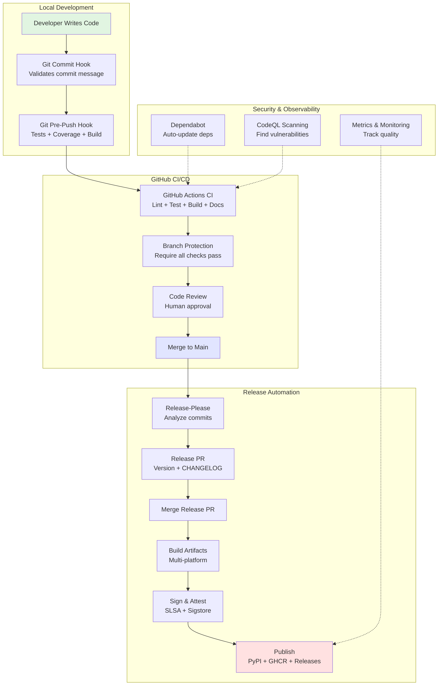

# CI/CD System Recipe: From Zero to Production

> A comprehensive, battle-tested guide to building enterprise-grade CI/CD systems for Python projects - extracted from production infrastructure and ready for immediate adoption.

---

## Executive Summary

### The Challenge

Modern software teams face an impossible triad:
- **Ship fast** (frequent, reliable releases)
- **Ship quality** (minimal bugs, high reliability)
- **Ship secure** (verified, compliant, auditable)

Traditional approaches force teams to choose two at most. Manual processes create bottlenecks. Ad-hoc automation creates fragility. Incomplete systems leave critical gaps.

### The Solution

This recipe provides a **complete, production-ready CI/CD system** that achieves all three simultaneously through systematic automation, layered quality gates, and security-first design.

**Not theory. Not aspirational best practices. This is working infrastructure from the `ado` CLI project**, distilled into a step-by-step playbook that any team can adopt.

### What Makes This Different

| Traditional CI/CD Setup | This Recipe System |
|-------------------------|-------------------|
| ❌ Piecemeal implementation | ✅ **Complete system** (comprehensive guide with extensive examples) |
| ❌ "Figure it out yourself" | ✅ **Step-by-step playbook** (phased tasks) |
| ❌ One-size-fits-all | ✅ **Three paths** (Quick Start / Standard / Comprehensive) |
| ❌ Generic advice | ✅ **Python-optimized** (pyproject.toml, pytest, ruff) |
| ❌ Security afterthought | ✅ **Security-first** (SLSA, signing, attestations) |
| ❌ Documentation optional | ✅ **Docs as code** (MkDocs, ADRs, specs) |
| ❌ Manual releases | ✅ **Zero-touch** (fully automated release process) |
| ❌ Hope for quality | ✅ **Coverage enforced** (multiple quality gates) |

### What This System Provides

A complete framework for:
- **Quality assurance**: Automated testing and coverage enforcement prevents broken builds
- **Release confidence**: Structured release process with cryptographic verification
- **Clear standards**: Conventional commits and documented workflows
- **Team alignment**: Shared practices and automated enforcement
- **Security-first**: Built-in verification and attestation patterns
- **Rapid onboarding**: Clear documentation and consistent patterns

### Implementation Scope

This recipe offers three implementation approaches based on your needs and organizational context. Each path builds on the previous, allowing teams to start simple and expand as needed.

### Who This Is For

#### ✅ Perfect For:
- **Startup teams** building production systems
- **Python projects** seeking modern CI/CD patterns
- **Open-source maintainers** wanting quality enforcement
- **Teams using LLMs** for code generation (spec-driven enables AI)
- **Security-conscious teams** needing compliance
- **Fast-moving teams** requiring frequent, reliable releases

#### ⚠️ Less Ideal For:
- Weekend prototypes (overhead not worth it)
- Solo experiments with short lifespans
- Non-Python projects (patterns translate but need adaptation)
- Teams resistant to conventional commits (core requirement)

---

## What You'll Build

### The Complete Stack



### System Capabilities

By following this recipe, your repository will have:

#### 🛡️ Quality Enforcement (Never Ship Broken Code)
- **Git hooks** validate commits locally (instant feedback)
- **Test coverage** enforced at multiple layers (pre-push, CI, branch protection)
- **Linting** blocks common bugs automatically
- **Type checking** optional but recommended (mypy/pyright)
- **Branch protection** prevents direct pushes to main
- **Fast feedback loops** through local hooks and CI checks

#### 🚀 Release Automation (Ship Frequently and Reliably)
- **Zero-touch releases** from conventional commits
- **Semantic versioning** automatic (feat→minor, fix→patch)
- **CHANGELOG** auto-generated from commits
- **Multi-platform builds** (Linux, macOS, Windows, containers)
- **PyPI publishing** with trusted publishers (no tokens!)
- **One-click deploy** (merge Release PR triggers full automation)

#### 🔒 Security First (Compliance-Ready)
- **SLSA Build Level 3** provenance for all releases
- **Cryptographic signatures** (Sigstore/cosign keyless signing)
- **Artifact attestations** (GitHub native, verifiable)
- **SBOM generation** (software bill of materials)
- **Dependency scanning** (Dependabot + auto-merge)
- **Vulnerability alerts** with automated patching
- **Secret scanning** (prevent leaks)

#### 📚 Documentation as Code (Knowledge Retention)
- **MkDocs** automated documentation site
- **ADRs** (Architecture Decision Records) for major decisions
- **Specs** (detailed specifications) for features/commands
- **Workflow guides** for team processes
- **GitHub Pages** auto-deployed on release

#### 🤖 Developer Experience (Happy, Productive Teams)
- **Spec-driven development** enables LLM code generation
- **Local-first** (all CI checks runnable locally)
- **Clear errors** with fix instructions (no cryptic failures)
- **Fast onboarding** through clear documentation and consistent patterns
- **Async collaboration** (review designs before code)

---

## Recipe Structure

This comprehensive guide is organized into parts covering philosophy, security, automation, integration, and implementation.

### 📖 Part 0: Navigation & Goals

| Chapter | Title | Purpose |
|---------|-------|---------|
| [00-overview.md](00-overview.md) | Complete Overview | Navigation, learning paths by role |
| [01-goals.md](01-goals.md) | System Goals | Goals framework and success indicators |

### 📖 Part 1: Foundation & Philosophy

| Chapter | Title | What You'll Learn |
|---------|-------|-------------------|
| [02-philosophy.md](02-philosophy.md) | CI/CD Philosophy | Core principles, design decisions, "why" |
| [03-ci-components.md](03-ci-components.md) | Essential CI Components | Complete system architecture |

**Start here** if you want to understand the "why" before the "how".

### 📖 Part 2: Security & Quality

| Chapter | Title | What You'll Learn |
|---------|-------|-------------------|
| [04-security-features.md](04-security-features.md) | Security Implementation | SLSA, signing, verification |
| [05-development-workflow.md](05-development-workflow.md) | Issues→ADR→Spec→Code | Three-phase workflow, specs, ADRs |

**Critical** for teams with compliance requirements or architecture complexity.

### 📖 Part 3: Automation & Tooling

| Chapter | Title | What You'll Learn |
|---------|-------|-------------------|
| [06-build-automation.md](06-build-automation.md) | Make & Git Hooks | Local tooling, modular Makefiles |
| [07-release-automation.md](07-release-automation.md) | Zero-Touch Releases | release-please, builds, publishing |

**Essential** for achieving zero-manual-step releases.

### 📖 Part 4: Integration & Operations

| Chapter | Title | What You'll Learn |
|---------|-------|-------------------|
| [08-github-integrations.md](08-github-integrations.md) | GitHub Apps & Integrations | Complete GitHub ecosystem setup |
| [09-troubleshooting.md](09-troubleshooting.md) | Problem-Solving | Debug guide, common issues, fixes |

**Bookmark** Chapter 8 for when things go wrong.

### 📖 Part 5: Implementation

| Chapter | Title | What You'll Learn |
|---------|-------|-------------------|
| [10-implementation-guide.md](10-implementation-guide.md) | Step-by-Step Playbook | Phased tasks with validation |
| [11-python-adaptation.md](11-python-adaptation.md) | Python-Specific Patterns | pyproject.toml, pytest, ruff, PyPI |

**Start here** if you want to implement immediately (Chapter 9).

---

## Three Implementation Paths

Choose your adventure based on urgency and completeness:

### ⚡ Quick Start

**Goal**: Basic CI/CD foundation

**You'll Implement**:
- ✅ Basic CI workflow (lint + test)
- ✅ Git commit message validation
- ✅ GitHub Actions only (no local hooks yet)
- ✅ Branch protection

**Skip**:
- ⏭️ Release automation
- ⏭️ Security features
- ⏭️ Advanced integrations

**Best For**:
- Proof of concept validation
- Establishing basic CI quickly
- Solo developers exploring the system

---

### 🎯 Standard Path

**Goal**: Production-ready for growing teams

**Phase 1**: Foundation
- ✅ Complete CI pipeline
- ✅ Git hooks (commit-msg, pre-push)
- ✅ Branch protection
- ✅ Makefile automation

**Phase 2**: Testing & Quality
- ✅ Coverage enforcement at multiple layers
- ✅ Fast feedback loops
- ✅ Comprehensive error handling
- ✅ Local development mirrors CI

**Phase 3**: Documentation & Process
- ✅ MkDocs documentation
- ✅ Workflow templates (ADR, specs)
- ✅ Spec-driven development
- ✅ Team training

**Best For**:
- Startup projects
- Small to medium teams
- Standard production systems

---

### 🏆 Comprehensive Path

**Goal**: Enterprise-grade with all features

**Phase 1-3**: Standard path features (above)

**Phase 4**: Release Automation
- ✅ Release-please setup
- ✅ Automated versioning
- ✅ Zero-touch releases
- ✅ Multi-platform builds

**Phase 5**: Security Features
- ✅ SLSA provenance
- ✅ Artifact attestations
- ✅ Container signing
- ✅ Security policy

**Phase 6**: Advanced Integrations
- ✅ GitHub App authentication
- ✅ Dependabot auto-merge
- ✅ GitHub Pages deployment
- ✅ Codecov integration

**Best For**:
- Production-focused teams
- Compliance requirements
- Enterprise environments
- Long-lived projects

---

## Quick Navigation

### 🎯 By Role

**Developers** → Start with:
1. [Philosophy](02-philosophy.md) - Understand the "why"
2. [Development Workflow](05-development-workflow.md) - Your daily process
3. [Python Adaptation](11-python-adaptation.md) - Python-specific patterns

**DevOps/Platform Engineers** → Start with:
1. [Philosophy](02-philosophy.md) - Core principles
2. [CI Components](03-ci-components.md) - System architecture
3. [Build Automation](06-build-automation.md) - Local tooling
4. [Release Automation](07-release-automation.md) - Automated releases
5. [Implementation Guide](10-implementation-guide.md) - Step-by-step execution

**Engineering Managers** → Start with:
1. [Goals](01-goals.md) - What you'll achieve
2. [Philosophy](02-philosophy.md) - ROI and principles
3. [Implementation Guide](10-implementation-guide.md) - Overview - Timeline and scope

**Security Engineers** → Start with:
1. [Philosophy](02-philosophy.md) - Security principles
2. [Security Features](04-security-features.md) - Complete security guide
3. [GitHub Integrations](08-github-integrations.md) - Security integrations

### 🎯 By Need

**"I need this working quickly"**
→ [Implementation Guide](10-implementation-guide.md) Quick Start section

**"Show me what's possible"**
→ [Goals](01-goals.md) - See the complete goals framework

**"I need to convince my team"**
→ This README Executive Summary + [Business Principles](01-goals.md#business-principles)

**"I'm stuck on something"**
→ [Troubleshooting](09-troubleshooting.md) (search for your error)

**"How do I adapt this for Python?"**
→ [Python Adaptation](11-python-adaptation.md) (complete Python guide)

---

## Prerequisites

### Required

- ✅ **Git knowledge**: Commits, branches, pull requests, merge
- ✅ **GitHub repository**: Public or private with admin access
- ✅ **Python**: Modern Python for your project
- ✅ **Command line basics**: Running commands, navigating directories
- ✅ **Willingness to learn**: Conventional commits (quick to learn)

### Recommended

- ⭐ **Make installed**: Usually pre-installed on macOS/Linux
- ⭐ **Docker (optional)**: For container testing
- ⭐ **PyPI account (optional)**: For package publishing
- ⭐ **Text editor with Markdown**: For documentation

### Validation

Run these commands to verify you're ready:

```bash
# Check versions
python3 --version    # Need modern version
git --version        # Need recent version
make --version       # Any version OK

# Check GitHub CLI (optional but helpful)
gh --version
gh auth status
```

---

## Success Indicators

You'll know the system is working when:
- Main branch is consistently stable
- Tests provide confidence for refactoring
- Releases happen regularly without manual intervention
- New team members can contribute quickly
- Documentation stays current with code
- Security is verifiable and transparent
- Team can focus on features rather than process
- Code quality is maintained automatically
- Rollbacks are straightforward when needed
- Compliance requirements are met continuously

### Tracking Progress

Use the [Goals](01-goals.md) framework to assess:
- System maturity across different areas
- Team adherence to established patterns
- Quality gate effectiveness
- Areas needing attention or improvement

---

## Philosophy Summary

This system is built on **three core principles**:

### 1. Automation Over Manual Process

**If it can be automated, it should be.**

```
Manual → Error-prone, slow, forgotten
Automated → Consistent, fast, reliable
```

**Examples**:
- ✅ Version bumping: Automated via conventional commits
- ✅ CHANGELOG: Generated from commits
- ✅ Testing: Runs automatically on every push
- ✅ Releases: One-click (merge Release PR)

### 2. Quality Gates at Every Level

**Multiple layers of enforcement create reliability.**

```
Developer Machine → Git Hooks (instant)
       ↓
GitHub CI → Automated Checks
       ↓
Branch Protection → Policy Enforcement
       ↓
Code Review → Human Validation
       ↓
Production → Verified Artifacts
```

### 3. Documentation as Code

**Specs define acceptance criteria before implementation.**

```
Traditional: Code → Tests → Docs (if lucky)
This System: Spec → Tests → Code (validated)
```

**Benefits**:
- Clear expectations upfront
- LLM-friendly (AI can implement from specs)
- Async review (design before code)
- Historical context preserved (ADRs)

---

## Key Benefits

### For Developers 👩‍💻

- **Fast feedback**: Know before you push through git hooks
- **Clear expectations**: Specs define what to build
- **Less toil**: Automated releases, dependency updates
- **Confidence**: Coverage enforcement catches regressions
- **LLM-friendly**: Specs enable AI code generation

### For Teams 🤝

- **Velocity**: Consistent feature delivery
- **Quality**: Reduced production bugs
- **Predictability**: Reliable release cadence
- **Async collaboration**: Review designs before code
- **Knowledge retention**: ADRs preserve decisions

### For Operations 🔧

- **Reliability**: Zero broken builds on main
- **Observability**: Every release tracked and logged
- **Rollback**: Previous versions always available
- **Compliance**: SLSA Level 3, signed artifacts
- **Automation**: No manual release steps

### For Business 💼

- **Speed**: Faster release cycles
- **Efficiency**: Reduced manual overhead per developer
- **Risk**: Lower bug escape rate through automated testing
- **Compliance**: Audit-ready through built-in controls
- **Competitive**: Ship faster and more reliably

---

## What Makes This Unique

### Battle-Tested, Not Theoretical

This isn't aspirational best practices or "you should do this."

**This is actual working infrastructure** from the `ado` CLI project:
- ✅ Production-validated patterns
- ✅ Main branch stability maintained
- ✅ Coverage enforcement proven effective
- ✅ Automated releases functioning reliably
- ✅ All releases cryptographically verified

Every configuration file, every workflow, every pattern - **it's all real, tested, and working**.

### Complete, Not Partial

Most CI/CD guides cover "setting up GitHub Actions" or "how to release to PyPI."

**This recipe covers everything**:
- Local development (git hooks, Make)
- CI/CD (GitHub Actions, multiple workflows)
- Release automation (release-please, builds, signing)
- Security (SLSA, attestations, verification)
- Documentation (MkDocs, ADRs, specs, workflow)
- Team process (three-phase workflow)
- Troubleshooting (comprehensive debug guide)

### Python-Optimized

Not generic advice adapted poorly to Python.

**Modern Python patterns throughout**:
- `pyproject.toml` (not setup.py)
- `pytest` with fixtures and parametrize
- `ruff` (replacing black + flake8 + isort)
- Trusted PyPI publishing (no tokens)
- Modern Docker (multi-stage, slim images)

### LLM-Optimized

This system was designed for **human-AI collaboration**:
- Specs provide clear prompts for LLMs
- Examples translate directly to tests
- Validation at every step catches AI errors
- Async workflow (human reviews design, AI implements)

Spec-driven development enables LLM-assisted implementation by providing clear, structured requirements.

---

## Next Steps

### Choose Your Starting Point

**Ready to implement?**
→ [Implementation Guide](10-implementation-guide.md) - Pick your path (Quick/Standard/Comprehensive)

**Want to understand first?**
→ [Philosophy](02-philosophy.md) - Learn the "why"

**Need to see goals?**
→ [Goals](01-goals.md) - Complete goals framework and success indicators

**Have questions?**
→ [Troubleshooting](09-troubleshooting.md) - Comprehensive Q&A

**Python-specific help?**
→ [Python Adaptation](11-python-adaptation.md) - Complete Python guide

**Want navigation help?**
→ [Overview](00-overview.md) - Learning paths by role

---

## Contributing

Found an issue or have improvements?

This recipe is based on the living `ado` project at https://github.com/anowarislam/ado

- **Issues**: Report problems in the `ado` repository
- **Discussions**: Ask questions in GitHub Discussions
- **PRs**: Improvements welcome

---

## License

This recipe is part of the `ado` project documentation and follows the same license.

---

**Ready to transform your CI/CD?**

**Start here**: [Implementation Guide](10-implementation-guide.md)

**Understand first**: [Philosophy](02-philosophy.md)

**See what's possible**: [Goals](01-goals.md)

---

*This recipe represents battle-tested CI/CD knowledge, distilled from production infrastructure and ready for your team to adopt.*
